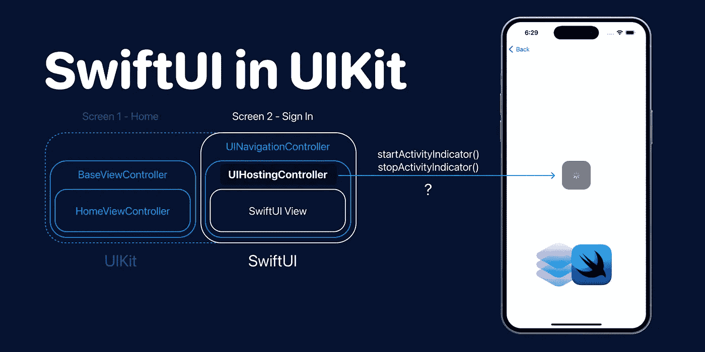
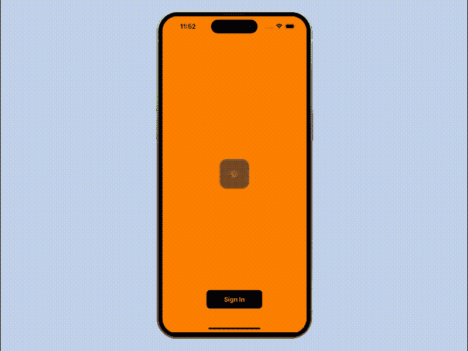
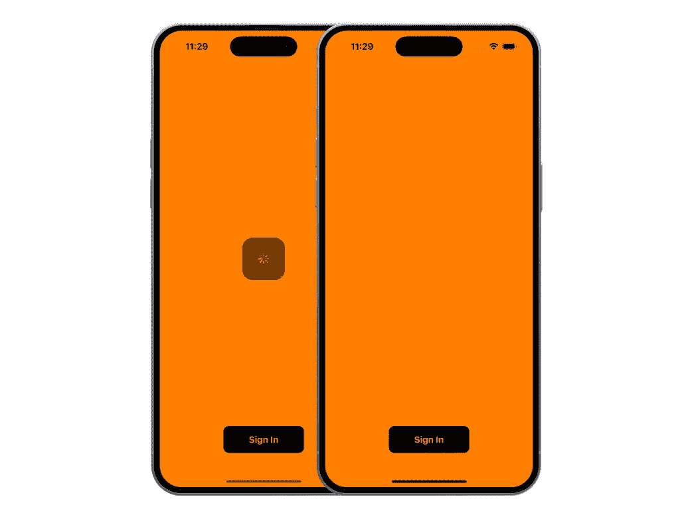
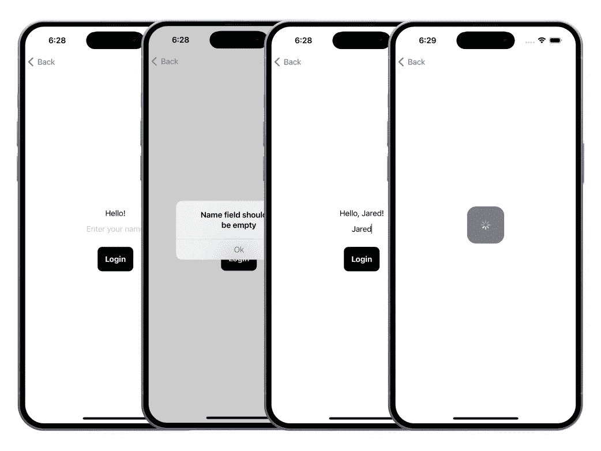
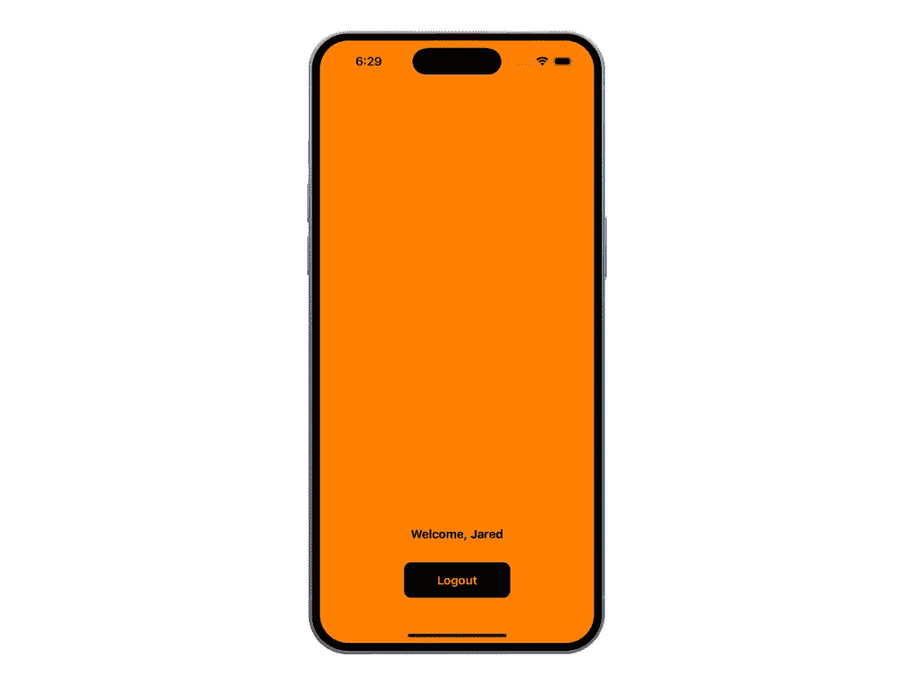
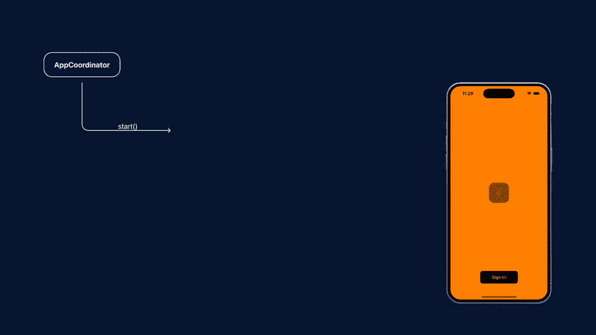
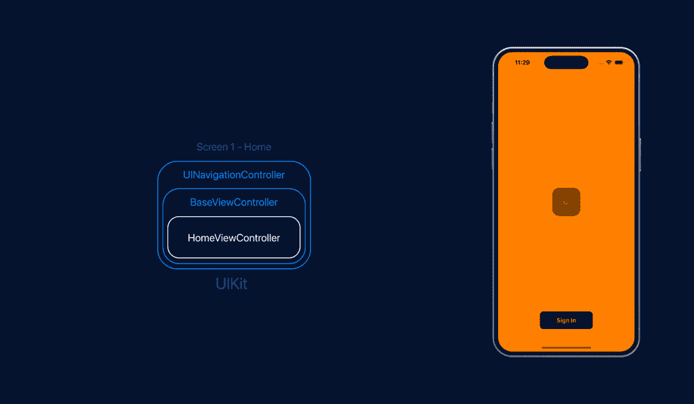
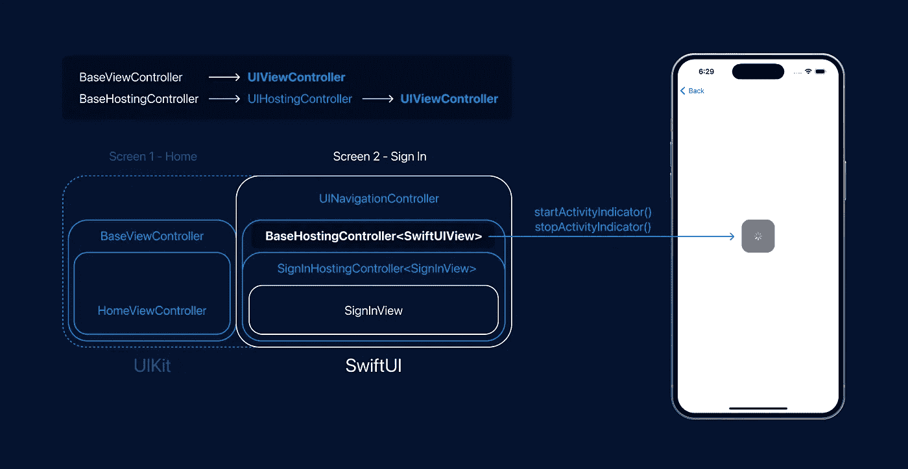
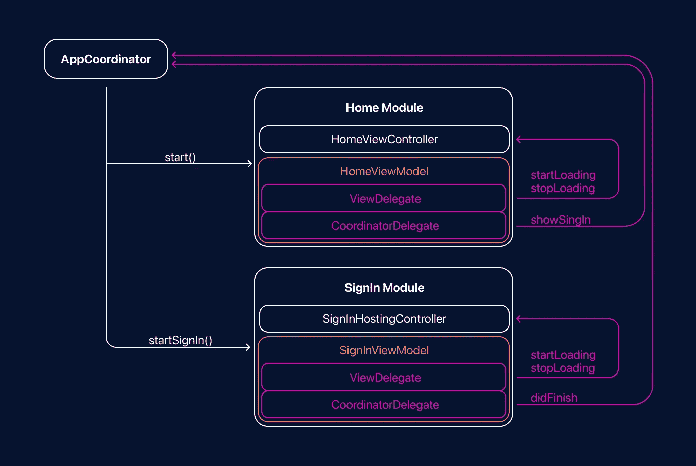

# 将 SwiftUI 集成到 UIKit 项目中

> 原文：<https://medium.com/geekculture/integrating-swiftui-into-uikit-project-a1051e432041?source=collection_archive---------5----------------------->



SwiftUI in UIKit

我正在做一个项目，我们开始的地方很经典——没有故事板的 UIKit，MVVM +协调员设计模式。它对你来说可能很熟悉，尤其是如果你正在为一家初创公司工作。我们所有的开发过程都进行得非常快。有时候，我会把我典型的工作日与中距离跑步相比较。企业一直在等待新功能的出现。在某个时刻，我们发现我们花了很多时间来构建新的 UI 特性，但是我们的特性不是很定制。我们把时间浪费在约束视图、配置和遵从委托上。你知道列表和表格视图设置的区别。

最好的选择之一是尝试 SwiftUI。使用这个框架，我个人想解决主要问题——更快地交付特性，将屏幕和视图从一个地方移动到另一个地方，而不损害现有的代码库。

一开始，使用 SwiftUI 进行生产有点可怕，但最终，我们得到了一个不错的结果:我们将构建功能的速度提高了一倍。这意味着我们可以腾出时间来关注逻辑、单元测试和 UI 测试。

所以，根据我的经验，我想分享一下在你的 UIKit 项目中，你如何快速、轻松地开始用 MVVM+C 设计模式构建新的场景(屏幕)。

# TL；速度三角形定位法(dead reckoning)



MVVM+C UIKit project with SwiftUI SignIn screen

[](https://github.com/maxkalik/uikit-swift-to-swiftui) [## 带有 SwiftUI 登录屏幕的 MVVM+C UIKit 项目

github.com](https://github.com/maxkalik/uikit-swift-to-swiftui) 

# 探索项目



Home Screen (UIKit)

给定:带有屏幕的 UIKit 应用程序—姑且称之为橙色背景的主屏幕。如果我们运行一个应用程序，它会启动一些自定义的活动指示器。当用户界面可以使用时，我们只有一个按钮——登录。



SignIn Screen (SwiftUI)

假设你有一个任务。某个产品经理或您的团队领导要求您实现一个新功能—一个新的登录屏幕。它应该以这种方式工作:在主屏幕上点击登录，我们应该呈现登录屏幕。我们必须在那里添加一些逻辑——为了检查`textfield`是否为空，我们需要给出一个带有错误消息的警告。

如果用户正确地完成了所有操作——`textfield`由名字填充，那么在一些加载过程之后，我们需要转到之前的橙色主屏幕，上面有更新的按钮标题和标签。



Home Screen (UIKit)

好的。这似乎不是一项复杂的任务，作为开发人员，您决定使用 SwiftUI 实现整个屏幕。好决定。但是，让我们想想如何整合我们的 SwiftUI 员工。

# 从建筑的角度来看



App Coordinator

首先，让我们从协调者的角度看一下这个项目。第一种`start`方法准备主屏幕。正如你所看到的，准备这个模块需要视图模型和视图控制器。那么这个视图控制器就被推送到导航视图控制器的堆栈中。在使用 MVVM +协调器设计模式时，这是 iOS 开发中一个非常常见的模块准备过程。

**视图模型** — `HomeViewModel`包括几个代表— `ViewDelegate`和`CoordinatorDelegate`。`ViewDelegate`用于控制特定场景下屏幕上的视图。在这种情况下，它是一个主屏幕，视图模型负责在屏幕上显示和隐藏活动指示器。 **CoordinatorDelegate** 委派显示我们的新屏幕——登录屏幕的责任。但是如果我们想使用 SwiftUI，我们要如何实现这一部分呢？

# `BaseViewController`

好的。如果你对这个项目了如指掌，你就可以开始了。
但是让我们假设在这一点上你并不确切知道项目的结构。你在团队中工作。你尊重你的每一个同事和他们的工作，你不想仅仅因为你想整合你的 SwiftUI 员工就打破现有的结构。

所以让我们来看看视图层次结构。你很可能会看到类似这样的东西——`ViewController`被`BaseViewController`或类似的东西继承。它需要存储一些基本视图逻辑(不是业务逻辑)。在我们的例子中，`BaseViewController`有显示和隐藏活动指示器的方法。

BaseViewController with methods for showing and hiding activity indicator

你很可能已经知道如何在 UIKit 中使用 SwiftUI 视图，以及为什么我们需要`UIHostingController`。此外，我打赌你明白引擎盖下的`UIHostingController`和往常的`UIViewController`一样。您将这个视图控制器推送到`UINavigationController`是正确的，因为它在其堆栈中自由地接受这个控制器。



UIHostingController in UINavigationController stack

但是我们有一个要求——我们必须使用这个确切的`ProgressView` 而不重复我们自己。当然，这个进度视图我们可以在 SwiftUI 中重新实现，但是可重用性呢？是时候记住[干](https://en.wikipedia.org/wiki/Don%27t_repeat_yourself)原理和你脑子里所有关于这个的警告了。正如我之前所说，我们不想打破现有的结构。

# `BaseHostingController`

合适的解决方案是准备与从`UIHostingController`继承的`BaseViewController`相同的`BaseHostingController`，并以某种方式从那里使用一些启动和停止活动指示器的方法。



如你所知`UIHostingController`就是`UIViewController`。这意味着我们可以用一个协议包装我们的两个基本控制器。

这个 BaseController 协议将使用`ProgressView`和与`BaseViewController`中相同的基本方法。我们开始吧。将该协议与`BaseViewController`和`BaseHostingController`一致，我们就有机会从 UIKit 和 SwiftUI 模块中使用相同的`ProgressView`。

Base Controllers

有了`BaseHostingController`，我们可以像使用`BaseViewController`一样使用它，尤其是在查看代表时。我们只是很容易地从这个主机控制器控制我们的加载指示器，而不会破坏项目的结构。

就连协调人似乎也没变。只出现了一个漂亮的方法:`showSignIn()`

看，它多么完美地符合现有的 MVVM+协调器设计模式。`AppCoordinators`获得了干净易读的方法，其步骤与准备要显示的模块的步骤相同。`SignInHostingController`中的`ViewDelegate`与`BaseViewController`的工作方式相同。



AppCoordinator with SignIn Module

# 包扎

如果你在一个团队中工作，你的代码应该对每个人都是可预测和可读的，即使你的同事不知道 SwiftUI，但无论如何，他们会理解如何维护这种结构。

根据我的个人经验，我非常成功地使用了这种方法。今天我们项目中几乎 70%的屏幕都是带有`UIHostingController`的 SwiftUI。我猜这将是 100%，但这将是另一个关于如何将您的 UIKit 应用程序完全转移到 SwiftUI 的故事:)

# 资源

GitHub 库:[https://github.com/maxkalik/uikit-swift-to-swiftui](https://github.com/maxkalik/uikit-swift-to-swiftui)

UIHostingController:[https://developer . apple . com/documentation/swift ui/UIHostingController](https://developer.apple.com/documentation/swiftui/uihostingcontroller)

```
**Want to Connect?**Don't hesitate to follow me on [Twitter](https://twitter.com/maxkalik).I appreciate any suggestions or comments regarding my research and articles.
```