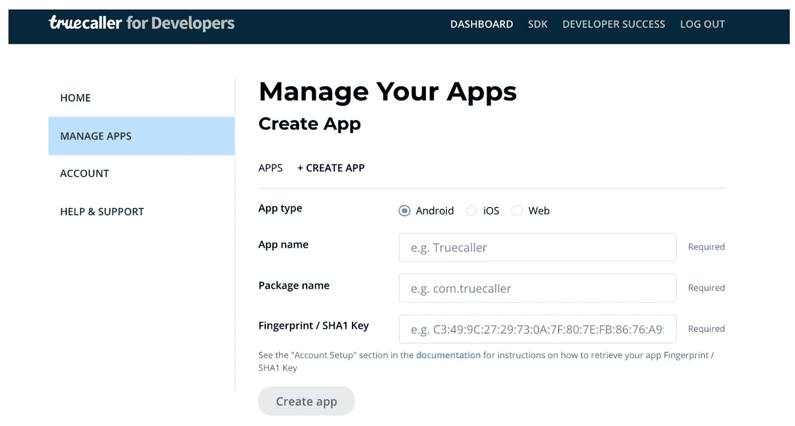
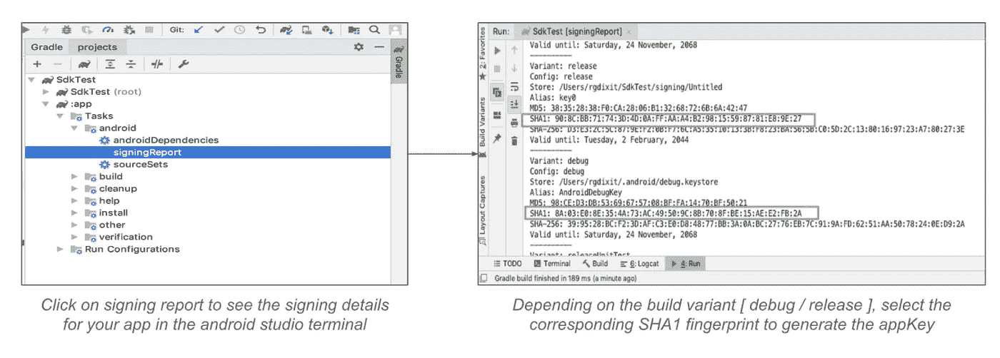
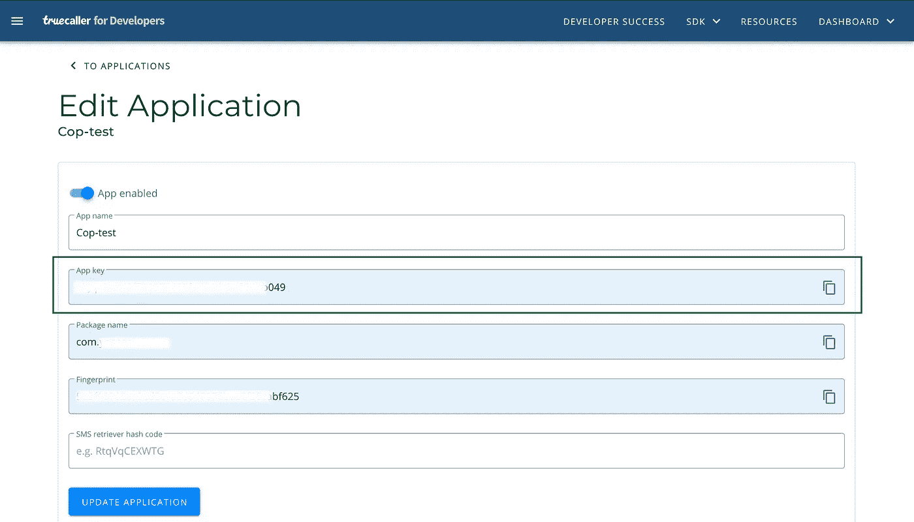

# 在 React Native 中集成 Truecaller SDK

> 原文：<https://medium.com/geekculture/integrating-truecaller-sdk-in-react-native-dbed49b601d4?source=collection_archive---------9----------------------->


Photo by [Lindsey LaMont](https://unsplash.com/@travelpen?utm_source=medium&utm_medium=referral) on [Unsplash](https://unsplash.com?utm_source=medium&utm_medium=referral)

最近我一直在 React Native 中试验 Truecaller SDK。[React-native-true caller-SDK](https://github.com/aaronalphonso/react-native-truecaller-sdk)可用作验证用户登录/注册的替代方法。然而，如果你是新手，正确配置应用程序可能会很困难。我将指导您在 React Native 中设置一个简单的基于 truecaller 的身份验证。
(注意:该模块目前仅支持安卓系统)

# **1。安装&链接包**

在项目目录中输入以下命令

```
*npm install react-native-truecaller-sdk — save*
```

如果您运行的 RN 版本大于 0.60，您可以跳过下一个命令，因为 React 会在最新版本中本地链接库本身。

```
*npm link react-native-truecaller-sdk*
```

# 2.在 Truecaller 仪表板上创建应用程序

现在访问[*https://developer.truecaller.com/login*](https://developer.truecaller.com/login)*并创建账户(如果您尚未创建账户)并登录 truecaller 仪表板。在此仪表板上创建一个应用程序，truecaller 将使用它来识别您的应用程序。
创建应用程序需要以下信息。*

**

*目标是通过添加您的应用名称、包名称和应用的 SHA-1 密钥，从 Truecaller [开发者帐户](https://developer.truecaller.com/login)生成应用密钥【合作伙伴密钥】。
您可以通过以下 3 个简单步骤获得不同应用版本配置(调试/发布)的应用 SHA-1 密钥:*

*-在 android studio 中打开您的项目
-点击右侧的 gradle 菜单并展开
-点击 android，然后签署报告*

**

```
*NOTE: Different app builds ( debug / release ) have different SHA1 fingerprints and hence would have different & unique app keys, as a single app key corresponds to a particular combination of package name and SHA-1\. You need to manage your debug / release builds by creating separate keys.*
```

*填写应用程序名称、包名称和正确的(根据构建配置)SHA-1 键，然后点击“创建应用程序”。您将被导航到以下屏幕，复制应用程序密钥。*

**

# *3.应用程序端设置和配置*

*打开 AndroidManifest.xml 文件，并将以下元数据元素添加到应用程序标记中。*

```
*<meta-data android:name="com.truecaller.android.sdk.PartnerKey" android:value="@string/truecaller_appkey"/>*
```

*现在打开 strings.xml 文件，添加一个新的 string 标记，名称为“truecaller_appkey ”,值为从 truecaller 仪表板复制的“appkey”。*

```
*<string name="truecaller_appkey">1234567abcdef</string>*
```

# *4.完整的类别代码*

*有关 truecaller 实现的完整代码，请参考下面的类*