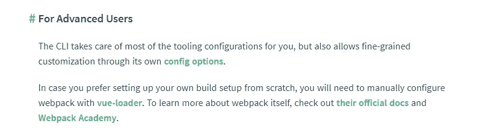
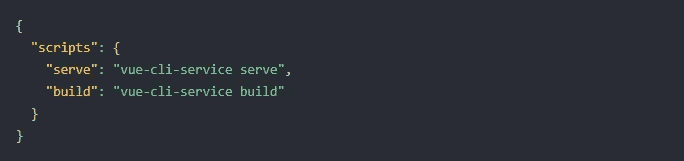
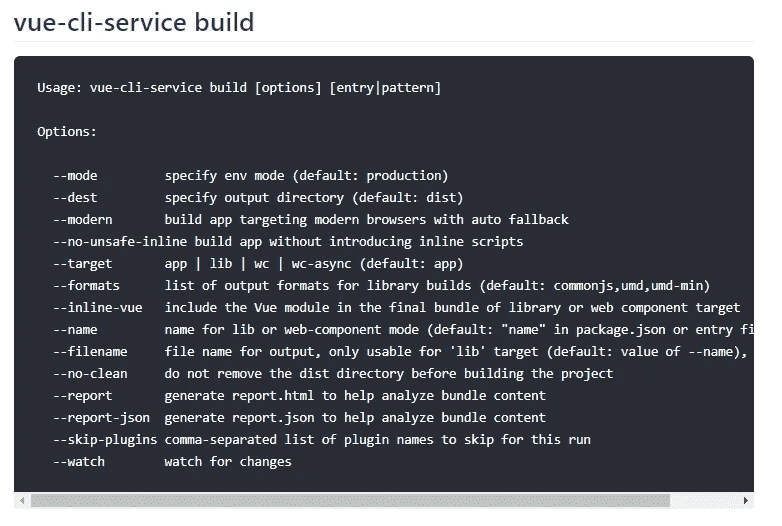

# 将 Vue CLI 集成到现有项目中

> 原文：<https://medium.com/geekculture/integrating-vue-cli-in-an-existing-project-67f4e6eefaef?source=collection_archive---------14----------------------->

当你有一个现有的项目，并想使用 Vue.js(结合[单个文件组件](https://vuejs.org/v2/guide/single-file-components.html)，这可能是一个斗争，让你的。vue 文件编译时，你也需要支持 IE11。

本文描述了如何在现有项目中使用 Vue CLI，而不需要太多的 webpack 知识。


Some fellow developer also connecting dots ;). Source: [Pexels.com](https://www.pexels.com/nl-nl/foto/vrouwelijke-software-ingenieur-codering-op-computer-3861972/)

# **简介**

当我面临这个问题时，我在 medium 上找不到任何匹配的文章(没有过时)。这就是为什么我决定写这篇文章给任何正在寻找这些信息的人。

**我必须满足两个非常重要的要求:**

*   在现有项目中，使用。需要编译 vue 扩展；
*   网站需要在 IE11 中工作。

## 等等，这篇文章适合我吗？

我为每个人写了这篇文章，但是可能需要一些知识来完全理解我所论述的一切:

*   Vue.js 的知识；
*   你知道如何用`vue-cli`设置一个项目，特别是用`vue create [my-app]`命令。

# **旅程**

我想到的第一件事是:好吧，让我们用 **webpack** 试试这个。Vue 有一些关于如何手动配置 webpack 进行编译的文档。vue 文件。



Vue’s documentation about custom configurations. Source: [vuejs.org](https://vuejs.org/v2/guide/single-file-components.html#For-Advanced-Users)

我按照指定的方式进行了配置，一切都运行良好。但是当我在 IE11 中浏览这个网站时，它只是一片空白。

救命啊！

当试图在我的 webpack.config.js 中实现 babel-loader 时，我陷入了一个黑洞。vue 文件由 vue-loader 编译，然后在捆绑之前通过一些 babel-loader 进行“管道传输”。我一直觉得 webpack 非常抽象，我自己也意识到我对 webpack 的了解还不够。

**但是等等！**我意识到，当你使用 vue-cli 创建一个项目时，Vue 确实有很多“魔力”。当以这种方式创建项目时，它会编译。vue 文件和管道通过一些 babel-loader。

Vue 如何做到这一点，我不能在现有项目中使用相同的方式吗？首先，我需要弄清楚 vue-cli 到底是如何工作的。

# Vue-cli 的工作原理

当你开始一个新的 vue 项目时，有几个选项可以将 vue.js 包含在你的网站中，根据:[https://vuejs.org/v2/guide/installation.html](https://vuejs.org/v2/guide/installation.html)

只需输入终端`vue create [name-of-my-app]`，它就会创建一个新的 Vue.js 项目，并进行大量配置(我指的是*magic*)。

当向导完成时，您将被要求导航到带有`cd name-of-my-app`的文件夹。之后你就可以运行`npm run serve`了。
如果您查看 package.json，您会看到这个神奇的命令刚刚添加了一个“scripts”属性，其中包含两个您可以使用的 npm 脚本。

*这里有更多关于 npm 脚本的信息:*[*https://docs.npmjs.com/cli/v7/using-npm/scripts*](https://docs.npmjs.com/cli/v7/using-npm/scripts)



scripts-object inside package.json

看看那个`serve`脚本做了什么。它将使用带有一些选项的`vue-cli-service`，在这种情况下只使用一个选项:`serve`。

*指定此* `*serve*` *选项将会查看默认入口点* `*src/main.js*` *并使用* [*热模块替换*](https://webpack.js.org/concepts/hot-module-replacement/) *启动开发服务器(基于 webpack-dev-server)。*

*热模块替换更新页面上的模块，而无需完全重新加载，这加快了开发速度。*

我们将使用这些 npm 脚本作为基础，将 vue-cli 服务集成到现有项目中。

# 集成 vue-cli 服务

当您导航到 vue-cli 的[文档时，您将找到在现有项目中配置它所需的所有信息。](https://cli.vuejs.org/guide/)

现有项目的问题是文件夹结构可以不同。您的条目文件可能在另一个地方，并且您可能希望生成一个不同的包。所有这些选项都可以通过 vue-cli 服务进行配置。

## vue-cli 服务的各种选项

vue-cli 服务附带了各种选项，我们可以使用这些选项来配置不同的模式、目标等。

在我现有的项目中，不需要使用热模块替换来运行开发服务器。这就是为什么我只使用 vue-cli-service 的 build 命令。在本文中，我将只引用这个 build 命令。



The different modes of the vue-cli-service build. Source: [https://cli.vuejs.org/](https://cli.vuejs.org/guide/cli-service.html#vue-cli-service-build)

## 我们的文件夹结构

这是我们的文件夹结构。我将把它放在这里，以便下面的任何例子都有意义。

```
| scripts
| -- components
| ----- Header.vue
| ----- Footer.vue
| -- App.vue
| -- base.js
|index.html
```

*base . js 文件导入 app . vue
app . vue 有两个组件:Header.vue 和 footer . vue*

## 指定入口/输出

其中一个问题是有些信息比较难找到，例如:指定输入。

前往 *package.json* 。当我们查看选项时，我们可以为 build-command 指定一个不同的条目。这是通过将文件夹路径作为最后一项添加到字符串中来完成的。像这样:

```
"scripts": {
  "build": "vue-cli-service build scripts/base.js"
}
```

可以通过指定- dest 来输出文件。比如说。如果我们希望我们的文件输出到一个新创建的名为‘dist’的文件夹中，我们应该在命令中添加`--dest scripts/dist`。像这样:

```
"scripts": {
  "build": "vue-cli-service build --dest scripts/dist scripts/base.js"
}
```

## 观看文件

`serve`命令真正有用的地方在于，当任何文件发生变化时，它会自动重新编译您的代码。
构建命令还有一个`--watch`选项。

只需将`--watch`添加到我们的构建脚本中，每次任何文件更新时，我们的输出文件都会重新编译。

```
"scripts": {
  "build": "vue-cli-service build --watch scripts/base.js"
}
```

## 一起

当你想要定制配置你的构建，但是你不想避免编写一个定制的 webpack 配置，并且仍然必须配置 vue-loader，style loadersá和 babel 时，使用和配置 vue-cli-service 是非常有用的。

下面是一个结合了入口点和选项`--dest`和`--watch`的例子。

```
"scripts": {
  "build": "vue-cli-service build --watch --dest scripts/dist scripts/base.js"
}
```

vue-CLI-救援服务！:)

感谢阅读这篇文章。我希望它对你有帮助。如果您有任何问题或建议让这篇文章变得更好，请不要犹豫，留下您的回复。