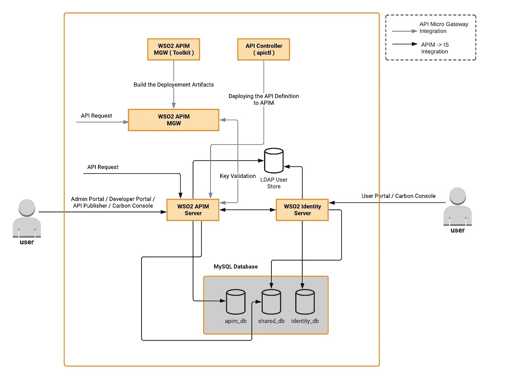
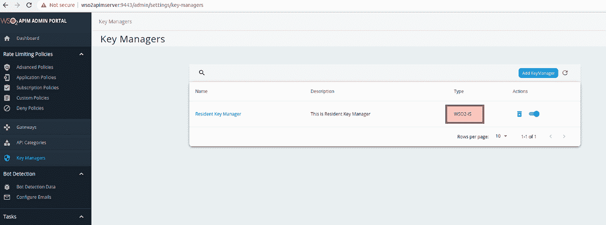
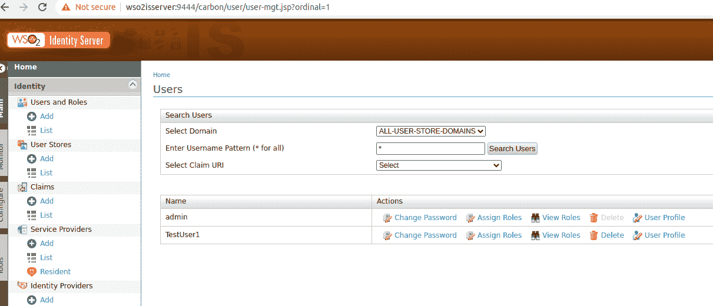
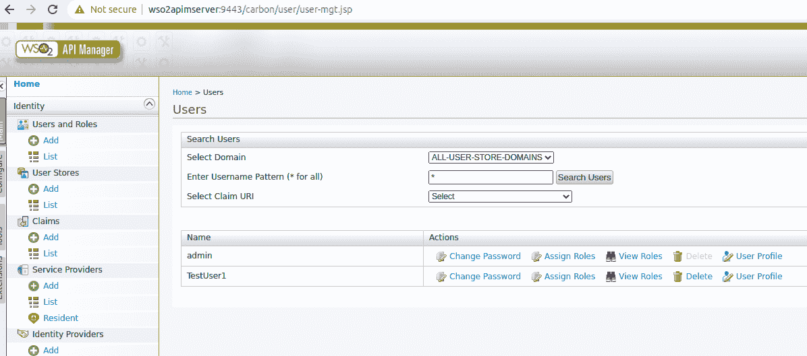
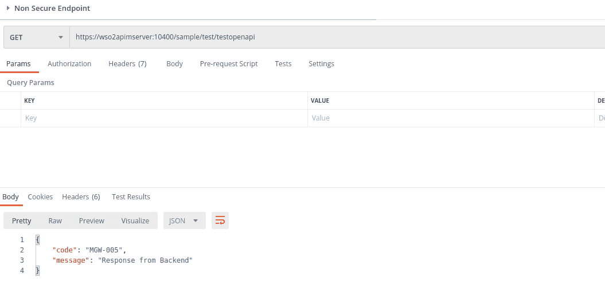
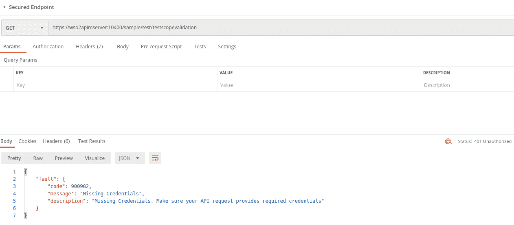
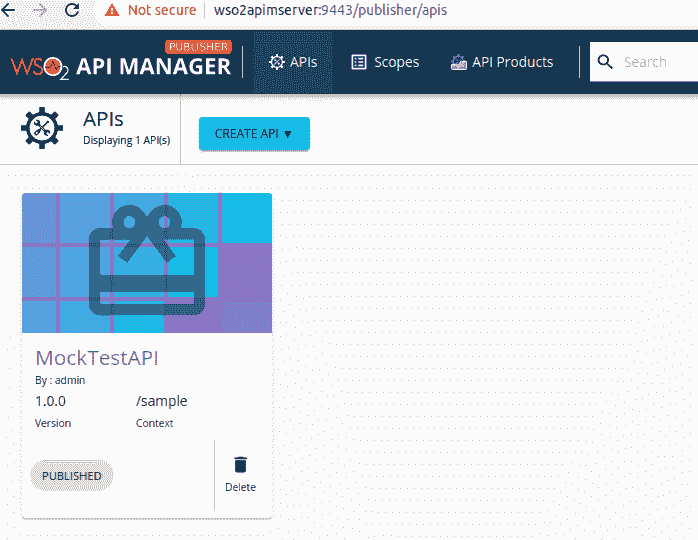
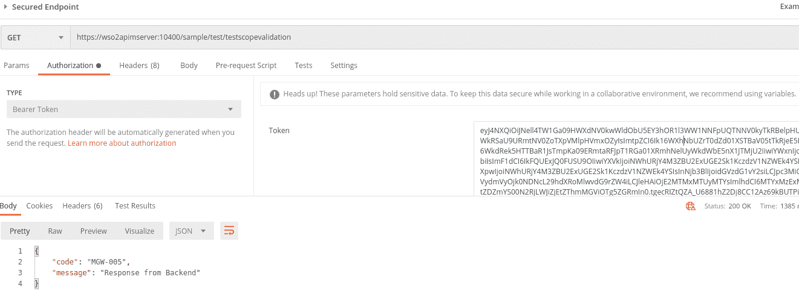

# 将 WSO2 APIM、API 微网关与 WSO2 身份服务器集成

> 原文：<https://medium.com/geekculture/integrating-wso2-apim-api-microgateway-with-wso2-identity-server-2eb3c91caafc?source=collection_archive---------13----------------------->

在典型的设置中，我们将 WSO2 API 管理器和 WSO2 Identity Server 集成为一个密钥管理器，因为附加组件 WSO2 已经引入了 API Microgateway，它可以与 WSO2 API 管理器集成并用作网关。其中 API 的管理将由 WSO2 API 管理器来处理。

在这篇文章中，我们将看到如何将所有这些集成在一起，并在分布式设置中使用它。

**内容**

*   先决条件
*   设置架构
*   建立发展环境

*(设置 OpenJDK，设置 Microgateway 工具包，设置 API 控制器，设置 MySQL，设置 Microgateway 运行时(可选)，设置 WSO2 发行版，设置 Docker )*

*   为 WSO2 设置配置数据库
*   将 WSO2 APIM 配置为与 WSO2 集成是
*   验证 WSO2 APIM 和 IS 之间的设置
*   设置 WSO2 API 微网关
*   从 WSO2 API 管理器导入要管理的 API
*   结论

**先决条件**

1.  WSO2 APIM 3.2.0
2.  WSO2 为 5.11.0
3.  OpenJDK 11
4.  微网关工具包 3.2.0
5.  微网关 3.2.0 运行时
6.  MySQL 5.7.33
7.  API 控制器— apictl 3.2.1

**设置架构**

## 建立发展环境

**设置 OpenJDK**

您可以[下载包](https://jdk.java.net/archive/)并解压到位置，然后设置环境变量如下:

**设置微网关工具包**

[下载](https://wso2.com/api-management/api-microgateway/)并解压到一个位置，设置环境变量如下:

**设置 API 控制器**

[下载](https://apim.docs.wso2.com/en/latest/learn/api-controller/getting-started-with-wso2-api-controller/)并解压到一个位置，设置环境变量如下:

**设置 MySQL**

在这次演示中，我使用的是 MySQL 下面的版本，根据您的需要，您可以选择一个版本，并使用标准的 MySQL 安装过程进行安装。

**设置微网关运行时**

如果我们只打算部署到虚拟机中，则需要进行此设置。在这里，我将演示如何使用 Docker 进行部署，这种设置是不需要的。有关这方面的更多信息，可以在 Microgateway 运行时发行版的 README.md 中找到。

**设置 WSO2 分布**

下载并解压缩 WSO2 APIM 和 WSO2 IS 发行版，并将其解压缩到一个位置。

**设置对接器**

## 为 WSO2 设置配置数据库

主要是 apim_db、shared_db 和 identity_db 涉及分布式设置，其他数据库将用作默认 h2 数据库。

以下示例脚本可用于创建数据库设置。

## 将 WSO2 APIM 配置为与 WSO2 集成是

**WSO2 正在配置更新**

在我的本地设置中，我将在同一台机器上运行 WSO2 APIM 和，因此设置 WSO2 的端口偏移量为。

设置主机名

在/etc/hosts 中创建一个映射，将主机名与本地 IP 进行映射

更新数据库以指向 MySQL 实例，这里如果我们不使用多租户，apim_db 不需要在这里共享。

从[这里](https://apim.docs.wso2.com/en/3.2.0/assets/attachments/administer/wso2is-km-connector-1.0.16.zip)下载 WSO2 APIM 的 WSO2 IS 连接器。

将以下流量管理器配置添加到<is_home>/repository/conf/deployment . toml</is_home>

配置事件侦听器。

## WSO2 APIM 配置更新

更新主机名。

更新数据库配置，这里我们需要指定。

在 deployment.toml 中将 IS 配置为 Keymanager。

当我们更新 mysql 数据库时，我们需要将 mysql 连接器添加到 <apim_home>/repository/components/lib 中。</apim_home>

## 验证 WSO2 APIM 和 IS 之间的设置

**启动 WSO2 是**

[https://gist . github . com/ajanthanblog/4c feb 791d 4036 f 55013490 C1 A0 DAA 444](https://gist.github.com/ajanthanblog/4cfeb791d4036f55013490c1a0daa444)

**启动 WSO2 API 管理器**

[https://gist . github . com/ajanthanblog/F9 b8 d6e 51003005d 24 ed C5 da 8 a 0 e 7 a 55](https://gist.github.com/ajanthanblog/f9b8d6e51003005d24edc5da8a0e7a55)

进入[https://WSO 2 API server:9443/admin/settings/key-managers](https://wso2apimserver:9443/admin/settings/key-managers)查看类型是否为:WSO2-IS。

在 WSO2 IS 中创建一个用户，看看是否可以在 WSO2 API 管理器控制台中查看该用户。

确保 WSO2 API 管理器成功听取了以下主题。

## 设置 WSO2 API 微网关

开始之前，请确保您已经完成了 Microgateway 工具包的设置，如果没有，请参考“设置 Microgateway 工具包”一节。

1.  更新<toolkit_home>/resources/conf/micro-GW . conf 文件，这是为了更改默认配置，对于我们的用例，我们需要通过 WSO2 API 管理器指向 keymanager，以及我们可以在这里编辑并在 deployment-config.toml 中指定的其他配置，以便这些配置将被添加到映像中。</toolkit_home>

这是用于“micro-gw.conf”文件中设置的示例配置。

2.准备 API 定义文件。这里我使用了两个 API，一个是客户端凭证授权类型的安全 API，具有特定的作用域，另一个是非安全 API。

3.执行下面的命令来初始化和创建项目。在执行之前，我们可以传递两个文件

API 定义文件——我们之前创建的

部署配置文件——这个文件我们需要更新如下。

当我们使用 Docker 构建时，更新下面的部分，以便我们复制我们的自定义配置。

sl-ajanthan @ slajanthan-Latitude-3580:~/integration $ micro-GW init testapimgw-a API-definition/API-definition-sample . YAML-d deployment-config/deployment-config . YAML

4.导出 WSO2 API 管理器公共证书

keytool-export-alias WSO 2 carbon-file WSO 2 carbon . CRT-keystore<api-m_home>/repository/resources/security/WSO 2 carbon . jks</api-m_home>

5.将证书导入 wso2am-micro-GW-toolkit-Linux-3 . 2 . 0/lib/platform/bre/security/ballerina truststore . p12

keytool-import-trustcacerts-alias WSO 2 PIM local-file WSO 2 carbon . CRT-keystore<toolkit_home>/lib/platform/bre/security/ballerina truststore . p12</toolkit_home>

6.导出 WSO2 API 的公共证书，并将其导入下面的信任存储。

keytool-export-alias WSO 2 carbon-file WSO 2 carbon-alias . CRT-keystore<api-m_home>/repository/resources/security/WSO 2 carbon . jks</api-m_home>

keytool-import-trustscacerts-alias gateway _ certificate _ alias-file WSO 2 carbon-alias . CRT-keystore<toolkit_home>/lib/platform/bre/security/ballerina truststore . p12</toolkit_home>

7.执行 build 命令来构建映像。

sl-ajanthan @ slajanthan-Latitude-3580:~/integration $ micro-GW build testapimgw—docker—docker-image testapigw:v1—docker-base-image wso2/WSO 2 micro-GW:3 . 2 . 0

8.打开集装箱。

docker run-d-p 10400:9095-p 10401:9090 testa pigw:v1

如果我们需要从外部文件加载配置，而不需要再次构建镜像，可以使用下面的命令:

docker run-p 10400:9095-p 10401:9090-v<host_path_to_micro-gw.conf_dir>:/home/ballerina/conf testa pigw:v1</host_path_to_micro-gw.conf_dir>

9.验证微网关

此外，通过调用非安全端点，我们可以检查请求是否通过微网关处理。

但是当您尝试使用安全端点时:

10.为了调用安全端点，我们需要将 API 定义导入到 WSO2 APIM，并从那里管理它。为了简化这个过程，WSO2 引入了 API 控制器。

## 从 WSO2 API 管理器导入要管理的 API

1.  希望已经完成了“设置 API 控制器”
2.  完成(1)后，执行下面的命令来设置环境变量。

3.检查您是否可以登录系统。

[https://gist . github . com/ajanthanblog/ee 71 ba 987 f 544 f 81 c 7 f 0804 f1 c 767d 47](https://gist.github.com/ajanthanblog/ee71ba987f544f81c7f0804f1c767d47)

4.初始化要为导入创建的项目。

[https://gist . github . com/ajanthanblog/b 63979460 BF 9161 b 25 c 71 b 7731 C5 f 63 c](https://gist.github.com/ajanthanblog/b63979460bf9161b25c71b7731c5f63c)

5.转到新创建的项目“testapiimport”并更新<home>/testapi import/Meta-information/API . YAML</home>

6.导入 API

apictl 导入-api -f 测试 api 导入-e 开发-k

7.创建应用程序并订阅 API

8.生成不记名令牌。

9.使用不记名令牌调用安全端点。

10.检查 Microgateway 的日志，看 API 调用是否通过。

## 结论

这篇文章解释了一个基本的设置，我们可以用 WSO2 APIM，WSO2 是和 WSO2 微积分器。利用这种理解，我们可以扩展架构以满足高可用性，并且在 API 定义上，我们可以使用 openAPI 规范添加其他 OAuth2.0 授权类型以供进一步使用。