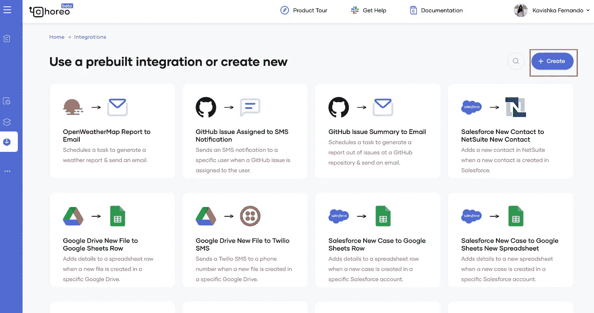
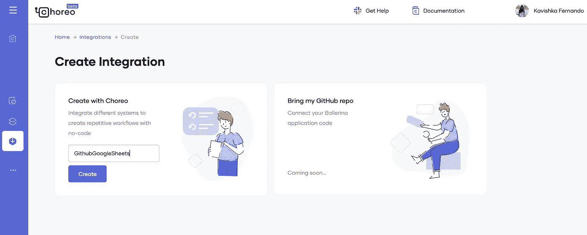
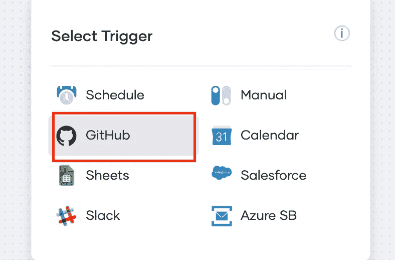
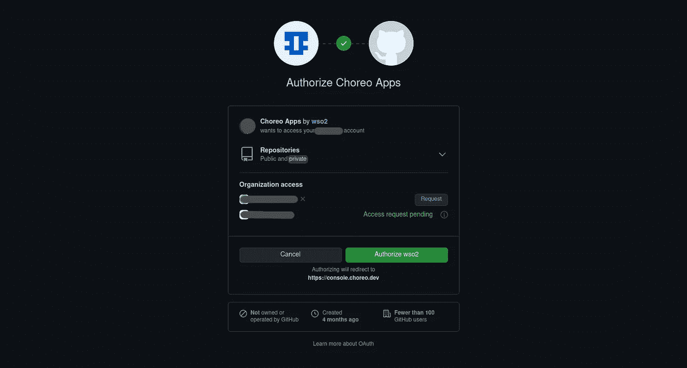
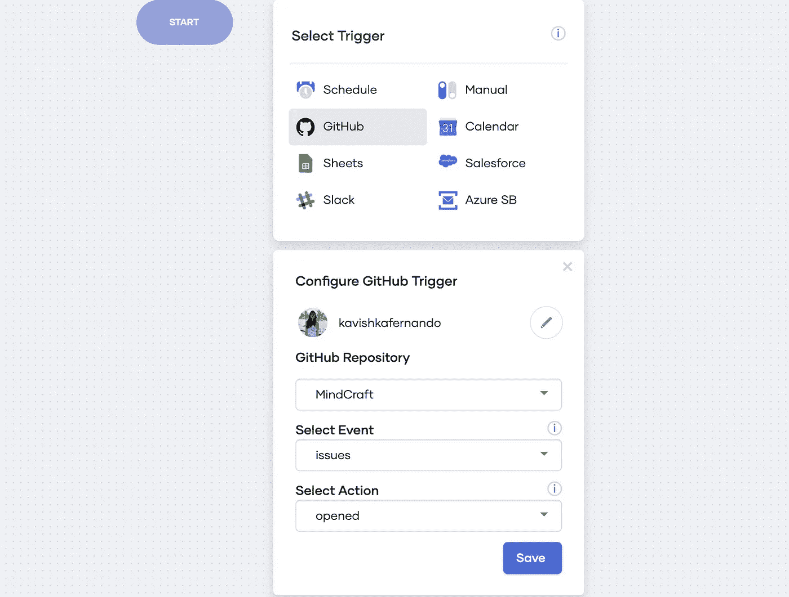
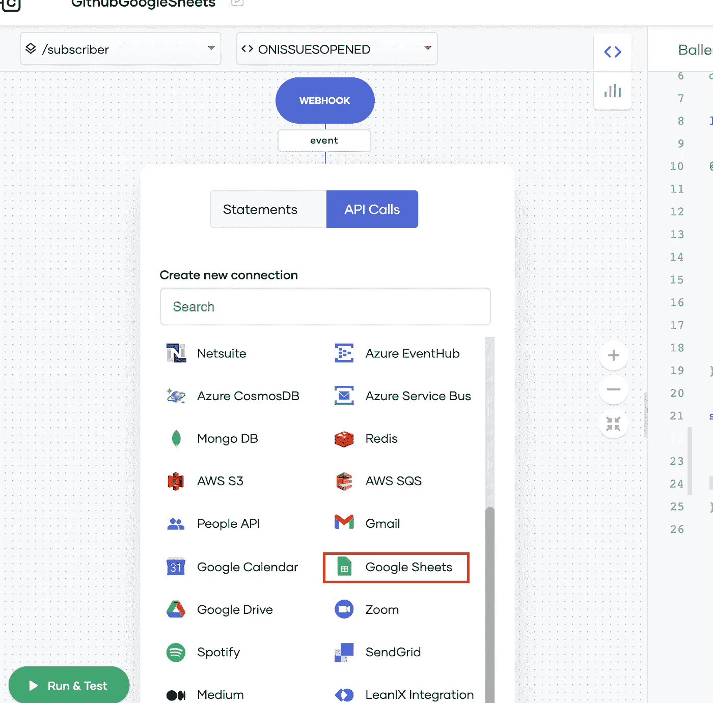
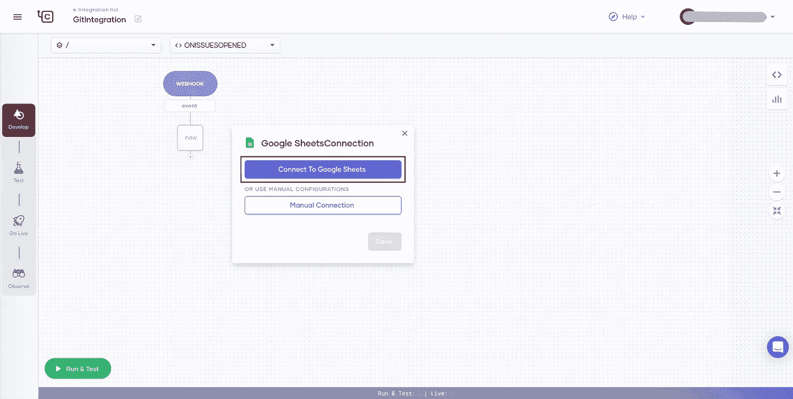
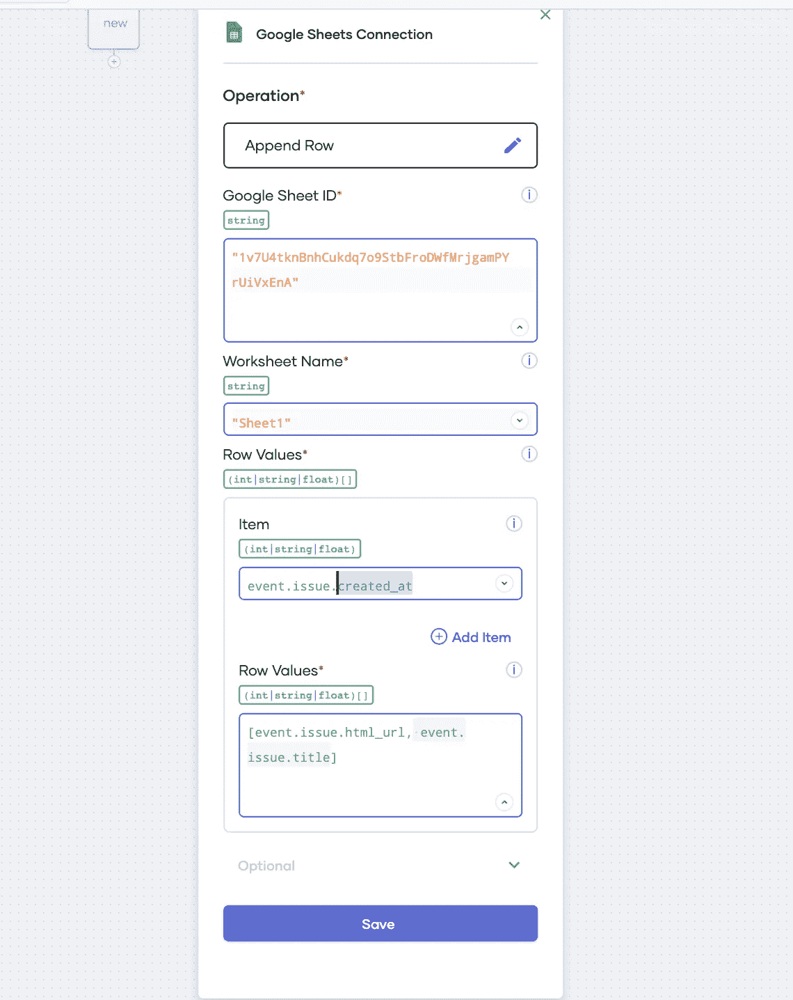
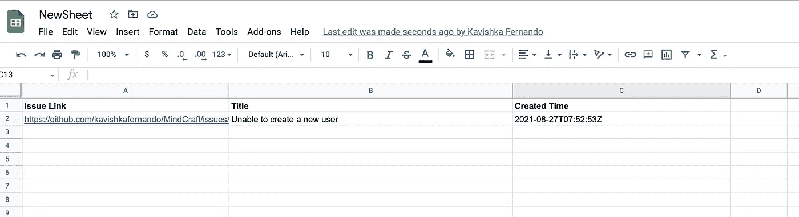

# 使用 Choreo 将 Github 与 Google Sheets 集成

> 原文：<https://medium.com/geekculture/integration-of-github-with-google-sheets-using-choreo-32f61e3f45ed?source=collection_archive---------20----------------------->

虽然 Github 提供了一个存储库概要，但我个人看到许多项目/产品经理使用 Google sheets 来跟踪问题和其他与存储库相关的概要细节。手动将这些细节复制粘贴到谷歌表单中是一项令人厌烦的任务。Choreo 让 Github 和 Google Sheets 的整合变得超级简单！

让我们看看如何在几分钟内完成这一集成。

1.  登录 [Choreo 开发者门户](https://console.choreo.dev/?utm_source=me&utm_medium=link&utm_campaign=me_link_KavishkaMedium_211001)。

2.点击集成卡中的**开始**，并点击**创建**

3.在 **Create with Choreo** 卡下插入您的集成服务名称，并点击 **Create** 。

4.选择 **Github** webhook 触发器并选择**连接 GitHub** 并授权 Choreo 访问您的 Github 账户。

5.为 Github 触发器提供以下详细信息。

I .选择一个 **GitHub 库**，它列出了所有可用的库。

二。选择您想要添加到表单的**事件**。它可以是问题、标签、拉动请求或下拉列表中列出的任何其他内容。

三。选择与您选择的事件相关的**动作**。我选择了问题，我将提取未解决的问题。

添加所有详细信息后，点击**保存**。

6.选择 API 调用下的 **Google Sheets** 并提供 Choreo，授权连接到 Google Sheets 并点击**保存。**

7.选择符合您要求的与 Google Sheets 相关的必要操作，并提供以下详细信息。我选择了追加行操作。

I .创建一个 Google sheet 并提供 **Google Sheet ID** 。

二。提供**工作表名称**。

三。您可以添加需要在工作表中显示的行值。我需要以下详细信息，相应的行值**项**如下所示。插入每个项目值后，点击**添加项目**。

a.问题 URL:**event . issue . html _ URL**

b.问题标题:**事件.问题.标题**

c.出库创建时间: **event.issue.created_at**

更多属性可以参考 Github issues API:[https://docs.github.com/en/rest/reference/issues](https://docs.github.com/en/rest/reference/issues)

添加完所有详细信息后，点击**保存**。

8.点击页面底部的**运行&测试**按钮，测试您的集成。
您可以在中创建新问题。您的 Github 库，并检查该问题是否记录在 Google 表单中。

几分钟后，您已经将 Github 与 Google sheets 集成在一起，记录了存储库中新创建的问题。

让每个经理的生活变得更加轻松！

关于 [Choreo](https://wso2.com/choreo/?utm_source=me&utm_medium=link&utm_campaign=me_link_KavishkasMedium_211001) 的更多信息，你可以访问[家务资源库](https://wso2.com/choreo/resources/)和 [Choreo 文档](https://wso2.com/choreo/docs/)。