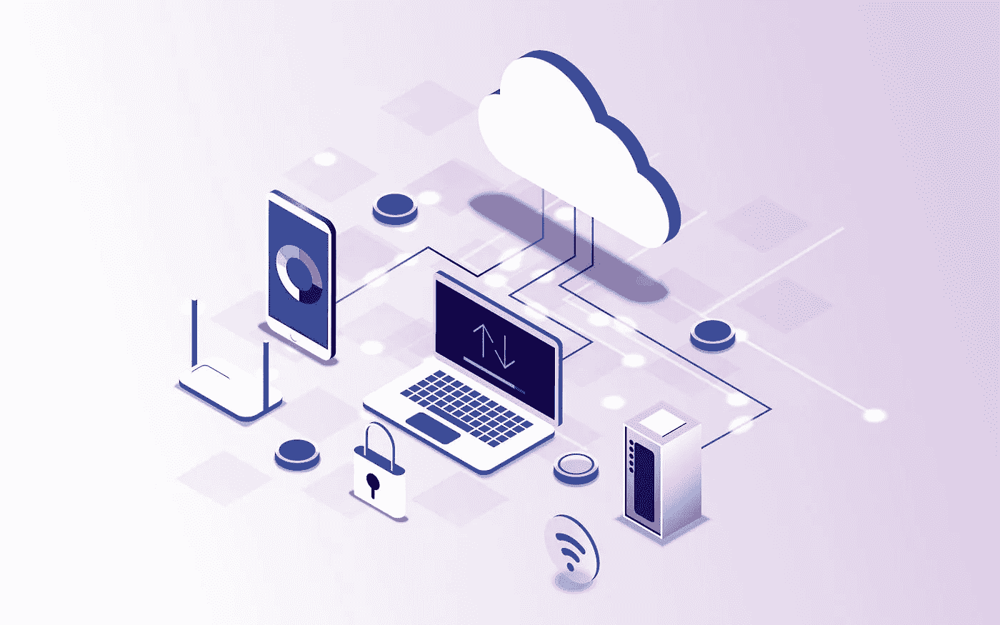

# 集成平台即服务(iPaaS):什么是集成平台即服务，它的优势以及如何选择最佳的集成平台即服务

> 原文：<https://medium.com/geekculture/integration-platform-as-a-service-ipaas-what-is-it-the-benefits-and-how-to-choose-the-best-one-fd8207de6a41?source=collection_archive---------16----------------------->

如今，所有垂直行业的组织都在采用基于云的应用和服务。行业的快速变化，加上基于云的应用的指数级增长，推动了 iPaaS 的增长。iPaaS 通过连接不同的数据系统，帮助组织处理他们的数据孤岛。使用这种方法，数据保存在一个位置，使员工和部门能够访问和管理实现业务目标所需的信息。通过将数据放入集中的存储库中，组织可以减少手动数据输入和法规遵从性要求。iPaaS 还提高了可视性，简化了员工对信息的访问。然而，iPaaS 的用处取决于它所连接的系统。

让我们来了解一下 iPaaS 实际上代表着什么，以及为什么它会是你在很长一段时间内可能做出的最重要的决定！

*相关:* [*什么是应用集成，如何实现企业级效率*](https://blog.quickwork.co/what-is-application-integration/)

# 什么是 iPaaS？

iPaaS 或集成平台即服务是一个中央平台，它对应用程序之间的数据流动进行标准化，以简化业务流程。

iPaaS 是一种解决方案，有助于改善不同部门之间的沟通，并简化组织内的数据共享。它允许公司通过与另一个已经具有这种能力的软件集成来扩展他们的产品，而不需要在内部构建它，允许企业向客户提供更全面和更健壮的解决方案。

# iPaaS 的优势

对于试图统一信息以改善团队之间人员、信息和服务流动的组织来说，集成平台是完美的解决方案。这使得团队成员可以通过统一的前端访问您的应用程序，了解哪些数据可用以及他们可以对这些数据采取哪些措施，并随时随地查看信息，而无需多次重新输入信息。在当今世界，您还应该考虑您的员工如何使用每个应用程序。集中式方法的好处对于许多人来说，信息访问是一个问题，但是如果您使用 iPaaS，您可以减少输入数据所花费的时间，并提高员工的工作效率。

**为什么要考虑购买 iPaaS？**

*   减少输入数据所花费的时间，提高员工的工作效率。
*   针对特定客户需求定制应用，例如更好地将 CRM 与 Salesforce 集成，或使用 ServiceNow 自动化 IT 管理任务。
*   通过加密系统间传输的数据来提高安全性。
*   以比传统集成工具更低的成本支持更多用户。

所以，如果你想改善你的业务流程，降低成本，提高员工的生产力？你需要一个 iPaaS 平台！

但是，让我们稍微详细地看一下贵公司可以从 iPaaS 中获得的好处:

1.  **您的集成工作可以加速:**您可以大幅减少应用与 iPaaS 集成所需的时间，让您能够更快地启动和运行集成，从而加速数字化转型计划。
2.  **您将能够将更多的时间投入到更高价值的集成任务中:**您将不必使用 iPaaS 编写低级别的网络代码，因为它附带了预先构建的、经过验证的连接器，这些连接器已经与特定于应用程序的 API 集成在一起。iPaaS 提供商承诺保持连接器最新，并确保与关键应用程序的兼容性。
3.  **您可以选择提高您的集成能力:**集成专家、市场分析师，甚至公民集成商都可以使用 iPaaS 的高级工具，使您能够扩大创建和管理集成的人才库。这加快了新集成的发布，减轻了 IT 部门的压力，使他们能够专注于更高价值的任务。
4.  **您可以快速调整您的集成:**由于您的公司和您使用的技术在不断变化，iPaaS 通过提供一致的用户体验使您能够快速适应，允许您升级或发展您的集成以跟上发展步伐，这是大多数数字化转型工作的先决条件。

# 您可以如何使用 iPaaS 以及使用 iPaaS 的目的

1.  **交换数据:**为了简化您的业务流程，改善您的客户和员工互动，并激励您的公司决策者，在您的应用程序之间实时交换数据。
2.  **迁移数据:**为了让公司更加敏捷，将数据从遗留系统迁移到新的、基于云的业务系统。您可以将数据从较旧的本地业务系统(如 Microsoft Dynamics CRM 4.0)映射、转换和传输到云 CRM(如 Salesforce 或 Microsoft Dynamics 365)。iPaaS 将帮助您以适当的顺序迁移身份、联系人和机会等数据，以便保留新系统中数据之间的关系。许多企业经常使用定制字段和对象，iPaaS 可以检测这些字段和对象并将其整合到迁移流程中。

# iPaaS 替代品

1.  **ESB:** 企业服务总线(ESB)是一种促进应用程序集成和提供面向服务架构(SOA)的技术方法。ESB 使用一组规则来组合各种应用程序。虽然 iPaaS 提供了更多的功能，但是它也可以与 ESB 结合使用。ESB 已经发展到在与 RESTful APIs 交互时支持云服务，并被推荐用于构建聚合服务。
2.  **SaaS:** iPaaS 提供商使客户能够保持对其应用程序和数据的控制，而 SaaS 提供商则处理应用程序的所有方面。此外，虽然 SaaS 解决方案可用于分析，并受益于有效和高效的集成，但这不是他们的主要功能。另一方面，iPaaS 用于通过集成 SaaS 解决方案将多个云服务捆绑在一起。

# iPaaS 功能

尽管集成平台即服务的好处很多，但问题仍然是 iPaaS 如何运行。几个关键功能构成了 iPaaS 的架构，根据 Gartner 的 2020 年企业集成应用程序即服务幻方图，该解决方案应该提供广泛的这些功能，才能真正成为有效的平台:

1.  应用程序集成特性包括各种系统发送和接收消息、调用彼此的业务功能以及自动化业务流程的能力。在大多数情况下，需要事务级集成。它必须支持应用程序之间的数据一致性/同步、从现有应用程序或服务的聚合中创建新服务(通常发布为 API 或事件)以及涉及多个系统的多步骤流程的交付等用例。
2.  数据集成功能包括各种数据存储的同步、数据传输以及合并、删除重复数据和集成来自多个存储的数据的能力。在这种集成中，经常使用批量/批处理、联合/虚拟化或复制/同步数据分发模式。它可以提取、转换、组合和提供数据，以服务于广泛的用例，包括分析和数据处理和集成。
3.  API 管理特性包括构建、部署、保护和跟踪 API 的能力。这些功能必须由一个 API 网关和一个管理门户组成；开发者门户是可选的。
4.  连接到各种内部和基于云的端点，包括:应用程序连接器(例如，用于 Salesforce、Workday、NetSuite、Oracle 电子商务套件、SAP S/4HANA、ServiceNow、Microsoft Dynamics 和 Marketo)；数据源连接器(例如，用于文件系统、SQL 和 NoSQL 数据库)；技术连接器(例如，用于 FTP、HTTP、Java 消息服务[JMS]和开放式数据库连接[ODBC])。
5.  多种数据/消息交付方式，包括:基于 API 的；消息传递/基于事件；批量。
6.  数据和消息验证。
7.  数据和消息映射和转换。
8.  数据和消息路由和编排。
9.  用于开发、测试、部署、执行、管理、监控和管理集成流程以及管理相关对象(转换映射、路由规则、编排流程、适配器配置等)的生命周期的最终用户工具。

# 如何选择合适的 iPaaS

尽管 iPaaS 架构有很多潜力，但企业在发现和选择过程中会寻找某些共同的特性和功能。以下是 iPaaS 架构中需要注意的几个特征:

*   连接到新数据源和业务流程的能力。
*   数据保护、正常运行时间和可靠性
*   API 管理是可用的管理解决方案之一。
*   监控解决方案提供端到端控制。
*   能够根据不断变化的业务需求进行扩展和调整
*   本地、云中以及混合环境中的数据存储

# Quickwork 是适合您企业的解决方案吗？

如果您厌倦了开发人员花费太长时间来构建您的下一个产品，或者如果您希望能够按计划启动，而不是为每个项目雇佣人员，那么 Quickwork 是完美的解决方案。凭借任何人都可以使用的易于使用且记录完善的 API 和连接器库，我们为您的企业(无论规模大小)提供了在不牺牲质量的情况下进行扩展的机会。

Quickwork 是一个企业 iPaaS，专为各种规模的团队设计，旨在提高协作和创新效率。它将直观的可视化设计与强大的任务自动化和工作流开发功能相结合。Quickwork 通过自动化手动任务、实现快速应用程序集成，并允许用户快速构建一个应用程序来完成他们现在需要的工作，从而帮助组织管理他们的任务关键型业务流程。Quickwork 的可视化流程设计器提供了对流程定义的几乎每个方面的完全控制，允许任何人构建高级工作流。

现在，您对 iPaaS 有了更多的了解——它是什么，它是如何工作的，以及如何确定 iPaaS 解决方案是否适合您的公司。有了这些信息，您就可以开始搜索提供商，看看 iPaaS 解决方案是否适合您的企业。

要了解有关 Quickwork 的更多信息，并了解该平台如何为您的组织带来益处，请与我们的自动化专家一起安排一次演示！

# [日程演示](https://calendly.com/quickwork/demo)