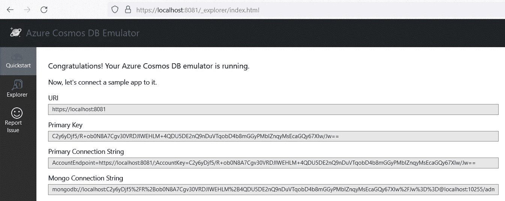
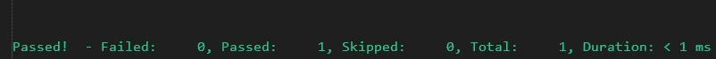

# Azure 函数和 Cosmos DB 演练的集成测试

> 原文：<https://medium.com/geekculture/integration-test-for-azure-functions-and-cosmos-db-walkthrough-aec0d4198567?source=collection_archive---------1----------------------->


Photo by [红火](https://pixabay.com/users/红火-2936866/) on [Pixabay](https://pixabay.com/?utm_source=medium&utm_medium=referral)

# 渴望阅读

用简单的设置运行*集成*测试有一个很大的优势。它帮助您在过程的早期发现错误，并确保代码按预期运行。按照下面我的指导运行 Azure Function 和 Cosmos DB 的集成测试。

# 更大的

> **集成测试** —是一种软件测试，将软件应用程序的不同单元、模块或组件作为一个组合实体进行测试。

如果可能的话，在本地增加依赖项是一个很好的做法。您应该选择对本地数据库而不是远程数据库运行测试。这有两个优点:

1.  测试在本地运行比在远程数据库上运行更快。
2.  你独立于其他开发人员运行测试。来自其他机器的测试数据不会影响您的数据库。

# 被测系统

> **Azure Functions** 是一个按需提供的云服务，提供运行应用程序所需的所有持续更新的基础设施和资源。您专注于对您来说最重要的代码，使用对您来说最有生产力的语言，函数处理剩下的事情。

对于这个例子，我放入了一个 Azure 函数。它向*公开一个端点，创建*汽车:

```
public class CarFunction
{
    private readonly ICarRepository _carRepository;
    private readonly ILogger<CarFunction> _logger;

    public CarFunction(ICarRepository carRepository, ILogger<CarFunction> logger)
    {
        _carRepository = carRepository ?? throw new ArgumentNullException(nameof(carRepository));
        _logger = logger ?? throw new ArgumentNullException(nameof(logger));
    }

    [FunctionName("CreateCar")]
    public async Task<IActionResult> CreateCar([HttpTrigger(AuthorizationLevel.Anonymous, "post", Route = "cars")] CarRequest request, HttpRequest req)
    {
        try
        {
            if (string.IsNullOrWhiteSpace(request.Name))
                return new BadRequestObjectResult("Name is mandatory.");

            var createdCar = await _carService.CreateCar(request);

            return new CreatedResult("/cars/" + createdCar.Id, createdCar);
        }
        catch (Exception ex)
        {
            return new ObjectResult(ex.Message) { StatusCode = 500 };
        }
    }
}
```

我们将使用 Cosmos DB 来存储汽车。下面是存储库的外观:

```
public class CarRepository : ICarRepository
{
    private CosmosClient _cosmosClient;
    private Container _container;

   public CarRepository(IOptions<Configuration> configuration)
    {
        this._cosmosClient = new CosmosClient(configuration.Value.ConnectionString);
        this._container = _cosmosClient.GetContainer("CarDatabase", "Cars");
    }
    public async Task<Car> Create(Car car)
    {
        var itemResponse = await _container.CreateItemAsync(car, new PartitionKey(car.Id));
        return itemResponse.Resource;
    }
}
```

因为我们使用功能应用程序，所以我们必须有`Startup.cs`:

```
public class Startup : FunctionsStartup
{
    private const string configurationSection = "Cars:Database";

    protected virtual IConfigurationRoot GetConfigurationRoot(IFunctionsHostBuilder functionsHostBuilder)
    {
        var local = new ConfigurationBuilder()
            .AddJsonFile(Path.Combine(Environment.CurrentDirectory, "local.settings.json"), true, true)
            .AddEnvironmentVariables()
            .Build();
        return local;
    }

    public override void Configure(IFunctionsHostBuilder builder)
    {
        var local = GetConfigurationRoot(builder);
        var config = new ConfigurationBuilder().AddEnvironmentVariables();
        var configurationSection = local.GetSection(configurationSection);
        builder.Services.Configure<Configuration>(configurationSection);
        var configuration = config.Build();
        builder.Services.AddInfrastructure(configuration);
    }
}
```

## Azure Cosmos DB 模拟器

我们将针对 Azure CosmosDB 的本地实例运行我们的集成测试。此处可下载[。这是它启动后的样子:](https://aka.ms/cosmosdb-emulator)



Azure Cosmos DB Emulator in browser

# 依赖注入

集成测试设置的关键部分是配置*依赖注入*。您需要以下设置类:

## 测试启动

我们将从`Startup`类派生来定义*依赖注入*用于我们的测试。

```
public class TestStartup : Startup
{
    protected override IConfigurationRoot GetConfigurationRoot(IFunctionsHostBuilder functionsHostBuilder)
    {
        var currentDirectory = AppDomain.CurrentDomain.BaseDirectory;
        var configuration = new ConfigurationBuilder()
            .SetBasePath(currentDirectory)
            .AddJsonFile("appsettings.json", true, true)
            .AddJsonFile("local.settings.json", true, true)
            .AddEnvironmentVariables()
            .Build();

        return configuration;
      }

      public override void Configure(IFunctionsHostBuilder builder)
      {
          base.Configure(builder);
          builder.Services.AddTransient<CarsFunction>();
      }
  }
```

# 配置

在 git 存储库中存储密钥和秘密是不明智的。对于本地开发，我们可以使用`local.settings.json`来存储配置。然而我们可以使用`appsettings.json`来管理配置。例如，我们可以在 Azure 管道中使用[管道变量](https://learn.microsoft.com/en-us/azure/devops/pipelines/process/variables?view=azure-devops&tabs=yaml%2Cbatch)和 [FileTransform](https://learn.microsoft.com/en-us/azure/devops/pipelines/tasks/reference/file-transform-v1?view=azure-pipelines) 。[这里的](https://www.youtube.com/watch?v=_iPfzH3ENAk)是我们如何实现它的例子。

`local.settings.json`(不该离开你的本地机器):

```
{
  "Cars": {
    "Database": {
      "ConnectionString": "AccountEndpoint=https://localhost:8081/;AccountKey=C2y6yDjf5/R+ob0N8A7Cgv30VRDJIWEHLM+4QDU5DE2nQ9nDuVTqobD4b8mGGyPMbIZnqyMsEcaGQy67XIw/Jw=="
    }
  }
}
```

`appsettings.json`(保持在源代码控制中，并通过 CI/CD 管道到达)

```
{
  "Cars": {
    "Database": {
      "ConnectionString": ""
    }
  }
}
```

## 测试初始化器

我们想使用一个测试主机，通过`TestStartup`进行*集成测试*。

```
public class TestsInitializer
{
    public TestsInitializer()
    {
        var host = new HostBuilder()
            .ConfigureWebJobs(builder => builder.UseWebJobsStartup(typeof(TestStartup), new WebJobsBuilderContext(), NullLoggerFactory.Instance))
            .Build();

        ServiceProvider = host.Services;
    }

    public IServiceProvider ServiceProvider { get; }
}
```

我们还需要通过从`ICollectionFixture`类派生来包含一个**集合定义**。

```
[CollectionDefinition(Name)]
public class IntegrationTestsCollection : ICollectionFixture<TestsInitializer>
{
    public const string Name = nameof(IntegrationTestsCollection);
}
```

## 整合测试

我们终于可以实现我们的*集成测试*:

```
[Collection(IntegrationTestsCollection.Name)]
public class CarFunctionTests : IClassFixture<TestStartup>, IAsyncLifetime
{
    private CarFunction _carFunction;
    private readonly TestsInitializer _testsInitializer;
    private readonly CosmosClient _cosmosClient;
    private Container _container;
    private readonly string _carId;

    public CarFunctionTests(TestsInitializer testsInitializer)
    {
        _testsInitializer = testsInitializer;

        var cosmosDatabaseConfiguration = testsInitializer.ServiceProvider.GetService<IOptions<CarConfiguration>>();
        _cosmosClient = new CosmosClient(cosmosDatabaseConfiguration.Value.EndpointUri, cosmosDatabaseConfiguration.Value.PrimaryKey);
        _carFunction = _testsInitializer.ServiceProvider.GetService<CarFunction>();
    }
    [Fact]
    public async void TestCreateCar()
    {
        // Arrange
        var carName = $"BMW - {Guid.NewGuid()}";
        var carRequest = new CarRequest { Name = carName };

        // Act
        var response = await _carFunction.CreateCar(, new DefaultHttpContext().Request);
        var createdResponse = (CreatedResult)_response;
        _carId = (createdResponse.Value as Car).Id;

        // Assert
        Assert.IsType<CreatedResult>(createdResponse);
        Assert.Equal(carName, (createdResponse.Value as Car).Name);
    }
    public async Task InitializeAsync()
    {
        var databaseResponse = await _cosmosClient.CreateDatabaseIfNotExistsAsync("CarDatabase");
        var database = databaseResponse.Database;

        var containerResponse = await database.CreateContainerIfNotExistsAsync("Cars", "/id");
        _container = containerResponse.Container;
    }
    public async Task DisposeAsync()
    {
        await _container.DeleteItemAsync<Car>(_carId, new PartitionKey(_carId));
    }
}
```

## 运行测试

我们可以用`dotnet test`命令运行我们的集成测试。



Result of running dotnet test command

# 摘要

我们已经为 Azure Function 和 Cosmos DB 编写了一个*集成测试*。我们还使用了可替换的配置和已配置的依赖注入来为我们工作。

# 资源

1.  [使用 Azure Cosmos DB Emulator | Microsoft Learn](https://learn.microsoft.com/en-us/azure/cosmos-db/local-emulator?tabs=ssl-netstd21)进行本地安装和开发。
2.  [应用程序配置的文件转换](https://www.youtube.com/watch?v=_iPfzH3ENAk)。