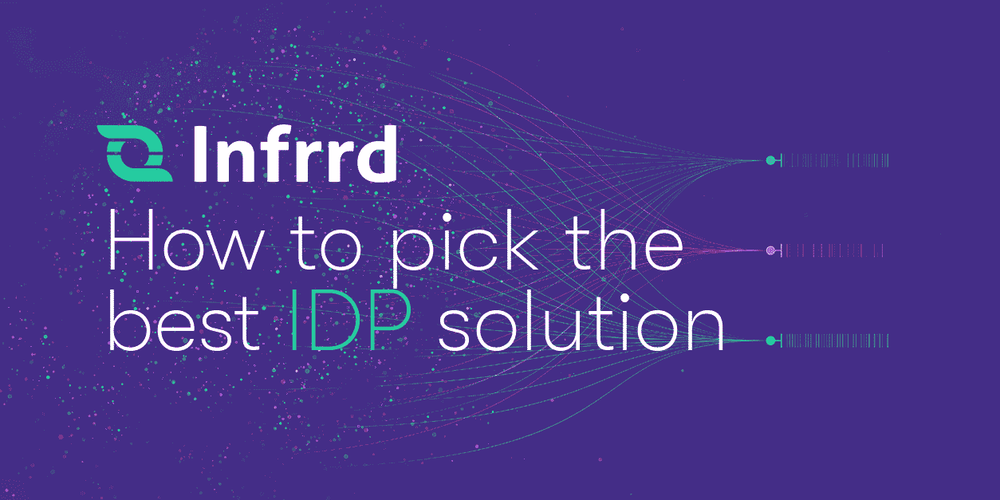
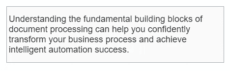
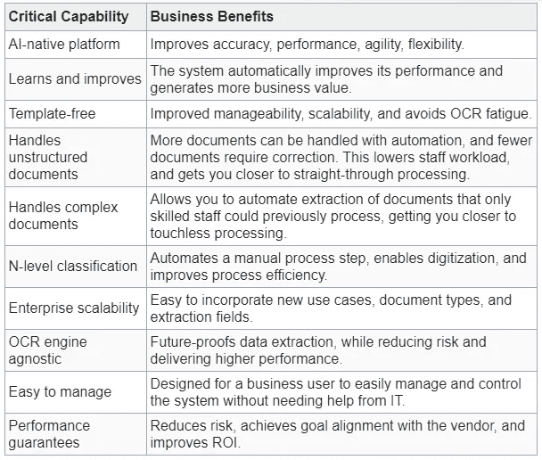
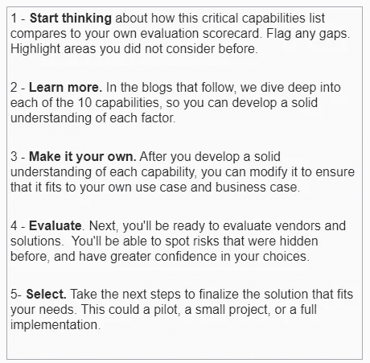

# 智能文档处理关键功能

> 原文：<https://medium.com/geekculture/intelligent-document-processing-critical-capabilities-e1a90cec72e0?source=collection_archive---------23----------------------->

在应对业务流程挑战时，智能文档处理(IDP)是企业数据成功的关键。

实施成功的 IDP 解决方案始于研究—探索 IDP 的关键能力是衡量不同供应商如何解决文档接收瓶颈和改进数据提取流程的最佳方式。

在这一系列博客中，我们提供了一系列关键功能，突出了强大的 IDP 解决方案的基本构建模块。

这些能力建立在我们在该领域的丰富经验以及我们客户的经验基础上，客户因其不断发展的过程以及对自己客户的责任而有各种各样的需求。

# 从关键能力中我可以了解到关于文档摄取的什么信息？

这些关键功能超越了最佳技术，延伸到确保您的解决方案能够:

评估供应商所涉及的调查工作是值得的，因为它可以引导您找到解决持续问题的解决方案，让您重新定义文档接收流程，消除低效，并提高投资回报率。

一个强大的 IDP 解决方案可以为数据提取提供前所未有的速度和准确性。

在一系列的 Infrrd 博客文章中，我们将探讨 IDP 如何有潜力提供由人工智能技术驱动的智能自动化，使您能够最终消除由手动文档输入和 OCR 限制产生的繁重的流程障碍。

我们还将了解为什么 IDP 广泛的处理能力意味着单个解决方案就可以自动处理您的所有文档，而不是将结构化程度较低的文档交付给手动处理循环。

# IDP 能提供什么样的商业价值？

当涉及到从文档中提取数据时，如果您想以最可靠的方式优化您的结果，有很多事情要做。

您希望构建一个灵活、敏捷、可伸缩的系统来交付高质量的数据。IDP 和与您供应商的真正协作将开启您加速数字化转型的旅程。

本博客系列将介绍如何定位自己以实现以下目标:

*   为您的宝贵数据提供超越人类的准确性
*   实现全数字化运营的自动化水平
*   弹性、灵活性和适应性
*   最大限度减少手动工作量
*   降低成本、加快处理速度、改善客户体验和减少错误的强大商业案例

这一切都始于 10 项 IDP 关键功能，这些功能可以帮助您在供应商越来越多的情况下选择适合您需求的产品。

# 智能文档处理的 10 项关键能力

让我们卷起袖子开始工作吧。

下面列出了 10 项关键功能以及每项功能提供的业务优势。每项能力都强调了 IDP 成功的一个关键成功因素。

我们将在接下来的博客中深入探讨每一个问题。(这是你的介绍)。

# 我们的行动计划

关键功能可以帮助您做出更明智的决策，选择能够提供价值的解决方案和供应商，并确保解决方案对于您的用例是可行的。这个博客提供了智能文档处理的 10 个关键功能的摘要，以及每个功能可以产生的业务影响。

这是我们取得成效的 5 步行动计划。我们接下来的步骤是:

请继续关注这个博客空间，等待下一篇文章，它将深入探讨人工智能原生平台的细节。在博客中，我们将详细介绍问题、解决方案、业务优势以及向供应商提出的问题。

想跳过前面吗？下载[10 项 IDP 关键能力的权威指南](https://www.infrrd.ai/critical-capabilities-idp-2)

有问题吗？[在这里和我们的专家聊天](https://chat.infrrd.ai/IDP-Demo)

*原载于*[*https://www . infrrd . ai*](https://www.infrrd.ai/blog/idp-critical-capabilities)*。*