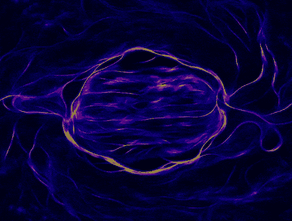
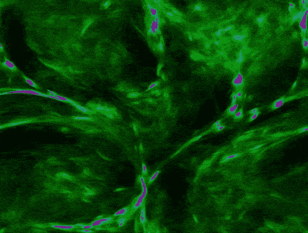
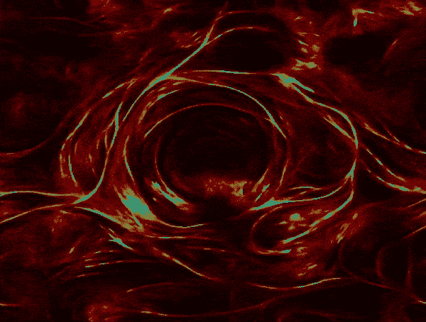

# Python 中的智能粒子模拟，黏菌和它们的美丽

> 原文：<https://medium.com/geekculture/intelligent-particle-simulations-in-python-slime-molds-and-their-beauty-c9527200f997?source=collection_archive---------3----------------------->

These simulations were made by me and run in real time on an M1-Pro’s GPU. Scenes have more than 3 million agents and are full HD. Medium’s compression may prevent their full fidelity from coming through in this article.

最近，我偶然看到了 Sebastion Lague 和他对黏菌的探索的这个绝对美丽的视频。我不得不亲自尝试一下！让我们探索一下，简单的程序，在大规模的情况下，是如何产生出引人入胜的结果的。

# 什么是黏菌模拟