# 意图分类和空位填充:用自然语言管理网页

> 原文：<https://medium.com/geekculture/intent-classification-and-slot-filling-managing-web-pages-with-natural-language-4d21d5cee4e3?source=collection_archive---------6----------------------->

## 构建用于确定用户意图、搜索命名实体和提取用户问题答案的解决方案

为了让人们远离繁琐的日常事务，降低交易成本，提高我们业务的效率，我们致力于自动化，包括最具创新性的方法，如深度学习。深度学习的一个领域，自然语言处理，最近取得了令人难以置信的发展。我们有许多强大、复杂和惊人的自然语言理解模型，或 NLU，从人类语言中提取有用的信息。现在，我们可以为诸如确定用户意图、搜索命名实体、提取用户问题的答案，甚至在类似人类的水平上生成我们自己的文本等问题构建具有强大泛化能力的复杂非确定性解决方案。

在 [Quantum](https://quantumobile.com/) 时，我们面临的任务是创建一个代理来自动操作网页。我们希望自动化整个用户与网站的交互过程，将其限制为只能用自然语言输入命令。我们的任务是创建一个统一的系统——它不需要绑定到一个特定的网站就可以工作。我们在这方面已经做了很多工作。例如，你可以看看我们为汉堡数据科学社区举办的讲座“[web 应用测试的模仿学习](https://youtu.be/pGGyz564yO8)”。我们可以看到这个解决方案在网页测试中的许多应用，从创建稳定的测试用例来抵抗站点标记的变化到提供一个包容的 QA 工作流。

# IC 和 SF 的核心概念

这一次，我们决定尝试这个领域的意图分类和空位填充(IC&SF)模型。IC&SF 任务在创建聊天机器人和其他用自然语言与用户自动交互的情况下很普遍。

意图分类是基于客户目标的文本查询的自动分类。本质上，意图分类器自动分析文本并将它们分类成意图。了解客户查询背后的意图、自动化流程并获得有价值的见解非常有用。在我们的领域中，我们将与不同 UI 元素的交互视为不同的意图。我们将根据意图决定要执行的操作——点击、键入文本等。

槽填充的目标是识别对应于用户查询的不同参数的槽。在填充模型的帮助下，我们可以了解查询中的每个单词是否对我们有有用的语义意义。因此，槽填充任务中的主要挑战是提取目标实体。槽填充任务类似于命名实体识别(NER)。这两项任务都使用序列标签作为一种方法。虽然科幻小说的目标是寻找与某事物相关的实体，但 NER 更通用，只寻找有名字的“事物”，如人、公司、地点等。，但没有告诉我们这个实体指的是什么。我们可以很容易地为 NER 问题重新设计模型，但是在我们的例子中，我们选择 SF 作为提供更多输出信息的模型。我们将插槽视为需要交互的 UI 对象，以及各种引用 UI 对象。

综合所有这些，我们可以考虑这个例子中 IC&SF 的问题——“请按下密码字段下的这个蓝色登录按钮。”对于这个查询，意图是“按下按钮”，槽是“登录”(按钮名称)和“密码”(文本框名称锚)。因此，意图分类侧重于预测查询的意图，而槽填充提取语义概念。使用关于用户意图和提供的槽的信息，我们可以确定代理必须执行哪个动作，以及这个动作必须执行哪个 UI 对象。

# 模型

在本文中，我们考虑了 IC&SF 任务的两个模型——joint Bert 和 DIET，它们是开放基准测试的最新水平。他们解决相同的问题，但使用相反的方法，所以将他们与我们的领域进行比较是有趣的。但是首先，我们需要定义我们正在解决的问题。因此，意图分类是输入序列的多类分类任务。反过来，槽填充是多类标记分类的任务，即输入序列的类分配。我们将使用 IOB 符号来标记插槽填充任务的序列，其中 B 代表插槽的开始，I 代表内部，O 代表外部。例如，在句子“按下大保存文件图标”中，槽标签将如下——“O O B-图标-名称 I-图标-名称 O。”

# 琼伯特

你可以在这篇文章中找到完整的 JointBERT 描述。还有一个 github [库](https://github.com/monologg/JointBERT)用于完全实现 Pytorch 模型。

JointBERT 的本质是用两个头微调 BERT 主干，这两个头是简单的全连接层，一个用于意图分类，另一个用于槽填充。在 JointBERT 中，联合目标是通过最小化交叉熵损失来最大化意图和每个时隙的条件概率。你可以在下面找到 JointBERT 模型架构。

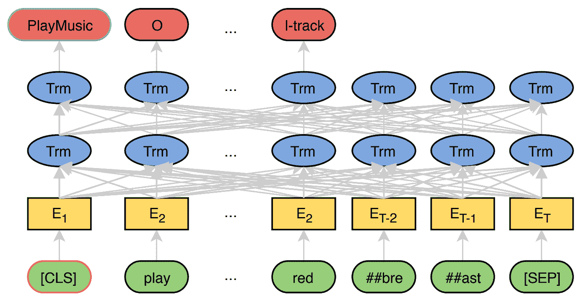

Fig 1\. JointBERT model architecture

# 规定饮食

在最初的[文章](https://arxiv.org/pdf/2004.09936.pdf)中，DIET(Dual Intent and Entity Transformer)的作者将该模型定位为重型模型的替代方案，使用复杂的方法来构建分类头，并为输入序列的特征化转移学习，而不是像 JointBERT 那样为特定任务微调主干。

作者使用具有一般 NLU 模型的迁移学习来获得密集特征，并将它们与稀疏单词和字符级 n-gram 特征组合在一起，然后将该序列表示传递给具有相对位置注意的 2 层变换器。他们还创建了一个复杂的培训目标，包括三个部分—命名实体识别、意图分类和屏蔽。

因此，与 JointBERT 不同，DIET 模型有一个更复杂的头部，并且不执行脊椎的微调。

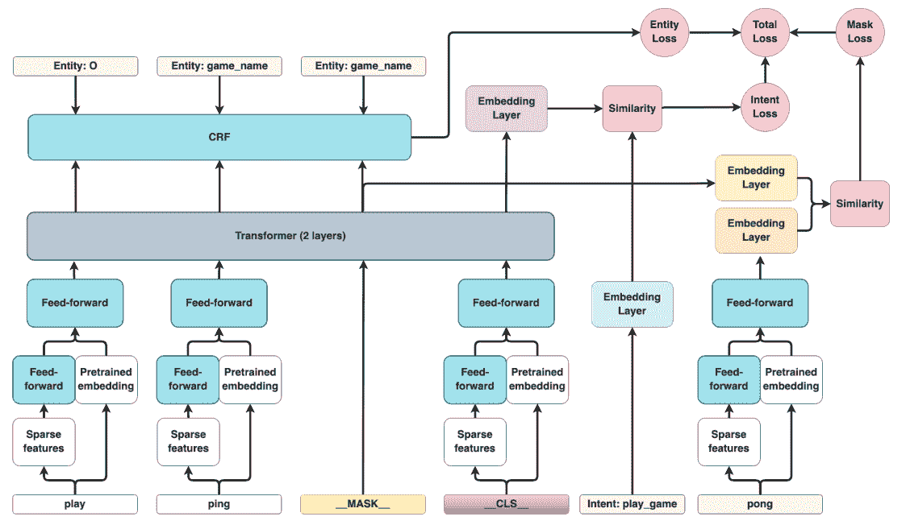

Fig 2\. DIET model architecture

# 数据

## 开源数据

对于 IC&SF 任务，有两个常见的开放基准——SNIPS 和 ATIS。ATIS 数据集包含来自航班信息请求的音频记录的抄本，而 SNIPS 数据集由用于个人语音助理的定制意图引擎收集。尽管两者都在 NLU 基准测试中广泛使用，但 ATIS 要小得多——几乎是示例的三倍，包含的单词也少 s 倍。然而，它有更丰富的标签集，21 个意向和 120 个时段类别，而 SNIPS 有 7 个意向和 72 个时段。

## 网络领域的综合数据

对于我们的领域，没有 IC&SF 任务的数据集。因此，我们决定通过使用不同的语法方案生成句子来创建一个合成数据集。

首先，我们写下了对我们的任务感兴趣的意图和位置。因此，我们的意图是:

*   按钮 _ 按压
*   复选 _ 复选框
*   输入文本
*   扩展下拉列表
*   文件 _ 上传
*   图标 _ 点击
*   link_click
*   单选按钮 _ 单击

和插槽:

*   按钮名称
*   复选框名称
*   下拉列表名称
*   图标名称
*   链接 _ 文本
*   位置 _ 锚点
*   单选按钮 _ 标签
*   文本框名称
*   文本框 _ 文本
*   上传姓名

对于作为 UI 元素名称(按钮名称、复选框名称等)的槽。)，我们还创建了额外的“锚”槽(button_name_anchor、checkbox_name_anchor 等)。).Anchor 是为了更精确地指定目标而给出的 UI 元素。虽然大多数槽表示 UI 元素的名称，但是 textbox_text 表示要插入到指定文本字段中的文本，location_anchor 表示目标和锚 UI 元素之间的相对位置(左、下等。).因此，我们的数据集中有 8 个意向和 18 个位置。

然后，针对每个意图，我们准备了 3 个语法方案(共 24 个)。每个模式都是一个句子模板，它的各个部分——主语、谓语等等——都是从语义相似的单词列表中随机选择的。同一个意图中的方案在句子次要成分的位置、字数和锚插入的位置上有所不同。您可以在下面找到此类方案的示例:

*   检测 and，查找 and(slot-O)
*   单击、按下、点击(slot-O)
*   圆形、黑色、大、小(插槽-O)
*   提交、创建、加载、添加、下一步、新建、清除(插槽—按钮名称)
*   按钮名称—文件、历史、顺序、页面(槽—按钮名称)
*   按钮(插槽— O)

锚子查询是一个单独生成并插入到主查询中的句子模式。例如:

*   位于下方、下方、上方、旁边、旁边(槽-位置 _ 锚点)
*   使用、添加、清除、选择(插槽—图标名称锚记)
*   全部、任务、日期、文件(位置—图标名称锚记)

# 结果

首先，我们可以在公共基准上比较模型的质量。下面来自 DIET paper 的比较表显示了这两种模型在意图分类方面的准确性和在填充位置方面的微观平均 F1 分数。

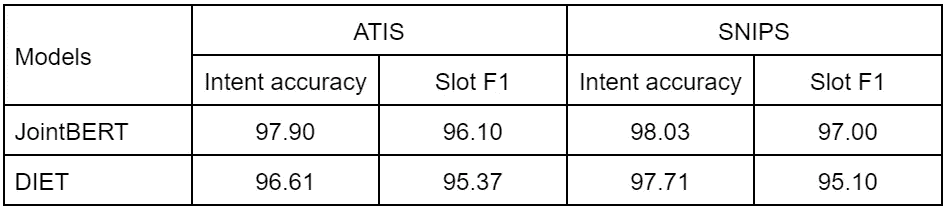

正如我们所看到的，JointBERT 在这些基准测试中的质量稍好一些。这两个模型都在接近 100%的水平上执行，这些结果是令人满意的。

# 非分层数据

在这个阶段，我们从所有三个方案中生成了 17，000 个示例，从所有可能的同义词组合中随机抽取示例。我们用了 15000 个例子进行训练，1000 个例子进行验证，1000 个例子进行模型测试。

然后，我们使用默认设置训练 JointBERT 和 DIET。我们获得了出色的结果——在测试集上，意图分类准确率和空位填充 F1 得分均为 1.0。JointBERT 比 DIET 更快地训练到最高确认分数，我们将在下一章讨论这个问题。

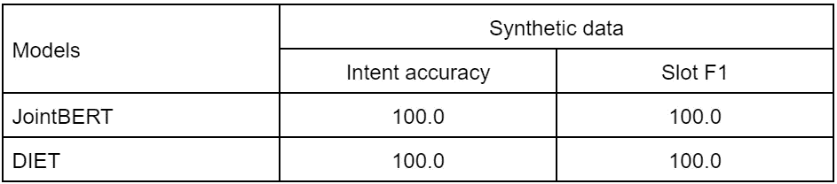

在推理过程中，我们在用其他同义词构成的查询上测试了模型。这些模型抵制单词替换，正如人们从它们的架构中所期望的那样。

# 分层实验

在下一个研究阶段，我们决定测试该模型对不熟悉的方案生成的查询的鲁棒性。我们的目标是确定该模型如何处理不寻常的公式。我们知道，训练样本的多样性问题是合成用于 NLP 任务的数据集的相关障碍。例如，在最初的 SNIP [论文](https://arxiv.org/pdf/1805.10190.pdf)中有所描述。这个问题通过文本扩充和使用部分手动标记来解决。但我们感兴趣的是确定模型对数据集中这种变化的初始鲁棒性。

我们再次抽取了 15，000 个样本来训练实验模型，1，000 个样本用于验证，1，000 个样本用于测试。但这一次，我们用语法模式对子样本进行了分层——我们为每个意图仅使用 2 个语法模式生成了一个训练样本，并搁置了第三个方案来从中生成验证和测试子样本。

在实验过程中，我们发现模型表现不稳定。我们在 10 个不同的数据生成(折叠)上对这两个模型进行了训练，发现模型之间 F1 的中值差异为 3.5%，JointBERT 的优势更明显，如图 3 所示。此外，JointBERT 的性病评分为 8.4%，DIET 为 4.2%。请注意，饮食模型是在 RASA 框架中提供的。然而，度量计算不同于 JointBERT 实现，因此我们重新计算了 DIET 模型的微观平均值 F1，并在图 3 中显示了它们与原始 RASA 的估计值。

此外，JoinBERT 在一个文件夹中有相同的 STD，如图 4 所示。随着训练和验证子集规模的增加，情况并没有改变。因此，3.5%的差异并不能回答哪个模型更好的问题——它们都表现得不稳定。

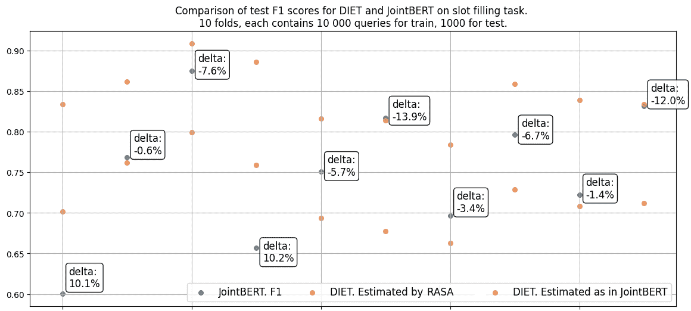

Fig 3\. DIET and JointBERT performance on 10 folds with stratification.

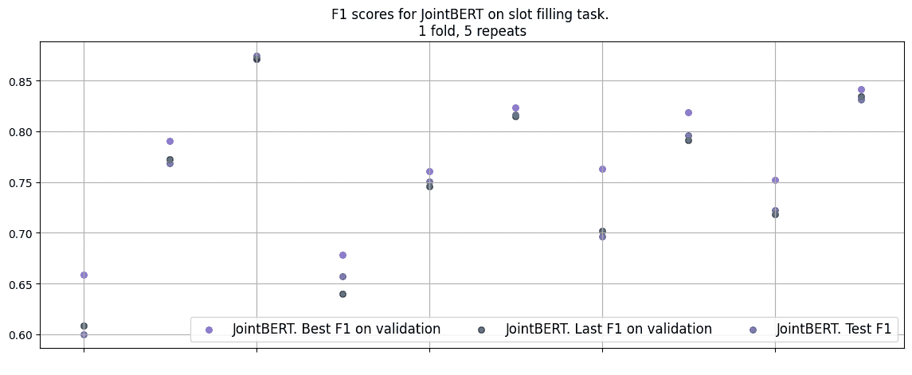

Fig 4\. JointBERT performance on 10 repeats on the same stratified fold.

需要注意的是，在训练样本上，两个模型的得分总是 100%。由此，我们可以得出结论，模型是过度拟合的，我们的模型的复杂性导致了不稳定性。此外，由于 JointBERT 的训练损失达到平台期的速度要快得多，我们看到该模型的过度训练比节食更快。对此有一个解释，因为在 JointBERT 中，我们微调所有 BERT 层，而在 DIET 中，骨干层被冻结。

我们决定用冻僵的冻土层做实验。首先，我们用非分层数据的冻结主干训练 JointBERT。因此，唯一改变的权重是在完全连接的头部层中。收敛的次数显著增加，而指标显著下降，如图 5 所示。

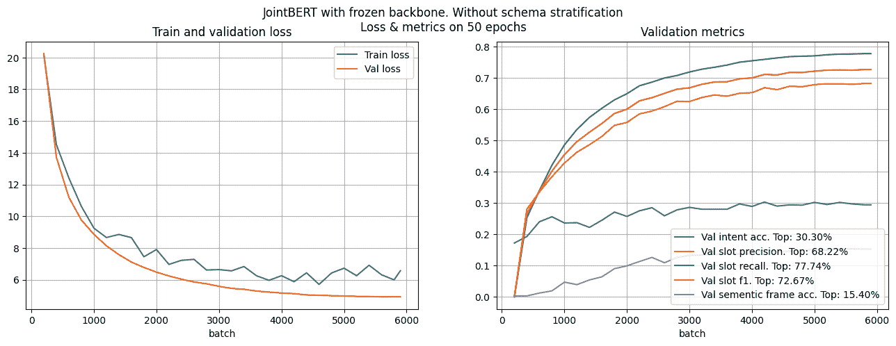

Fig 5\. JointBERT performance without stratification. Frozen backbone.

从图 6 中可以看出，冻结 JointBERT 的主干导致了网络的稳定。

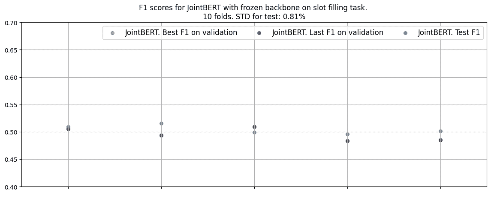

Figure 6\. JointBERT performance on 5 folds with stratification. Frozen backbone.

然后，我们决定解冻主干的最后几层，并为 Intent 和 Slot 分类头添加新层。经过几次反复的实验，我们得到了图 7 中的结果。如你所见，分数增加了，尤其是意图分类。

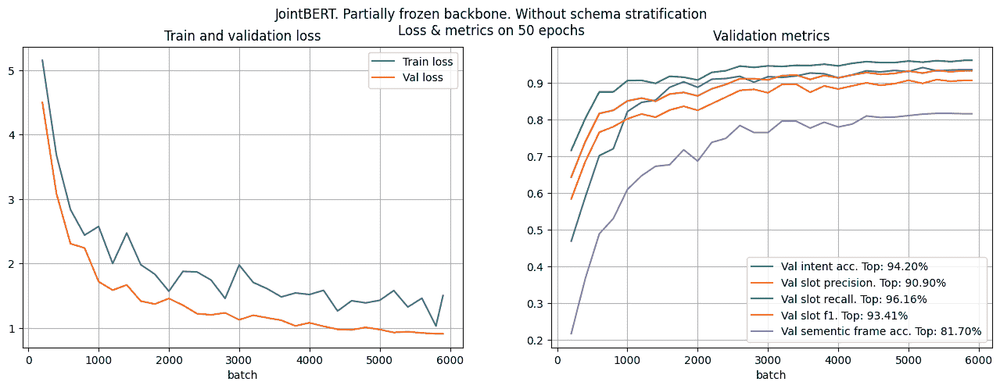

Fig 7\. JointBERT performance without stratification. Partially frozen backbone and complex head.

下一步是根据分层数据训练修改后的模型。训练结果如图 8 所示。我们看到，与最初的冻结模型相比，意向准确率达到了 90 %, F1 时段增长了 10%。我们可以理解，修改 JointBERT 最后几层的进一步实验将有助于我们实现更高的泛化能力，并防止过度拟合。

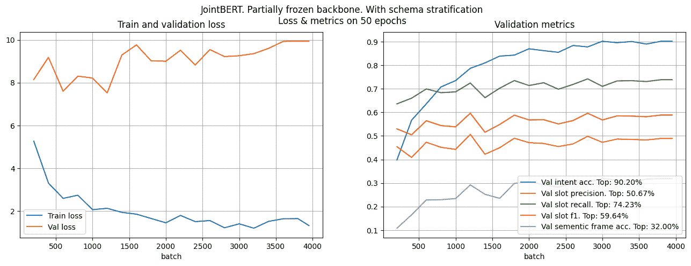

Fig 8\. JointBERT performance with stratification. Partially frozen backbone and complex head.

当在不同的褶皱上运行部分冻结的模型时，我们将得到图 9 中的结果。

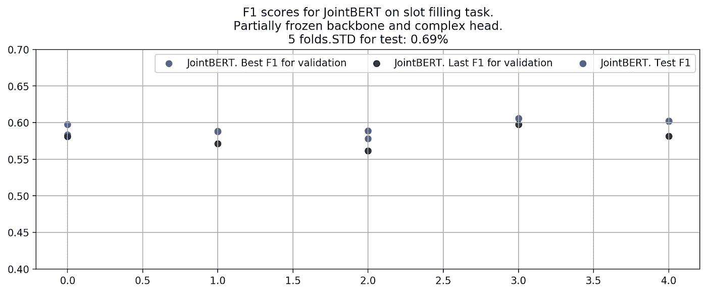

Figure 9\. JointBERT performance on 5 folds with stratification. Partially frozen backbone and complex head.

# 结论

在这项研究中，我们研究了一种使用自然语言在用户和网站之间建立交互系统的方法。我们在开放基准上测试了几个最先进的 NLP 模型，用于联合意图分类和槽填充任务。我们还生成了一个合成数据集，并针对我们的领域测试了模型的性能。

因此，我们看到，如果我们可以为合成数据生成建立详尽的语法模板，我们就可以为我们的任务获得出色的结果，并将类似的系统嵌入不同自动化系统的管道中，如聊天机器人。

我们还研究了所选模型对未知语法结构的敏感性。我们获得的结果表明，我们可以通过修改特定数据集的网络来部分解决该问题。结合文本数据多样化的其他方法，我们可以使用所选择的模型为不同的领域构建用于意图分类和槽填充的健壮的解决方案。