# 使用 GPT 新协议的意图分类和释义示例|如何使用 GPT3

> 原文：<https://medium.com/geekculture/intent-classification-paraphrasing-examples-using-gpt-3-how-to-use-gpt3-4d2b61bb96cc?source=collection_archive---------1----------------------->


[GPT-3](https://en.wikipedia.org/wiki/GPT-3) 是一个由 OpenAI 组织训练的神经网络，比早期一代模型有更多的参数。GPT 3 号和 GPT 2 号的主要区别在于它的大小，即 1750 亿个参数。这是在大型数据集上训练的最大的语言模型。该模型可以更好地响应不同类型的输入，如问题&答案格式、长格式写作或人类语言翻译(如英语到法语)。大量的参数使 GPT-3 在自然语言处理和文本生成方面明显优于先前的模型 GPT-2，后者只有 15 亿个参数。

如果你想尝试 GPT-3，那么你需要请求 API 访问 [OpenAI beta](https://beta.openai.com/) 。经过漫长的等待，我们终于幸运地获得了 API access 的批准。

自发布以来，我们已经看到了令人惊讶的演示应用和 GPT-3 的使用，所以我们非常兴奋地尝试一下。GPT-3 的主要优势之一是，它可以在没有任何微调过程的情况下表现得非常好。你只需要提供一些例子或背景，它就会开始工作。

在这篇博客中，我们将看到如何使用 GPT-3 进行意图分类任务和文本释义，使用 OpenAI Playground 可以从他们的网站在线访问。

# 意图分类

登录你的 OpenAI 账户。

在 OpenAI 打开游乐场

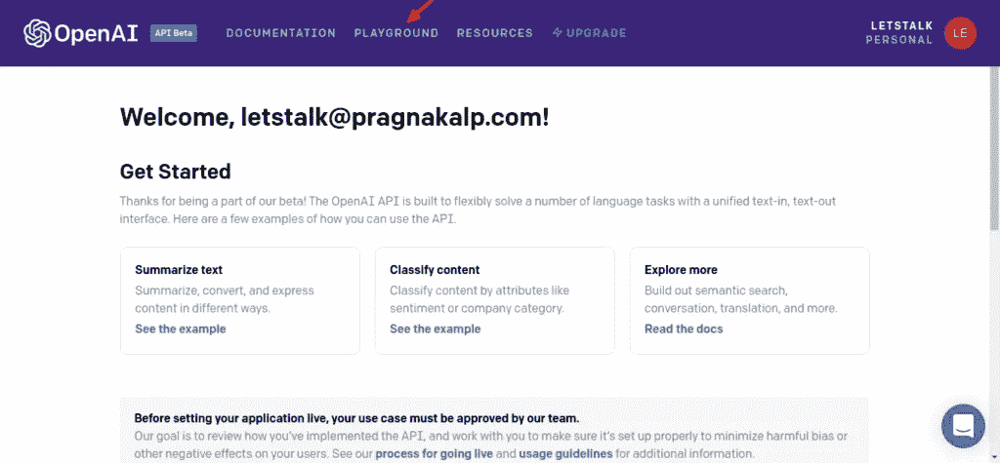

根据您的任务设置参数，每个任务需要一组不同的值，您可以调整这些值并尝试哪一个最适合您的任务。对于意图分类，我们设置了以下参数。

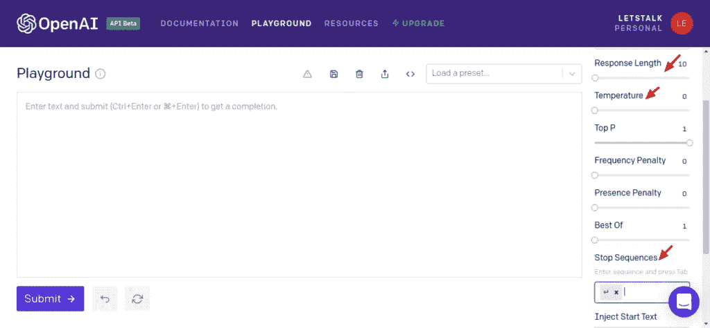

现在我们将添加样本数据，您可以添加下面给出的数据或您选择的其他数据。

**样本数据:**

```
listen to WestBam album allergic on google music: PlayMusic
give me a list of movie times for films in the area: SearchScreeningEvent
show me the picture creatures of light and darkness: SearchCreativeWork
I would like to go to the popular bistro in oh: BookRestaurant
what is the weather like in the city of Frewen in the country of Venezuela: GetWeather
```

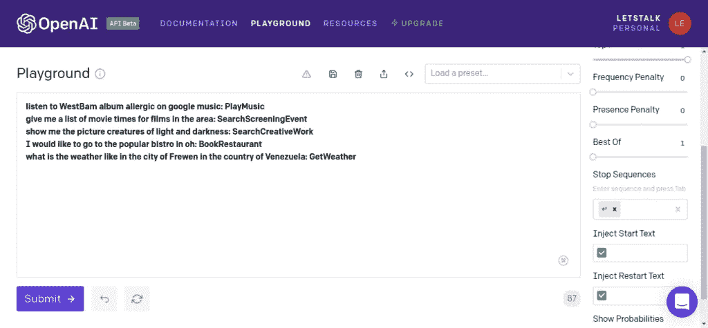

因此，以上是我们给 GPT-3 模型的一种背景，它将从中学习和理解我们期望的结果类型。现在，是检验它的时候了。为此，我们需要提供一个我们想要找到意图的句子。

例如，我们的测试句子是“**我想订一张去德里的机票:**”

要将其视为输入，我们只需在冒号(:)后留空，GPT-3 将理解它必须找到输入的意图。

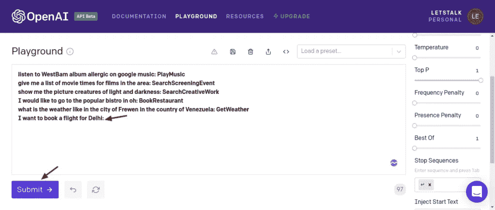

点击提交按钮后，我们可以看到 GPT-3 已经成功地将我们输入的句子归类为“BookFlight”！

“停止序列”让 GPT-3 知道它应该停止。在我们的例子中，一个新的行是一个停止序列，所以一旦找到分类，GPT-3 将停止。

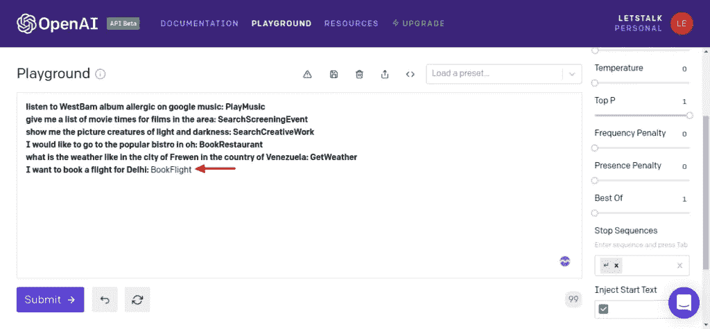

令人惊讶的是，在我们的样本中，我们甚至没有提供“预订航班”分类，但 GPT-3 仍然成功地将其分类。这就是 GPT 3 的力量！

您也可以将此示例存储为预设，以便将来使用。点击“保存预设”图标，如下所示。

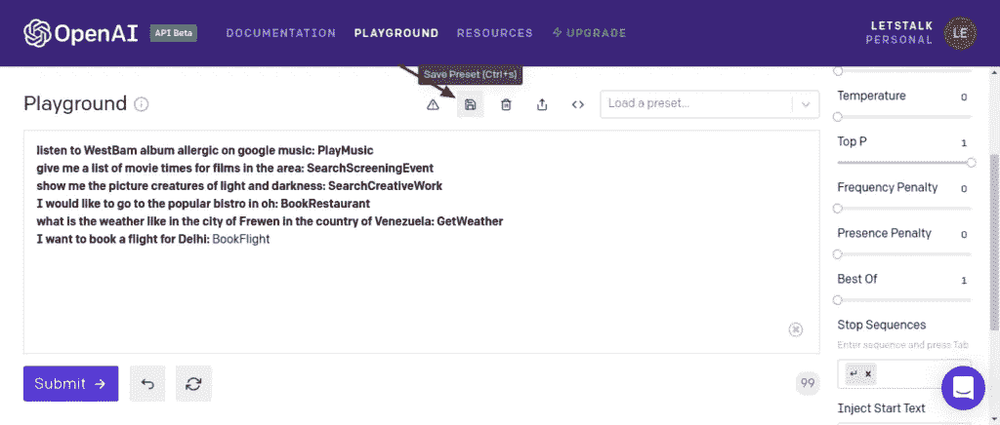

给你的预设命名，然后点击“另存为新的”按钮。

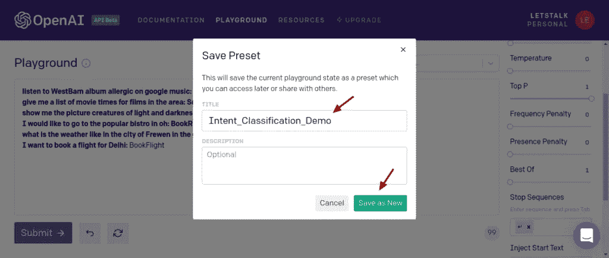

一旦保存了预置，您就可以随时加载它。

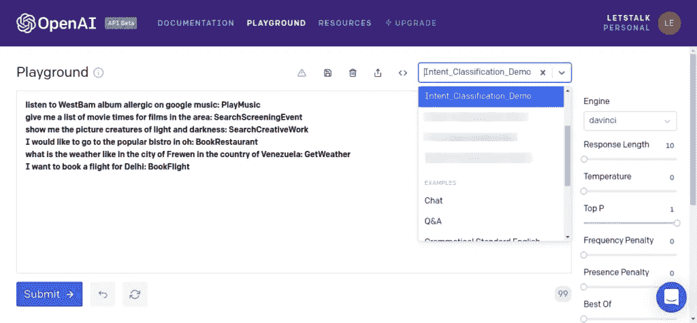

您也可以在 python 代码中使用它，或者发出 curl 请求。

这里有一个代码图标，点击它会为你提供 python 和 cURL 的样本代码，很容易复制。

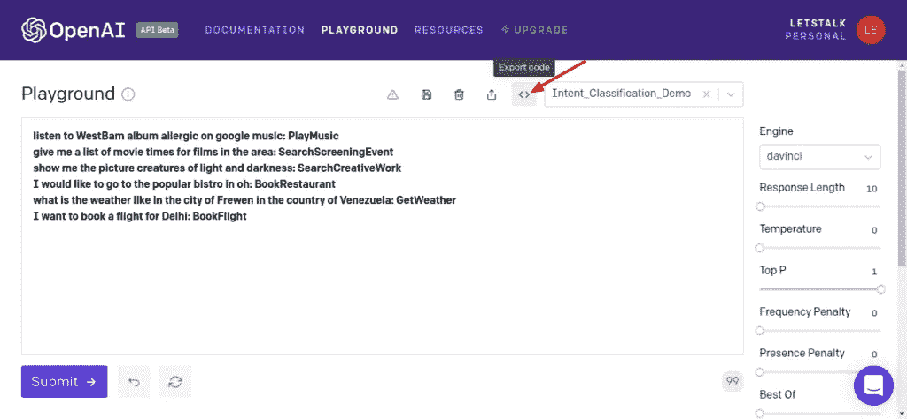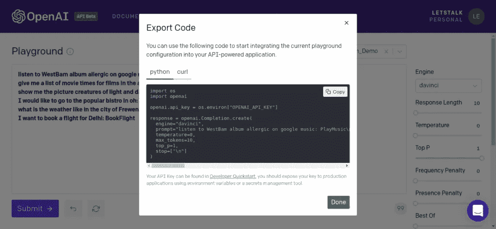

由于 GPT-3 是一个托管解决方案，您可以通过 API 访问它。您不需要在您的系统上下载或设置模型。

# 改写

释义是指你用不同的词汇改写表达相同意思的句子。您可以使用任何语言模型来执行释义，如 BART、T5、pegasus，其中您需要微调模型，但您必须在大型数据集上微调那些预训练的模型。使用 GPT-3 你不需要微调任何模型来执行这项任务。又快又简单。让我们看看我们将如何做它。

从 OpenAI 打开游乐场

设置以下参数，您甚至可以更改这些参数并测试结果。

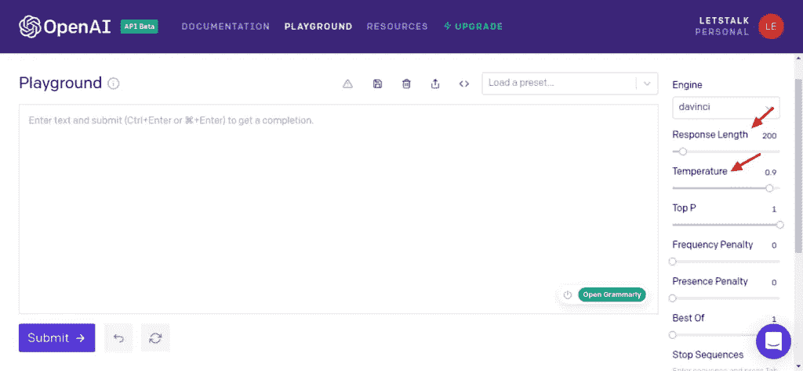

对于这个例子，我们将使用 2 个参数“注入开始文本”和“注入重启文本”。

注入开始文本将在用户输入后自动添加输出文本。

生成输出后，注入重启文本将自动追加输入文本标签，以便输入和输出的模式将继续。

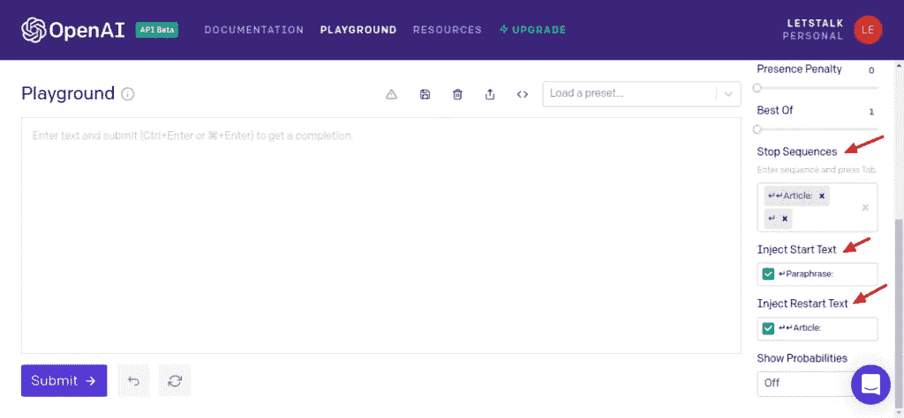

现在，按照下图所示的方式添加示例。
**样本数据:**

```
Article: Searching a specific search tree for a binary key can be programmed recursively or iteratively.
Paraphrase: Searching a specific search tree according to a binary key can be recursively or iteratively programmed.Article: It was first released as a knapweed biocontrol in the 1980s in Oregon , and it is currently established in the Pacific Northwest.
Paraphrase: It was first released as Knopweed Biocontrol in Oregon in the 1980s , and is currently established in the Pacific Northwest.Article: 4-OHT binds to ER , the ER / tamoxifen complex recruits other proteins known as co-repressors and then binds to DNA to modulate gene expression.
Paraphrase: The ER / Tamoxifen complex binds other proteins known as co-repressors and then binds to DNA to modulate gene expression.Article: In mathematical astronomy, his fame is due to the introduction of the astronomical globe, and his early contributions to understanding the movement of the planets.
Paraphrase: His fame is due in mathematical astronomy to the introduction of the astronomical globe and to his early contributions to the understanding of the movement of the planets.
```

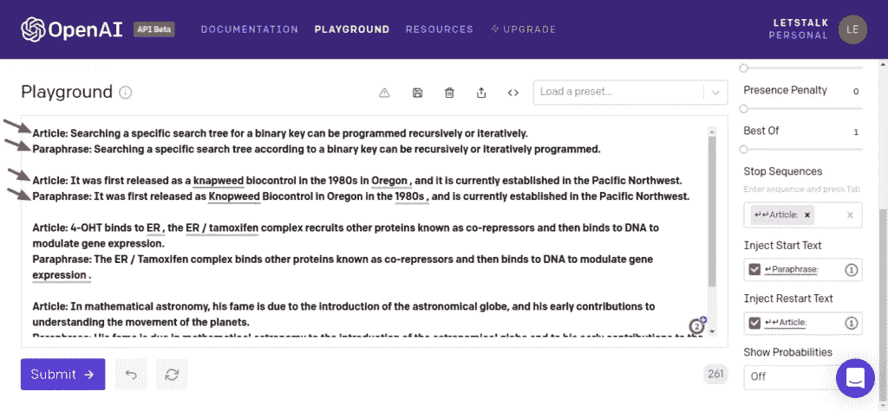

通过提供您的输入来测试它，我们在下面添加了几个样本。

**测试数据:**我能喝杯水吗？

结果:我可以喝杯水吗？

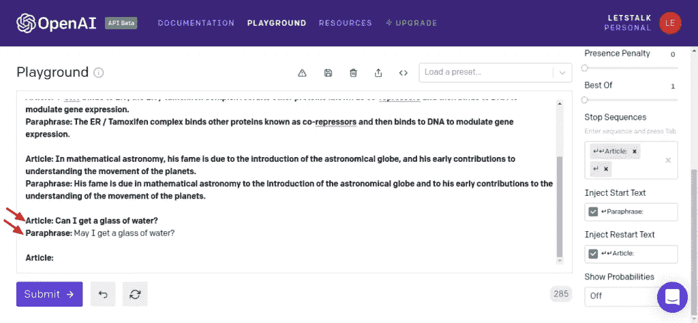

**测试数据:【2020 年 2 月，美国总统唐纳德·特朗普和总理纳伦德拉·莫迪首次来到莫特拉体育场访问艾哈迈达巴德。**

**结果:**2020 年 2 月，美国总统唐纳德·特朗普来到艾哈迈达巴德，访问这座城市，并首次会见印度总理纳伦德拉·莫迪。

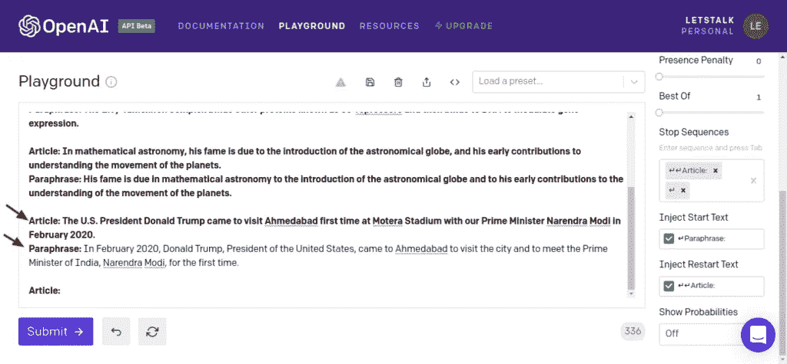

**测试数据:**谷歌由拉里·佩奇和谢尔盖·布林于 1998 年在加州斯坦福大学攻读博士学位时创立。他们总共拥有约 14%的股份，并通过超级投票权股票控制了 56%的股东投票权。1998 年 9 月 4 日，他们将谷歌注册为私人控股公司。

**结果:**谷歌于 1998 年 9 月 4 日由拉里·佩奇和谢尔盖·布林注册成立，当时他们还是加州斯坦福大学的博士生。他们拥有大约 14%的股份，并通过超级投票权股票控制了 56%的股东投票权。

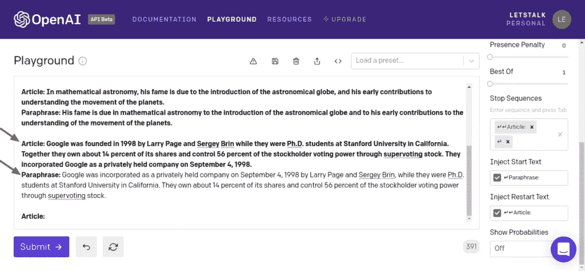

在这里，我们也得到了非常好的结果！然而，结果并不一致。每次我们尝试相同的输入都会得到不同的结果，有时结果的质量不是很好。

这就是我们对 GPT 3 号的小实验。使用 GPT-3 创建各种应用程序的可能性数不胜数。我们将继续探索更多，并将它们发布在我们的网站上。

*原载于* [***意图分类&释义示例使用 GPT-3 |如何使用 gp T3***](https://www.pragnakalp.com/intent-classification-paraphrasing-examples-using-gpt-3/)*2021 年 1 月 19 日。*