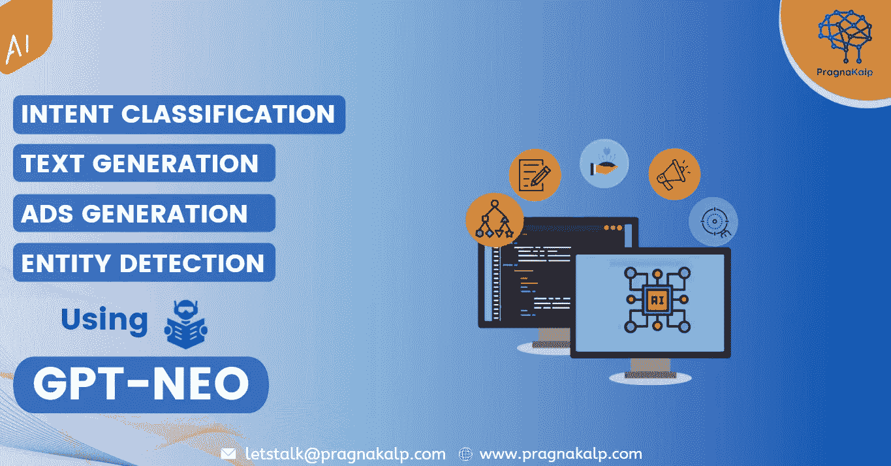

# 意图分类、文本生成、广告生成、使用 GPT-尼奥的实体检测

> 原文：<https://medium.com/geekculture/intent-classification-text-generation-ads-generation-entity-detection-using-gpt-neo-a784ba9e3c87?source=collection_archive---------29----------------------->



GPT3 改变了语言模型的水平，并通过其学习能力彻底改变了人工智能，因为 [GPT3 是一个一次性学习者](https://arxiv.org/abs/2005.14165)。然而，它不是开源的，只有在请求时才能访问 OpenAI 的 API。因此，EleutherAI 正在努力创造一个类似于 GPT3 的模型，它被命名为 GPT3 尼奥。

[GPT-尼奥](https://www.eleuther.ai/projects/gpt-neo/)是一个基于转换器的语言模型，其架构与 GPT3 模型几乎相同，结果也大致等同于 GPT3 模型的较低版本。GPT-尼奥在 Pile 数据集上进行训练。和 GPT3 一样，GPT3 尼奥也是一个新手。与 GPT3 相比，GPT-Neo 的优点是它是一个开源模型。

GPT-尼奥是一个自回归语言模型。这可以解释为首先获取提示文本并基于此预测下一个文本标记的功能。

GPT-尼奥有两种不同型号:

[GPT-尼奥-1.3B](https://huggingface.co/EleutherAI/gpt-neo-1.3B) :该模型参数为 1.3B，训练数据使用的令牌在 380B 左右，共训练 362000 步。

[GPT-尼奥-2.7B](https://huggingface.co/EleutherAI/gpt-neo-2.7B) :该模型参数为 2.7B，训练数据使用的令牌约为 380B，共训练 362000 步。这是一个比较大的模型。

在这篇博客中，我们将看到 GPT 近地天体如何被用于不同的任务。这里我们尝试了 4 个任务，分别是文本生成、实体检测、意图分类和广告生成。

我们使用了 [Huggingface](https://huggingface.co/) 的 [Transformers](https://huggingface.co/transformers/) 库，它提供了一个管道来使用 GPT-尼奥模型的预训练权重。让我们看看我们是如何为不同的任务准备提示文本的。

# 安装和设置 GPT 尼奥

```
!pip install git+https://github.com/huggingface/transformers.git
```

2.从变压器导入管道以执行任务

```
from transformers import pipeline
```

3.为文本生成分配管道

下面的代码是分配用于文本生成的管道，其中您需要提供模型名称，如果您想使用 2.7B 模型，您可以提供 EleutherAI/gpt-neo-2.7B 而不是 EleutherAI/gpt-neo-1.3B

```
generator = pipeline('text-generation', model='EleutherAI/gpt-neo-1.3B')
```

4.现在，对于下面的所有任务，你只需要复制提示文本并生成给定的响应。

# 文本生成

要使用 GPT-尼奥生成文本，我们只需给出一个输入提示，如初学者句子或标题，这有助于模型生成与特定主题相关的文本，然后将“最大长度”设置为预测参数，以生成 GPT-尼奥模型的输出。

在下面的例子中，我们给出了一个句子的开头作为输入提示。在这两个例子中，我们设置 max_length = 200，do_sample = true。

prompt_text:“谷歌由拉里·佩奇和谢尔盖·布林于 1998 年创立，而”

在定义了 prompt_text 之后，运行下面的代码来获得结果。

```
text = generator(prompt_text , do_sample=True, max_length=200) print(text[0]['generated_text'])
```

上述提示的输出是:

```
Google was founded in 1998 by Larry Page and Sergey Brin while they were students at Stanford University. The company was originally called Google, Inc. and was incorporated in Delaware. In 2001, Google was acquired by the holding company Google Capital. Google is a search engine that provides information about the web. It is the most popular search tool in the world, with over 1.5 billion searches per month. Google is also the largest search company in terms of revenue. Its revenue in 2010 was $8.6 billion.
```

您可以生成任何主题的文本，只需提供您选择的 prompt_text。让我们看看第二个例子，我们给出了关于 COVID 19 的 prompt_text，GPT 尼奥生成了如下所示的输出。

prompt_text:在全球范围内，冠状病毒(COVID19)疫情已成为挑战健康的最重大危机。

输出为以上提示文本:

```
Globally, coronavirus (COVID19) pandemic has become the most significant crisis to challenge the health and safety of individuals, societies, and nations, and has resulted in the closure of approximately 1.25 million businesses and other facilities in more than 110 countries globally. During December 29-31, 2020, the Chinese government extended the suspension of major events and implemented stringent restrictions on all-day working, school trips, and other activities [@bib1]. The first confirmed cases were reported by the Health Administration Bureau of Hubei Province in Wuhan on January 22, 2020, and the second confirmed case was reported by the Zhuhai Municipal Health Commission on January.
```

# 实体检测

对于实体检测，我们需要创建一个包含一些样本数据的输入提示。您可以使用下面的样本数据，也可以自己准备。

样本数据=

```
‘’’ 
Entities: Person, Facility, Location, Organization, Work Of Art, Event, Date, Time, Nationality / Religious / Political group, Law Terms, Product, Percentage, Currency, Language, Quantity, Ordinal Number, Cardinal Number, Degree, Company, Food Text: Google was incorporated as a privately held company on September 4, 1998 by Larry Page and Sergey Brin, while they were Ph.D. students at Stanford University in California. They own about 14 percent of its shares and control 56 percent of the stockholder voting power through supervoting stock.

Entities Detected: 
Google : Company 
September 4, 1998 : Date 
Larry Page : Person 
Sergey Brin : Person 
Stanford University : Organization 
California : Location 
14 percent : Percentage 
56 percent : Percentage 
Ph. D. : DegreeEntities: Person, Facility, Location, Organization, Work Of Art, Event, Date, Time, Nationality / Religious / Political group, Law Terms, Product, Percentage, Currency, Language, Quantity, Ordinal Number, Cardinal Number, Degree, Company, Food

Text: The U.S. President Donald Trump came to visit Ahmedabad for the first time at Reliance University with our Prime Minister Narendra Modi in February 2020\. Entities Detected: 
U.S. : Location 
Donald Trump : Person 
Ahmedabad : Location 
Narendra Modi : Person 
Reliance University : Organization 
February 2020 : DateEntities: Person, Facility, Location, Organization, Work Of Art, Event, Date, Time, Nationality / Religious / Political group, Law Terms, Product, Percentage, Currency, Language, Quantity, Ordinal Number, Cardinal Number, Degree, Company, Food Text: SpaceX is an aerospace manufacturer and space transport services company headquartered in California. It was founded in 2002 by entrepreneur and investor Elon Musk with the goal of reducing space transportation costs and enabling the colonization of Mars. Elon Musk is an American Entrepreneur. Entities Detected:  
SpaceX : Company 
California : Location 
2002 : Date 
Elon Musk : Person 
Mars : Location 
American : Nationality / Religious / Political group  
‘’’
```

在样本数据中，我们提供实体:和文本:作为对 GPT 近地天体的输入，检测到的实体:是预期的输出。在实体中:我们使用了 20 个实体，您可以根据需要增加或减少它。在文本中:我们给出了句子，在检测到的实体中:我们给出了要从文本中检测到的实体的名称和标签。

现在，为了测试，我们只需要添加实体列表作为实体:并输入句子作为文本:带有我们的 sample_data。下面是一些测试示例。

在第一个例子中，我们添加了 Amazon 相关的输入文本。

```
input_text = '''Entities: Person, Facility, Location, Organization, Work Of Art, Event, Date, Time, Nationality / Religious / Political group, Law Terms, Product, Percentage, Currency, Language, Quantity, Ordinal Number, Cardinal Number, Degree, Company, Food Text: Amazon.com, Inc., known as Amazon, is an American online business and cloud computing company. It was founded on July 5, 1994 by Jeff Bezos. It is based in Seattle, Washington. It is the largest Internet-based store in the world by total sales and market capitalization. Amazon.com started as an online bookstore. When it got bigger, it started selling DVDs, Blu-rays, CDs, video downloads/streaming, MP3s, audiobooks, software, video games, electronics, apparel, furniture, food, toys, and jewelry. It also makes consumer electronics like Kindle e-readers, Fire tablets, Fire TV, and Echo. It is the world's largest provider of cloud computing services. Amazon also sells products like USB cables using the name AmazonBasics.'''
```

让我们将 input_text 添加到 sample_data 并创建最终的 prompt _ text:
prompt _ text = sample _ data+' \ n \ n '+input _ text

在定义了 prompt_text 之后，现在运行下面的代码来获得结果。

```
text = generator(prompt_text , do_sample=True, max_length=200) print(text[0]['generated_text'])
```

结果是:

```
Entities detected: 
Amazon : Company 
Seattle : Location 
Jeff Bezos : Person 
AmazonBasics : Product 
July 1994 : Date
```

第二个例子是关于 SpaceX 相关样本文本的实体检测。提供如下所示的 input_text:

```
input_text = '''Entities: Person, Facility, Location, Organization, Work Of Art, Event, Date, Time, Nationality / Religious / Political group, Law Terms, Product, Percentage, Currency, Language, Quantity, Ordinal Number, Cardinal Number, Degree, Company, Food Text: SpaceX is an aerospace manufacturer and space transport services company headquartered in California. It was founded in 2002 by entrepreneur and investor Elon Musk with the goal of reducing space transportation costs and enabling the colonization of Mars. Elon Musk is an American Entrepreneur.'''
```

prompt _ text = sample _ data+'/n/n '+input _ text

结果是:

```
SpaceX : Company 
California : Location 
2002 : Date 
Elon Musk : Person 
Mars : Location 
American : Nationality / Religious / Political group
```

得到结果后，我们可以清楚地看到，GPT-尼奥已经从我们的输入句子中检测到实体。

GPT-尼奥没有任何选项，如停止序列，所以我们必须根据我们的需要调整输出的长度。我们可以使用 max_length 参数来调整输出长度。

# 意图分类

意图分类的任务是自动分析文本，并在此基础上对意图进行分类。

在我们之前的博客中，我们看到了如何使用 GPT3 进行意图分类，结果令人满意。现在我们来看看 GPT·尼欧是如何进行意图分类的。

我们通过给**句:**和**分类:**作为前缀来创建提示，下面是我们将使用的提示。你甚至可以提供自己的数据。

```
prompt_text = ''' 
Sentence: listen to westbam alumb allergic on Google music Classification: PlayMusic 
Sentence: Give me a list of movie times for films in the area Classification: SearchScreeningEvent 
Sentence: Show me the picture creatures of light and darkness Classification: SearchCreativeWork 
Sentence: I would like to go to the popular bistro in oh Classification: BookRestaurant'''
```

在定义了 prompt_text 之后，添加我们需要对其进行分类的输入句子:

委内瑞拉弗雷文市的天气怎么样？

prompt _ text = prompt _ text+" \ n "+input _ text

将 input_text 添加到 prompt_text 后，现在运行下面的代码来获得结果。

```
text = generator(prompt_text , do_sample=True, max_length=150) print(text[0]['generated_text'])
```

我们测试句子委内瑞拉弗雷文市的天气如何的结果是:

```
Classification: getWeather
```

我们已经提供了 150 的 max_length，因此生成器将尝试生成 150 个令牌，尽管您已经有了分类。您可以调整 max_length 以获得所需的输出长度。

1.3B 模型的结果对于意图分类任务来说是好的，但是你可以对 GPT NEO 2.7B 模型进行同样的尝试，并且看到结果更加令人印象深刻。

# 脸书 Ads 生成器

我们可以使用 GPT 尼奥生成不同的广告，这里我们将看到我们如何生成脸书广告。

下面是我们将用作提示的样本数据。其中产品，描述和搜索词作为输入，而数据，链接和其他被认为是广告生成器的预期输出。

sample _ data = " " product:Dollar Shave Club
描述:我们出售浴室中您需要的一切，从剃须刀片到美容产品，只收取很少的费用。
搜索词:优质，便宜，订阅，性别中性。

数据:现在是 2021 年。谁说女士剃刀必须是粉色的？Dollar Shave Club 提供令人惊叹的剃须刀(男女通用)，每月只需几美元。链接:美元秀 CLUB.COM
其他:注册并获得一流的美容服务。

产品:Squarespace
描述:一个简单易用的网站生成器。
搜索词:便宜，好用，优质。

资料:Squarespace 是一家在线公司，它使人们能够创建数字店面，以便他们可以在线销售他们的产品或服务。他们允许企业家购买域名并立即开始销售。
链接:[www.squarespace.com](http://www.squarespace.com)

商品名称:Canva
商品简介:具有独特创意和功能的精美图形设计工具。
搜索词:Canva，Canva 平面设计，平面设计。

数据:使用 Canva 的在线设计平台，让您的照片、视频或想法看起来很棒。他们免费提供图形、模板和字体。
链接:canva.com/ads
其他:报名可免费获得 2 个月保费。"'

在定义了 sample_data 之后，现在我们需要在一些输入文本上测试它，为此我们需要提供产品、描述和搜索词。让我们定义一个样本输入文本。

input_text = ' ' '商品:牛仔裤-别墅
商品简介:顶级经典牛仔裤，专为女装提供 6 折优惠。
搜索词:网店、牛仔裤、女装。''

prompt _ text = sample _ data+" \ n \ n "+input _ text

现在生成广告文本。

```
text = generator(prompt_text , do_sample=True, max_length=400) print(text[0]['generated_text'])
```

以下是输出:

```
Data: Jeans-Villa is the best place to buy a traditional jeans for as low as $4.00, free shipping on all. Link: jeansvilla.com Other: Get 75% off on your first purchase, signup bonus.
```

您可以使用您的示例数据并尝试生成输出。

注意:您可能会得到一些不同于博客中给出的输出，因为生成器会为相同的输入生成不同的响应，您可以通过多次执行相同的代码来测试这一点。

请在评论区告诉我们您的反馈或疑问。你可以在 letstalk@pragnakalp.com 与我们联系，询问任何与 GPT 2 号、GPT 3 号、GPT 近地天体或 GPT j 号有关的项目。

*原载于 2021 年 8 月 17 日* [使用 GPT-尼奥](https://www.pragnakalp.com/intent-classification-text-generation-ads-generation-entity-detection-gpt-neo/) *进行意图分类、文本生成、广告生成、实体检测。*