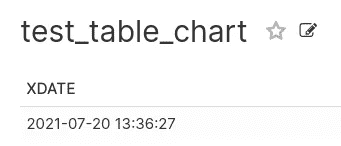
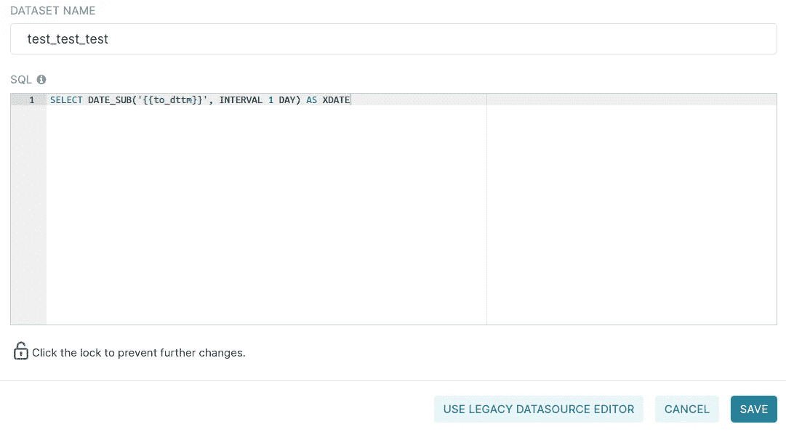
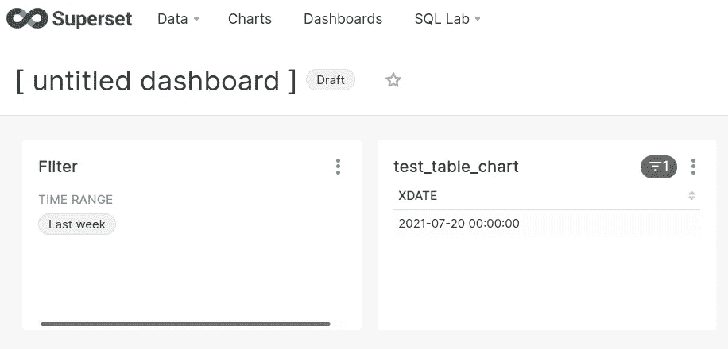

# Apache 超集中的交互式仪表板

> 原文：<https://medium.com/geekculture/interactive-dashboards-in-apache-superset-ec4a3bf9bc82?source=collection_archive---------3----------------------->

如果您想让您的仪表板更具交互性，该怎么办？如果您的数据集有一个复杂的 SQL 查询，并且您必须实现一个算法，该算法将依赖于您在仪表板中设置的过滤器，甚至基于来自该特定仪表板的链接的参数，该怎么办？所有问题的答案都是 Jinja 模板。


Photo by [Kelly Sikkema](https://unsplash.com/@kellysikkema?utm_source=medium&utm_medium=referral) on [Unsplash](https://unsplash.com?utm_source=medium&utm_medium=referral)

首先，如果你以前没有这样做过，你需要激活 Jinja 模板。为此，您应该在您的 **superset_config.py** 中的 **FEATURE_FLAGS** 字典中添加另一个元素。元素的键将是**ENABLE _ TEMPLATE _ PROCESSING**，值将为 True。下面是它的样子:

```
FEATURE_FLAGS = {
    ...  # your existing flags
    "ENABLE_TEMPLATE_PROCESSING": True,
}
```

添加参数后，如果在容器中使用超集，应该重新构建 Docker 映像。这里是我的两篇文章，可以帮助你[在 10 分钟内在本地运行 Apache 超集](/geekculture/run-apache-superset-locally-in-10-minutes-30bc70ed808c)和[通过 superset_config.py](/geekculture/custom-security-manager-for-apache-superset-c91f413a8be7) 更改设置。

现在，是时候在我们的 SQL 查询中使用 Jinja 宏了！例如，你可以从标准超集宏开始。如果您要编辑您的虚拟数据集，您可以为 Jinja 处理器使用`{{to_dttm}}`占位符。Jinja 将用您设置的时间范围过滤器的结束界限替换该占位符。让我们从一个示例查询 MariaDB 开始:

```
SELECT DATE_SUB(NOW(), INTERVAL 1 DAY) AS XDATE
```

我们将使用它在我们的系统中创建新的虚拟数据集，方法是单击 EXPLORE 按钮并保存。然后，我们将用名称`test_table_chart`保存一个表格图表。现在，我们看到查询结果如下:



Result of the query execution

现在，让我们通过用`{{to_dttm}}` Jinja 宏替换`NOW()`函数来更改虚拟数据集中的查询，并保存:



Changed virtual dataset with Jinja macro

如果您现在尝试运行您的图表，它将返回`N/A`，因为模板处理器看不到任何与此图表相关联的时间范围过滤器。要解决这个问题，你必须把你的图表和一个过滤器放在一个新的仪表板上。如果您现在打开控制面板，您将会看到我们预期的查询结果，即表示时间范围筛选器结束界限前一天的日期:



Chart based on a dataset that uses to_dttm macro

哇，很酷，不是吗？摆弄过滤器，检查它对`test_table_chart`的影响。

有许多内置宏可用于模板化。你知道 HTML 是以表格可视化类型呈现的吧？例如，您可以使用`{{ url_param('your_custom_parameter') }}`在您的仪表板中使用定制的 GET 请求参数，并使它们真正具有交互性。您可以通过 SQL 中的`<a>`标记构建链接，如下所示:

```
SELECT <a href="http://superset?page=777">Page #777</a> AS MY_LINK
```

该链接将引导用户到详细的仪表板，其中数据集是基于通过从您的链接获取参数填充的`{{ url_param('page') }}`！

关于其他内置 Jinja 宏的更多信息可以在 **jinja_context.py** [源代码](https://github.com/apache/superset/blob/master/superset/jinja_context.py)中找到。此外，您可以定义自己的宏，并通过数据集属性中的模板参数使其可用于数据集中的模板化。太棒了。

我希望，你喜欢这篇文章，这条信息将帮助你建立迷人的有用的可视化。如果有，请在 [Medium](/@agordienko) 、 [GitHub](https://github.com/aleksandrgordienko) 、 [Twitter](https://twitter.com/data_diving) 、 [LinkedIn](https://www.linkedin.com/in/aleksandrgordienko/) 上关注我。