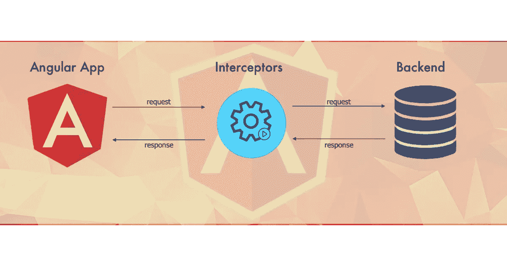
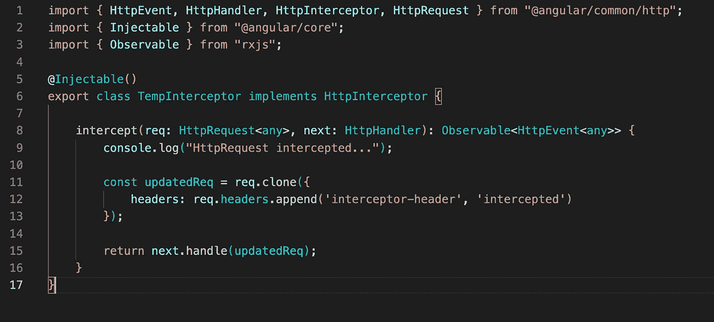
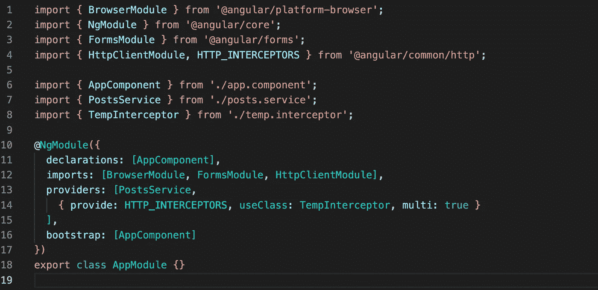
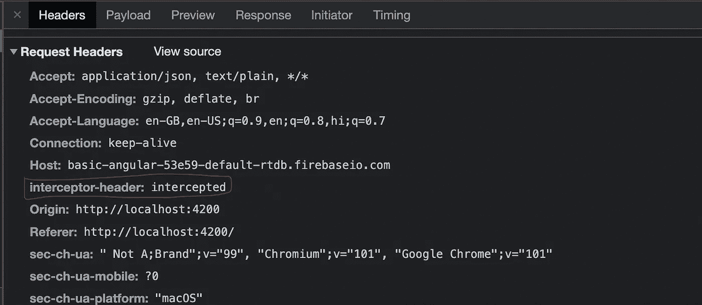
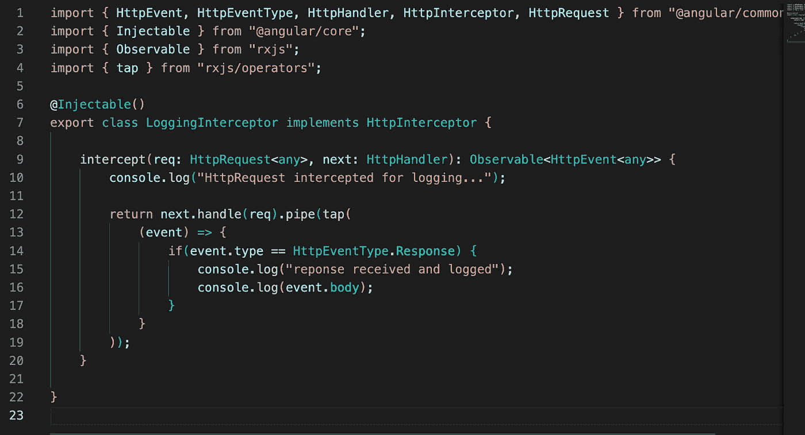
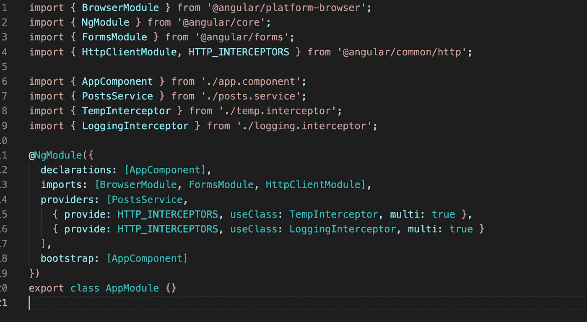

# 角形截击机

> 原文：<https://medium.com/geekculture/interceptors-in-angular-3505c832c1db?source=collection_archive---------3----------------------->

Interceptors in Angular

> 拦截器在 Angular 中用于拦截和处理一个 **HttpRequest** 和 **HttpResponse** 。

在我们的请求中添加一些特定的头或参数，或者修改我的 HttpRequest 或 HttpResponse，而不是为我的每个请求单独处理它，angular 通常为我们提供拦截器。它们只需编写一次，就会被我们使用 HttpClient 的所有请求和响应截获。

通过拦截 HTTP 请求，我们可以修改或更改请求的值。

为了创建一个拦截器，我们需要从`@angular/common/http`实现`HttpInterceptor`接口。每次我们的应用程序使用`HttpClient`服务发出 HTTP 请求时，拦截器都会调用`intercept()`方法。

当调用`intercept()`时，角度传递一个对`httpRequest`对象的引用。有了这个请求，我们可以检查它，并根据需要修改它。一旦我们的逻辑完成，我们调用`next.handle`并将更新的请求返回给应用程序。

为了更好地理解事情，我们创建了一个 TempInterceptor，它只拦截每个传入的请求，将一些随机数据附加到请求头，比如 key: interceptor-header 和 value: intercepted，记录一些信息，然后调用 next.handle()并传递更新的请求。

TempInterceptor code which intercepts my HTTP Request and appends a random header

一旦创建了拦截器，我们需要将其注册为多提供者，因为在一个应用程序中可以运行多个拦截器。重要注意事项，您必须注册提供者`app.module`,这样它才能正确地应用于所有的应用程序 HTTP 请求。

app.module.ts code which shows how we register our interceptor in the provider array

如果我们在浏览器中查看开发工具，我们可以看到网络请求包含我们的新报头`interceptor-header`和相应的截取值。

Dev tools showing our new header in the network request (highlighted in red)

我们还可以在这里添加多个拦截器，这些拦截器将根据它们在 app.module.ts providers 数组中定义的顺序进行调用。如上所述，我们将以同样的方式定义第二个拦截器，它将包含一些逻辑来转换我们的网络请求或响应。

让我们试着用一个基本的 LoggingInterceptor 来理解它，它将简单地记录我们的请求和响应数据。

这里我们只记录一些信息，然后通过从 rxjs/operators 添加 tap 操作符，我们记录特定事件类型的事件体。

LoggingInterceptor code which intercepts and logs my request and response data

现在，在 providers 数组中定义它时，顺序很重要。这里我们首先定义了 TempInterceptor，然后定义了 LoggingInterceptor。同理，事物也会被调用。一旦 TempInterceptor 调用 next.handle()，HttpRequest 将进一步转移到 LoggingInterceptor，依此类推…

app.module.ts code which shows how we register our logging interceptor in the provider array (order matters)