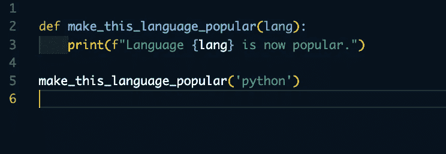
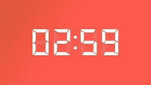
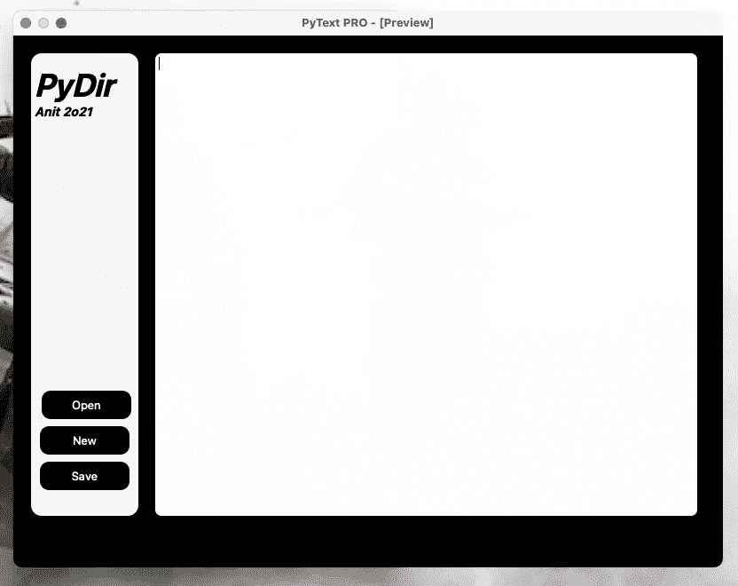
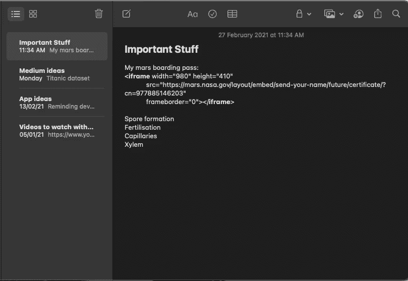
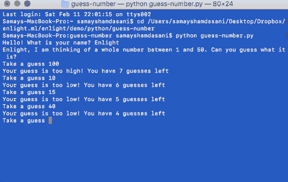
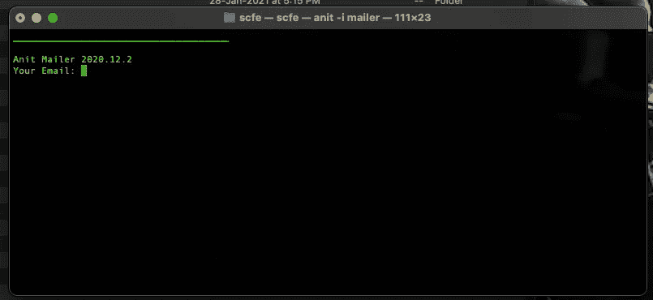

# 使用 Python 的有趣想法和项目

> 原文：<https://medium.com/geekculture/interesting-ideas-and-projects-with-python-1dc79698c5a5?source=collection_archive---------4----------------------->

## 嗯，我们需要创造一些比待办事项更多的东西，不是吗？

image from the author

## 计算机编程语言

Python 是世界上最流行的编程语言之一。它在网页设计、数据科学等领域获得了广泛的认可。社区。它有一个非常简单的学习语法。

image from stackoverflow.com surveys

很明显，要学习一些东西，你也需要做一些实际的工作，对我来说这是一个挑战，要么是因为我太懒，要么是我找不到我感兴趣的想法。

首先，您需要考虑您将使用什么平台 web、gui 或 cli，以下是您可以使用的工具和框架的简要说明:

# Web 开发

所以有很多网络框架你可以选择来创建你自己的网站，比如 Flask，Django，Tornado 等等。我个人使用 Django，但这取决于你，因为它应该适合你。为了创建一个网站，你至少需要一些关于这些核心 web 开发语言的知识，HTML，CSS，Javascript。

姜戈文献->[https://www.djangoproject.com/](https://www.djangoproject.com/)

烧瓶文献->【https://flask.palletsprojects.com/en/1.1.x/ 

龙卷风:【https://www.tornadoweb.org/en/stable/ 

# 图形用户界面(GUI)

当涉及到构建桌面应用程序时，Python 有一个非常简单的方法，你可以使用它的模块 PySimpleGUI 来开发一个，它允许你构建简单的 GUI，但是如果你真的喜欢这个，但是发现它太简单了，PyQt5 框架也提供了高级的 GUI 构建元素，但是更难学习。

PySimpleGUI 上的酷教程:[https://realpython.com/pysimplegui-python/](https://realpython.com/pysimplegui-python/)

youtube 上的 PyQt5 教程:[https://bit.ly/3aZjdgS](https://bit.ly/3aZjdgS)

# 命令行界面(CLI)

命令行程序只能在终端上运行，没有图形界面。它可以用内置的 python 来构建，也可以使用像 click、python-fire 这样的库。为了让他们看起来不像 90 年代的人，使用 **rich**

# 给我项目！

是的，在这里:

# 面向 Web 的项目

## 1.微博网站

您可以创建一个应用程序，人们可以在其中发送他们关于主题的更新，就像您可以创建一个 web 应用程序，开发人员可以在其中以简短的文本提供建议。你也应该创建一个回复功能，允许人们对建议提出疑问。

您可以在 ORM 中使用 Django 的构建版本，或者在 sqlalchemy 中使用 Flask

## 2.文本到莫尔斯电码音频

是的，想想当你是一名特工，忘记了 s 的莫尔斯电码，你可以拿出你的手机，打开它，嘣！这挽救了一天。虽然这不是一个实际的用例，但这只是一个很酷的项目，你可以用 Flask 来构建它，因为 Django 对于来说太复杂了

源代码:[https://github.com/shaurya-blip/morse-code-generator-flask](https://github.com/shaurya-blip/morse-code-generator-flask)

## 3.任何时间的倒数计时器

image from gamedevbeginner.com

创建一个倒计时时间从任何日期或时间。

## 4.用意境的基础暗示宋

在你的 web 应用程序中加入一点机器学习！这只是一个初学者项目来尝试你的新技能，而不是一个现实世界的项目。创建一个应用程序，接受相机，看到你的脸，然后它会根据你的心情播放一些歌曲

## 5.查看应用程序

因此，在这个应用程序中，用户将从亚马逊发送一个产品(这将是一个亚马逊链接)，并询问其他购买过它的人对它的看法。

# GUI 的项目

## 1.基本的。txt 编辑器

image of the author

我自己定制的 python 文本编辑器。这只是一个基本的编辑器，没有完成等。这对于 GUI 初学者项目来说是很好的。它是用 PyQt5 构建的

## 2.倒计时定时器

这和 web 应用程序的想法是一样的，但是你可以有通知，小部件等等。

## 3.便签应用

image of apple notes app screenshotted by the author

在 macOS 中创建类似于 Notes 应用程序的东西，这是从 GUI 开始的好方法。您可以将笔记保存在 json 文件或数据库中。

## 4.画布应用程序

可以在上面画画，导出成 png 或者 jpg！您还可以使其成为多用户，这样人们就可以在全球范围内进行编辑。

# CLI 应用程序

## 1.基本数字猜谜游戏

source: enlight.nyc

创建一个输入数字的基本数字猜谜游戏。这是非常基本的。你可以用丰富来美化它

## 2.一切尽在一个命令中

当我没有任何想法时，我创建了这个，所以我只是创建了一个包，在这个包中我不断地添加我的随机包，就像当我想在命令行中发送邮件时，我写这个

`anit -i mailer`

它只会显示这个:

source: author

我用点击 python 模块做了这个。

## 3.文本到莫尔斯文本

是的，这和用莫尔斯电码发短信是一样的，但是是在终端里，虽然看起来更像是一个电脑黑客试图用莫尔斯电码给他的同伙发信息。

# 结论

我们的 Python 项目列表已经结束，如果你有更多的想法，我很乐意听到你的建议！

-.-. .. .- — -!