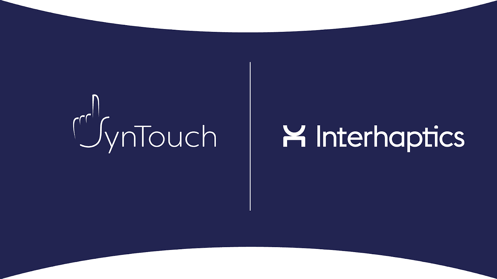
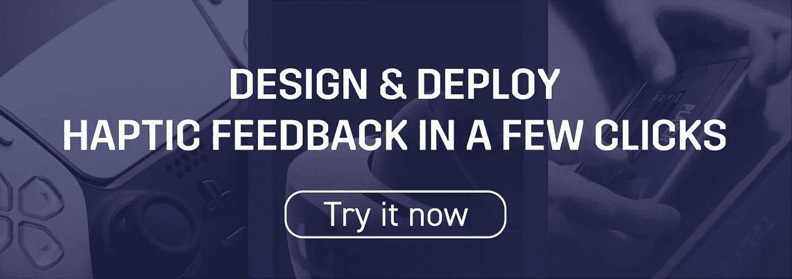
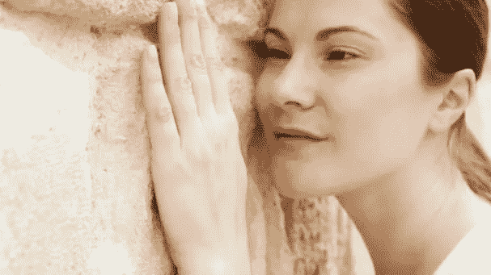
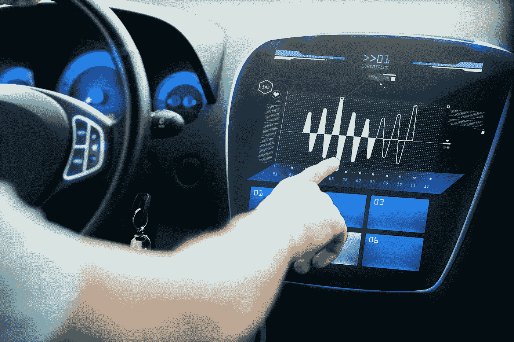
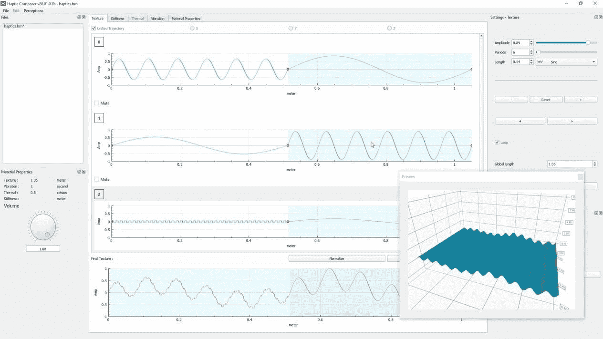
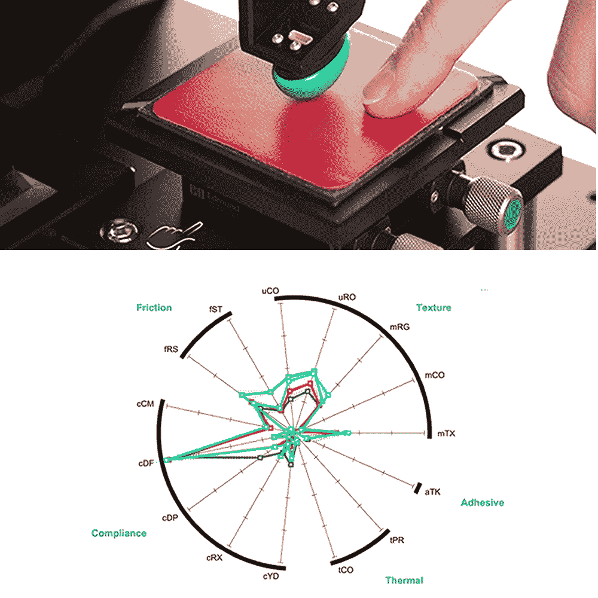

# Interhaptics 和 SynTouch 合作伙伴，提供受现实启发的数字触觉体验

> 原文：<https://medium.com/geekculture/interhaptics-and-syntouch-partner-for-digital-haptic-experiences-inspired-by-reality-8b2c1a3071c3?source=collection_archive---------18----------------------->

# **触觉不可或缺！**

想象一下，与看不见、听不见、闻不到或尝不到相比，没有皮肤感觉的生活。人类的进化使触摸成为一种强有力的、有说服力的非语言交流渠道，它能独特地告知人们物体的形状、位置、质地、柔软度、重量和温度。

此外，人们经常为了触摸的乐趣而触摸，例如享受纸的质感、柔软织物的丝滑感或汽车座椅皮革的奢华感。

# **触觉是“触摸的语言”**

它是非语言交流的子系统，通过身体接触来传达意思。它是通过触摸和本体感受对物体的感知，尤其是在非语言交流中。

今天最常见的触觉数字体验是智能手机和显示器提供的振动，就像汽车和家用电器中的振动一样。虽然这些触觉体验很有帮助，而且常常令人愉快，但是它们非常有限，并且不是从现实生活中获得灵感的。

Haptics integrated into the digital interface of automobiles

但我们已经看到了在交付触觉真实感方面取得的巨大进展，这将丰富虚拟现实、混合现实、增强现实和其他沉浸式数字体验。最近的两个例子是 [PS5 Dualsense](https://www.playstation.com/en-us/accessories/dualsense-wireless-controller/) 的触觉和开始出现在市场上的高清晰度(HD)触觉致动器，如纳米孔 TacHammer 或 SenseGlove DK1。

# **SynTouch & Interhaptics，完美匹配**

沿着这条发展道路， [Interhaptics](https://www.interhaptics.com/products/haptics-for-vr-and-mr) (法国巴黎)和 [SynTouch Inc.](http://syntouchinc.com) (加州洛杉矶)正在合作，让数字体验的创造者能够提供从现实中获得灵感的触觉体验，而无需要求他们成为触觉专家。

具体来说，Interhaptics Haptic Composer 将为许多材料和表面嵌入 SynTouch 的 Toccare Haptics 配置文件。使用触觉合成器的创建者将简单地通过参考用于玻璃的 Toccare 触觉简档来定义虚拟表面，例如玻璃。消费者将“感受”到由玻璃的真实触摸反馈激发的触摸反馈。

Haptic Composer 是一款易于使用的软件工具，它允许在几分钟内而不是几小时内创建高质量的触觉体验，这些体验可以跨支持触觉的平台进行交互操作。它允许创建高保真的触觉内容，完全由强大的执行器支持，如 Nanoport TacHammer。它还可以在 SenseGlove DK1 触觉设备上呈现多个高保真触觉感知。最后，由于有了 [Interhaptics 引擎](https://www.interhaptics.com/explore/interhaptics-engine)，它可以通过任何可用的设备进行部署。

Interhaptics Haptic Composer Interface

与 RGB 值描述颜色的方式类似，Toccare Haptics Profiles 的 15 个触觉维度独特地量化和传达了人类对材料和表面的触觉感知方式。也就是说，它们是传递真实的、可复制的触觉体验所需的“触觉语言”。Toccare 档案是通过广泛的心理物理学研究开发的，并经过数千种材料和表面的验证，以确保符合人类的感知。

Toccare 触觉轮廓由 Toccare 触觉测量系统生成，这是一种高度灵敏的仪器，可仿生再现人类手指如何感知、探索和移动。如果手指能感觉到，Toccare 系统就能测量出来。

> [syn touch 的首席执行官 Richard Koffler](https://syntouchinc.com/contact/) 评论道:“我们与 Interhaptics 的合作完全符合我们的使命，即在数字世界中为类似人类的触觉带来科学的确定性。我们通过 Toccare Haptics Profiles 和我们的 BioTac 和 NumaTac 触觉传感器来实现机器人和假手应用。”

Interhaptics 专注于允许虚拟现实(VR)、混合现实(MR)、移动、增强现实(AR)和控制台应用程序的创作者轻松、廉价地开发和交付高质量触觉体验的软件。Interhaptics 的使命是支持可扩展的 haptics 生态系统的发展，并努力为 VR/MR/AR、移动和控制台开发人员社区提供一流的开发工具，以及支持触觉的内容在任何支持触觉的平台上的互操作性。

> [Interhaptics 首席执行官 Eric Vezzoli](https://www.interhaptics.com/contact) 认为“Syntouch 是量化虚拟触觉体验的先驱。他们的精确数据与真实世界材料的触觉一致，这将帮助我们让那些有兴趣以最少的努力高效地提供真实触觉体验的创作者获得力量。”

联系 Interhaptics & SynTouch 整合触觉反馈，以及现成的逼真触觉信号[此处](https://www.interhaptics.com/contact)。