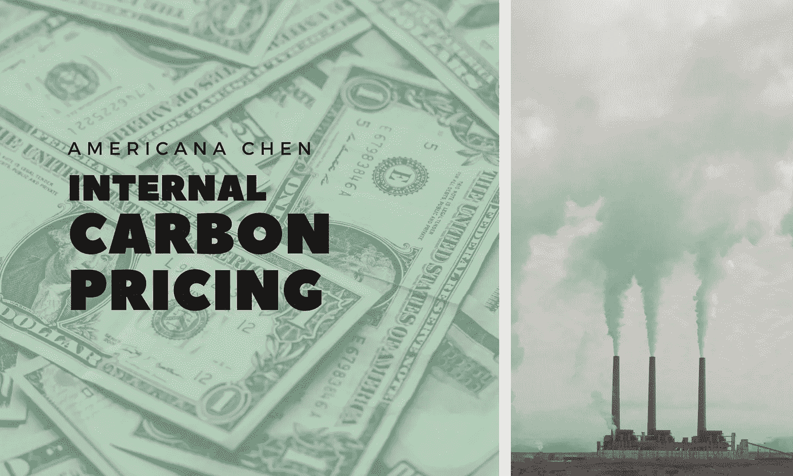
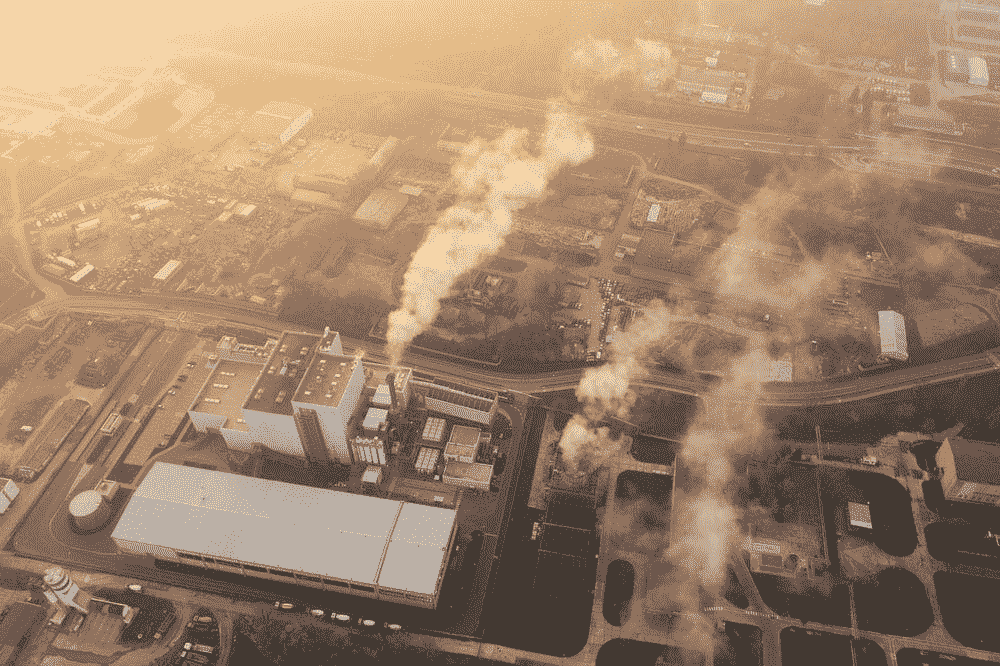
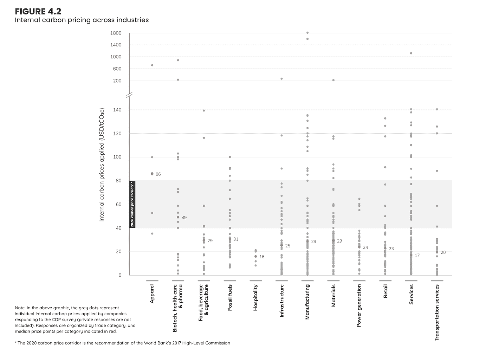

# 内部碳定价——为什么企业需要现在就开始实施

> 原文：<https://medium.com/geekculture/internal-carbon-pricing-why-do-businesses-need-to-start-implementing-it-right-now-3a6efda4b53b?source=collection_archive---------6----------------------->

> 人们越来越认识到，气候变化以搁浅资产的形式给投资者带来了重大风险。为了解决这一问题，数百家公司正在设定碳的内部价格，以减轻当前或未来气候变化监管带来的风险，从而保护投资者的利益，并以此推动对清洁能源和低碳替代能源的投资。
> 
> - Fiona Reynolds，负责任投资原则董事总经理

在过去的几年里，围绕碳定价的讨论越来越多，这是我们实现零碳排放的必不可少的组成部分。碳定价的核心思想是将过去由公众支付的活动(主要是商业活动)温室气体排放的外部性内部化。全球碳定价市场迅速扩大，早在 2016 年，据气候经济研究所估计，只有 13%的全球排放量被明确的定价机制覆盖，而根据世界银行的数据，***2021 年，全球共有 65 个碳定价倡议覆盖了 21.5%，相当于 11.65Gt 二氧化碳当量的全球温室气体排放量。***

Source: [Unsplash](https://unsplash.com/photos/T-eDxGcn-Ok)

在国家和区域两级，两种主要的碳定价机制是排放交易系统，即排放者交易排放配额以达到排放目标和规定，以及不太灵活的方法，即碳税，即对每单位温室气体排放确定税率。然而，这些**高水平的计划并不适用于每个国家和地方司法管辖区，随着新的考虑因素不断出现**，存在监管不确定性，例如跨境调整问题。这些计划的细节仍需完善，以提高效率。

在这样一个巨大的、不断变化的市场中，作为个体企业，你应该怎么做？碳市场只面向十亿美元的公司吗？你应该如何应对碳市场带来的风险和机遇？你的企业如何为低碳经济增长做出贡献？

## 内部碳定价可能会给你所有这些问题的答案。

## ***1。什么是内部碳定价(ICP ),我们现在处于什么阶段？***

内部碳定价是企业自己对其经营活动产生的每单位碳排放设定的价格。**它被用作一种工具，帮助企业将气候风险和机遇纳入商业决策、投资选择，并激励企业投资低碳创新。**

正如全球碳市场如何扩大一样，报告使用 ICP 流程的公司数量也在激增。根据 CDP 的数据，2020 年， **853 家公司**披露了他们使用 ICP 的情况，另外 **1159 家公司**有意向在未来两年采用 ICP，比 2019 年增加 20%。领先的企业越来越注意气候风险，按市值计算，500 家最大的公司中有近一半已经采用了 ICP。对 2019 年结果的地理细分表明，大多数早期采用者来自欧洲、日本、英国和美国。

> **嗯……自愿给自己的业务运营增加额外成本似乎在财务上没有意义……**

## ***2。为什么要给自己标价？***

***理由 1:了解并缓解碳和气候风险***

当谈到气候风险时，实际上有几个方面— **物理风险、过渡风险以及与之相关的金融风险。**

物理风险很简单，但它们可能会产生最具破坏性的影响。海平面上升、更频繁的气候灾害、飓风正使人类生命和数十亿美元的有形资产处于危险之中。然而，从比较方案的角度来看，更相关的风险是过渡风险。随着世界各国政府对碳排放设定更严格的限制，碳价格将不可避免地攀升，这是由对排放许可的更高需求推动的。**如果你的企业无法通过转变业务运营、重新设计产品和流程来减少碳排放，你将不得不购买高价的碳排放许可，**这将使你在市场中处于不利地位。在激烈的竞争下，为排放支付更高的价格甚至可能迫使你退出市场。

Source: [Unsplash](https://unsplash.com/photos/_whs7FPfkwQ)

除了购买排放许可证的成本上升，金融风险的另一个方面与获得资金的能力有关。随着越来越多的投资者考虑环境、社会和公司治理因素，越来越多的银行根据公司的环境、社会和公司治理绩效发放贷款，公司从金融机构和公众获得财政支持的能力现在在很大程度上取决于它们对环境、社会和治理问题的回应程度。无法过渡到低碳商业模式可能会让你面临现金流短缺和缺乏金融资本的风险。这不仅是单个企业的风险，也是**整个金融系统的风险**——欧洲中央银行(ECB)估计**如果气候行动不加速，到 2050 年，欧元区普通银行公司贷款的违约概率可能会增加 7.1%。**

因此，建立一个被纳入企业投资决策的 ICP 可以使**低碳投资和低碳项目得到优先考虑，更多的投资可以被引入创新的低碳技术**，在为时已晚之前，逐渐帮助您的企业过渡并**减轻未来的气候和碳风险。**

***理由二:为不可预测的未来碳价格做好准备***

正如我提到的，目前全球碳市场存在巨大的不确定性。在欧盟，2017 年，碳排放许可价格仅为每吨二氧化碳当量约 3€，而在 2022 年，价格已飙升至每吨 82€的惊人水平。企业很难预测未来碳价格上涨的速度。**预先设定 ICP 可以帮助企业减少由于国家碳价格突然上涨而带来的现金流冲击，从而在压力情况下保持市场竞争力。**

***原因三:增强员工的碳和气候风险意识***

通常情况下，高管和高级经理对气候风险非常了解，因为他们是战略制定者和决策者。但是当涉及到实施时，气候因素能在多大程度上融入到日常业务运营中，最终取决于员工是否能够将气候风险融入到业务流程中。例如，当一家银行的员工在评估客户的贷款违约风险时，他/她是否能够查看公司的排放数据或 ESG 报告，并估计客户未来会面临多大的气候风险？尽管可以设置 ESG 分数和量化标准来指导评估流程，但仍有许多特定于业务的定性因素需要考虑。**因此，员工的气候意识是企业气候风险准备程度的决定因素。设置 ICP 意味着每个项目团队都参与到碳排放评估过程中，因此他们必须彻底理解碳概念。**

***其他原因可能包括:***

***理由四:提高外部知名度，建立自己的品牌形象***

***理由五:回答投资者和消费者的问题，回应他们对气候突发事件的担忧***

## ***3。*设定合适的价格**

顾名思义，国际比较方案没有标准级别，取决于具体的业务情况。

> 所以你可能会问，我应该定什么价格？

在定价之前，你需要首先决定你将采用哪种定价方式。**常用的方法有三种:影子定价、隐性定价和内部碳费。**

影子定价是一种假设的碳排放成本，公司用它来调整投资的成本和回报，评估他们的投资决策。**他们并不真正由项目团队支付，而是用作评估工具**，例如，如果一家企业正在比较化石能源和可再生能源，当前的市场能源价格可能表明化石能源是更便宜的选择，但当排放被赋予影子价格时，可再生能源可能会胜出。

另一方面，**隐性定价是对实现某个气候目标**所需的金融资本投资的一种衡量，例如碳中和。如果一个项目估计排放一定量的二氧化碳当量，国际比较方案应回答从碳市场购买排放许可证以抵消它们需要多少费用。

最后，**内部碳费涉及真实的金钱，它适用于企业的不同部门，他们真的必须为他们项目的排放付费。这些款项被收集到一个基金中，由企业再投资到低碳投资中。**

公司设定的实际价格因行业和地区而异。在向 CDP 报告其 ICP 的所有公司中，价格从 6 美元到 918 美元不等。平均影子价格为 28 美元，隐含价格为 27 美元，内部碳费仅为 18 美元。这实际上一点也不令人满意，**碳价格高级委员会建议，公司需要在 2020 年将 ICP 设定在每公吨 40 至 80 美元之间，并在 2030 年之前将其提高到每公吨 50 至 100 美元，以便与巴黎协议设定的标准保持一致**。

source: the World Bank — State and Trends of Carbon Pricing 2021

碳定价的**内部异质性和外部波动性**使得设定 ICP 很困难，公司也可以根据地理位置和生产的产品为不同的运营单位设定不同的价格，但我建议公司考虑以下几个方面:

*   你公司的气候目标有多远大？
*   你所在地区的碳价格是多少？
*   你所在行业的平均 ICP 是多少？
*   你面临的气候风险有多大？(例如，你的供应链是否严重依赖易受气候风险影响地区的农产品？)

## 4.案例分析: ***微软的 ICP***

为了向您提供实施 ICP 的示例，微软在 2012 年采用了内部碳费系统，该系统在所有业务部门实施，涵盖范围 1、2 和 3 的排放。价格定在每吨 5 到 10 美元之间，筹集的资金将被集中用于内部效率项目、绿色能源和碳抵消项目的投资。**总体而言，据微软报告，自 2012 年以来，每年能源成本节约超过 1000 万美元，减排近 1000 万吨。**

**随着国际监管机构、政府和企业之间的合作和交流日益增多，毫无疑问，零碳企业时代即将到来。公司需要重新评估其投资，管理风险，并根据比较方案重新整合战略。做一个未来学家，为即将到来的碳风险和机遇做好准备。**

# 关于我

我是**世界可持续发展规划师学会**的准会员，目前在**联合国教科文组织香港协会**及其秘书处——**香港可持续发展教育学会**工作。在伦敦大学学院攻读统计学学位时，我对可持续发展和技术有着强烈的热情。因此，我致力于撰写和发表与 SDG、人工智能和区块链等创新技术以及经济学相关的文章。我渴望将数字技术和可持续发展结合在一起，激励更多的人为所有人创造更美好的未来。

# 我的工作

*   我关于可持续发展目标的第一本书—***“Hi 17 SDGs:动态世界中的可持续发展目标”*** 是一本介绍性指南，涵盖了专家意见和年轻人对实现可持续发展目标的创新方法的看法。亚马逊上可以买到数字版:[https://www.amazon.com/dp/9887566918](https://www.amazon.com/dp/9887566918)/香港读者可以买到实体版:[http://hiesd.org/wp/publications/](http://hiesd.org/wp/publications/)
*   我在 ***撰写和报道活动*** 方面也很有经验:阅读更多关于我的文章作品集:[https://americanachen.wixsite.com/my-site/me](https://americanachen.wixsite.com/my-site/me)(如果有任何合作或您希望我为您的活动撰写文章，请联系我)
*   我的 Udemy 课程:面向商业领袖的企业环境、社会和治理基础—[https://www.udemy.com/course/corporate-esg-fundamental/](https://www.udemy.com/course/corporate-esg-fundamental/)(通过电子邮件联系我获取优惠券)

# 联系人:

电子邮件:americanachen@unesco.hk

LinkedIn: [美国陈](https://www.linkedin.com/in/americana-chen-94432219a/)

insta gram:[@ africccana](https://www.instagram.com/africcccana/)

陈

# 参考资料:

1.  Fan，j .，Rehm，w .，& Siccardo，G. (2021 年 2 月 19 日)。*内部碳定价的状态*。麦肯锡&公司。2022 年 1 月 22 日检索，来自[https://www . McKinsey . com/business-functions/strategy-and-corporate-finance/our-insights/the-state-of-internal-carbon-pricing](https://www.mckinsey.com/business-functions/strategy-and-corporate-finance/our-insights/the-state-of-internal-carbon-pricing)
2.  *内部碳定价指南——花期集团*。开花。(2021 年 9 月 9 日)。于 2022 年 1 月 22 日从[https://www.anthesisgroup.com/internal-carbon-pricing/#why](https://www.anthesisgroup.com/internal-carbon-pricing/#why)检索
3.  *微软将在 2030 年实现碳减排*。微软官方博客。(2020 年 7 月 23 日)。检索于 2022 年 1 月 22 日，来自[https://blogs . Microsoft . com/blog/2020/01/16/Microsoft-will-be-carbon-negative-by-2030/](https://blogs.microsoft.com/blog/2020/01/16/microsoft-will-be-carbon-negative-by-2030/)
4.  Newson，Thomas Kaiser 编辑，Bill Coen 和 D. R. Maurice 编辑，Pitacco，e .，Lorenzo Migliorato 2021 年 9 月 24 日，Migliorato，l .，& 2021，24 S. (2021 年 9 月 24 日)。*气候不作为导致违约风险上升——欧洲央行*。Risk.net。2022 年 1 月 22 日检索，来自[https://www . risk . net/risk-quantum/7880281/default-risk-set-to-rise-from-climate-unaction-ECB](https://www.risk.net/risk-quantum/7880281/default-risk-set-to-rise-from-climate-inaction-ecb)
5.  *什么是碳定价？*什么是碳定价？碳定价仪表板。(未注明)。检索于 2022 年 1 月 22 日，来自[https://carbonpricingdashboard . world bank . org/what-carbon-pricing](https://carbonpricingdashboard.worldbank.org/what-carbon-pricing)
6.  *“世界银行。2021.2021 年碳定价的现状和趋势。DC 华盛顿:世界银行。世界银行。*[*https://openknowledge.worldbank.org/handle/10986/35620*](https://openknowledge.worldbank.org/handle/10986/35620)*牌照:CC BY 3.0 IGO。”*