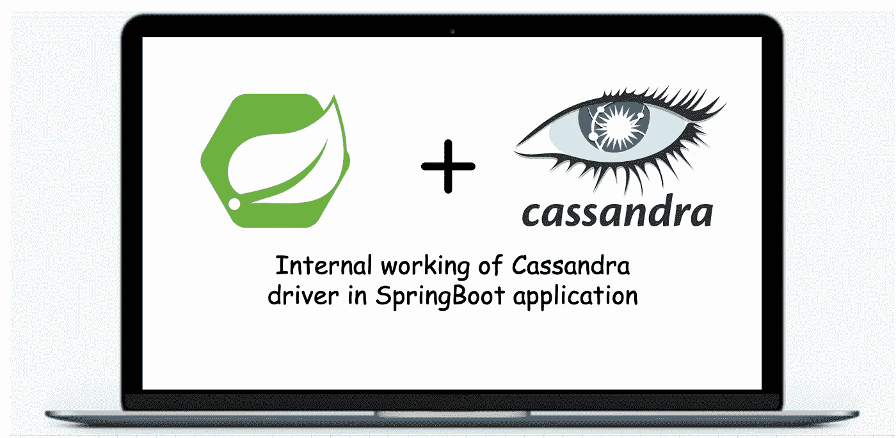
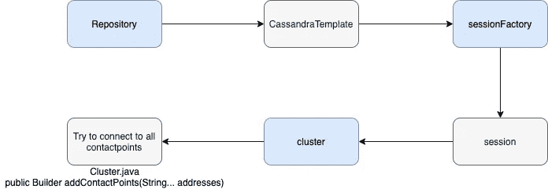
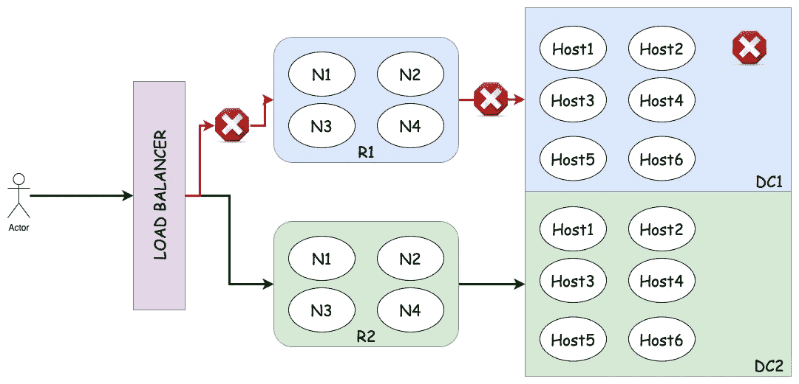
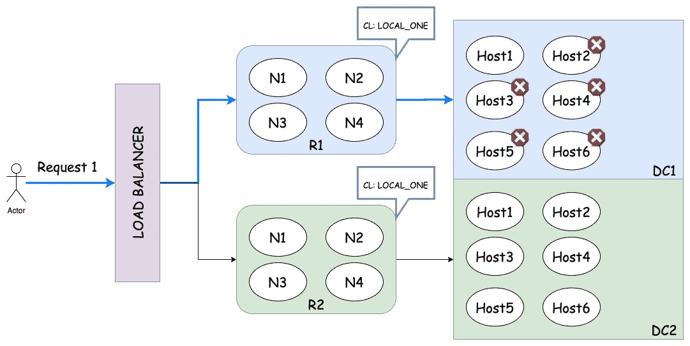
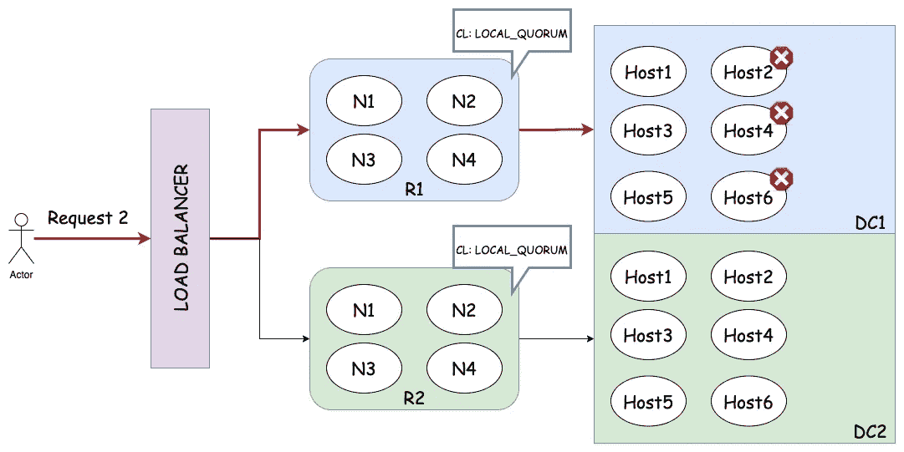

# Cassandra 驱动程序在 Springboot 应用程序中的内部工作

> 原文：<https://medium.com/geekculture/internal-working-of-cassandra-driver-in-springboot-application-d45ce58b748b?source=collection_archive---------8----------------------->

有许多教程或博客可以阅读如何在 Springboot 应用程序中使用 JPA maven 依赖项连接到 Cassandra 数据库。[这里的](https://docs.spring.io/spring-data/cassandra/docs/current/reference/html/#cassandra.repositories)是春季的教程之一。



用 Cassandra 数据库编写一个 Springboot 应用程序并没有太多的工作要做。有 `7 properties`需要在`application.properties` 文件中定义，并在扩展 CassandraRepository 的接口上使用`@Repository`注释，我们几乎完成了 Cassandra 所需的实现。写这篇文章的目的是为了理解 Cassandra driver 使用 Springboot 应用程序的内部原理。

```
#application.properties filecassandra.contactpoints=localhost1,localhost2,...
cassandra.port=9042
cassandra.keyspace=test_keyspace
cassandra.username=<username>
cassandra.password=<password>
cassandra.clusterName=<cluster_name>
cassandra.localDC=<local_DC>
```

## 应用程序如何在驱动程序的帮助下连接到数据库？

有许多 beans 在应用程序启动时被初始化。

1.  **repository** :这是一个为特定的表与数据库交互的类。对于每个表，都会有一个对应的存储库，它扩展了`CassandraRepository<Entity, ID_type>`。
2.  Cassandra template:Cassandra template*构建在底层 CqlTemplate 之上，提供了一种简单的方法来查询域对象并将对象映射到 Cassandra 中的持久化数据结构。*
3.  ***sessionFactory** :它是查询数据库所需的所有会话的工厂。它为一个数据库的应用程序创建一次。*
4.  ***时段**:该时段由`sessionFactory`制作。会话保持与 Cassandra 集群的连接，允许对其进行查询。每个会话维护到集群节点的多个连接，提供为每个查询选择使用哪个节点的策略(默认情况下在集群的所有节点上循环)，并处理失败查询的重试(当有意义时)，等等。*
5.  ***集群**:这是驱动的主入口。群集对象维护与其中一个群集节点的永久连接，该连接仅用于维护有关群集状态和当前拓扑的信息。使用该连接，驱动程序将发现当前在集群中的所有节点以及随后加入集群的新节点。*

**

*Bean creation flow for Cassandra in spring-boot application*

## *如果任何接触点无效，应用程序会启动吗？*

*答案是**没有**。驱动程序试图在应用程序启动时添加所有提供的接触点。如果任何联系点未找到或无效或关闭，**应用程序不会启动。**它抛出以下错误。*

```
*Caused by: java.lang.IllegalArgumentException: Failed to add contact point: **<invalid_or_down_host>**
 at com.datastax.driver.core.Cluster$Builder.addContactPoint(Cluster.java:922) ~[cassandra-driver-core-3.6.0.jar:na]
 at com.datastax.driver.core.Cluster$Builder.addContactPoints(Cluster.java:942) ~[cassandra-driver-core-3.6.0.jar:na]
 at org.springframework.data.cassandra.config.CassandraClusterFactoryBean.afterPropertiesSet(CassandraClusterFactoryBean.java:174) ~[spring-data-cassandra-2.1.6.RELEASE.jar:2.1.6.RELEASE]
 at org.springframework.beans.factory.support.AbstractAutowireCapableBeanFactory.invokeInitMethods(AbstractAutowireCapableBeanFactory.java:1837) ~[spring-beans-5.1.6.RELEASE.jar:5.1.6.RELEASE]
 at org.springframework.beans.factory.support.AbstractAutowireCapableBeanFactory.initializeBean(AbstractAutowireCapableBeanFactory.java:1774) ~[spring-beans-5.1.6.RELEASE.jar:5.1.6.RELEASE]
 ... 124 common frames omitted
Caused by: java.net.UnknownHostException: **<invalid_or_down_host>**: nodename nor servname provided, or not known
 at java.net.Inet6AddressImpl.lookupAllHostAddr(Native Method) ~[na:1.8.0_191]
 at java.net.InetAddress$2.lookupAllHostAddr(InetAddress.java:929) ~[na:1.8.0_191]
 at java.net.InetAddress.getAddressesFromNameService(InetAddress.java:1324) ~[na:1.8.0_191]
 at java.net.InetAddress.getAllByName0(InetAddress.java:1277) ~[na:1.8.0_191]
 at java.net.InetAddress.getAllByName(InetAddress.java:1193) ~[na:1.8.0_191]
 at java.net.InetAddress.getAllByName(InetAddress.java:1127) ~[na:1.8.0_191]
 at com.datastax.driver.core.Cluster$Builder.addContactPoint(Cluster.java:919) ~[cassandra-driver-core-3.6.0.jar:na]
 ... 128 common frames omitted*
```

## *Cassandra 群集关闭时，应用程序是否会停止？*

***否，**当集群关闭时，应用程序继续运行。但是，应用程序将无法为数据库请求提供服务，它会收到集群面临一些问题的通知，并在延迟后开始计划重新连接。除非与群集重新建立连接，否则驱动程序会在给定时间后继续尝试重新连接。有一个 [ReconnectionPolicy](https://docs.datastax.com/en/drivers/java/2.1/com/datastax/driver/core/policies/ReconnectionPolicy.html) 接口，它有两个实现:*

1.  *[ConstantReconnectionPolicy](https://docs.datastax.com/en/drivers/java/2.1/com/datastax/driver/core/policies/ConstantReconnectionPolicy.html):在每次重新连接尝试之间等待恒定时间的重新连接策略。*
2.  *[指数重连策略](https://docs.datastax.com/en/drivers/java/2.1/com/datastax/driver/core/policies/ExponentialReconnectionPolicy.html):一种重连策略，在每次重连尝试之间以指数方式等待更长时间(但是一旦达到最大延迟就保持恒定延迟)。*

*`ReconnectionPolicy`的默认实现是`[ExponentialReconnectionPolicy](https://docs.datastax.com/en/drivers/java/2.1/com/datastax/driver/core/policies/ExponentialReconnectionPolicy.html)`，其中基本延迟是 1000 毫秒，最大延迟是 60000 毫秒(10 分钟)。将生成如下重试日志:*

```
*[Control connection] Cannot connect to any host, scheduling retry in 1000 milliseconds[Control connection] Cannot connect to any host, scheduling retry in 2000 milliseconds[Control connection] Cannot connect to any host, scheduling retry in 4000 milliseconds[Control connection] Cannot connect to any host, scheduling retry in 8000 milliseconds
.....
.....
.....[Control connection] Cannot connect to any host, scheduling retry in 600000 milliseconds
[Control connection] Cannot connect to any host, scheduling retry in 600000 milliseconds
[Control connection] Cannot connect to any host, scheduling retry in 600000 milliseconds*
```

## *应该提供多少个接触点来进行连接？*

*接触点的数量不应超过必要的数量。理想情况下，我们应该为每个数据中心提供前两个联系点。驾驶员使用这些接触点只是为了进入集群。当您计划降级您的集群时，如果提供了更多的联系点，您将需要删除联系点。*

```
*#single DC cluster
contactpoints=host1DC,host2DC#multile DC cluster
contactpoints=host1DC1,host2DC2,host1DC2,host2DC2*
```

## *是否必须提供当地的 DC 名字？*

***不，**不强制要求，但**建议**明确提及当地的 DC 名称。如果未提及本地 DC 名称，驱动程序将从用于连接到群集的 contactpoints 中的第一台主机分配本地 DC 名称。我们提供的顺序是不保证的，驱动程序会随机洗牌并从提供的列表中选择一台主机。*

*如果所有主机都属于同一个 DC，就不会有问题。但是，**对于多 DC 集群，建议设置本地 DC 名称。***

## *本地数据中心(本地 DC)有什么用？*

*为什么驱动程序为我们设置本地数据中心，即使我们不想设置它。它带来了什么好处？它基本上防止了跨 DC 查询，这有助于更好的性能，因为跨 DC 延迟没有考虑在内。对应用程序的所有查询将仅由本地 DC 节点提供服务。*

## *对于一个驱动程序，联系点和本地 DC 之间有任何相关性吗？*

*只有在没有显式设置时，驱动程序才会从用于与数据库**建立连接的第一个接触点评估本地 DC 名称。**如果明确设置了本地 DC(这是推荐的方法)。这两者之间没有依赖关系。但是，请确保所有提供的联系点和本地 DC 必须属于同一个目标集群。*

```
*contactpoints=host1DC1, host2DC1
localDC=DC2# Here driver uses host1 and host2 of DC1 to connect to the Cassandra cluster and localDC becomes DC2 for all the queries from the application*
```

## *为多区域应用程序和多 DC Cassandra 集群部署设置本地 DC 的最佳方式是什么？*

*本地 DC 名称不应该与密钥空间、用户名、联系点等一起传递。它应该特定于该特定区域的应用程序实例。假设有 2 个区域:`R1 and R2` 和 2 个 DC:`DC1 and DC2`。R1 的应用程序实例应该指向 DC1 作为本地 DC，而 R2 的实例应该指向 DC2。现在，在 DC1 中断的情况下，R1 实例将无法为流量提供服务。但是，R2 实例将与 DC2 节点一起工作。*

**

*DC1 outage, Traffic is served by nodes of R2 with DC2 hosts. End-user does not face any issue even in case of complete one DC outage.*

## *一致性级别(CL)的作用是什么？*

*一致性级别是为查询设置的。对于写/读查询，我们可以有共同的/不同的 CLs。**带 Spring Cassandra 驱动的默认 CL 是** `LOCAL_ONE`参考此[页](https://docs.datastax.com/en/cassandra-oss/3.0/cassandra/dml/dmlConfigConsistency.html)阅读所有 CL。*

*当不满足所需的一致性时，查询会失败。让我们试着用下面的例子来理解:*

**

*Request 1 gets passed as 1 host is up and running in DC1 and the required CL is LOCAL_ONE. Only local DC will be checked for hosts*

**

*Request 2 gets failed as only 3 hosts are up in DC1 and the required CL is LOCAL_QUORUM. At least 4 hosts have to up to serve the query in local DC*

**

*Request 3 gets failed as only 3 hosts are up in DC1 and the required CL is EACH_QUORUM. At least 4 hosts have to up to serve the query in both DCs*

*感谢阅读！*