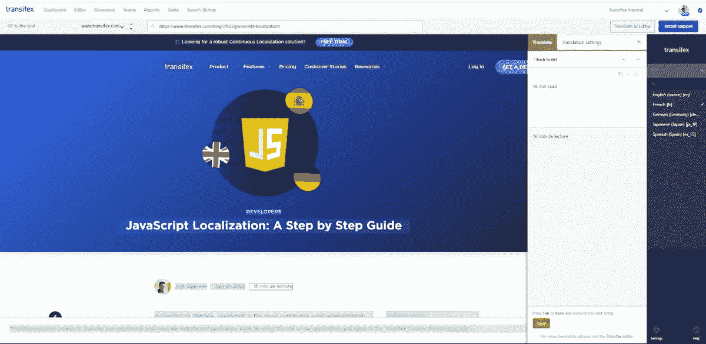

# 营销人员国际搜索引擎优化指南

> 原文：<https://medium.com/geekculture/international-seo-guide-for-marketers-92f8865abbf?source=collection_archive---------16----------------------->

与使用单一语言发布内容相比，国际 SEO 有其自身的挑战。如果你不考虑这些挑战，无论你的内容有多好，有多少反向链接，你都有可能排名不上。

这意味着你会失去大量的有机交通。更准确地说，只有 [25.9%的互联网用户使用英语，](https://www.statista.com/statistics/262946/share-of-the-most-common-languages-on-the-internet/) 76%的互联网用户更喜欢购买带有母语信息的产品， [40%的人从不从其他语言的网站购买](https://www.transifex.com/resources/localization-roi-by-the-numbers/)。

这就是为什么糟糕的[网站本地化](https://www.transifex.com/blog/2022/website-localization/)和国际 SEO 实践会让你错过很多客户。以下是正确的做法！

# 什么是国际 SEO？

SEO(搜索引擎优化)就是你采取必要的步骤来增加你在谷歌搜索结果中排名的几率。

英语内容可以在多个地区排名，假设这些地区的人用英语搜索他们的需求。

例如，我们关于[什么是本地化](https://www.transifex.com/blog/2021/what-is-localization/)的文章在 20 多个国家排名。这部分是因为它是如此受欢迎的关键字。你肯定会有人用英语搜索它，即使那不是他们的母语。

但是如果你想给那些用母语搜索的人排名呢？嗯，这就是国际 SEO 的用武之地！

顾名思义，国际搜索引擎优化是所有关于搜索引擎优化，但内容，可在多种语言。

事情是这样的，国际 SEO 带来了一些额外的挑战，在你收获劳动成果之前，你需要解决这些挑战。

# 何时不关注国际 SEO

国际 SEO 是伟大的，但也不是每个人都适合。

如果您的服务只在本地可用，那么本地化您的内容就没有意义。因为当你的新网站访问者进来的时候，他们只会失望，当他们意识到他们找到的解决方案对他们来说是不可用的。

在这种情况下，首先，通过扩展您的业务并使其适用于其他地区，然后您可以开始投资本地化和国际 SEO。

# 国际 SEO 的重要性

国际搜索引擎优化是有机发展你的业务的好方法。另外，如果你的竞争对手没有在这方面努力，这意味着你将以相对较低的投资获得竞争优势。

最后但同样重要的是，您可以使用国际 SEO 来最大化您现有内容和本地化的结果。

# 循序渐进的国际搜索引擎优化指南

# 1.受众定位

用多种语言创建内容并对其进行优化会很快变得昂贵。在每个地区都这样做，包括那些对你的服务不感兴趣的地区，并不是最大的投资。

相反，从那些已经对你的内容和业务表现出兴趣的地区开始。为他们创造国际搜索引擎优化友好的内容是增加你的有机流量和客户的可靠方法。

看看谁是你的竞争对手的目标，也会给你更多的洞察力。你可以使用诸如 [Ahrefs](https://ahrefs.com/) 或 [ScreamingFrog](http://screamingfrog.com) 这样的工具，或者你也可以使用 [VPN](https://nordvpn.com/) 来查看其他地区得到的结果。

然后，你可以通过问自己以下问题找到更多的受众:

*   人们如何以及在哪里寻找我提供的解决方案？(关键词研究)
*   谁可能对我的服务感兴趣？(受众定位)
*   我怎样才能最有效地为他们优化我的网站？(本地化)

# 2.关键词研究和本地化

本地化和国际 SEO 不仅仅是翻译你现有的内容。而是为各个地区创造最佳体验。

如何做到这一点取决于你的目标地区和你的产品或服务的种类。

如果你提供的软件即服务(SaaS)解决方案是国际通用的，你只需要翻译你的页面和博客文章，并遵循最佳的国际 SEO 实践，就可以在其他地区使用。

但是如果你提供的东西需要在一个地方的实体存在，你也必须考虑用户。

例如，如果一个当地人搜索你当地的生意，也许他们想知道你营业的时间。但是如果有人在另一个地区做，也许他们想知道你做什么，你的服务何时对他们可用。

对于这个例子，关键词可能是相同的，但是用户意图是不同的，所以你需要的内容也是不同的。

# 3.URL 结构

规划阶段结束后，下一步是决定你的网站要使用什么样的 URL 结构。

看，当涉及到国际网站时，通常有 4 种 URL 结构可以使用:

1.  通用顶级域名(gTLD)
2.  国家代码顶级域名(ccTLD)
3.  子目录
4.  子域

> 谷歌非常聪明地判断出哪种语言版本的页面适合向不同的用户显示。当同一种语言的一个页面有多个版本时，Hreflang 真的很有用，例如针对英国和美国观众的英语，其中存在很小的区域差异。这些页面可能在内容上非常相似，被视为重复的，并且为了索引而折叠在一起。Hreflang 帮助 Google 理解这些页面之间的关系，并在 SERPs 中为用户显示合适的版本。ScreamingFrog 的联合创始人丹·夏普

每个选项都有优点和缺点。简而言之，对于大多数人来说，带子目录的 gTLDs 提供了易用性、费用和结果之间的最佳解决方案。

另一方面，对于那些有预算建立新网站的人来说，ccTLDs 是最好的选择。不要忘记，一个新的网站也需要你为它建立权威，这样它才会排名，这意味着你将再次获得流量，反向链接等。

以下是关于它们的更深入的信息。

## 通用顶级域名(gTLD)

通用顶级域名是指我们所知的大多数网站，如 example.com、example.org 等。

这种 URL 结构的好处是，你不局限于任何特定的地区。世界上任何一个国家的任何人用英语搜索一个关键词，都可以通过这个网址找到你。

当然，假设你的内容是 SEO 优化的，谷歌认为它值得排名，这就是不管你的 URL 结构如何。

不利的一面是，你可能会比其他选择的流量更少。毕竟，这种 URL 结构并不是针对任何特定地区进行优化的。所以，你错过了喜欢本地域名的潜在访问者。

## 国家代码顶级域名(ccTLD)

国家代码顶级域名是指以国家代码结尾的网站。例如:

1.  示例. de(德国)
2.  Example.co.uk(英国)

这些域名在它们的目标地区表现更好，因为搜索引擎和用户都更喜欢它们。如果你正在全世界建立类似电子商务的东西，这可能是最好的 URL 结构。

亚马逊是利用这种结构的最受欢迎的商店之一。

但是尽管如此，ccTLDs 最大的缺点是你需要单独的网站。谷歌将本地化版本视为全新网站的问题是，你必须从头开始为它建立权威。

## 子目录

子目录会在您网站的 URL (Example.com/de/)顶部添加国家代码。

这告诉搜索引擎你的网站和内容的目标区域，而没有为一个全新的网站建立权威的缺点。

托曼就是一个很好的例子。如果你从另一个国家浏览他们的网上商店，你得到的是:thomann.de/gr/，而不是:thomann.gr/.

但是这种方法的缺点是一些本地人可能更喜欢本地的 ccTLD 域名。

## 子域

使用子域是 gTLD 和 ccTLD 的结合。典型的子域看起来像:de.example.com。

这很容易设置，而且可以完成工作。

然而，搜索引擎仍然像对待不同的网站一样对待子域，这意味着你必须为你创建的每个子域建立权威。

此外，对于最终用户来说，这是最令人困惑的结构。我们大多数人会开始输入 www 或我们想要访问的网站的名称。所以，开头很容易漏掉国家代码。

# 4.使用 hreflang 标签启用国际索引

如果你有一个国际搜索引擎优化计划，你知道你想使用什么领域，接下来要记住的是你如何让搜索引擎抓取你的国际内容。

看，谷歌需要一种方法来知道你的内容是针对什么语言和地区的。你主要可以用 hreflang 标签来实现。

hreflang 标记是您应该添加到页面中的一段 HTML 代码，它为爬虫提供了所需的信息。或者更准确地说，爬虫看到你翻译的内容，它可以理解源语言最初是什么。

例如:

<link rel="”alternate”" href="”http://example.com/fr&quot;" hreflang="”fr-fr”/">

这段代码将爬虫指向页面的替代法语版本。更具体地说，这是您向爬虫“解释”的内容:

*   link rel ="alternate ":这是另一个页面的替代版本
*   hreflang="example.com ":这是您可以找到原始页面的地方
*   hreflang="fr-fr"/>:这是此页面用于此区域的语言

别忘了语言和地区是不一样的。你可以用法语来形容法国，也可以用法语来形容加拿大。因此，如果您想指出该页面是法语的，但是对于加拿大观众，您必须修改 hreflang，如下所示:

<link rel="”alternate”" href="”http://example.com/fr&quot;" hreflang="”fr-ca”/">

您可以在 HTTP 头、XML 站点地图或 HTML 的部分包含 hreflang。

确保引用页面本身及其翻译版本，并使用规范的链接。

# 5.本地化/翻译入门

现在您有了一个计划，并且知道如何实施它，您还需要合适的工具来尽可能高效、经济地管理您的内容。你需要一个[翻译管理系统](https://www.transifex.com/blog/2021/what-is-a-translation-management-system/) (TMS)。

一个现代化的 TMS 不仅仅是管理你的内容和你的团队。你还需要它来集成软件，如 [WordPress](https://www.transifex.com/integrations/wordpress/) 、Figma、Sketch、Slack 等等。

如果您希望无缝地使用多种工具和团队，同时使整体管理更加容易，那么这些集成是必要的。例如，考虑如何使用 Figma 从设计阶段开始本地化。

更不用说它让您可以使用其他方式无法使用的工具，例如不需要开发人员参与设置的实时编辑器。

你可以用它来预览你正在翻译的内容，以及本地化完成后的效果。

更不用说你可以用它来摆脱管理大量的文件和/或电子表格。本指南中关于[网站 TMS 本地化的更多信息。](https://www.transifex.com/blog/2022/website-localization/)

# 专业提示

在总结之前，让我们添加一些需要记住的实践:

*   优化你的目标关键字的网址
*   不要指望用[机器翻译](https://www.transifex.com/blog/2021/what-is-machine-translation/)来主导竞争。翻译是有帮助的，但是翻译是唯一能够提供高质量本地化的人
*   避免自动重定向。允许你的听众选择他们自己想要的语言。有些人更喜欢用英语浏览，而不是他们的母语
*   你仍然需要为有反向链接和流量的翻译页面建立权威，特别是如果你为每个地区使用一个新的域名
*   如果你正在使用类似于 [Transifex Live](https://docs.transifex.com/live/introduction) 的东西，考虑安装 [Prerender](https://github.com/prerender/prerender) 来用 HTML 呈现你的 JavaScript 翻译的页面。SEO 专家仍然不确定这是否必要，但是安全总比后悔好

# 包扎

总结本指南，以下是你必须为国际 SEO 做的最重要的事情:

1.  锁定最适合你的公司和网站的受众
2.  不要简单地翻译你的内容。做关键词研究，了解其他地区如何搜索你的品牌或产品
3.  根据您的需求使用最佳的 URL 结构
4.  使用 hreflang 标记启用国际索引
5.  使用强大的[本地化工具](https://www.transifex.com/blog/2022/localization-tools/)更有效地进行本地化

本指南最初发布于本页。