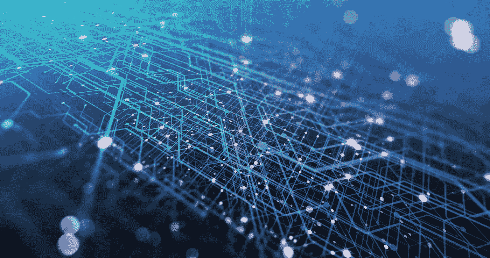

# 互联网计算机:Web App 分散式数据库架构

> 原文：<https://medium.com/geekculture/internet-computer-web-app-decentralized-database-architecture-8647d1a437b8?source=collection_archive---------10----------------------->

## 一种在网络计算机上实现 web 应用程序数据持久化的方法。

我们正在开发一个概念验证，将我们的网络应用程序 [DeckDeckGo](https://deckdeckgo.com/) 移植到[有限公司](https://dfinity.org/)的互联网计算机上。