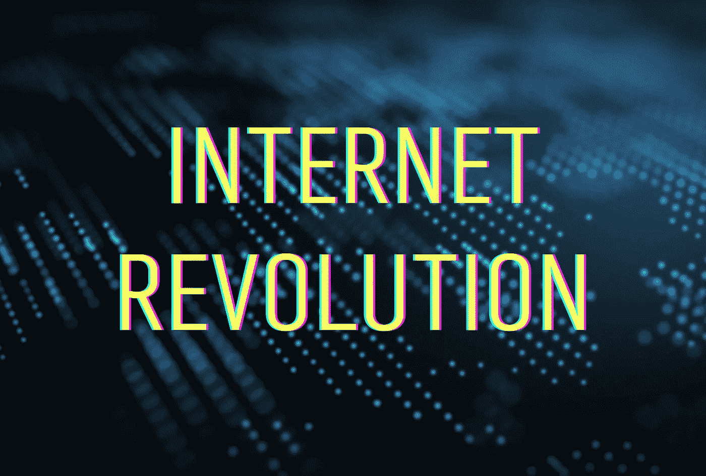
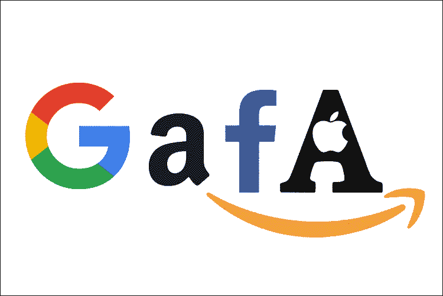
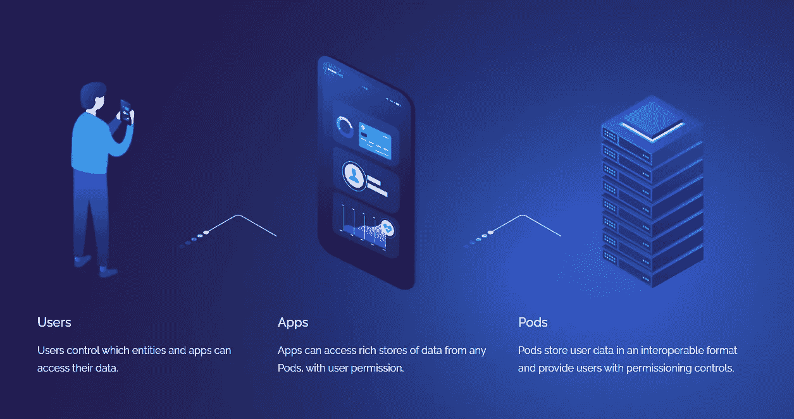

# 互联网革命:语义网如何拯救我们的隐私

> 原文：<https://medium.com/geekculture/internet-revolution-how-a-semantic-web-could-save-our-privacy-46aa954b9b72?source=collection_archive---------19----------------------->

## 自由，平等，互联网！

他真的打算用一种有点滑稽的文字游戏来开始一篇关于一项极其重要且具有颠覆性的技术的文章吗？

是的，绝对的。本文将深入探讨个人网络安全、数据容器、互联网的去中心化和寿司。
关于这一点:除了糟糕的双关语，还有更好的方式来表彰万维网的开创性发明吗？我不这么认为。

让我们从头开始。抓紧你的办公椅或智能手机，它会变得很辣。

# **什么是语义网？**

语义网也叫 **Web 3.0** 。这个术语是由臭名昭著的万维网发明者蒂姆·伯纳斯·李创造的。语义代表单词、短语或文本之间的意义和关系。当互联网刚出现时，它的设计初衷并不是教计算机它们所显示的信息到底意味着什么。随着 Berners-Lee 对语义网的展望，这种情况发生了变化。

它是一种将存储在万维网上的数据结构化的技术，使其可供程序和软件使用。这可以通过基于**图的** **元数据**的系统来实现。

元什么？元数据。描述其他数据的数据。大塘岭？对不起，这是最后一次了，我保证。 )
元数据包含关键信息，如内容描述、关键字和标签，使它们成为机器可读的。这已经在搜索引擎优化中发挥了巨大的作用。以[schema.org](http://schema.org/)为例。

在这种情况下，元数据存储在资源描述框架(RDF)中。文本可以分解成主语、谓语和宾语，以建立术语之间的关系网络。

# 语义网如何改变我们的互联网体验？

作为人类，我们自然理解这些话背后的含义。反正大部分时间都是。电脑不会。有了语义网，机器也可以理解数据背后的含义。

如果计算机能识别网页上的内容，它们就能了解用户感兴趣的内容，并主动而不仅仅是被动地获取相关信息。

像谷歌这样的搜索引擎今天的工作方式只是理论上可能的一小部分。

想象一下:你正计划和你的另一半共度一个美好的夜晚。你的伴侣想看一部恐怖片，而你非常想吃美味的寿司。

Photo by [Andraz Lazic](https://unsplash.com/@andrazlazic?utm_source=medium&utm_medium=referral) on [Unsplash](https://unsplash.com?utm_source=medium&utm_medium=referral)

你在搜索引擎中准确地提出这个要求，然后根据你的位置、最近的电影院和基于社交媒体评论推荐的日本餐馆，得到个性化的答案。餐馆的菜单甚至可以通过 3D 图形显示出来。

但是不仅仅是搜索引擎可以从语义网中受益。知识图表、机器学习和人工智能确实可以拯救生命。
医疗保健行业可以通过提供疾病预警信号而受益匪浅。利用患者数据，疾病甚至可以在出现之前就得到预防治疗。

# **蒂姆·伯纳斯·李如何拯救我们的隐私**

蒂姆·伯纳斯·李(Tim Berners Lee)在欧洲粒子物理研究所(CERN)工作期间，发明了互联网、第一个网络浏览器和 HTML，从而塑造了我们星球的未来。他对互联网的愿景是赋予用户权力和去中心化。一个所有人都可以免费获取信息的地方。

有一段时间，万维网就是这个地方。时下？没有那么多。

Tech giant monopolies contradict Berners Lee’s original vision of the Internet.

谷歌、亚马逊、脸书、苹果和微软等科技巨头垄断并控制、买卖个人数据。这些公司如此强大的原因可以归结为网络效应。如果数据数量巨大，那么它的价值是难以置信的。

像脸书这样的社交平台是这个领域最大的玩家，因此获得越来越多的用户，因为几乎每个人和他们的祖母都在那里。

用户越多，数据越多，产生更好服务的可能性就越大。这是一个恶性循环。这造成了垄断和集权。

互联网最初的愿景正被产生回音室和断开人们联系的算法引向荒谬。

如果我们把蒂姆·伯纳斯·李视为互联网之父，那么今天的网络将是一个正处于青春期的少年。技术上聪明，内心善良，但是容易操纵，走向错误的方向。

# **有什么办法可以对抗？**

Berners Lee 目前正在从事一个名为 Solid 的开源项目，旨在将数据主权归还给用户。Solid(社交关联数据)希望通过“pods”(个人在线数据存储)来恢复我们的隐私。

注意:数据舱不是《星球大战》中的交通工具。那些是赛车，年轻的学徒。(哎呀，我又做了一次，我甚至不感到抱歉。)

With Solid, data can be stored in so-called pods. © Inrupt

豆荚基本上是个人数据保险箱。固体就像一个储存豆荚的银行。它们由用户拥有和控制，而不是转移到数字平台。

一个关键特征是我们允许收集、分析、存储、拥有和使用的个人数据的自主决定。

然后，公司可以请求访问这些豆荚，这些豆荚可以被接受或拒绝。存储在 pod 中的数据不能被提取或出售——用户始终处于控制之中。

Sir Tim Berners Lee on his company Solid

你可能会想:“这听起来很棒，我们什么时候可以使用它？现在就革命！”嗯，没那么容易。Web 3.0、人工智能和 project Solid 仍处于起步阶段。此外，科技巨头不会放弃他们的垄断和权力。还有许多障碍要克服。

蒂姆·伯纳斯·李认为网络面临三大挑战

*   夺回对我们个人数据的控制权
*   防止错误信息的传播
*   政治广告透明度的实现

这个给我们带来万维网*(因此也带来了维基百科、社交媒体和便便脸表情符号)*的人会再做一次，为一个真正去中心化的互联网彻底改革他自己的工作吗？我们还不知道，但是为了更好的明天而奋斗总是值得的。

*关于语义网的更多信息，蒂姆·伯纳斯·李和 Solid:*

> [*https://www . Reuters . com/article/us-tech-bernerslee-interview/father-of-the-web-Tim-berners-lee-prepares-do-over-iduskbn 29 h1 JK*](https://www.reuters.com/article/us-tech-bernerslee-interview/father-of-the-web-tim-berners-lee-prepares-do-over-idUSKBN29H1JK)
> 
> [*https://Ruben . verborgh . org/articles/re decorification-the-web/*](https://ruben.verborgh.org/articles/redecentralizing-the-web/)
> 
> [*https://the conversation . com/Tim-berners-lees-plan-to-save-the-internet-give-us-back-control-of-our-data-154130*](https://theconversation.com/tim-berners-lees-plan-to-save-the-internet-give-us-back-control-of-our-data-154130)
> 
> [*https://solid.mit.edu/*](https://solid.mit.edu/)

*德语文章:*

> [*https://blog.hubspot.de/marketing/semantic-web*](https://blog.hubspot.de/marketing/semantic-web)
> 
> [*https://semantisches-web . net/technologie n/resource-description-framework-rdf/*](https://semantisches-web.net/technologien/resource-description-framework-rdf/)