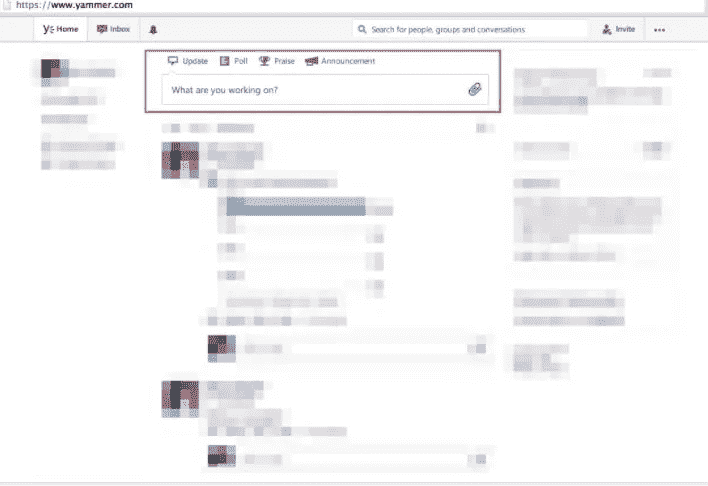
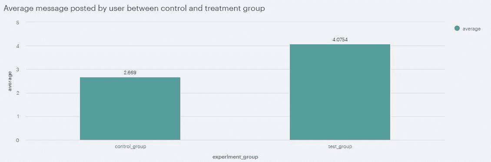
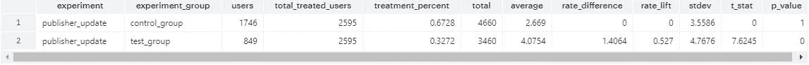
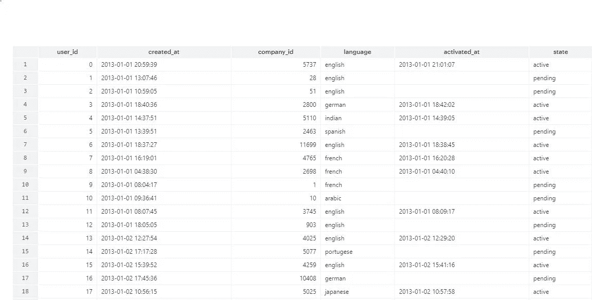
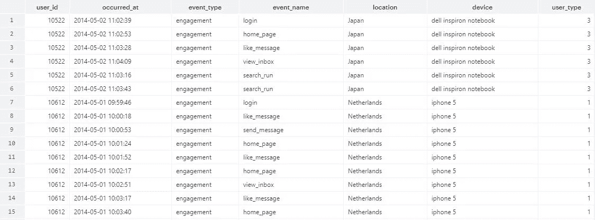
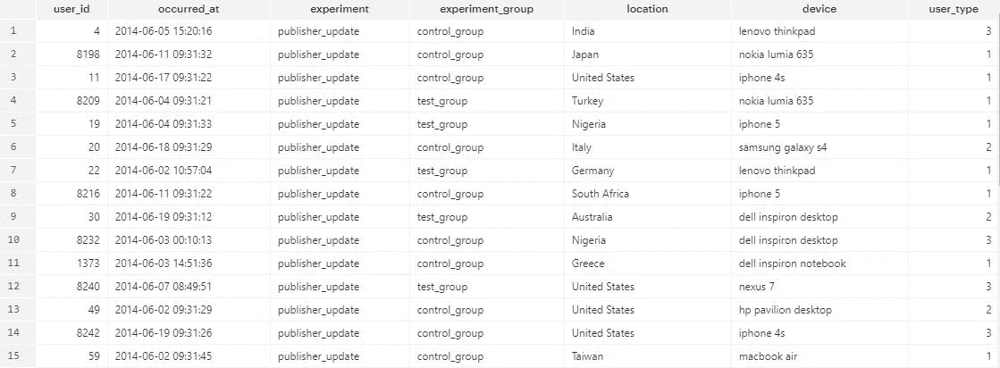
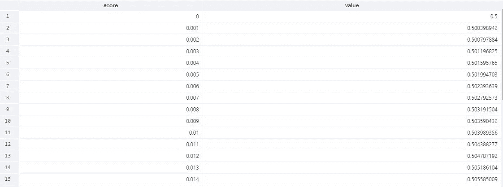
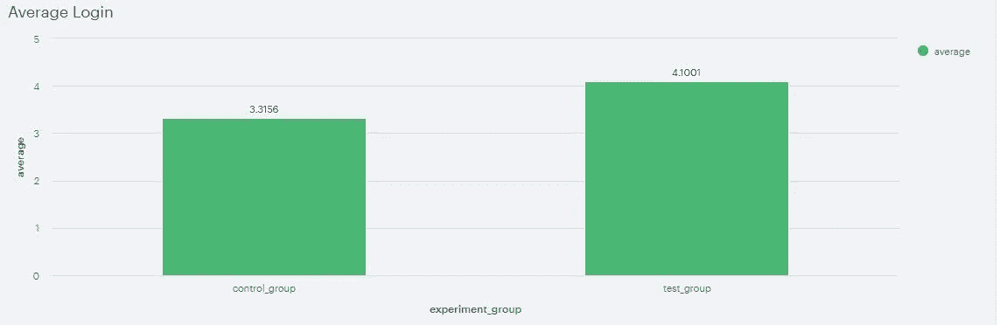
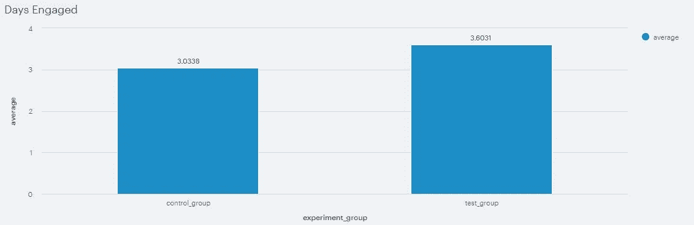
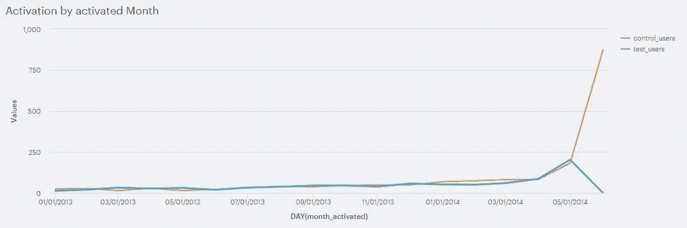

# 通过使用 A/B 测试实验解决业务问题来解释洞察力

> 原文：<https://medium.com/geekculture/interpreting-insights-through-solving-business-problems-using-a-b-testing-experimentation-in-yammer-a8dd4cdd4b78?source=collection_archive---------26----------------------->


Photo by [Smartworks Coworking](https://unsplash.com/@smartworkscoworking?utm_source=medium&utm_medium=referral) on [Unsplash](https://unsplash.com?utm_source=medium&utm_medium=referral)

```
· [Investigating the Data](#062c)
· [Investigate the data](#8713)
· [Validating the results](#6a1f)
· [Thank you for reading!](#9a9f)
```

DATA 到处都是。我们可以通过数据解决很多问题。许多行业不断使用数据来获得可操作的见解，从而为公司带来收入或利润。这些事情表明，数据是公司或企业推动更好决策的重要组成部分。因此，我想举一个社交媒体公司 Y **ammer** 的商业问题。我们将使用保存在 [**模式分析工作室**](https://mode.com/) 中的 Yammer 数据集

[](https://mode.com/) [## 协作数据科学平台|模式

### 52%的财富 500 强公司依赖 Mode 进行快速的探索性分析。向 Lyft 请求演示课程…

mode.com](https://mode.com/) 

为了让我们更容易拉数据。Yammer 是一个与同事交流的社交网络。在这个应用程序中，个人可以通过在组中发布来共享文档、更新和想法。Yammer 可以无限期免费使用，但如果公司希望获得管理控制，包括与 ActiveDirectory 等用户管理系统的集成，则必须支付许可费。他们有集中的分析团队，专注于提供工具和教育，使 Yammer 内的其他团队更有效地使用数据。

Yammer 分析哲学是不断考虑每个项目的价值，如选择优先考虑哪些项目，如何根据核心参与度、保留率和增长指标评估产品分析师。除此之外，我们将进行 A/B 测试，不断向用户推出更好的产品。

# 调查数据

产品团队希望了解即将推出的新功能，它是否会是一个不错的功能，或者在向公众推出之前需要一些改进。



Yammer interface

你可以看到图片显示检查 Yammer 的公共核心界面的改进，在用户输入消息的提要的顶部。产品团队从 6 月 1 日**到 6 月 30 日**进行了 A/B 测试。一些登录 Yammers 的用户看到的是发布者的旧版本，称为**控制组**，而其他用户看到的是后端站点**上随机出现的新版本，称为**处理组**。**7 月 1 日，作为 yammer analytics 的产品分析师，你通过数据库中收集的数据得出了这个图表，显示在新版本/治疗组中，消息发布量 ***比*** 高 50 %，这是治疗组中的巨大增加，如下图所示。



# **调查数据**

作为 Yammer Analytics 的产品分析师，您拿出这个图表向产品团队展示。在深入研究这一结果对公众发布与否的影响之前，我们将尝试使用 A/B 测试实验来证明这一治疗组效应对用户发布行为的影响。我们将尝试检查可能出现的假设，如下所示:


Photo by [Andres Siimon](https://unsplash.com/@johnmcclane?utm_source=medium&utm_medium=referral) on [Unsplash](https://unsplash.com?utm_source=medium&utm_medium=referral)

1.  **新奇效应**是指用户倾向于欢迎新功能，这使得经常发帖的用户比例更高。
2.  **对照组和治疗组之间的干扰**意味着我们预期这两组之间的分裂是随机分裂的，没有干扰，但有时这种假设不成立，并且在分裂数据时，社交网络问题的用户之间存在干扰，称为**社交网络**。理想情况下，我们应该让用户保持独立，不干涉理想的实验。这些事情可能会导致更多的用户比对照组发布更多的帖子。
3.  **度量不相关或不正确**为控制组接收大量流量。例如，一个更大的按钮发布新的消息会影响用户发布的方式吗？。比例度量的选择可能很棘手，以使实验能够与要解决的现实世界问题相关联。
4.  **测试统计的计算不正确**可能是我们的结果也会出错的信号。使用了许多统计方法，人们思考具体统计方法的方式可能会做出错误的计算。

在估计了影响用户参与度下降的几个因素后，我们将尝试调查由 4 个表组成的数据，如用户表、事件表、实验表和正态分布表。

这些是在[模式分析](https://app.mode.com/yammer_problems/reports/3ee3cdd80a45)中捕获并运行的表格的一些摘要，您可以在这里查看表格[的详细信息。](https://mode.com/sql-tutorial/validating-ab-test-results/)



**Table 1\. Yammer_Users**

> Yammer_users 表由几列组成，如 user_id、created_at、company_id、language、activated_at 和 state。



**Table 2\. Yammer_Events**

> Yammer_events 表由几列组成，如 user_id、occured_at、event_type、event_name、location、device 和 user_type。



**Table 2\. Yammer_Experiments**

> Yammer_emails 表由几列组成，如 user_id、occured_at、action 和 user_type。



> Yammer_normaldistribution 表由分数和值等几列组成。

# **验证结果**

根据我们对治疗组比例高出 50%的原因做出的一些假设，我们将尝试绘制一些能够代表这些因素的图表，以及我们可以采取的一些行动来支持我们的假设，作为我们对产品团队的建议。您可以在 Mode Analytics Studio 的这个[报告](https://app.mode.com/yammer_problems/reports/3ee3cdd80a45)中看到完整的 PostgreSQL 查询。

1.  用户发布的平均消息数



> 确定 Yammer 核心价值的指标之一是登录频率。我们可以看到每个用户的平均登录次数。图表显示，每个用户的平均登录次数增加了，这表明用户不仅发送了更多的帖子，而且还登录了 Yammer。



> 当用户希望更多地了解 yammer 功能并与同事一起参与社交网络时，控制组和治疗组之间的平均登录显示出良好的平衡。这也表明应用程序中没有登录问题/错误(快速登录/注销)。



> 该图表显示了现有用户和新用户已经相互干扰到同一个组中。这意味着一月份注册的用户很可能与测试结束前一天注册的用户是同一批用户。在用户分离的情况下，最好创建一个群组用户。这将是一个很好的比较，也可以测试新颖性效果(如上所述)。


> 该图表显示，控制组中的用户比现有用户有更少的发布时间。这个错误会导致偏见，最好以忽略新用户的方式来分析治疗组。

我们已经确定了一些地块来支持我们的假设，并且通过查询数据有许多可能性可以探索。你可以通过[课程](https://mode.com/sql-tutorial/validating-ab-test-results/)进行探索。我们可以根据一些图得出结论，因为我们的指标显示，交互作用可能通过一些干扰和组(对照组和治疗组)之间不独立的用户发生，这些干扰和用户可能会影响治疗组中发布更多帖子的 50%以上用户的结果。然而，我们可以根据一些细分来隔离控制组和治疗组中的用户，如设备使用，用户类型使用，如**内容制作者与读者**，以避免错误并获得更好的结果。

**您可以在** [**模式分析工作室**](https://app.mode.com/yammer_problems/reports/3ee3cdd80a45/viz/64e39d1b137d)**[**pdf 格式**](https://drive.google.com/file/d/1mU0ekx4w4_GOV-WWOgiII1djT7Q4Uj1l/view?usp=sharing) **中查看完整结果。****

**参考资料，并考虑作为附加信息阅读:**

1.  **[构建您的客户想要的应用程序:使用亚马逊 A/B 测试服务进行测试](https://developer.amazon.com/blogs/appstore/post/Tx1LQCDHYPY8DRJ/build-the-app-your-customers-want-beta-test-with-amazon-a-b-testing-service)**
2.  **[A/B 测试中的统计方法计算](https://www.evanmiller.org/index.html)**
3.  **[使用 A/B 测试来衡量亚马逊个性化服务产生的推荐效果](https://aws.amazon.com/blogs/machine-learning/using-a-b-testing-to-measure-the-efficacy-of-recommendations-generated-by-amazon-personalize/)**
4.  **[Udacity A/B 测试免费课程](https://www.udacity.com/course/ab-testing--ud257)**
5.  **[模式分析工作室 Yammer 中的 A/B 测试报告](https://app.mode.com/yammer_problems/reports/3ee3cdd80a45)**
6.  **[学生的 t 检验](https://en.wikipedia.org/wiki/Student's_t-test)**
7.  **[值得信赖的在线控制实验:A/B 测试实用指南](https://www.amazon.com/Trustworthy-Online-Controlled-Experiments-Practical/dp/1108724264)**

# **感谢您的阅读！**

**我真的很感激！🤗*如果你喜欢这个帖子并且想看更多，可以考虑* [***关注我***](https://naiborhujosua.medium.com/) *。我发布与机器学习和深度学习相关的主题。我尽量让我的帖子简单而精确，总是提供可视化和模拟。***