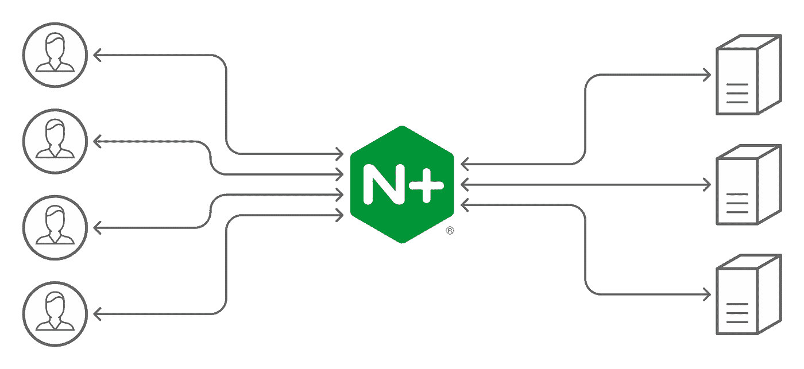
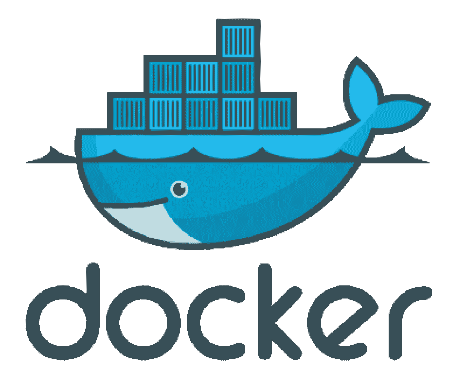

# 面试问答系列—第一部分

> 原文：<https://medium.com/geekculture/interview-question-and-answer-series-part-i-9bde48309828?source=collection_archive---------26----------------------->

本博客系列旨在关注以下职位的面试问题:

*   **数据科学家**
*   **NLP 工程师**
*   **ML 工程师**
*   **数据分析师**


Photo by [Towfiqu barbhuiya](https://unsplash.com/@towfiqu999999?utm_source=medium&utm_medium=referral) on [Unsplash](https://unsplash.com?utm_source=medium&utm_medium=referral)

# **1。拥抱脸:**


image by author

拥抱脸不是一个表情符号，而是一个自然语言处理库，它有以下生态系统:

*   **变形金刚**

> Transformers 中提供了数千个预先训练好的模型，以各种形式执行工作，包括文本、视觉和音频。
> 这些模型可用于多种情况，包括:
> 
> 📝100 多种语言的文本，用于文本分类、信息提取、问题回答、摘要、翻译和文本制作等任务。
> 🖼️图像分类、对象识别和分割都是需要图像的任务。
> 🗣️For 任务如语音识别和音频分类，使用音频。
> 
> 表格问答、光学字符识别、从扫描文档中提取信息、视频分类和视觉问答都是 transformer 模型可以处理的任务。
> 
> Transformers 提供的 API 允许您在任何文本上快速下载和使用预先训练的模型，在您自己的数据集上对它们进行微调，然后在我们的模型中心与社区共享它们。同时，每一个指定架构的 python 模块都是完全独立的，并且可以更新以允许短期的研究实验。
> 
> Transformers 由三个最著名的深度学习库支撑:Jax、PyTorch 和 TensorFlow，所有这些库都无缝集成。用一个模型训练你的模型，然后用另一个模型进行推理，这很简单。

*   **数据集**

> Datasets 是一个小型库，有两个主要特性:一行数据加载器，用于各种公共数据集和快速数据预处理。
> 
> 数据集还包括+15 个评估指标，旨在简化社区贡献和共享其他数据集和指标的工作。

*   **记号赋予器**

> 提供了当今最流行的令牌化器的工作实现，重点是速度和灵活性。
> 
> **特点:**
> 使用当今最流行的分词器，对新词汇进行分词和训练。
> 由于 Rust 的实现，训练和标记化都非常快。在服务器的 CPU 上，对一 GB 的文本进行标记不到 20 秒。
> 
> 使用起来很简单，但适应性也很强。
> 
> 它是为研究和生产而制造的。
> 
> 对齐跟踪伴随着标准化。获得对应于特定标记的原始句子部分总是可行的。
> 
> 执行所有预处理:截断、填充和添加模型需要的任何附加标记。

*   **加速**

> Accelerate 是为 PyTorch 用户构建的，他们喜欢编写 PyTorch 模型的训练循环，但对编写和维护使用多 GPU/TPU/fp16 所需的样板代码犹豫不决。
> 
> Accelerate 只封装与多 GPU/TPU/fp16 相关的样板代码，其余代码不做修改。
> Accelerate 甚至可以为你放置你的小工具(这需要对你的代码做一些修改，但总体来说更安全)。
> Accelerate 还包括一个命令行界面(CLI ),您可以使用它在运行脚本之前快速配置和测试您的培训环境。
> 
> 使用 DeepSpeed，Accelerate 可以在一个或多个 GPU 上训练。

*   **敲打敲打**

> 通过增加两行代码，您可以在训练完成时或者在整个过程中训练崩溃时得到一条消息。
> 
> 在训练深度学习模型时，通常采用早期暂停。很难预测培训何时结束，即使有一个大概的估计。因此，设置自动培训通知可能是值得的。如果你的训练由于不可预见的情况而在过程中失败，得到警告也是有用的。

# **2。T5 —“文本到文本转换转换器”型号**


Photo by [nadi borodina](https://unsplash.com/@borodinanadi?utm_source=medium&utm_medium=referral) on [Unsplash](https://unsplash.com?utm_source=medium&utm_medium=referral)

> 核心概念是将任何文本处理问题作为“文本到文本”问题来处理，其中文本作为输入，新文本作为输出。先前用于 NLP 任务的统一范例，例如将所有文本问题描绘为问题回答、语言建模或跨度提取任务，已经影响了这种方法。重要的是，文本到文本的框架允许对每个任务应用相同的模型、目标、训练方法和解码过程。
> 
> 我们探索的每一个任务都被设计为输入模型文本，并训练它输出一些目标文本，包括翻译、问题回答和分类。这使我们能够将相同的模型、损失函数、超参数和其他参数应用到广泛的应用中。

# 3.细流

> 创建和共享数据应用程序的最有效方式。在几分钟内，Streamlit 将数据脚本转换为可共享的 web 应用程序。一切都是用 Python 写的。都是免费的。没有要求以前的前端经验。

## 安装 Streamlit

1.  确保您的计算机上安装了 python。
2.  要安装 streamlit，请运行以下命令。

```
pip install streamlit
```

Streamlit 的 Github 库可以在这里找到，以及他们的[文档](https://docs.streamlit.io/en/stable/)。

# 4.FastAPI


Photo by [Douglas Lopes](https://unsplash.com/@douglasamarelo?utm_source=medium&utm_medium=referral) on [Unsplash](https://unsplash.com?utm_source=medium&utm_medium=referral)

[FastAPI](https://fastapi.tiangolo.com/tutorial/) 是一个基于标准 Python 类型提示，使用 Python 3.6+构建 API 的 web 框架，它是最新的、快速的(高性能)。

以下是主要特征:

*   快速:在性能方面与 NodeJS 和 Go 不相上下。
*   市场上最快的 Python 框架之一。
*   将功能开发的速度提高大约 200%到 300%。*
*   直观:强大的编辑帮助。*
*   更少的错误:减少大约 40%的人为(开发人员)相关错误。哪里都有完成。调试花费的时间更少。
*   简单:旨在简单使用和理解。花在阅读文档上的时间更少。
*   简而言之，减少代码重复。每个参数声明都有多个特性。虫子少了。
*   健壮:获得可用于生产的代码。带有自动生成的交互式文档。
*   基于标准:基于(并完全兼容)OpenAPI(以前称为 Swagger)和 JSON Schema open API 标准。
*   基于负责生产应用程序开发的内部开发团队进行的测试的估计

# 5.Nginx —负载平衡器



Load balancer

> 负载平衡是一种很好的技术，可以扩展您的应用程序，同时提高其性能和冗余性。Nginx 是一个流行的 web 服务器软件，可以设置为一个简单而有效的负载平衡器，以提高服务器资源的可用性和效率。
> 
> 跨许多应用程序实例的负载平衡是提高吞吐量、降低延迟和确保容错配置的标准策略。

**选择负载平衡方法**

> NGINX Plus 在 NGINX 开源支持的四个负载平衡机制的基础上增加了两个负载平衡机制:
> 
> 循环调度—考虑到服务器权重，请求在服务器之间均匀分布。默认情况下使用这种方法(无法关闭):

```
upstream backend {
   # no load balancing method is specified for Round Robin
   server backend1.example.com;
   server backend2.example.com;
}
```

> 最少连接数—请求被传送到具有最少活动连接数的服务器，再次考虑服务器权重:

```
upstream backend {
    least_conn;
    server backend1.example.com;
    server backend2.example.com;
}
```

> IP 哈希—客户端 IP 地址用于确定请求发送到的服务器。在这种情况下，使用 IPv4 地址的前三个八位字节或整个 IPv6 地址来计算哈希值。除非服务器不可用，否则这种方法可以确保来自相同地址的请求被路由到相同的服务器。

```
upstream backend {
    ip_hash;
    server backend1.example.com;
    server backend2.example.com;
}
```

> 如果其中一个服务器必须暂时退出负载平衡循环，可以使用 down 选项来指定它，以保留客户端 IP 地址的现有散列。本应由该服务器处理的请求会自动路由到组中的下一个服务器:

```
upstream backend {
    server backend1.example.com;
    server backend2.example.com;
    server backend3.example.com down;
}
```

> 通用哈希—用户定义的关键字，可以是文本字符串、变量或组合，确定请求转发到的服务器。密钥可以是 URI 或耦合的源 IP 地址和端口，如下例所示:

```
upstream backend {
    hash $request_uri consistent;
    server backend1.example.com;
    server backend2.example.com;
}
```

> hash 指令的可选 consistent 参数支持一致的 hash 负载平衡。基于用户定义的散列键值，请求被均匀地分布在所有上游服务器中。当上游服务器被添加到上游组或从上游组中撤销时，只有少数键被重新映射，从而减少了负载平衡高速缓存服务器或其他存储状态的应用程序中的高速缓存未命中。
> 
> 最短时间(仅适用于 NGINX Plus)—对于每个请求，NGINX Plus 会选择平均延迟最短、活动连接最少的服务器，最短的平均延迟取决于使用了以下哪个`least_time`指令参数:

*   `header`–从服务器接收第一个字节的时间
*   `last_byte`–从服务器接收完整响应的时间
*   `last_byte inflight`–从服务器接收完整响应的时间，包括未完成的请求。

```
upstream backend {
    least_time header;
    server backend1.example.com;
    server backend2.example.com;
}
```

> 随机-每个请求将被发送到随机选择的服务器。如果给定两个参数，NGINX 首先随机选择两个服务器，考虑服务器权重，然后使用以下方法选择其中一个服务器:

*   `least_conn`–最少数量的活动连接
*   `least_time=header`(NGINX Plus)–从服务器接收响应头的最短平均时间(`[$upstream_header_time](https://nginx.org/en/docs/http/ngx_http_upstream_module.html#var_upstream_header_time)`)
*   `least_time=last_byte`(NGINX Plus)–从服务器接收完整响应的最短平均时间(`[$upstream_response_time](https://nginx.org/en/docs/http/ngx_http_upstream_module.html#var_upstream_response_time)`)

```
upstream backend {
    random two least_time=last_byte;
    server backend1.example.com;
    server backend2.example.com;
    server backend3.example.com;
    server backend4.example.com;
}
```

> 如果您想提高在线应用程序的性能和可用性，负载平衡器绝对是一个值得考虑的因素。Nginx 是一个健壮的负载平衡 web 服务器，设置起来相当简单。当与一个简单的加密解决方案结合使用时，如 Let's Encrypt client，它将成为您的 web 场的优秀前端。
> 
> 在 nginx.org 查看 [**上游**](https://nginx.org/en/docs/http/ngx_http_upstream_module.html) 文档以了解更多信息。
> 
> 虽然使用许多服务器为您的 web 服务提供了冗余，但是负载平衡器本身仍然可能是一个单点故障。当您在多个负载平衡器之间使用浮动 IP 时，您可以进一步提高高可用性。

# 6.码头工人



> Docker 是一个用于快速开发、测试和部署应用程序的软件平台。Docker 将软件组织到容器中，容器包括软件运行所需的一切，如库、系统工具、代码和运行时。Docker 允许您在任何环境中快速部署和扩展应用程序，同时确保您的代码能够运行。AWS 上的 Docker 为开发人员和管理员提供了一种高度可靠、低成本的方法来构建、发布和运行任何规模的分布式应用。
> 
> Docker 通过给你一个一致的机制来运行你的代码。Docker 是一个容器操作系统。容器虚拟化服务器操作系统的方式与虚拟机虚拟化的方式相同(消除了直接处理服务器硬件的需要)。每台服务器都安装了 Docker，它提供了构建、启动和停止容器的简单命令。
> 
> Docker 允许您更快地发送代码，标准化应用程序操作，无缝地迁移代码，并通过更好地利用资源来节省资金。Docker 给你一个可以在任何地方可靠运行的单一对象。Docker 的易于理解的语法为您提供了完全的控制。因为 Docker 有如此广泛的用途，所以有一个强大的工具和现成的应用程序生态系统，随时可以使用它。

**上述博客主要关注埃森哲询问的 NLP 工程师 Q & A。**

这个博客系列的第二部分将关注不同公司的 NLP 问题和答案。

敬请期待，快乐学习！！