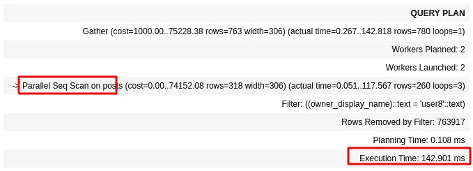
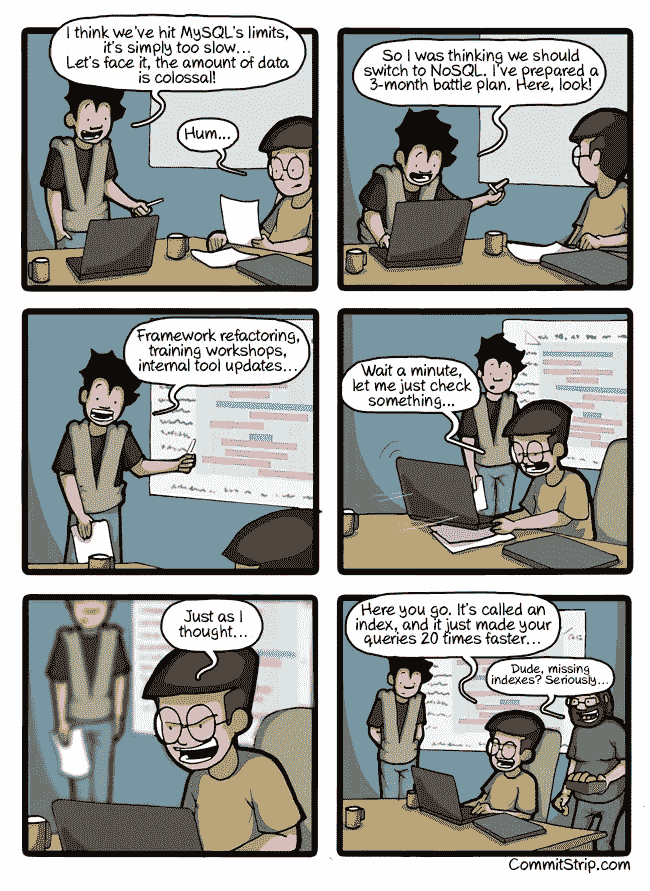
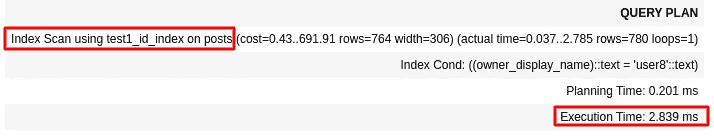
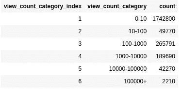
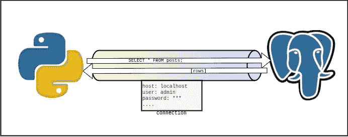
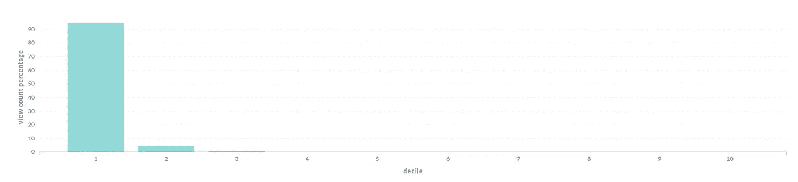
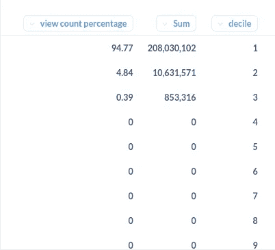
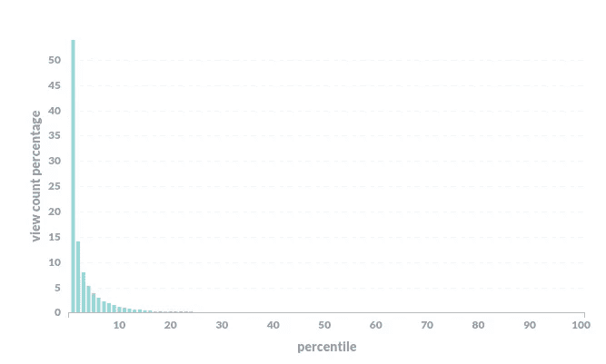
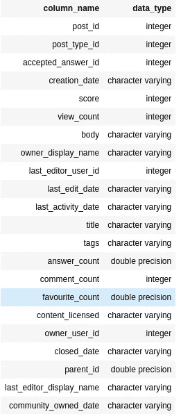
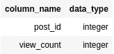

# 面试问题:如何提高数据库的性能

> 原文：<https://medium.com/geekculture/interview-questions-how-to-improve-the-performance-of-your-database-21b42aba352e?source=collection_archive---------1----------------------->


# 介绍

一个有趣的面试问题，我听过并问过很多次，

*“您将如何提高数据库的性能？”*

我喜欢这个问题，因为和我之前讨论的问题一样，它从一个更广阔的角度来衡量候选人的技能。云架构师会考虑数据库的架构，考虑读取副本和分片，后端或全栈工程师可能会考虑应用程序级别的更改，如优化的 SQL 查询、连接池，数据库人员可能会考虑数据库的配置、插件等。

这个问题可能有很多答案，因为我想深入每个答案，我将写三篇独立的帖子，每篇针对某一类答案。

第一篇(这一篇)将更多地讨论应用程序级别和 SQL 变化。这些可能是我对直接编写代码的开发人员的期望(例如，开发人员编写 NodeJS，与数据库服务器交互的 Python 应用程序)。

第二个趋势是更加关注架构级别的变化、托管服务等。他们会更关注云架构师或者对系统设计概念有很好了解的人。

第三组答案更侧重于数据库和操作系统配置。

请记住，这是一个非常广泛的话题，这是我对如何回答这个问题的看法，我将提供进一步阅读的链接，并尝试尽可能多的实际例子。

我还使用了软件工程 stackexchange 数据集作为我的示例，您可以在这里找到。在使用 Pandas 将数据加载到 Postgres 之前，我还做了一些转换和调整，如果你有兴趣了解更多关于它们的信息，请告诉我，我可以分享 jupyter-notebook。这些数据相当容易理解，我的大多数例子应该局限于 Posts 表，它简单地定义了 StackOverflow 上发布的问题，带有诸如`title`、`body`、`creation_date`等属性。

# 这个问题

问题是，*“我的数据库越来越慢，您如何提高它的性能？”*。出于本文的目的，我假设有一个 SQL 数据库，特别是 Postgres。

把这个问题想成一个由两部分组成的问题，即使它没有明确地这样说。第一部分是*为什么*，第二部分是*如何修复*。为了理解*为什么*，你需要调试问题，一旦你知道了为什么数据库性能慢，那么你就可以提出一个可能的解决方案。

为了便于阅读，我从可能的答案开始，涵盖与每个答案相关的权衡，然后我将处理您需要提出的反问题，以调试问题的 *why* 。

在你向下滚动之前，想想你将如何回答这个问题，如果你发现我的帖子中没有的东西，请在评论中告诉我！

# 可能的答案

请记住，每个答案都有取舍。

## 索引

如果您的 SELECT 查询因为检查某个条件而变得非常慢，索引可以提供一种提高数据库读取性能的方法。

您可以在一组特定的列上创建索引，数据库将创建一个数据结构来保存数据库中的这些列，这样您就可以快速查找这些列。

例如，如果我想获取用户`user8`创建的帖子，我可以运行下面的查询—

```
SELECT * FROM posts WHERE owner_display_name='user8';
```

然而，这迫使数据库扫描表中的所有行，以找到其中`owner_display_name`是“user8”的帖子。这种类型的扫描称为顺序扫描，因为数据库正在扫描整个表。顾名思义，这种类型的查找并不是最佳的解决方案。

运行上面的查询，执行大约需要 150 毫秒。该查询的查询计划(数据库为如何读取查询表所做的计划)也表明它将对该查询进行顺序扫描



获得相同结果的更好方法是在列`owner_display_name`上创建一个索引。这将创建一个单独的数据结构，数据库可以使用这个新的数据结构快速查找该列的特定值。

创建索引很简单，

```
CREATE INDEX posts_owner_display_name_idx ON posts (owner_display_name);
```

一旦我们创建了索引，我们不需要做任何其他事情来使用它。数据库足够聪明，知道什么时候使用索引，什么时候不使用。运行相同的查询，

```
SELECT * FROM posts WHERE owner_display_name='user8';
```

我们现在得到完全不同的结果。查询现在大约在 2 毫秒内完成！这比没有索引时快 50 倍！



查询计划还声明数据库现在正在使用我们创建的索引



没有什么是免费的，索引也有一定的成本。

因为我们现在创建了一个不同的数据结构来存储表中的相同数据，所以表中的每一行需要更多的存储空间。除此之外，现在数据库必须确保每当您向表中添加新行时索引都是最新的，因此在写入新行时也增加了数据库的工作量。

索引是修复数据库读取性能的好方法，但可能会降低写入性能。

索引本身是一个复杂的主题，网上有很多资源更深入地讨论了性能影响。如果您想了解更多与索引相关的权衡，这个是一个很好的起点。[如果你想了解更多关于索引的知识，这个](https://www.youtube.com/watch?v=-qNSXK7s7_w)视频还会更详细地解释索引。

## 创建实体化视图

您可以在数据库中创建两种类型的视图，简单视图和物化视图。

虽然简单视图充当查询的别名，但是物化视图存储查询的结果。这意味着您可以预先计算查询，将结果存储在物化视图中，并在用户实际请求时非常快速地向用户显示结果，而不是在用户请求时运行查询。

让我们用一个例子来讨论这个问题。假设我想根据帖子的浏览量了解帖子的类别-



一种方法是运行以下查询

```
SELECT
 CASE
  WHEN view_count < 10 THEN 1
  WHEN view_count < 100 THEN 2
  WHEN view_count < 1000 THEN 3
  WHEN view_count < 10000 THEN 4
  WHEN view_count < 100000 THEN 5
  ELSE 6
 END as view_count_category_index,
 CASE
  WHEN view_count < 10 THEN '0-10'
  WHEN view_count < 100 THEN '10-100'
  WHEN view_count < 1000 THEN '100-1000'
  WHEN view_count < 10000 THEN '1000-10000'
  WHEN view_count < 100000 THEN '10000-100000'
  ELSE '100000+'
 END as view_count_category,
 COUNT(*)
FROM
 posts
GROUP BY view_count_category, view_count_category_index
ORDER BY view_count_category_index ASC;
```

用`EXPLAIN ANALYZE`运行这个命令给我以下输出

```
Execution Time: 257.556 ms
```

250 毫秒比我想要的要高一点。理想情况下，我希望这个值低得多，可能是我们创建查询时的<50ms for example. Creating a view is very simple, I simply need to run 【 . Let’s create a simple(non-materialized) view,

```
CREATE VIEW non_mat_view_count_view AS
SELECT
 CASE
  WHEN view_count < 10 THEN 1
  WHEN view_count < 100 THEN 2
  WHEN view_count < 1000 THEN 3
  WHEN view_count < 10000 THEN 4
  WHEN view_count < 100000 THEN 5
  ELSE 6
 END as view_count_category_index,
 CASE
  WHEN view_count < 10 THEN '0-10'
  WHEN view_count < 100 THEN '10-100'
  WHEN view_count < 1000 THEN '100-1000'
  WHEN view_count < 10000 THEN '1000-10000'
  WHEN view_count < 100000 THEN '10000-100000'
  ELSE '100000+'
 END as view_count_category,
 COUNT(*)
FROM
 posts
GROUP BY view_count_category, view_count_category_index
ORDER BY view_count_category_index ASC;
```

And then try fetching the results from the view,

```
SELECT * FROM non_mat_view_count_view;
```

it does give me the correct output. But when running with 【 , the execution time I get is still pretty similar at 250–260ms. The reason this is happening is that simple views just store the query, and re-execute the query when we try to use the view.

Creating a materialized view, however, is different. Here the materialized view would actually store*结果，当用户请求这个数据时，它不需要计算结果，因为它只需要获取结果，这比执行查询或简单视图要快得多。*

创建一个物化视图与创建一个简单视图非常相似，除了我们使用`CREATE MATERIALIZED VIEW`而不是`CREATE VIEW`。

```
CREATE MATERIALIZED VIEW mat_view_count_view AS
SELECT
 CASE
  WHEN view_count < 10 THEN 1
  WHEN view_count < 100 THEN 2
  WHEN view_count < 1000 THEN 3
  WHEN view_count < 10000 THEN 4
  WHEN view_count < 100000 THEN 5
  ELSE 6
 END as view_count_category_index,
 CASE
  WHEN view_count < 10 THEN '0-10'
  WHEN view_count < 100 THEN '10-100'
  WHEN view_count < 1000 THEN '100-1000'
  WHEN view_count < 10000 THEN '1000-10000'
  WHEN view_count < 100000 THEN '10000-100000'
  ELSE '100000+'
 END as view_count_category,
 COUNT(*)
FROM
 posts
GROUP BY view_count_category, view_count_category_index
ORDER BY view_count_category_index ASC;
```

当我们运行`EXPLAIN ANALYZE SELECT * FROM mat_view_count_view;`时，我们得到的执行时间是 0.027 毫秒。这比执行查询或使用我们旧的简单视图要快得多！事实上，这要快 12000 倍！

然而，这是有代价的。因为结果是预先计算的，所以对表的任何更新都不会自动更新结果。您需要手动运行`REFRESH MATERIALIZED VIEW mat_view_count_view`来刷新视图。如果你想自动化这一点，有许多方法可以做到这一点，正如在[这个堆栈溢出回答](https://stackoverflow.com/questions/29437650/how-can-i-ensure-that-a-materialized-view-is-always-up-to-date)中解释的，但所有这些方法都有一些缺点。不利方面包括数据不一致(例如，用户获取过期的视图计数类别数据)，以及数据库服务器上的性能问题，因为更新视图意味着再次计算该查询，等等。

因此，虽然物化视图是提高读取性能的一个很好的方法，但是它们在写入数据库时会导致性能问题或一致性问题。当数据更新频率较低且轻微的数据不一致或不准确是可以容忍的时候，这种解决方案可能是有意义的。

[这个](https://www.youtube.com/watch?v=kHLIDnA5x3g)也是学习更多关于物化视图的重要资源。

## 应用程序级别的连接池

在我谈论连接池之前，让我解释一下什么是连接。

要连接到数据库，您的应用程序需要建立数据库连接。可以把这个连接想象成一个假想的管道，请求和响应将通过这个管道流动。



您需要数据库主机名、数据库名、凭证等。建立一个新的连接，这个连接有一些相关的数据。我认为维基百科关于联系的文章说得很好，

*“数据库连接是有限且昂贵的，相对于在其上执行的操作而言，创建数据库连接会花费不成比例的长时间。应用程序在需要更新数据库时创建、使用和关闭数据库连接的效率很低。”*

一旦建立了连接，就可以开始向数据库发送请求。大多数数据库只允许您在每个连接上一次执行一个操作。这意味着，如果单个事务需要 100 毫秒才能执行，那么每个连接每秒只能处理 10 个事务(或 10TPS)。因此，使用单一连接会限制您可以运行的事务数量。

所以，让我们回顾一下。我们知道打开和关闭连接是昂贵的，我们也知道我们不能使用单一的连接，因为这将成为我们系统的瓶颈。

那么，有什么解决办法呢？

嗯，我们可以保留一些连接并重用它们。这被称为连接池。想象一个连接池，如果这样更容易记忆的话:P


对我们来说幸运的是，大多数客户端库都很好地配备了连接池，我们可以快速地在代码中编写连接池。

事实上，它是如此的普遍，以至于在文档中的例子是一个非常流行的用于 postgres 的 nodejs 库，它同时提供了连接到数据库的连接池方法和直接客户端方法

我们还可以在数据库服务器上为连接池进行重要的配置，这会影响性能，但是因为我想在另一篇文章中讨论数据库服务器和操作系统的配置，所以我现在就把它放在一边。

说到权衡，我不认为连接池有什么重大的权衡，至少我没有遇到过，也没有读到过。如果你碰巧知道，发表评论来帮助我，也帮助那些会读这篇文章的人。

最后，[如果您想了解更多关于连接池的知识，这个](https://www.youtube.com/watch?v=GTeCtIoV2Tw)是一个很好的起点。

## 应用层缓存

对于许多应用程序来说，大多数读取都只针对少量数据。以 Twitter 为例。大多数被浏览的推文可能是重要和受欢迎的人，如政治家、名人等。类似的趋势可能存在于许多流行的阅读量大的网站上。

事实上，让我们看看目前为止我们一直在处理的数据。请记住，这是来自 softwareengineering.stackexchange.com 的真实交通数据。

为了分析这些数据，我按照 view_count 对数据进行了排序，然后按照十分位数进行分组。简而言之，下图显示了哪个十分位数获得了总浏览量的多少百分比。



数据显示，排名前 10%(前十分位数)的帖子约占 95%的浏览量，排名后 10%(后十分位数)的帖子约占 4.8%的浏览量。



我写的 SQL 有点乱，也不是很重要，但是如果你感兴趣的话，它看起来像这样-

```
SELECT
 (SUM(view_count) * 100.0) / (SELECT SUM(view_count) FROM actual_posts) as percentage,
    SUM(view_count),
    decile
FROM (
    SELECT
        post_id,
        view_count,
        ntile(10) over (order by view_count DESC) as decile
    FROM actual_posts
) sum_data
GROUP BY decile
ORDER BY decile
```

当以百分位数而不是十分位数计算时，浏览量的差异更加明显，前 1%的帖子占了 50%以上的浏览量



这意味着，通过找到一种方法来服务前 1%的帖子，你可以加快 50%的请求速度，或者找到一种方法来服务前 10%的帖子，你可以加快 95%的请求速度！因为这为其他请求释放了您的服务器，所以其他请求也可以使用更多的资源，从而更快！

那么，让我们看看问题陈述，我们需要找到一种方法来存储相对少量的数据，但能够非常快速地获取它。另一方面，我们仍然需要存储其余的数据，但我们不需要超快的检索。

实现这一点的一个很好的方法是将经常读取的少量数据存储在 RAM 中，而将大量数据存储在 SSD 中。通过这种方式，您可以非常快速地满足您收到的大多数请求，并在需要时偶尔访问 SSD。这就是所谓的缓存。

有很多方法可以实现这一点，但是因为我在这篇文章中谈论的是应用程序级别的变化，所以实现这一点的一个简单方法是在应用程序中添加一个简单的 hashmap。请注意，这肯定不是最好的方法，还有其他更好的缓存解决方案，但我将在后面介绍更复杂的解决方案。

想法很简单，在 hashmap 中为经常收到的请求构建一个小的缓存。当用户请求 post 时，检查它是否存在于您的缓存中，如果存在，那么将 post 发送给用户，如果不存在，那么您可以访问您的数据库，将数据存储在 SSD 上。幸运的是，已经有很多库实现了这一点，例如，[这个](https://www.npmjs.com/package/node-cache)。

不过，这也带来了明显的负面影响。

其中一个大问题与数据一致性有关。如果您在 RAM 上存储少量数据，您需要确保在数据库中的数据更新时更新这些数据，这样用户就不会收到过时的数据。这打开了一个蠕虫罐，因为现在您需要决定更新数据的频率，是每分钟、每秒钟、每笔交易等等。

这个解决方案可能带来的另一个问题(虽然这不会带来我们在以后的文章中讨论的其他缓存解决方案)是使您的服务器更加复杂和有状态。终止您的服务器将意味着丢失存储在 RAM 中的数据，而启动新的服务器将意味着从数据库中非常快速地获取大量数据(这被称为[雷群问题](https://en.wikipedia.org/wiki/Thundering_herd_problem))。当一个新的服务器出现时，这个大的读取会使数据库变慢一会儿。

不要担心，这些问题的解决方案是存在的，缓存在许多用例中是一个非常好的通用解决方案，尤其是当数据一致性不成问题时。

## 编写优化的 SQL 查询

在应用程序级别，提高性能的一个好方法是编写优化的 SQL 查询。即使性能不是问题，为将来的可伸缩性编写优化的 SQL 查询仍然是更好的实践。

有相当多的方法可以编写优化的 SQL 查询，例如，试图避免使用`OFFSET`并找到更好的方法来实现分页，或者避免使用`SELECT *`等。网上有很多很棒的资源可以帮助你理解优化的 SQL 查询，例如[这个](https://www.youtube.com/watch?v=2OJazrXmKXA)。

另一个好的组织技巧是编写非物化视图，并在应用级 SQL 中使用它们，而不是长 SQL 语句。

对于那些不知道什么是非物化视图的人来说，可以把它看作是查询的别名。例如，假设我有一个名为`posts`的表。此表具有以下模式-



在大多数情况下，我们会考虑以下几列



比方说，我想编写一个 SQL 查询，根据帖子的浏览量对帖子进行分类，例如，如果我想要这样的输出


对此的疑问是，

```
SELECT
 CASE
  WHEN view_count < 10 THEN 1
  WHEN view_count < 100 THEN 2
  WHEN view_count < 1000 THEN 3
  WHEN view_count < 10000 THEN 4
  WHEN view_count < 100000 THEN 5
  ELSE 6
 END as view_count_category_index,
 CASE
  WHEN view_count < 10 THEN '0-10'
  WHEN view_count < 100 THEN '10-100'
  WHEN view_count < 1000 THEN '100-1000'
  WHEN view_count < 10000 THEN '1000-10000'
  WHEN view_count < 100000 THEN '10000-100000'
  ELSE '100000+'
 END as view_count_category,
 COUNT(*)
FROM
 posts
GROUP BY view_count_category, view_count_category_index
ORDER BY view_count_category_index ASC;
```

这有点复杂。我可以创建一个视图，而不是写在我的代码中，

```
CREATE VIEW view_count_category_view AS
SELECT
 CASE
  WHEN view_count < 10 THEN 1
  WHEN view_count < 100 THEN 2
  WHEN view_count < 1000 THEN 3
  WHEN view_count < 10000 THEN 4
  WHEN view_count < 100000 THEN 5
  ELSE 6
 END as view_count_category_index,
 CASE
  WHEN view_count < 10 THEN '0-10'
  WHEN view_count < 100 THEN '10-100'
  WHEN view_count < 1000 THEN '100-1000'
  WHEN view_count < 10000 THEN '1000-10000'
  WHEN view_count < 100000 THEN '10000-100000'
  ELSE '100000+'
 END as view_count_category,
 COUNT(*)
FROM
 posts
GROUP BY view_count_category, view_count_category_index
ORDER BY view_count_category_index ASC;
```

然后，我可以简单地使用，而不是用代码编写这个 SQL 逻辑

```
SELECT * FROM view_count_category_view
```

当我在上面的视图上执行查询时，数据库将在后台实际执行创建该视图的实际查询。

这使我的代码更整洁，而且在将来，我可以更新视图逻辑，而无需应用程序级别的更改和重新部署。还有另一种实现类似功能的方法叫做[存储过程](https://www.geeksforgeeks.org/what-is-stored-procedures-in-sql/)。

# 回答问题前先反驳

在回答这个问题之前，你通常应该问几个反问题来帮助更好地理解这个问题。这些可以帮助您测量系统中的瓶颈。整个系统可能非常复杂，数据库性能开始下降的原因有很多。为了更好地理解原因，以及更好地理解系统的需求，你可以问面试官几个问题，这些问题可以帮助你找出最佳的解决方案。

由于这一部分需要对上面的答案有所了解，所以我在讨论了可能的答案之后才把它包括进来，但是你可能应该在回答之前问一些反问题。

## 是读性能慢还是写性能慢？

影响您决策的一个非常重要的因素是数据库的读写性能。许多改善其中一个的解决方案也可能对另一个产生负面影响。例如，创建实体化视图会提高读取性能，但会增加数据库服务器的额外负载，从而影响写入性能。

## 我们用的是哪个数据库？

另一个重要因素可能是我们正在使用的数据库。每个数据库都是为特定的用例而构建的。使用错误类型的数据库会严重影响您的性能。

例如，当您想要执行分析查询时，使用 Postgres 这样的关系数据库通常不是一个好的实践。虽然关系数据库可以执行大量的分析功能，但它们在该领域的功能和性能比专门为这些类型的操作(例如 Cassandra 或 Redshift)构建的数据库要有限得多。

许多数据库是为特定的问题而存在的，一般来说，使用它们所处理的问题语句会表现得更好。有用于搜索的数据库(例如 ElasticSearch)、用于地理空间数据的数据库(例如 Neo4J)、用于时间序列数据的数据库(例如 Prometheus)、用于存储临时数据的数据库(例如 Redis 或 Memcached)等。

## 了解用户如何使用您的服务

另一个需要了解的重要因素是用户如何使用你的服务。用户是全天发送请求，还是有特定的高峰时间？

对不准确或过时数据的容忍度是多少(例如，用户通常不会介意帖子上的点赞数最多过期几分钟)？

他们是主要执行读取查询还是主要执行写入操作？

他们存储的数据有多敏感？你需要考虑哪些法规要求？

这些问题可以帮助您了解应该关注什么，是读性能还是写性能，以及您在 ACID 属性方面的灵活性级别。例如，如果用户可以接受过时的数据，那么您可以考虑使用刷新频率相对较低的物化视图。

## 时间表

另一个需要记住的重要因素是解决方案需要多快。这是一个紧急问题，数据库完全无法使用吗？或者是轻微的性能下降，公司希望确保系统的可伸缩性。

# 结论

这是我对如何回答这个问题的看法。我还会谈论更多关于架构方面的事情，以及一些关于配置方面的事情，但我会在另一篇文章中包括这些内容。

感谢你花时间阅读这篇文章，如果你喜欢它，或者觉得它有用，或者有任何其他反馈，请在评论中告诉我。