# 面试问题:提高数据库性能的系统设计解决方案

> 原文：<https://medium.com/geekculture/interview-questions-system-design-solutions-to-improve-database-performance-2d2ce1be8536?source=collection_archive---------1----------------------->

# 介绍

一个有趣的面试问题，我听过并问过很多次，

*“您将如何提高数据库的性能？”*

我已经在我的上一篇文章[这里](/geekculture/interview-questions-how-to-improve-the-performance-of-your-database-21b42aba352e)中讨论了这个问题的应用级答案，这是它的第二部分，但是这篇文章是完全自给自足的，所以你不需要阅读上一篇文章来理解这篇文章。

我喜欢这个问题，因为和我之前讨论的的[问题一样，它从一个更广阔的角度来衡量候选人的技能。云架构师会考虑数据库的架构，考虑读取副本和分片，后端或全栈工程师可能会考虑应用程序级别的更改，如优化的 SQL 查询、游标，而数据库人员可能会考虑数据库的配置、插件等。](/geekculture/interview-questions-why-cant-you-create-a-file-e08f3486a92a)

这个问题可能有很多答案，因为我想深入每个答案，我将写三篇独立的帖子，每篇针对某一类答案。

这一次将更加关注架构级别的变化、托管服务等。他们会更关注云架构师或者对系统设计概念有很好了解的人。

第三组答案更侧重于数据库和操作系统配置。

请记住，这是一个非常广泛的话题，这是我对如何回答这个问题的看法，我将提供进一步阅读的链接，并尝试尽可能多的实际例子。

# 这个问题

问题是，*“我的数据库越来越慢，你如何提高数据库的性能？”*。为了这篇文章的目的，我假设一个 SQL 数据库，特别是 Postgres，但是这些解决方案是通用的，应该适用于任何其他数据库。

在你向下滚动之前，想想你会怎么回答，如果你发现我没有在我的帖子里提到，请在评论里告诉我！

# 可能的答案

请记住，每个答案都有取舍。根据具体情况和问题陈述，有些答案可能不相关。我会尽量解释每一个答案的取舍是什么。

## 垂直缩放数据库

垂直扩展数据库意味着增加数据库实例的大小。这可能意味着增加 RAM、CPU、网络带宽、存储等。

很多人会恨我说这是一个可行的解决方案，但我觉得在很多情况下，这是一个可行的，如果不是唯一的解决方案。但是在我详细说明我为什么这样认为之前，请允许我解释一下什么是垂直扩展，以及为什么它不总是被认为是一个好的解决方案。

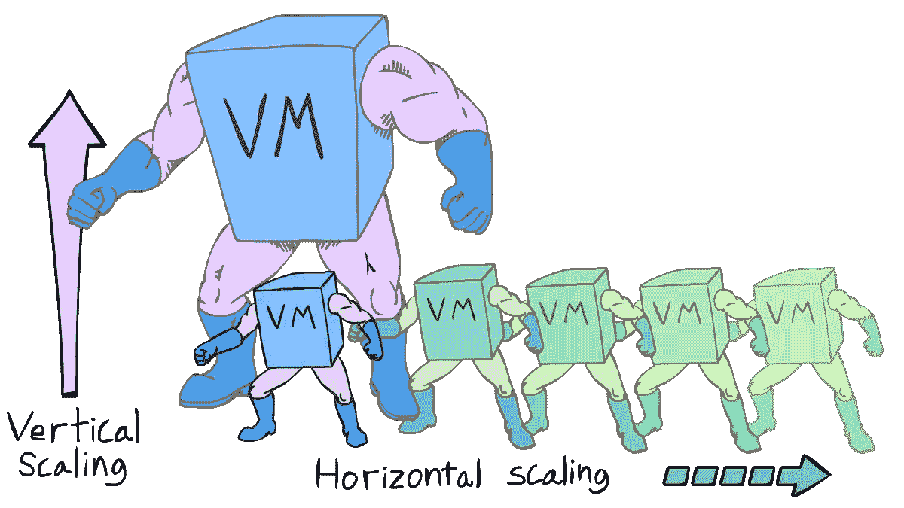

垂直扩展仅仅意味着改进您的数据库服务器。这为您提供了更多的资源，并且是您面临的大多数与伸缩相关的问题的快速解决方案。然而，最大的缺点是它是不可持续的，如果经常这样做，会增加技术债务。这意味着，如果您不断增加数据库资源，您可能很快就无法提供更高容量的数据库。现在您需要考虑一个系统来提高您的性能，如果您到目前为止一直在不断增加您的系统资源，那么现在迁移这样一个庞大的系统会更加困难。

除此之外，当你有更多的资源时，成本往往会上升得很快。垂直扩展导致问题的原因还有很多，例如，在您的系统中产生单点故障、更困难的灾难恢复、执行修补/更新的困难等。

鉴于所有这些缺点，您可能会认为垂直扩展从来都不是正确的解决方案，但它也有一个巨大的优势，那就是时间。垂直缩放非常快速和容易做到。只要投入更多的钱，你就能获得更高的性能。

根据我的经验，当你必须快速解决一个问题时，支付一点额外费用几天，而你和你的团队可以调试问题并找到一个更低成本、更可持续的解决方案是没问题的。重要的是要记住，作为工程师，我们希望创造完美的解决方案，但我们的客户对正常运行时间和成本等指标更感兴趣。

我想是 Tim Peters 在“*Python 的本质*”中写下了下面这段话，

*“特例不足以特殊到打破规则。
虽然实用胜过纯粹。”*

## 代理级别的连接池

在上一篇文章中，我们讨论了连接池如何帮助您的应用程序运行更多的并发事务。

为了进一步讨论这个问题，让我们看一个示例应用程序。一个简单的连接到 Postgres 数据库的 REST API。

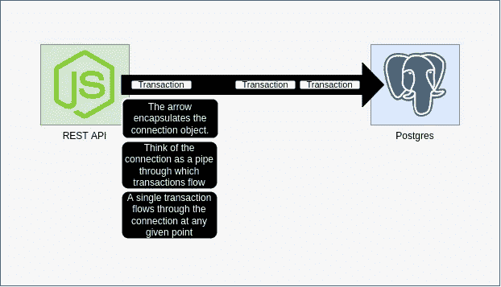

由于单个事务可以在任何给定点通过连接流动，连接池或在应用程序级别维护大量连接有助于将大量事务发送到数据库

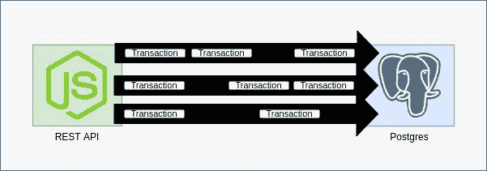

上图显示了我们现在如何发送八个事务，因为我们现在在应用程序和数据库之间有三个连接。我在之前的文章[中对此进行了更深入的讨论。](/geekculture/interview-questions-how-to-improve-the-performance-of-your-database-21b42aba352e)

然而，这产生了另一个问题，您的数据库现在需要管理三个连接，而不是一个。虽然这对您的应用程序来说是一个巨大的提升，但这也增加了您的数据库的工作量。当您的应用程序水平扩展时，这个问题会变得更加严重，例如，当您的应用程序装入 docker 容器或作为 Lambda 函数运行时。

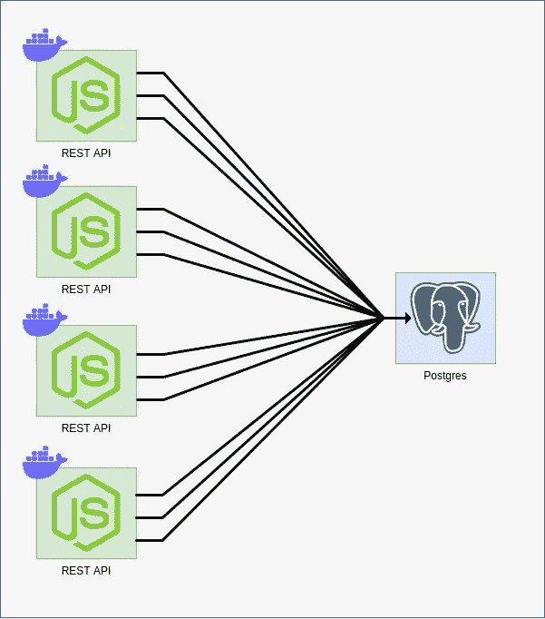

您可以想象运行数十或数百个容器/无服务器函数，每个都有 5-10 个连接时数据库的负载量。

当运行默认的 Postgres docker 映像时，我得到的变量`max_connections`的值是 100。这是可以配置的，但是添加更多的连接会占用更多的 RAM，所以数据库中的连接数是有限制的。

所以，我们有一个问题。在应用程序端拥有大量连接对应用程序来说是一件好事，因为它现在可以并发发送更多的事务，但所有这些连接都会进入数据库，而数据库现在必须承担所有这些连接的成本。水平扩展数据库也不是一个选项，因为数据库很难水平扩展。

真正的问题是数据库做两件事。一个是存储、检索和插入数据的实际责任，另一个是存储大量的连接。

那么，解决方案是什么？在中间添加一个代理来处理连接！

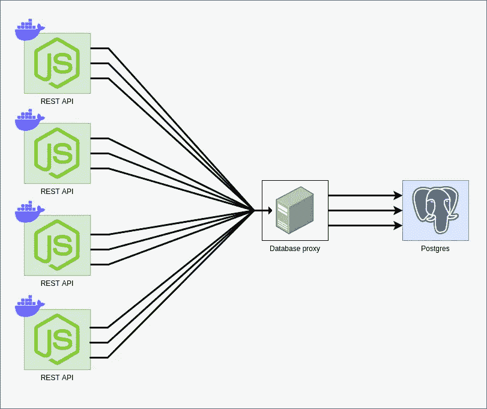

代理可以充当数据库的某种漏斗。它可以承担管理与应用程序服务器的所有数据库连接的所有繁重工作，同时只向数据库公开其中的一部分。

代理提供了许多其他优势，比如灾难恢复和帮助故障转移、安全性、使您的应用程序更加健壮等等。但是由于这个帖子是针对性能的，其他的优点我就不多说了。

当您有很多到数据库的连接时，数据库代理可能是有用的，这通常发生在您有很多应用程序的运行实例时。常见的例子是运行无服务器功能或运行大量 Docker 容器。此外，即使您有更多的数据库连接，代理也只能在您没有大量事务或者您的连接大部分空闲时工作。代理只是将您正在执行的事务合并到一个较小的连接池中，如果您想要支持非常多的并发事务，那么代理可能不是您正在寻找的解决方案。

数据库代理还会为您的系统添加另一个组件，从而增加其复杂性和成本。有很多数据库代理可供选择，像 RDS Proxy 这样的托管服务提供了丰富的功能，并且易于设置，但比 ProxySQL 这样的开源代理更昂贵。

[这个](https://www.youtube.com/watch?v=VFsGJIeuR_Y)是一个关于 RDS 代理的很好的视频，它是一个托管数据库代理，也解释了代理可以解决的不同问题。

## 使用消息队列的异步通信

当你一步一步地做操作时，你是在同步地做它们，这意味着你首先执行步骤 1，等待它完成，然后是步骤 2，等待步骤 2 完成，然后是步骤 3，等等。让我们举一个简单的例子，一个连接到数据库的 REST API。API 获得一个 POST 请求来更新数据库中的某些数据，它在数据库中执行一个命令，等待数据库发送一个响应，然后向用户返回一个适当的响应。这是一个同步流程。

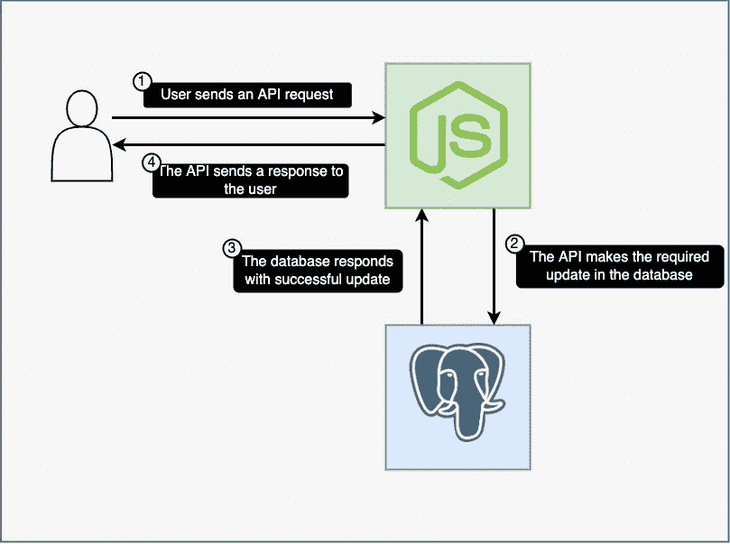

Synchronous flow

让我们对比一下异步通信。在异步通信中，API 不会等待数据库。它可以简单地向用户返回它已经接受请求的响应，而数据库将在 API 已经响应用户之后做出响应。

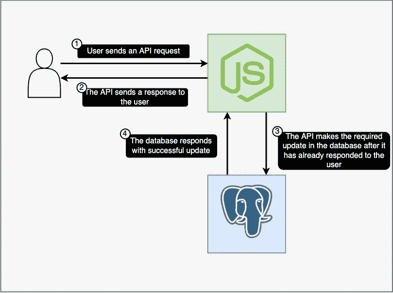

Asynchronous flow

您可能在想，当您还没有执行数据库查询时，如何向用户返回响应。在一些用例中，这是可能的。有时，当更新或插入数据时，您可以假设数据将被插入，并告诉用户您已经收到了他/她的更新请求。

同步调用与异步调用实际上取决于您的用例。有时用户想要即时的反馈，但有时你可以等待几秒钟，如果不是几分钟来执行更新。例如，当用户添加评论时，您会希望该评论立即可见，因为这是不同用户之间快速交流的一种形式。但是，也许对于 upvotes 或 downvotes，您可以将 up votes/down votes 添加到一个队列中以便稍后处理，而不是同步更新数据库。服务可以针对新的向上投票/向下投票请求轮询队列，并且可以相应地更新数据库。

队列可以更容易地处理流量高峰，因为它可以充当存储请求的缓冲区。

缺点是取决于您的实现的数据一致性。由于您的数据在一小段时间内存在队列中，而不是数据库中，这意味着它对于您的 API(它将查询您的数据库)来说是不可见的，因此对于您的用户来说也是不可见的。您的数据一致性可能只有几秒钟或更长，这取决于您的实现。

另一个有趣的反问题是，您将使用哪个队列来存储这些请求，将它仅存储在内存中可能是一个答案，但这也有局限性(例如成本很高),并可能导致其他副作用，例如使您的服务器有状态。Redis 之类的东西可能是一个很好的解决方案，因为它支持在内存中存储数据，也支持在磁盘中持久存储数据。

这种解决方案的一个很好的用例是用户的“一劳永逸”的操作(在这种情况下，用户根本不关心响应，例如，报告堆栈溢出问题，用户不期望立即得到响应)。

简而言之，如果您能够容忍某种程度的数据不一致性，并且主要是为了处理不可预测的请求高峰，那么这是一个很好的答案。

让我们快速讨论一下实现，您通常有两种方法来实现它，一种是添加另一个小型工作服务来轮询队列并将数据推入数据库，

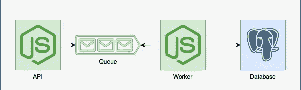

或者你可以使用一个插件，如果你能找到一个，避免额外的服务。[这个](https://livebook.manning.com/book/rabbitmq-in-depth/chapter-10/6)是一个很好的起点。

## 更改您的数据库

数据库通常是为特定的用例而构建的。当然，您可以尝试以一种非预期的方式使用它们，这可能会奏效，但您可能会面临性能、数据完整性、一致性等问题。

例如，SQL 数据库有很多不错的特性，比如对 ACID 的良好支持、创建关系以表格形式存储数据的能力、连接关系的能力等等。然而，如果您的数据是非结构化的，那么将它存储在 SQL 数据库中就不容易了(尽管并非不可能，像 [EAV](https://en.wikipedia.org/wiki/Entity%E2%80%93attribute%E2%80%93value_model) 这样的数据模型也可以用来建模非结构化数据)。如果您的需求是存储非结构化数据，基于文档的数据库可能会更好地满足您的需求。

除了您想要存储的数据之外，还有其他因素需要考虑，例如性能。某些数据库为特定的用例提供了更好的性能。

例如，列数据库将以面向列的方式存储数据，并且能够比 SQL 或文档数据库更快地执行列聚合查询。因此，如果您想获取所有行的列和/或对其执行聚合函数，Cassandra 或 Redshift 之类的工具将比 Postgres 或 Mongo 快得多。

除此之外，一些数据库将数据存储在内存中，而不是磁盘中。从内存中检索数据比从磁盘中检索要快得多，因此在这些数据库中检索数据要快得多。Redis 就是一个很好的例子。但是它们也有缺点，比如缺乏对存储关系数据的支持，或者由于数据现在存储在内存中而不是磁盘中，存储数据的成本更高。我在以前的帖子中已经写了很多关于 Redis 的文章，有很多实际的项目，所以请点击这里查看更多关于 Redis [的内容。](/@sanilkhurana7/list/redis-88a4c95150fa)

简而言之，数据库是为特定的用例构建的，有些是为了解决特定的问题。尝试找到一个能很好地解决您的问题的数据库总是一个好主意。

这种解决方案的缺点是，您需要将数据从一个数据库迁移到另一个数据库，而且数据迁移并不简单或直接。为了使用新的数据库，您还需要进行重大的应用程序级更改。这需要开发和测试时间。

## 添加辅助数据库

很多时候，单个数据库无法满足您的所有需求。当您想要使用多个数据库时，有几个很好的用例示例。

例如，您可能希望存储具有 ACID 属性的关系数据，但也希望更流行的数据能够很快可用。一个很好的例子可能是我们的 Stackexchange 数据，我在我的例子中使用了它。

概括一下，这是我们数据使用情况，

95%的请求都是针对前 10%的职位。事实上，50%以上的人要求得到前 1%的职位。

如果你感兴趣，我在我的[上一篇文章](/geekculture/interview-questions-how-to-improve-the-performance-of-your-database-21b42aba352e)中更深入地讨论了这个问题。

简单的想法是，我们需要在缓存中存储流行的数据，比如 Redis 和 Postgres 中的其余数据。我们不能把所有的数据都存储在 Redis 中，因为存储在 Redis 中会非常昂贵。

根据用户如何使用我们的服务，我们可以根据用户如何使用我们的服务来定义如何将数据发送到 Redis 和 Postgres。例如，根据使用统计，我们发现大多数帖子流行一天左右，然后很少被再次请求。我们可以有一个简单的架构，最初我们将帖子存储到 Redis 和 Postgres 中，并每 12 小时运行一次 cron 作业，将超过一天的帖子移动到 Postgres 中。因为现在大部分获取都发生在 Redis 上，我们的 Postgres 服务器也可以更容易地处理它收到的请求。

这是流动的样子。

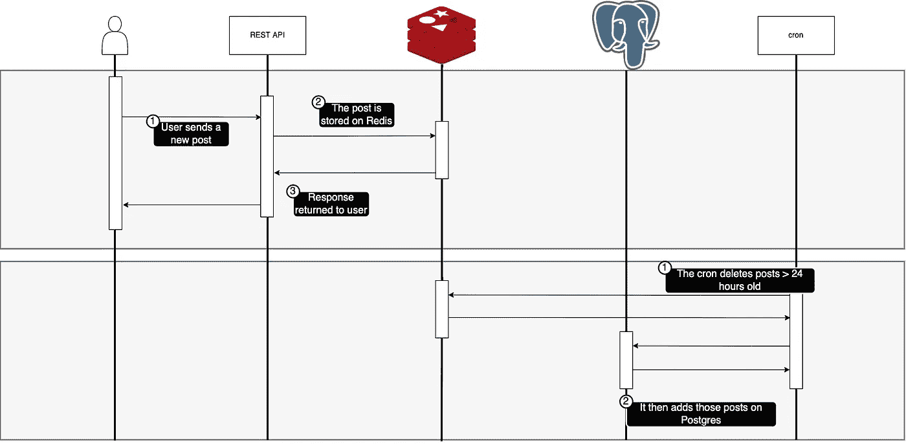

这里的缺点是使你的系统更复杂，通常也更昂贵。除此之外，您还必须考虑如何处理每个数据库中的数据，如果用户更新数据会怎样，在多个数据库中需要如何更新，以多快的速度运行您的 cron 或您提出的任何其他解决方案。

一般来说，这使你的系统变得复杂，并为更多的问题打开了空间，但是如果使用得当，这可以是一个修复性能甚至增加更好功能的伟大解决方案。

## 添加读取副本

正如我们已经看到的，许多应用程序都是大量读取的。这意味着我们收到的大多数数据库请求都是读请求，而不是写请求。这实际上是一件好事，因为扩展大多数数据库来处理更高的读取请求更容易。

我们可以创建复制主数据库的读取副本。这是一个独立的数据库，甚至可能运行在不同的服务器上。运行在不同实例上的多个数据库可以通过网络交换数据和通信。

建筑变成了

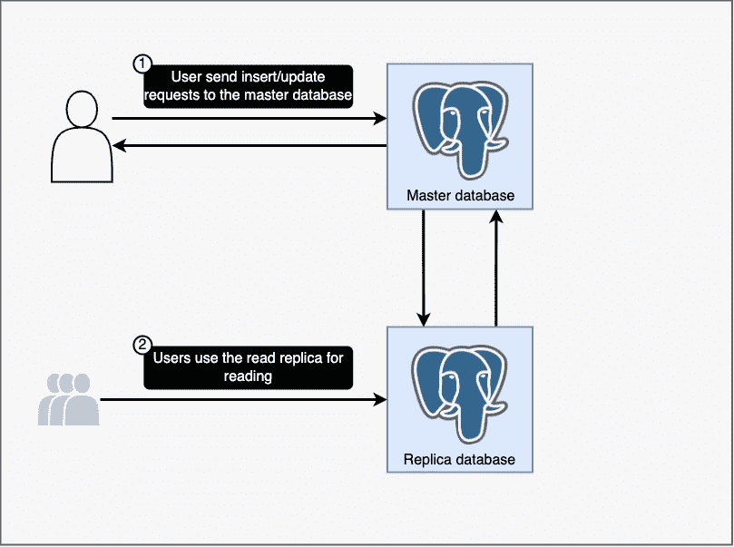

主数据库保留用于写入，而读取副本可以处理读取。您甚至可以向同一个数据库添加多个读取副本，以服务更多的数据库读取。

那么，这如何提高性能呢？您的读取请求(构成您的大部分流量)现在可以被拆分到多个数据库中，每个数据库运行在不同的硬件上，有自己的 CPU、内存和网络带宽。

您需要回答的一个基本问题是如何同步数据库。通常有两种选择，对每个请求进行同步更新，其中对主数据库的每次更新也首先同步到读取副本，然后将响应返回给用户

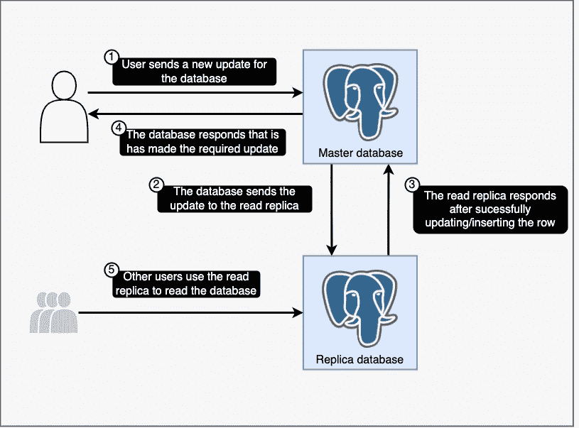

或者进行异步更新，将更新写入主数据库，在某个时候，将读取的副本数据库同步到主数据库。

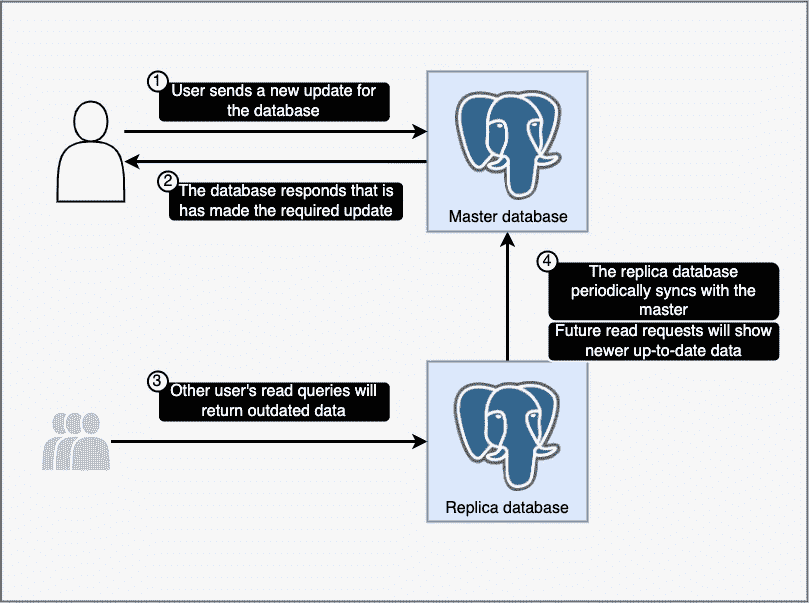

你可能已经猜到了，这也造成了很大的缺点。例如，如果异步同步您的读取副本，您的数据库可能会不同步。然而，同步请求使数据库更新的时间加倍，因为它们现在应该发生在两个数据库上。

如果数据一致性不是特别重要，并且您的大部分流量都是读取负载，那么添加带异步更新的读取副本是一个很好的工具。

# 回答问题前先反驳

在回答这个问题之前，你通常应该问几个反问题来帮助更好地理解这个问题。这些可以帮助您测量系统中的瓶颈。整个系统可能非常复杂，数据库性能开始下降的原因有很多。为了更好地理解原因，以及更好地理解数据库中的需求，你可以问面试官几个问题，这些问题可以帮助你找出最佳解决方案。

由于这一部分需要对上面的答案有所了解，所以我在讨论了可能的答案之后才把它包括进来，但是你可能应该在回答之前问一些反问题。

## 是读性能慢还是写性能慢？

影响您决策的一个非常重要的因素是数据库的读写性能。有些解决方案可能会提高读取性能(例如添加读取副本)，有些可能会提高写入性能。

## 了解用户如何使用您的服务

这对于决定所需的一致性、性能要求和可用性至关重要。许多修复性能的方法可能会影响数据库的一致性。例如，添加一个队列并异步更新而不是同步更新会影响数据库的一致性。

当用户使用你的服务时，理解用户模式也很重要。一项监控服务可能会全天候使用，但电子商务网站可能会在一天中的特定时间出现非常高的峰值。

在数据库前使用队列、扩大缓存、添加更多读取副本等解决方案都是处理高峰流量的好方法，缩小缓存、在用户不使用您的服务时删除读取副本也是节省成本的好方法。

## 用户数量

大量的消费者通常意味着大量的连接，这会严重影响数据库。如果达到连接数限制，数据库将拒绝为新连接提供服务，这可能会影响数据库的性能。

如果您的数据库有许多消费者(例如，许多无服务器功能或容器运行在 ECS、EKS、GKE 等容器编排服务上。)，您可能需要采用一种解决方案来解决这个问题。

您有许多选择，添加队列、添加数据库代理、添加读取副本或对数据库进行分片都是可能的解决方案。

## 时间线？

促使我做出决策的一个关键因素是时间表。如果数据库性能不佳，用户感到沮丧，转而使用竞争对手的产品，那么尽快找到一个解决方案是很重要的，即使这会带来技术债务或更高的成本。

这是一个很好的例子，说明垂直扩展比水平扩展更好。

## 理解成本计算

了解这些改进如何影响你公司的钱包是很重要的。

例如，使用 RDS 之类的托管服务将减少开发时间并减少错误，但成本也会更高。

尽可能确保您的解决方案具有成本效益，这一点非常重要。最好考虑开源服务并在可能的情况下托管它们，只有当您认为使用开源服务可能不可行或者可能更复杂时才考虑托管服务。

# 结论

我还想介绍几个要点，它们是分片和缓存，但是，这篇文章已经很长了，所以我不会在这篇文章中介绍它们。但是，如果你感兴趣，你可以对这些问题进行更多的研究，以便更好地理解它们。

如果你已经走了这么远，感谢你阅读我的帖子！如果你喜欢我的内容，给我几个掌声或者看看我写的其他帖子，如果你想得到关于我的帖子的通知，你可以关注我。如果你有任何反馈，请在评论中告诉我！