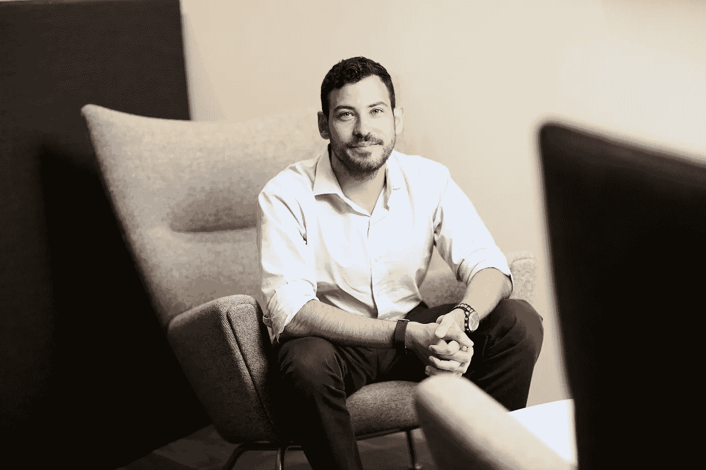

# Filteroff 联合创始人扎克·施莱恩访谈

> 原文：<https://medium.com/geekculture/interview-with-zach-schleien-co-founder-of-filteroff-83aa25205f21?source=collection_archive---------12----------------------->

扎克·施莱恩已经准备好尝试科技和约会世界了。作为锡拉丘兹大学(Syracuse University)的校友和知名企业家，Schleien 希望恢复人类与约会应用的联系，并为刷卡文化提供另一种选择。他坐下来谈论他的公司应用程序 Filteroff，以及迈阿密巴塞尔艺术展的相关活动，这是全美最大的艺术展之一…