# Bug Emir 和 Pepijn van der Stap 的 intigriti 挑战 0921

> 原文：<https://medium.com/geekculture/intigriti-challenge-0921-by-bug-emir-pepijn-van-der-stap-f79a4a9b8692?source=collection_archive---------21----------------------->

来自 Intigriti 的另一个令人敬畏的 XSS 挑战。通过解决这个挑战，我学到了一些关于基于 DOM 的 XSS 的很酷的东西，希望你会喜欢阅读这篇关于我是如何解决这个挑战的文章，并赢得了 Intigriti Swag 的最佳文章之一😋

我们开始吧。

[https://challenge-0921.intigriti.io/](https://challenge-0921.intigriti.io/)

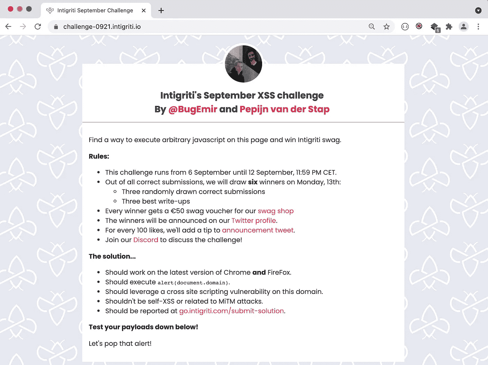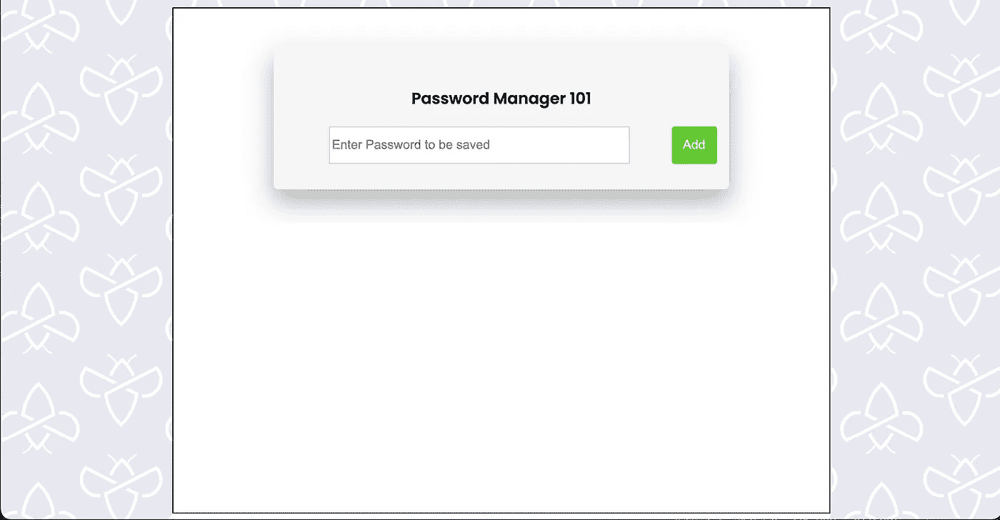

Challenge Overview & Challenge Area with user input field, hmm XSS 😍 ??

让我们在文本字段中输入一些字符，看看会发生什么！

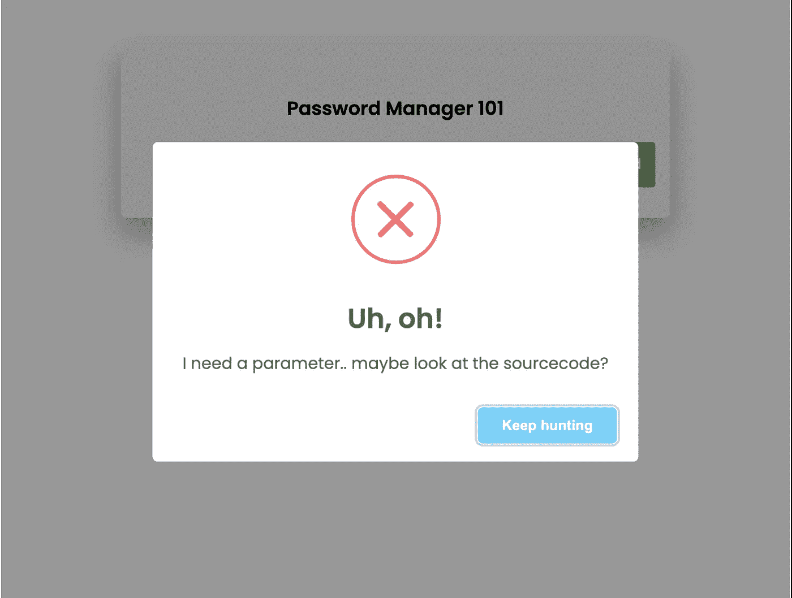

如您所见，模型错误信息弹出窗口要求输入参数。这是一个很好的迹象，表明可能有一个参数接受一个值来保存密码，你也可以看到消息的第二部分“可能是看源代码？”。好吧，那我们来看看源代码。

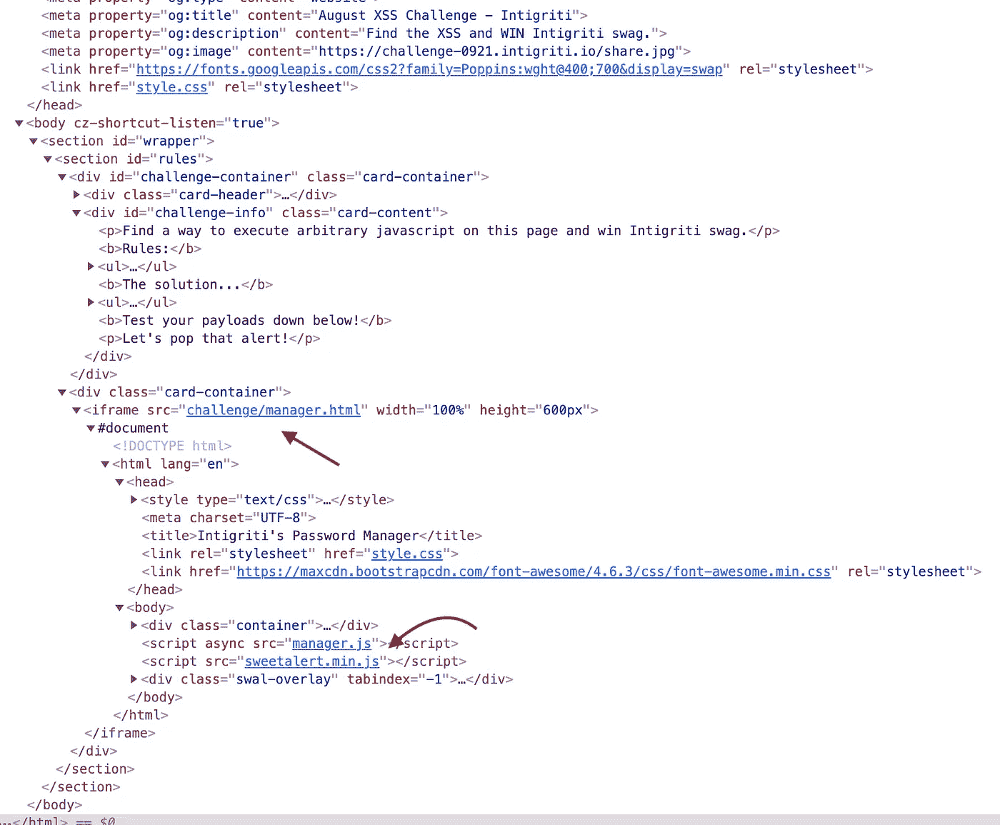

我们可以看到主页面使用了一个 iframe 和源代码***(src = " challenge/manager . html ")***，并使用了两个 javascript 文件。那么让我们访问这一页。

[https://challenge-0921.intigriti.io/challenge/manager.html](https://challenge-0921.intigriti.io/challenge/manager.html)

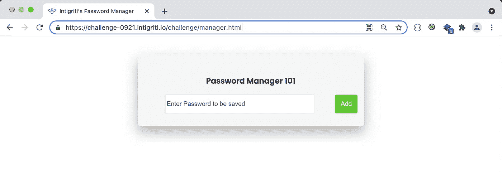

让我们检查这些 javascript 文件中的代码，作为错误消息提示。

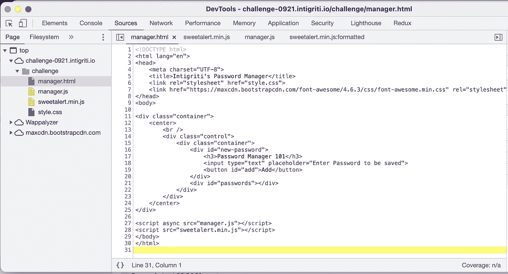

在该页面的源代码中，我们可以找到正在加载的 **javascript 库" sweet alert . min . js&" manager . js "**。

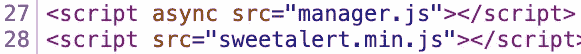

首先检查 *sweetalert.min.js* 文件，因为弹出的错误提示信息要求输入参数。发现该文件是用于 SweetAlert 库的那些很酷的弹出窗口。

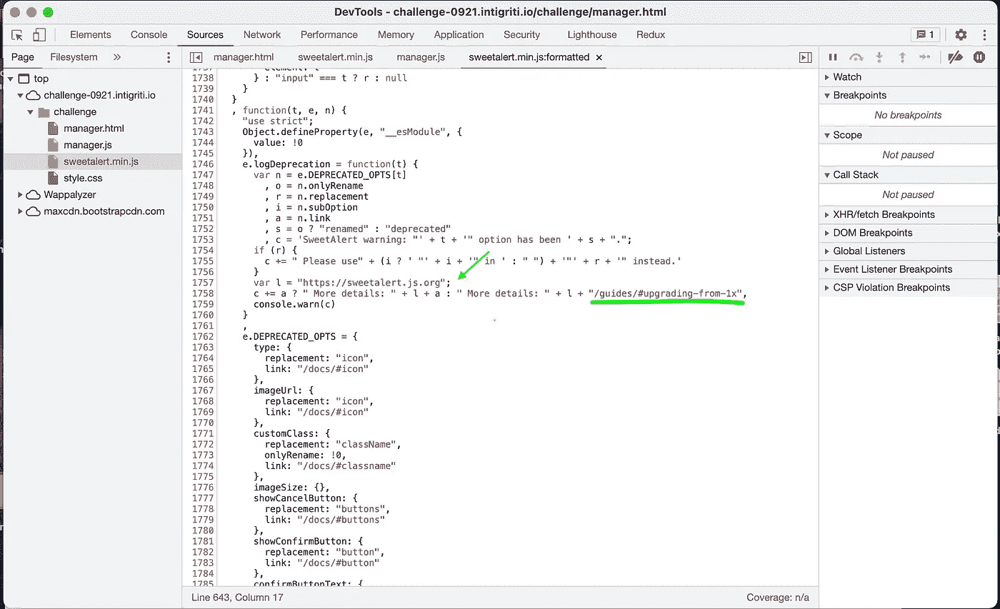

This is very bottom part of the “sweetAlert.js” file!

当我看到上面突出显示的代码部分时，我想，“好吧，这表明这个库可能在使用旧版本”。可以看到***/guide/# upgrading-from-1x****，*然后 Google**sweet alert 漏洞**。有文章显示这个库(旧版本)容易受到 XSS 攻击。

精心制作了一些有效载荷输入到输入框中，没有运气，仍然得到相同的消息“我需要一个参数”。是时候检查另一个 Javascript 文件**“manager . js”**…..这里是所有有趣的开始…😅

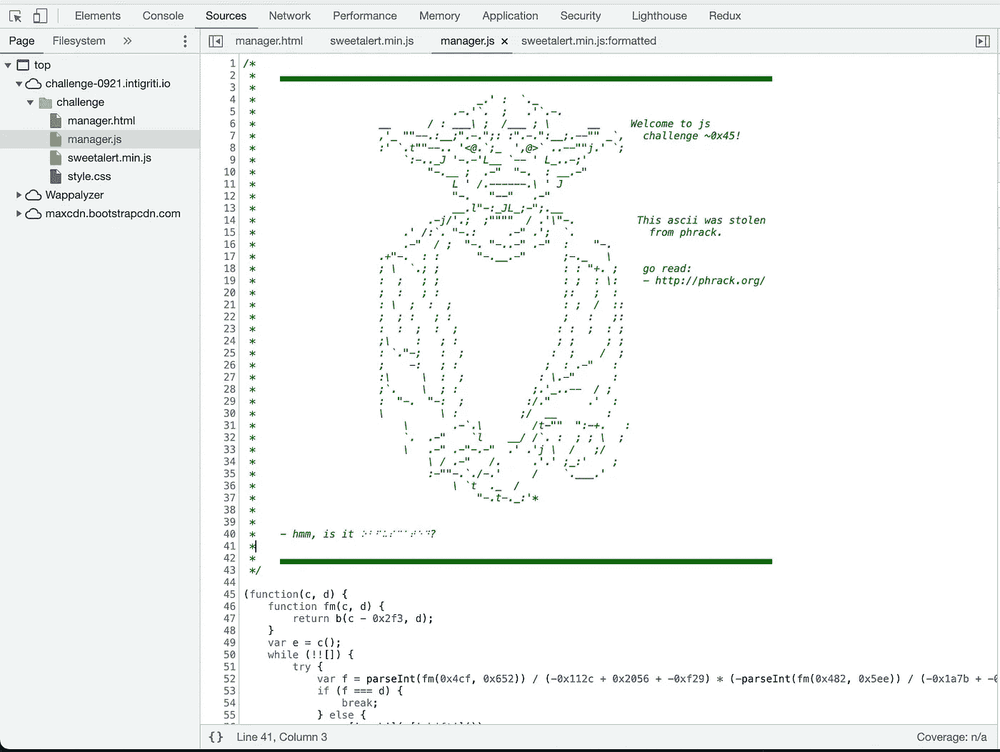

Hola Yoda.. What are you doing here? 👽

Hexadecimal.. god this going to be more fun to crack this… 😬

这看起来很有趣……🧐***“这个 ASCII 码是从 phrack 偷来的。”*** 好吧..& **“走*读:——***[***【http://phrack.org/】***](http://phrack.org/)*。这里可能有一些有效载荷的提示，去过 http://phrack.org*

*在**上呆了一段时间后，意识到这是一个兔子洞，找不到任何与这次挑战有关的东西。我不确定也许有人在这里发现了一些与 XSS 挑战赛相关的有用的东西。(将等待官方报告)。***

> ***但是有一些很酷的关于一些战功的文章，我相信值得一读，好吧，也许以后…📖***

***在检查神秘参数的代码之前，下面的部分引起了我的注意(在上面的图片中突出显示)。***

*****——嗯，是⠕⠃⠋⠥⠎⠉⠁⠞⠑⠙吗？”🛎盲文，但是我看不懂，让我们问问谷歌这是什么意思？([http://xahlee.info/comp/unicode_braille.html](http://xahlee.info/comp/unicode_braille.html))*****

*****⠕⠃⠋⠥⠎⠉⠁⠞⠑⠙** 表示**混淆，**这解释了为什么这个 js 文件中的代码看起来很滑稽。无论如何，让我们看看这里还有什么惊喜🤨***

***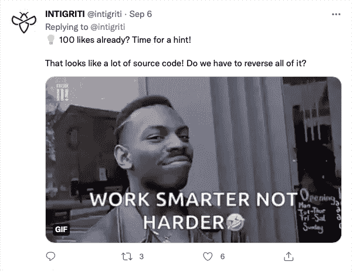***

***Tip # 1 from Intigriti after 100 likes.***

***来自 Intigriti 的技巧 1，但是这次我已经知道这段代码是模糊的，需要去模糊(逆向工程)。***

***但是在向谷歌求助之前，我决定扫描一下代码，发现在 manager.js 文件中到处都在使用 ***_0x5195*** 。***

**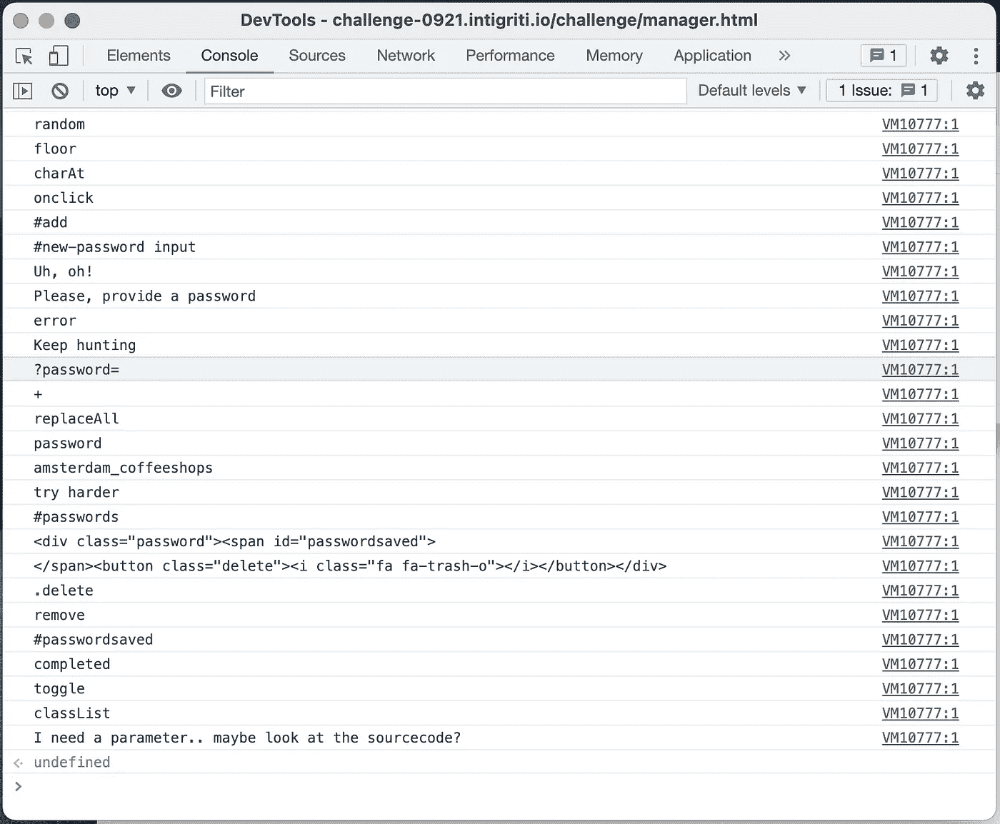**

**数组" ***_0x5195*** "，游戏规则改变者…😙为了查看数组值，我在开发人员控制台中使用了这段 javascript 代码**

*****_ 0x 5195 . foreach(e =>{ console . log(e)})****→*这将列出数组内的所有值，并找到其所需的参数→ " **password=** "🙃*(或者..只需复制****_ 0x 5195****并粘贴到开发人员控制台内，然后按 enter 键…您将看到所有的值和索引号)***

**立即尝试低于有效载荷..**

**【https://challenge-0921.intigriti.io/challenge/manager.html? 密码= % 3c 脚本%3E 警报(1)% 3C/脚本%3E**

**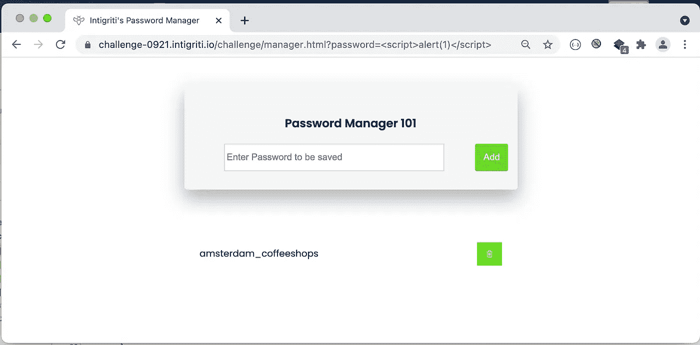**

**哦😳正在添加“阿姆斯特丹咖啡馆”的内容。**

**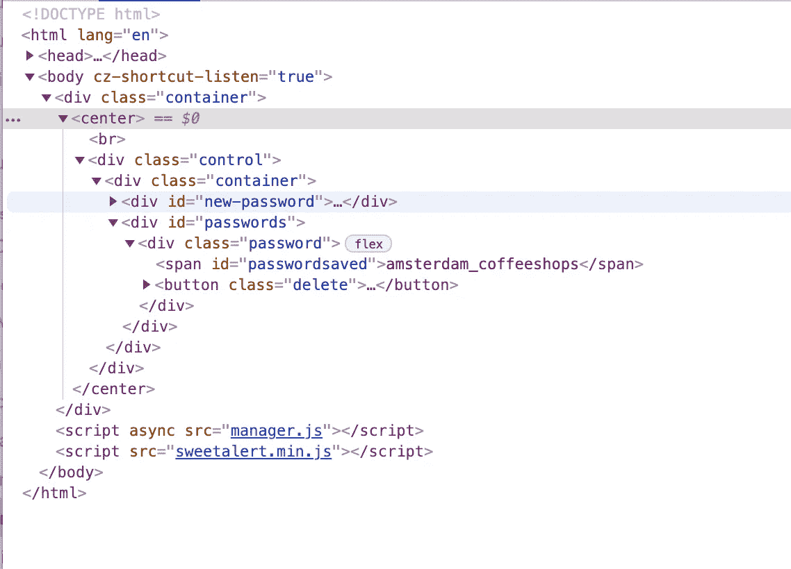**

**提供 ***<脚本>预警(1)</脚本>*** …还有我的有效载荷在哪里？？😬检查了 HTML no 有效负载，🤣“阿姆斯特丹咖啡馆”是什么**

**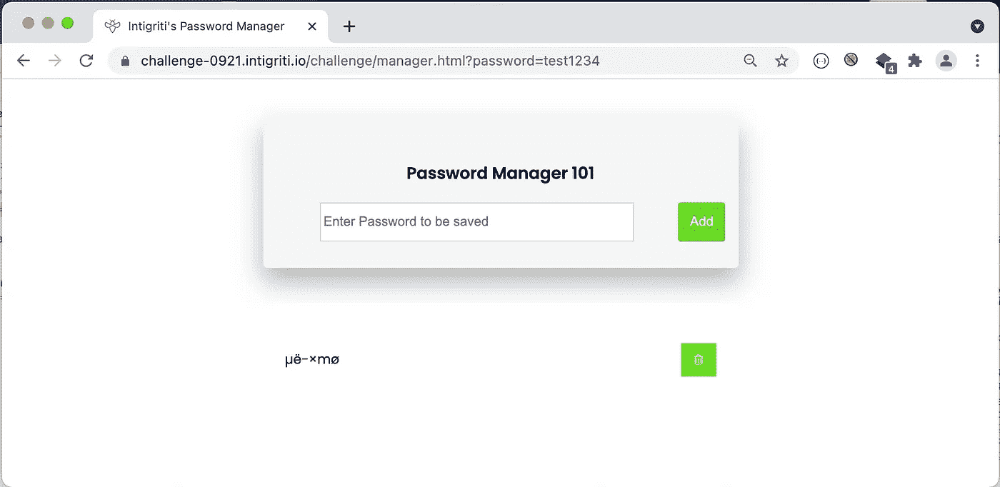**

**在这一点上，我认为这里的一些过滤器用***“Amsterdam _ coffee shop”***替换了有效载荷，然后决定放一些像“test1234”这样的纯文本，以查看它在 HTML 中的任何地方得到反映，但是发生了一些连线的事情***“Amsterdam _ coffee shop”***被替换为**“é-×m”。当输入值长度是 4 的倍数(4，8，12，16)时，我得到这个连线字符..实际上有代码来检查这一点。****

**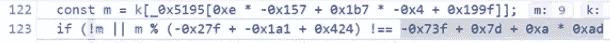**

**Code Line 123**

**另一个有趣的事实是，不小心去掉了***【test 1234】***→***【test 123】***中的一个人物，然后又出现了***【Amsterdam _ coffee shop】***。然后意识到 ok 值输入有一些影响如何内容被添加到页面，并希望找到所有这一切发生在代码中的位置？**

**我还注意到，每当*“Amsterdam _ coffee shop”*被添加到开发者控制台的页面中时，就会出现一条消息***“try hard”***(这个索引 701:数组 *_0x5195* 中的“Try hard”)。**

**是时候揭开整个代码了，再次谷歌拯救。[http://jsnice.org](http://jsnice.org)https://www.dcode.fr/javascript-unobfuscator**

**开始看到一些 javascript 特定的功能，但代码仍然没有意义。开发者技能来了，调试。在主数组 ***_0x5195*** 上放置一些断点，并开始查看添加到变量中的值。还从数组 ***_0x5195*** 中复制了所有的值作为文本文件以备后用，这的确很有帮助，你将在下面看到如何！**

**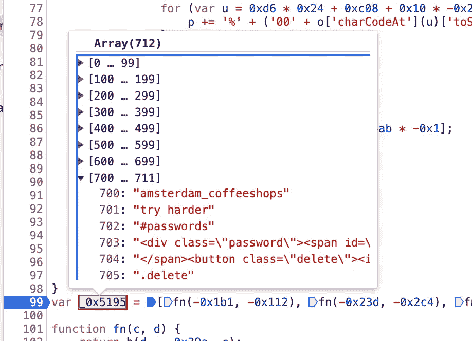**

**Index 700 looks familiar at this point**

**在用断点调试了一段时间后，找到了一个 javascript 函数，它负责将提供给“password”参数的值转换成这个连线的**“n-×m”**字符。它在第 1424 行**

****

****atob()** what this function/method does? Turn to be Game Changer**

> **搜索 Javascript 时使用[https://developer.mozilla.org](https://developer.mozilla.org)和在谷歌搜索栏**中 *javascript atob MDN* 和****

**谷歌时间再次为“ **atob()** ”。此函数用于解码 base64 编码值。是是是，网络咖啡馆的时间到了**

** [## atob()-Web API | MDN

### atob()函数对使用 Base64 编码的数据字符串进行解码。你可以使用 btoa()…

developer.mozilla.org](https://developer.mozilla.org/en-US/docs/Web/API/atob) 

使用 base64 编码( ) aaaannndd 精心制作的有效负载..没有弹出窗口..这是怎么回事😂

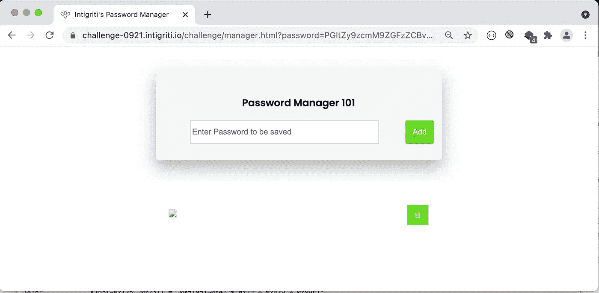

让我们检查一下 HTML，

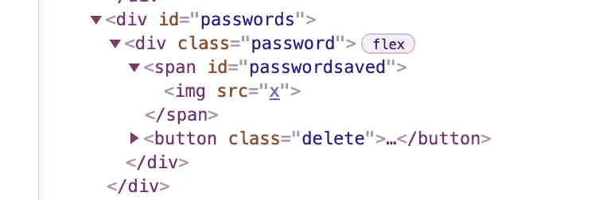

Where is the rest of the payload ?

在尝试了许多 base64 有效负载后&检查 HTML 时，我注意到所有的 ***事件*** 都被切断了。所以在代码中使用了 ***过滤器/杀毒器*** ，因为我们看不到任何其他的 Javascript 库文件。与此同时，Intigriti 在 twitter 上发布了第二条提示，让我们来看看。(这个提示帮我破解了 ***滤镜/杀毒*** )

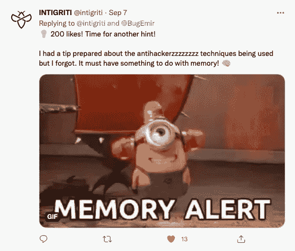

他们在暗示关于内存和“anthi 4c k3 rc0 D3 zzzzzzzzz”，哦我在那个魔法阵***_ 0x 5195***index 681(**681:" anthi 4c k3 rc0 D3 zzzzzzzzz "**)里见过这个

“内存”是有意义的，因为代码使用了大量的闭包& IIFE

 [## 闭包- JavaScript | MDN

### 闭包是一个函数的组合，它被捆绑在一起(封闭),并引用其周围的状态(…

developer.mozilla.org](https://developer.mozilla.org/en-US/docs/Web/JavaScript/Closures)  [## life-MDN 网络文档词汇表:网络相关术语的定义

### IIFE(立即调用的函数表达式)是一个 JavaScript 函数，它一被定义就运行。这个名字…

developer.mozilla.org](https://developer.mozilla.org/en-US/docs/Glossary/IIFE) 

所以在全球范围内一定有什么东西在泄露…是的…(见下图)

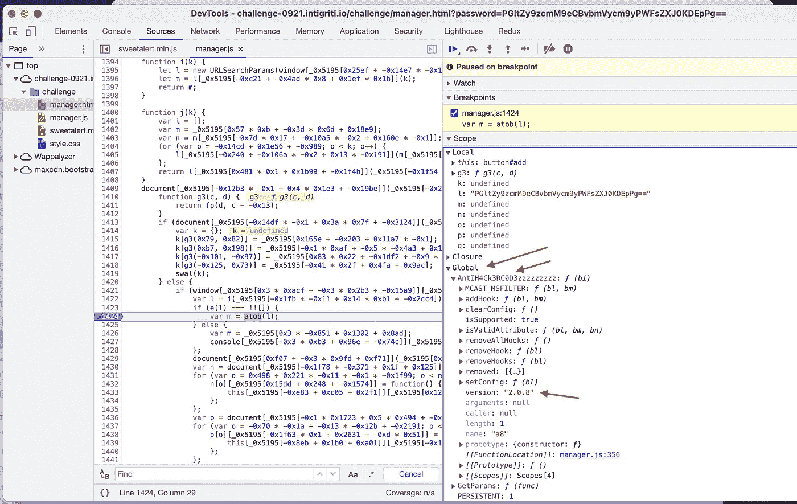

Hey Hello AntIH4Ck3RC0D3zzzzzzzzz

> 在分析/调试不清楚的代码时，留意**范围**标签总是好的，你可以看到变量和它们的值被分配给它们。我相信大部分黑客都错过了这一部分。所以下次不要错过这个地区。

可以看到**anti H4 k3 rc0 D3 zzzzzzz**以大写**“A”开头。这表明它是一个类..再次看到索引 668:数组 ***_0x5195 中的“构造函数”。*****

> **在许多编程语言中，构造函数方法是一个类的特殊方法，用于创建和初始化该类的对象。**

***那么这个*anti H4 k3 rc0 D3 zzzzzzzzz 类是做什么的……很明显这是滤镜/杀毒器库，为什么？看上面的图片，它的版本号是 2.0.8，试着在开发者控制台中运行下面的代码。**

**AntIH4Ck3RC0D3zzzzzzzzz。MCAST_MSFILTER**

**anth 4 CK 3 RC 0 D3 zzzzzzzz . version**

**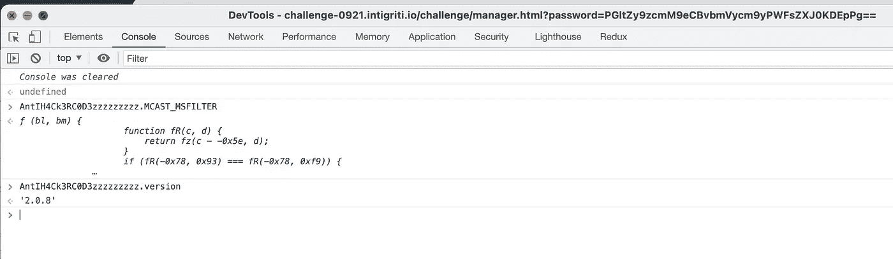**

**Developer console**

**所以我们用它来做什么..来吧，我们是黑客..谷歌呆瓜 it***【2 . 0 . 8】杀毒*****

**[https://www.google.com/search?client=safari&RLS = en&q = % 222 . 0 . 8% 22+消毒剂& ie=UTF-8 & oe=UTF-8](https://www.google.com/search?client=safari&rls=en&q=%222.0.8%22+sanitizer&ie=UTF-8&oe=UTF-8)**

**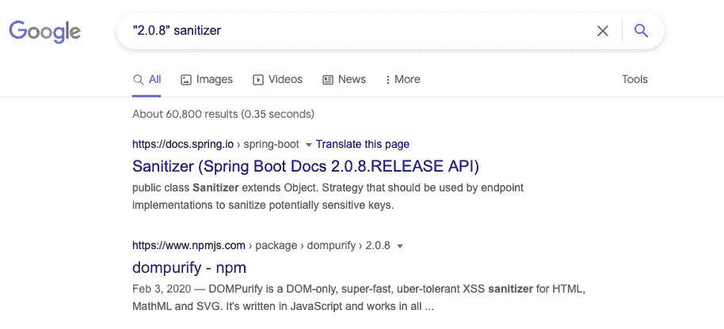**

**Hey Hello DomPurify**

**[https://www.npmjs.com/package/dompurify/v/2.0.8](https://www.npmjs.com/package/dompurify/v/2.0.8)→与 anti H4 k3 rc0 D3 zzzzzzzzz . version 同版本，好好好……我们来检查一下这个库中的漏洞。**

** [## Snyk - dompurify@2.0.8 漏洞

### 了解更多关于 dompurify@2.0.82.3.1 中的漏洞，dompurify 是一个只支持 DOM 的、超快的、超级宽容的 XSS…

snyk.io](https://snyk.io/vuln/npm:dompurify@2.0.8) 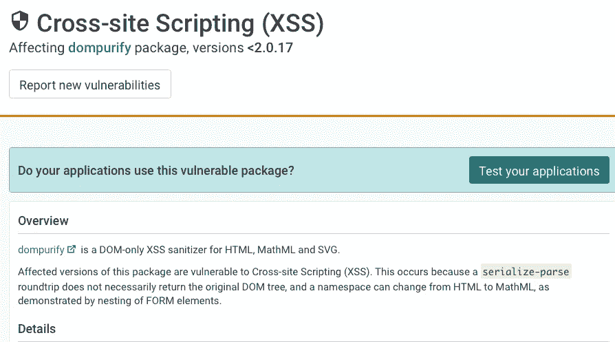

所以现在我们知道这个版本对 XSS 来说是易受攻击的。让我们问问我们的好哥们谷歌…

 [## dompurify xss bypass - Google 搜索

### 编辑描述

www.google.com](https://www.google.com/search?client=safari&rls=en&q=dompurify+xss+bypass&ie=UTF-8&oe=UTF-8) 

这篇来自[portswigger.net](https://portswigger.net/research/bypassing-dompurify-again-with-mutation-xss)的精彩文章拯救了我的一天，

 [## 用变异 XSS 再次绕过 DOMPurify

### 在看到 Michał Bentkowski 的 DOMPurify 旁路和由此产生的补丁后，我受到启发，试图破解补丁…

portswigger.net](https://portswigger.net/research/bypassing-dompurify-again-with-mutation-xss) 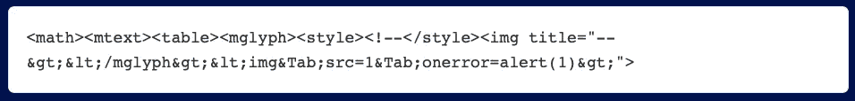

[**DOMPurify**](https://portswigger.net/research/bypassing-dompurify-again-with-mutation-xss) **payload from PortSwigger**

有效载荷时间宝贝…..😎

**原始有效载荷**:

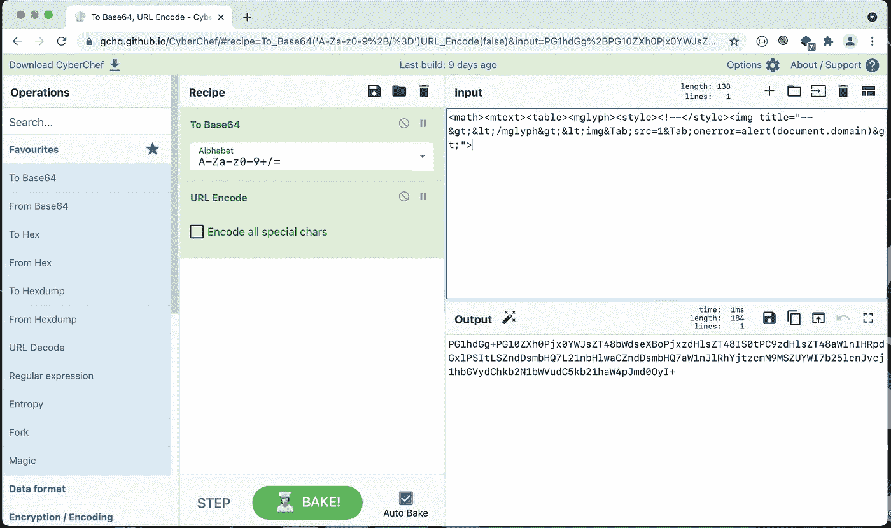

CyberChef — To Base64 → URL Encoded

*为什么在 base64 之后我们还需要 URL 编码*🤔

因为 base64 字符串可以包含“+”、“=”和“/”字符。这可能会改变数据的含义。

**Base64 编码+URL 编码的有效负载**:

[https://challenge-0921.intigriti.io/challenge/manager.html?password = pg 1 hdgg+pg 10 zxh 0 pjx 0 ywjszt 48 bwdsexbopjxzdhlszt 48 is 0 TPC 9 zdhlszt 48 aw 1 nihrpdgdxlpsitlsznddsmbhq 7 l 21 nbhwacznddsmbhq 7 aw 1 jrhyjtzcmm 9 mszuywi 7 b 25 lcnjvcj 1 hbgvydchk b 2 1 bwvudc 5 kb 21 haw4 pjmd 0oyi+](https://challenge-0921.intigriti.io/challenge/manager.html?password=PG1hdGg+PG10ZXh0Pjx0YWJsZT48bWdseXBoPjxzdHlsZT48IS0tPC9zdHlsZT48aW1nIHRpdGxlPSItLSZndDsmbHQ7L21nbHlwaCZndDsmbHQ7aW1nJlRhYjtzcmM9MSZUYWI7b25lcnJvcj1hbGVydChkb2N1bWVudC5kb21haW4pJmd0OyI+)"

***💥Booom！！！*** ***终于！！！***

感谢阅读，希望你能从这篇文章中学到一些东西。注意安全！！！

> 确保你给这篇文章一些建议👏如果你喜欢这篇文章并想看更多的话，可以关注我的博客。🤝 ❤️ 🇱🇰

# **BOUNS 读作**:

我是如何手动对代码的某些部分进行逆向工程*来感受这些代码在做什么。让我们做这个简单的 console.log()部分…*

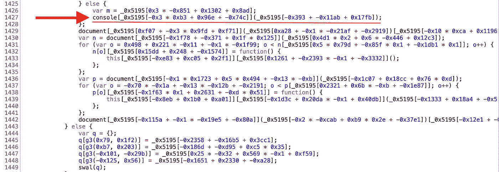

控制台[_ 0x 5195[-0x 3 * 0x B3+0x96e+-0x74c]](_ 0x 5195[-0x 393+-0x 11 ab+0x 17 FB])；

**第一步:**我们知道 _0x5195 是数组..因此，让我们复制[-0x3 * 0xb3 + 0x96e + -0x74c]并粘贴在谷歌…

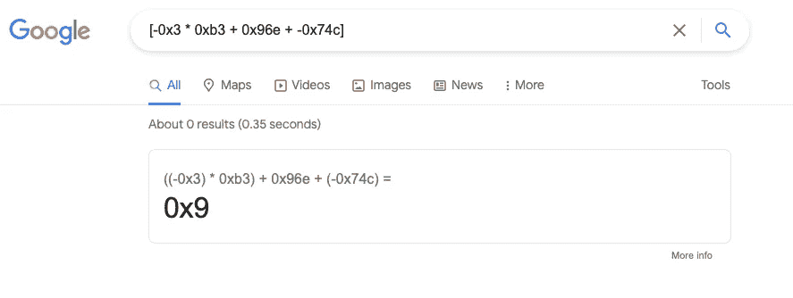

**第二步:**取 0x9，粘贴到 google 中，点击搜索(十六进制 0x9 = 9)

那么在这次挑战中，我们的“9”是什么..它是 array _0x5195 的索引 9，所以我们先来看看索引 9 然后*(这就是为什么前面提到的把所有的值从 array _0x5195 复制到一个文本文件中)*

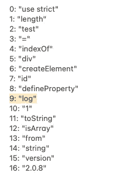

索引 9 是“log”，让我们替换它*(注意我是在我的代码编辑器中替换这些)*

控制台。**log**(_ 0x 5195[-0x 393+-0x 11 ab+0x 17 FB])；

让我们进入第二部分.. **[-0x393 + -0x11ab + 0x17fb]** ，同样的步骤重复一遍，复制到 google，看结果，

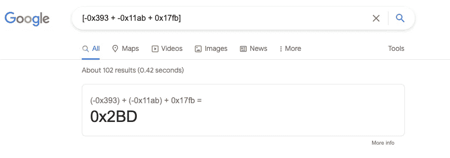

是 **0x2BD** ..复制这个值，再次粘贴&搜索..

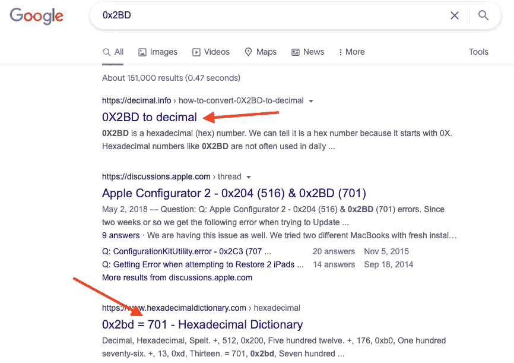

您可以点击“0x2BD”到十进制链接来查看值，或者您可以查看下面的“701”位。一

我们来看看 array _0x5195 中的索引 701 是什么…是“再努力一点”…我们把这个放进去…

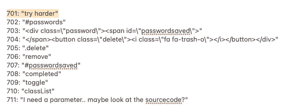

**console.log("更加努力")😎**

我是这样做的..

# **更简单的方式……**

只需复制并粘贴到开发人员控制台，然后按回车键

控制台[_ 0x 5195[-0x 3 * 0x B3+0x96e+-0x74c]](_ 0x 5195[-0x 393+-0x 11 ab+0x 17 FB])

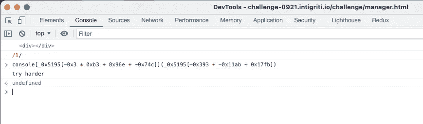****