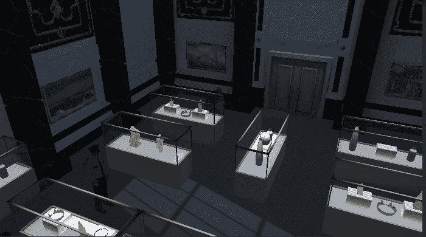

# 进入游戏机制:转移注意力——扔硬币给你的守卫

> 原文：<https://medium.com/geekculture/into-game-mechanics-distraction-move-toss-a-coin-to-your-guard-24692e83267?source=collection_archive---------18----------------------->

**目标**:实现一个可以分散守卫注意力的功能，把他们吸引到某个地方

今天我们要实现一个新功能:**通过投掷**硬币**来分散**守卫的注意力。前面有很多编码！

让我们设计我们真正想要的。

1.  当玩家右击屏幕时，达伦将会掷硬币。