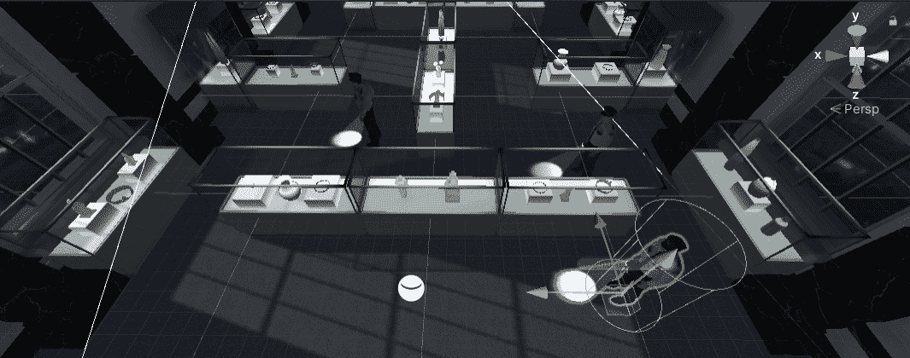

# 进入游戏机制:警卫巡逻-第 1 部分

> 原文：<https://medium.com/geekculture/into-game-mechanics-guards-patrol-part-1-720c330aed46?source=collection_archive---------32----------------------->

**目标**:对敌方 AI 的巡逻行为进行编码

前面有很酷的东西！

我们今天的目标是让守卫**在预先选择的路径上巡逻**。为了做到这一点，我们必须承认守卫和达伦有着相同的特征(在这种情况下是 **navmesh 代理**)，唯一的区别是达伦由**人手**引导。所以，首先要做的是…