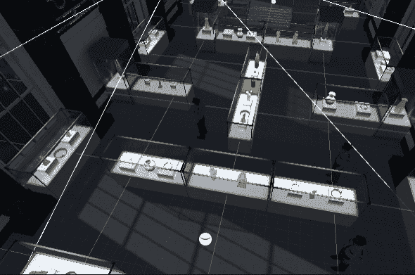

# 进入游戏机制:警卫巡逻-第 2 部分

> 原文：<https://medium.com/geekculture/into-game-mechanics-guards-patrol-part-2-290a592811ea?source=collection_archive---------22----------------------->

**目标**:优化巡逻，引入随机巡逻，引入守卫动画

今天我们要让守卫们过得更好。首先是优化他们的行为。我想了想，把所有都留在更新方法中会导致无用的计算和向量比较。因此，我将把所有东西都放入一个协程中，并在`.Start()`方法中启动它。