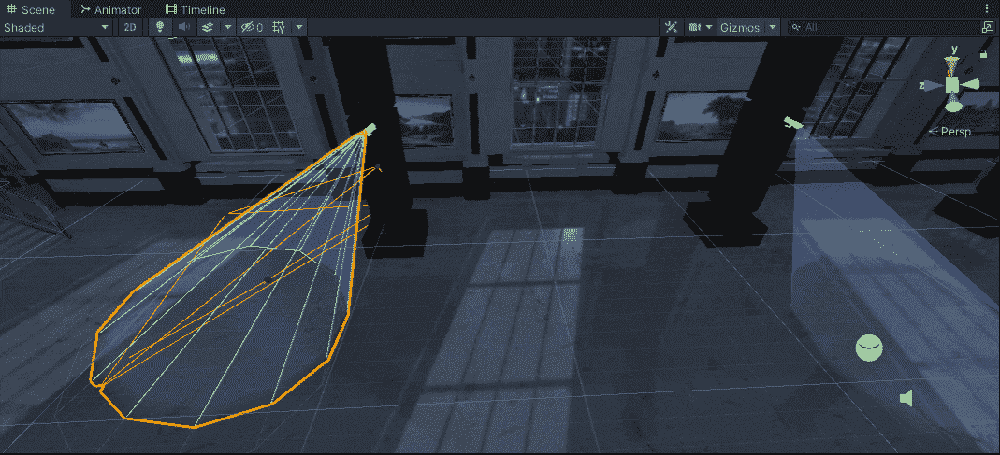

# 进入游戏机制:安全摄像头

> 原文：<https://medium.com/geekculture/into-game-mechanics-security-cameras-d29b1ad468a7?source=collection_archive---------22----------------------->

**目标**:设置摄像机以创造真实的行为

那些摄像机不是用来展示的，让我们**把它们打开**。

一个小设计:

1.  相机的颜色**应该不同于红色**，所以当丹纳被发现时，它可能会变成红色。
2.  相机**反方向摆动**:它们在中间一起看，然后旋转…