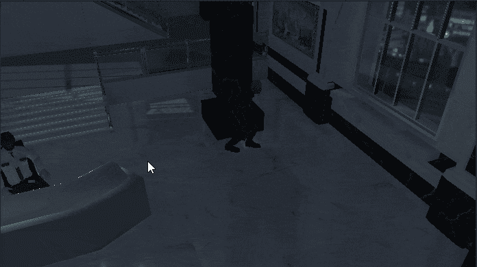

# 进入游戏机制:触发整个场景的过场动画

> 原文：<https://medium.com/geekculture/into-game-mechanics-trigger-cutscene-all-over-the-scene-dd47ebbf1702?source=collection_archive---------30----------------------->

**目标**:触发我们游戏中的非游戏结束过场动画。

今天超级快速教程。我们将以我们通常的方式实现**过场动画触发特性**:使*可重用*。

如果你观察层次结构，你会发现这些对撞机。

空的游戏对象拿着一个盒子**碰撞器**，可以用来触发我们…