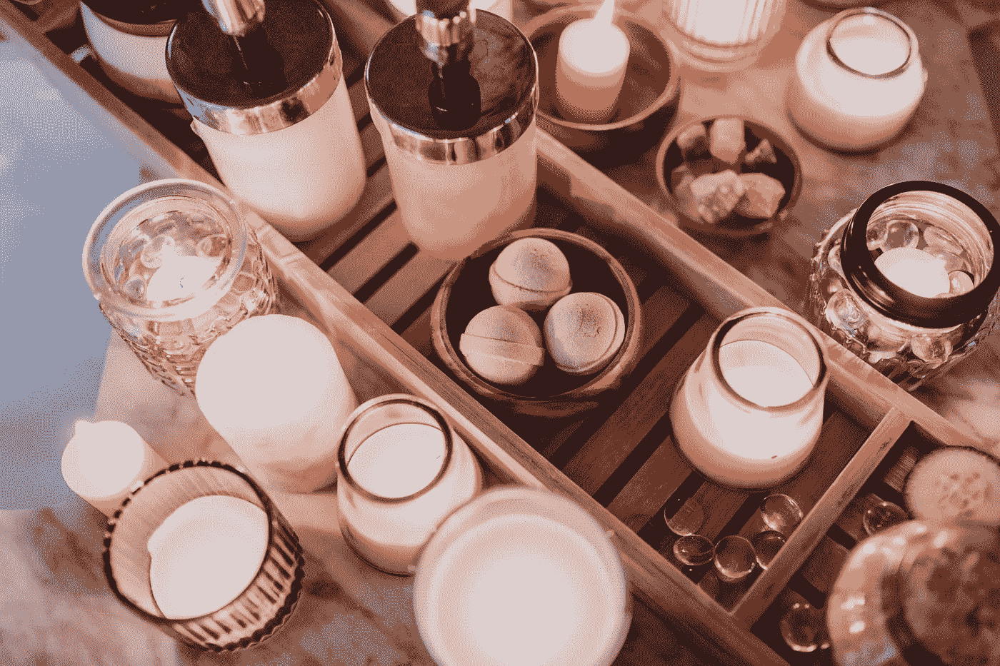

# 用你的设计吸引你的观众是一项艰巨的任务。

> 原文：<https://medium.com/geekculture/intriguing-your-audience-with-your-design-is-a-hard-task-b55335cc01f2?source=collection_archive---------25----------------------->

## 这些 YouTube 频道将构成你的工具箱。

Photo by [RODNAE Productions](https://www.pexels.com/@rodnae-prod?utm_content=attributionCopyText&utm_medium=referral&utm_source=pexels) from [Pexels](https://www.pexels.com/photo/food-healthy-wood-nature-6724539/?utm_content=attributionCopyText&utm_medium=referral&utm_source=pexels)

> “好设计就是好生意。”——小托马斯·沃森，商人，IBM 第二任总裁

据 similarweb.com 称，在过去的 6 个月里，Starbucks.com 已经吸引了大约 1700 多万游客。

是什么让这个网站吸引了更多的访问者？是信息/艺术方向引起了他们的兴趣吗？还是因为他们的咖啡很棒？

> "设计增加价值的速度快于增加成本的速度."-乔尔·斯波尔斯基，网络程序员、作家和 Trello 的创始人

*我相信这个网站的网页设计师知道这一点！*

我敢肯定，如果你不喜欢一个网站，你就不会坚持下去。

因此，在这篇文章中，你将**发现** 5 个惊人的 YouTube 频道，学会立刻吸引和引起你的观众的兴趣。

## 1)禅悟图形

这些家伙会放大你的设计能力。他们深入分析了基本的设计原则，为什么他们的工作，以及如何有效地使用它们。你还可以获得他们积压的惊人的免费设计资源。

## 2)通量

在 [Flux](https://www.google.com/url?sa=t&source=web&rct=j&url=https://m.youtube.com/channel/UCN7dywl5wDxTu1RM3eJ_h9Q&ved=2ahUKEwja6eCgnNvwAhVF4YUKHSb2DWwQFjAFegQIHhAH&usg=AOvVaw3bM5hzZSPGOeP3wiVyYI-9) 节目中，Ran Segall 深入挖掘真正重要的设计见解、技巧和诀窍。众多的作品集和登录页面评论是获得大胆艺术指导灵感的理想选择。

## 3)查理马里电视台

Charli，一位新西兰设计师，在她的[频道](https://www.google.com/url?sa=t&source=web&rct=j&url=https://m.youtube.com/user/charlimarieTV&ved=2ahUKEwjSnIqUndvwAhXM4IUKHUnVDOwQFjAAegQIAxAH&usg=AOvVaw1xSQ86PxGG19RCCR19F4tz)上给出了她对设计工具、网页设计和自由网页设计世界的见解和建议。

## 4)在视觉上

[他们](https://www.google.com/url?sa=t&source=web&rct=j&url=https://www.youtube.com/channel/UCndfHdRdEiGOyCOgxQ4W9YQ&ved=2ahUKEwiOxb_5ndvwAhWNyIUKHdHuAuEQ9zAwH3oECAMQCQ&usg=AOvVaw1uiAxpsd35NFqAllOrUDjo)发送令人大开眼界的设计讲座和专家访谈，以便更深入地了解设计世界。

## 5).Maex

在 Maex 上，你会发现关于设计工具和资源的惊人教程。

他还指导设计构建的实时流，使您能够在他设计项目时看到他的身后。

# 最后的想法

记住你的设计是在和你的观众说话。好的设计吸引并激起他们的兴趣。糟糕的设计让他们反感。

> “款式来来去去。好的设计是一种语言，不是一种风格。”-意大利设计师马西莫·维格内利

感谢阅读！