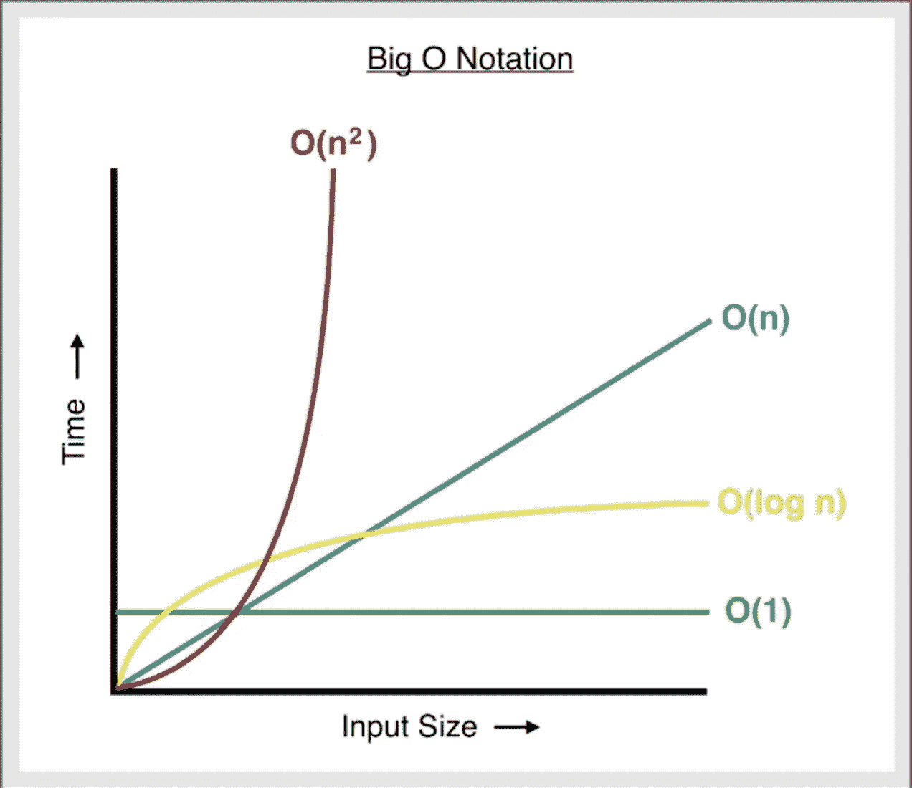

# 大 O 符号介绍

> 原文：<https://medium.com/geekculture/intro-to-big-o-notation-f299915f403f?source=collection_archive---------42----------------------->


Warp 1 or O(1)..?

随着输入大小的增加，大 O 符号用于对算法的运行时或空间效率进行分类。这是一种描述算法功能的性能和/或复杂性的方式。算法的 Big-O 分类是基于最坏的情况。它是开发人员用来比较解决问题的不同方法的效率的“语言”(或者术语)。就个人而言，数学从来都不是我的强项，因此我将使用一些编码示例来说明常见的大 O 类别。

## 时间和空间复杂性的背景

因为单个计算机的处理速度差异很大，很明显，不能用计算机运行一个算法所花费的时间来衡量算法的效率。取而代之的是，使用一个概念来观察运行时增长有多快。为了测量*时间复杂度*，使用了计算机为了完成算法/功能而需要执行的操作数量。至于推导*空间复杂度*，使用成功完成算法/功能所需的内存量。

优化时间和空间复杂性需要了解数据结构及其属性/特征——有些对于搜索功能更有效，而有些对于插入目的更节省内存。我写了一篇关于常见数据结构的文章，并将链接如下:

[](/geekculture/intro-to-data-structures-735142170c7a) [## 数据结构介绍

### 在这篇文章中，我将介绍作为程序员应该知道的常见数据结构，以及哪些数据…

medium.com](/geekculture/intro-to-data-structures-735142170c7a) 

要理解大 O 符号，首先必须理解几个定义:

*   **n** —代表大 O 内某算法的输入，



Graphical Representation of Big O Notation

当你进一步阅读时，你可以参考上面的图表。

## O(1)

O(1)是黄金标准。如果算法的时间或空间复杂度得分为 O(1 ),这意味着无论输入数据集的大小如何，执行时间或内存需求都将保持不变— *一次*操作或内存分配。它在时间和空间上都是不变的。

```
function countUpTo(n) {
    return arr[0]
}nums = [5, 6, 7, 1, 8, 2]printFirst(6) // => 5
```

无论 **printFirst** 的输入值大小如何，该函数将只执行一次操作，使其为 O(1)。

## O(n)

O(n)描述了操作数与输入中的项目数相同的情况。现在是*线性时间*。

```
function printAll(arr) {
   for(let i = 0; i < arr.length;  i++) {
      return arr[i]
   }
}nums = [5, 6, 7, 1, 8, 2]printAll(nums) // => 
// 5
// 6
// 7
// 1
// 8
// 2
```

函数返回值的次数取决于输入中的项数，即运算次数与 **n** 成比例增长。和上面的循环一样，简单循环的时间复杂度是 O(n)。

以上，完成该函数所执行的操作的数量取决于输入(n ),因为每次执行循环的迭代时，输入的长度都与新的值 **i** 、 **i** 进行比较，并且随着每次迭代，返回索引 **i** 处的值。这导致了基于函数为了到达输入的结尾而必须执行的循环数的可变操作数( **n** )。

## O(n^2)

对于 O(n ),为完成该函数而执行的操作数会根据输入呈指数增长。当一个 O(n)操作嵌套在另一个 O(n)操作(例如嵌套循环)，在这种情况下运行时间将以 n 的速度增长。O(n)次运算是*的二次时间复杂度*。

```
function bubbleSort(arr) {
    for (let i = 0; i < arr.length; i++) {
        for (let j = i; j < arr.length; j++) {
            if(arr[i] < arr[j] {
              let switch = arr[i]
              arr[i] = arr[j] 
              arr[j] = switch
        }
    }
    return arr
}
```

这里我们有一个时间复杂度为 O(n)的冒泡排序算法的表示，因为我们嵌套了两个循环。如果 **arr** 有 *n* 个项目，那么对于外循环的每次迭代，外循环运行 *n* 次，内循环运行 *n* 次，总共有 n 次操作。

如果 **arr** 有 10 个项目，我们必须循环 100 次。如果它有 1，000 个项目，我们必须打印 1，000，000 次。

## o(登录号)

对数运行时，即 O(log n)，意味着运行时与输入大小的对数成比例增长。一个可以用来可视化 O(log n)的常见例子是在电话簿中查找某人。为了做到这一点，你不需要检查书中的每一个 T21 人，直到你找到你要找的人。相反，你可以*分而治之*查看电话簿，看看你登陆的页面上是什么字母——然后只搜索电话簿中包含你要搜索的姓氏的第一个字母的子集。你继续这种模式，翻书，只搜索包含给定字母的部分，直到你发现你还有一页，并搜索该页上的名字。

这种*分治*方法是 O(log n ),因为它随着每次划分而提高效率——因为你正在搜索的部分的大小每次被分成一半。上面的电话簿解释是一个*二分搜索法*的例子。O(log n)是*对数时间*。

```
function logarithmic(n) {
   for(let i = 1; i < n; i*=2) {
      let result = i;
   }
}
```

在上面的例子中，迭代的次数总是小于登录输入的大小，因此最坏情况下的时间复杂度是 O(log n)。