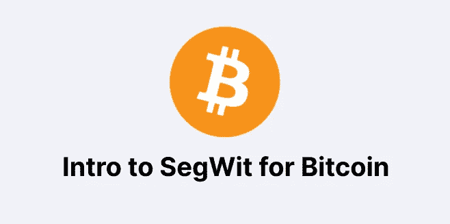

# 比特币 SegWit 简介:更快更便宜的交易

> 原文：<https://medium.com/geekculture/intro-to-bitcoin-segwit-faster-and-cheaper-transactions-3a603c1f07b0?source=collection_archive---------8----------------------->

SegWit 是 segregated witness 的缩写，是比特币网络上的协议升级，旨在防止交易延展性并增加块容量。SegWit 于 2017 年 8 月首次实施，但此后在区块链空间一直是一个有争议的问题。

尽管有争议和批评，SegWit 已经看到了相对较新的激增…