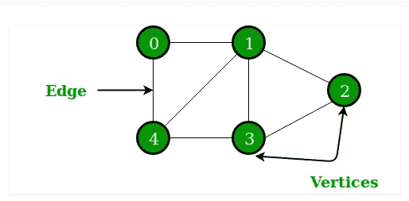
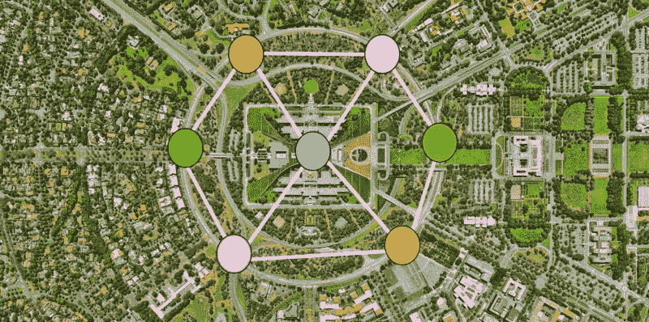
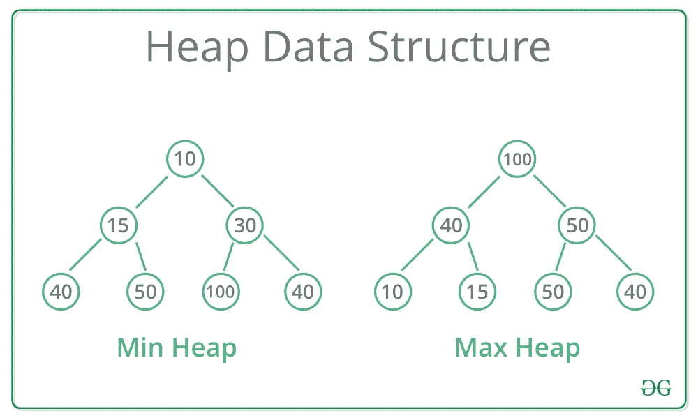

# 数据结构介绍

> 原文：<https://medium.com/geekculture/intro-to-data-structures-735142170c7a?source=collection_archive---------53----------------------->


The way in which you choose to structure your data directly affects your program’s efficiency

在这篇文章中，我将介绍作为程序员应该知道的常见数据结构，以及什么是数据结构，我们如何以及为什么使用它们。数据结构是一种组织和存储数据的方式。数据结构被用在几乎所有已经开发的程序或软件系统中。不同的数据结构对于不同的用途更有效，作为一名程序员，你应该理解它们之间的区别，以便优化你的程序的效率。利用数据结构的四种最常见的方式是访问、搜索、插入或删除数据。您选择的数据结构应该基于它对您希望对数据执行的任务的效率。

除了对你的发展追求有数据结构的知识之外，这也是在面试中展示熟练程度的一个极其重要的领域；因为关于这个概念的问题通常会决定你是否适合软件开发人员的职位。

# 数组

数组是一种数据结构，用于存储具有相同数据类型(例如整数)。数组元素的索引从零开始，可以通过提供分配给数组的变量名来访问单个元素，变量名附加有您希望访问的元素的索引，用括号括起来(即括号符号)。

```
numbers = [1, 5, 8, 9, 2, 35]numbers[0] #=> 1
numbers[4] #=> 2
```

如上所述，数组允许随机访问(也称为“直接访问”——在相同的时间内访问任意元素的能力，就像访问任何其他元素一样容易，而不管集合的大小)。数组可以由整数、字符串、浮点以及其他数组组成——创建一个嵌套数组。数组最适合用于在单个变量中存储同一数据类型的多个值。

使用数组进行数据结构化的一个优点是易于排序和搜索——因此，如果这是您希望在程序中对数据执行的功能，数组可能是一个不错的选择。排序算法通常应用于数组，包括冒泡排序、快速排序、插入排序和合并排序。

数组数据结构的缺点包括插入和删除元素的效率低下。因为数组的大小是固定的，所以不能直接在这个数据结构上执行这些操作。要将元素插入到数组中，必须首先创建一个大小增加的新数组，复制原始数组的元素并添加新元素。在删除元素时必须执行相同的过程，从而产生一个减小了大小的新数组。

# 链接列表

类似于数组，链表数据结构是线性的。与数组不同，链表的元素不是存储在连续的位置，而是使用指针链接。链表的元素称为节点。链表由指向第一个节点的指针表示，称为**头**，而最后一个元素称为**尾。**每个节点都有两个部分——数据和指向下一个节点的指针(或引用)。链表的最后一个节点不指向下一个节点，如果一个链接不指向一个节点，则该值被设置为空，表示链表的结束。


Linked List Visual

链表对于数组来说是有利的，因为它们具有动态的大小以及轻松插入和删除元素的能力。然而，与数组不同，链表不能进行随机访问，要定位链表的元素，必须从第一个节点开始按顺序搜索。这使得在链表中搜索效率很低，如果你主要是在寻找搜索功能，就不应该选择这种数据结构。此外，内存空间被分配给链表中每个元素的指针——这使得数据结构的开销更大。链表不是缓存友好的，因为它们没有引用的局部性，因为元素不是连续存储的(不像数组)。

# 大量

堆栈通常在许多编程语言中使用。它是一种 **LIFO** (后进先出，即最后添加的元素首先被访问)结构，因其在视觉和功能上与物理堆栈(例如一叠盘子)。


Representation of a Stack

如上图所示，堆栈有两个基本操作- **压入**和**弹出**。 **Push** 用于在堆栈顶部插入一个元素，而 **pop** 用于移除和返回顶部元素。栈提供了一些额外的功能来检查状态； **peek** 用于返回栈顶元素而不删除它，**是 Empty** 【恰如其名】用于检查栈是否为空，**是 Full** 用于【惊喜，惊喜】检查栈是否已满。

在递归编程中，堆栈用于表达式求值和实现函数调用。

# 行列

Penguin Queue!

队列是一种 **FIFO** (先进先出，最先添加的元素最先被访问)数据结构，也常用于编程语言中。在一个队列上可以执行两个基本操作，即**入队**和**出队**。将**入队**是将一个元素添加到队列的末尾，而将**出列**是将一个元素从队列的开头移除。

队列通常与堆栈一起工作，可用于实现排队系统，如优先级队列。例如，由于 JavaScript 是单线程语言，为了实现用 JavaScript 构建的 web 应用程序的异步功能，**调用堆栈**负责跟踪所有要执行的操作——之后它们被弹出堆栈。当一个异步请求被发送时——它被定向到一个浏览器 API——T2 事件队列开始发挥作用。为了响应来自**调用栈**的命令，这个 API 开始自己的单线程操作。

例如，对于涉及 **setTimeout** 方法的操作，该操作在**堆栈**中处理，并被定向到相应的 API——该 API 等待，直到作为参数提供的时间增量将该操作发送回**事件队列**进行处理。**事件队列**利用队列数据结构来维护发送执行操作的正确顺序。这个过程代表了在单线程语言中允许异步操作的循环系统，因为浏览器 API 充当独立的线程——由**事件队列**提供便利(与**事件循环**串联——这不在本文讨论范围之内)。

# 树

与非线性结构的链表不同，树在结构上是分层的，数据按照这种模式分层组织*并链接在一起。已经开发了许多树种来满足不同应用限制的需求。其中一些包括二叉树、二分搜索法树、红黑树、AVL 树、八字树等。*


Tree Visual

我将会更详细地讨论二叉树的结构细节。二叉树的元素最多有两个子元素——恰当地称为左右子元素。二叉树的一个节点包含三个部分——数据、指向左边子节点的指针和指向右边子节点的指针——如上图所示。

如果您存储的数据自然形成一个层次结构，例如您计算机上的文件系统，您可以选择使用树形数据结构。如果使用树来组织关键字，一个优点是能够在适当的时间内搜索关键字——比使用数组慢，但比使用链表快。插入或删除键也需要一定的时间——比数组快，但比链表慢。此外，树对于能够被指针链接的节点数量没有上限——不像数组，但类似于链表。

不同的树结构更适合不同的应用程序——例如，二叉查找树允许对排序后的数据进行快速删除、搜索和插入。了解不同树的属性可以优化程序的功能效率。

# 图表



Graph Diagram

图是一种非线性数据结构，由连接图中节点的有限的一组**顶点**(又名**节点**)和**边**(表示为线条)组成。图形用于表示现实生活中的网络，如电话网络或城镇中的街道。它们也可以用于 Instagram 这样的社交网络——其中每个节点都是一个用户，当你关注另一个用户时，你通过一条边连接起来。

有**有向图**和**无向图**。有向图的特征在于所有的边都具有指示起始节点和结束节点的方向，例如只有一个用户(或节点)跟随另一个的关系，单向关系。当边没有指示起点和终点的方向时，图是无向的。例如，两个用户相互跟随——这种关系存在于两个方向。



Roads as a Graph

如何使用图形数据结构的另一个例子是 Google maps——它使用图形来构建交通系统，道路的交叉点是节点，然后连接两个节点(交叉点)的道路被视为边。将一种算法应用于该结构，以计算两个顶点之间的最短路径，并向用户产生最佳方向路径。

# 很

堆是一种特殊的基于树的数据结构，通常可以是两种类型之一- **最大堆**或**最小堆**。一个 **max-heap** 的特征是具有最大值作为根节点，所有子树紧随其后。一个**最小堆**是一个以最小值作为根节点的树结构，所有的子树都跟随其后。



Min Heap vs Max Heap Structure

当您希望快速访问最大值或最小值元素时，使用堆是非常有利的。

# 哈希表

哈希表是以关联方式存储数据的结构，如果您知道与您希望访问的值相关联的键，则无论集合的大小如何，它都支持高效的插入和搜索功能。散列表的数据以数组格式存储，每个数据值具有相关联的唯一索引值。哈希表使用数组作为存储介质，并使用哈希函数来生成插入元素的索引。


当要存储的数据量对于典型计算机的存储器来说太大时，使用哈希表来代替直接寻址(存储在表中的数据的值和键之间的一对一映射)。

使用哈希表的应用包括实现关联数组、数据库索引和“集合”数据结构。