# 使用 Seaborn 和 Matplotlib 的数据可视化简介

> 原文：<https://medium.com/geekculture/intro-to-data-visualization-using-seaborn-and-matplotlib-9a9b9ea532f?source=collection_archive---------31----------------------->

Photo by [Carlos Muza](https://unsplash.com/@kmuza?utm_source=medium&utm_medium=referral) on [Unsplash](https://unsplash.com?utm_source=medium&utm_medium=referral)

我们生活在一个网络时代，我们每天产生 2.5 万亿字节的数据给 T2。当你读到这篇文章的时候，这个数字已经增加了！这是一个巨大的，非常巨大的。**数据可视化**是驾驭其力量的工具。在数据科学领域，python 中广泛使用的库之一是**seaborn**——一个易于使用但功能强大的工具。

Seaborn 是一个建立在 matplotlib 库之上的高级数据可视化库，matplotlib 库是 Python 编程语言及其数字数学扩展 NumPy 的绘图库。对于本教程，你需要一个 jupyter 笔记本/google colab 或任何其他类似的东西。支持应用程序的 ipynb。没有进一步的讨论，让我们从导入所有必要的库开始。

# 设置环境

在笔记本中运行以下代码，导入 pandas、matplotlib 和 seaborn 库。

如果您还没有安装这些库，那么使用下面的命令从您的 jupyter 笔记本安装它们，然后使用上面的命令导入它们。

# 导入和理解数据

我们将在这个练习中使用**口袋妖怪数据集**，你可以从[这里](https://raw.githubusercontent.com/sanketkangle/Exploratory-Data-Analysis/master/Seaborn_tutorial/Pokemon.csv)获得它，或者运行下面的代码

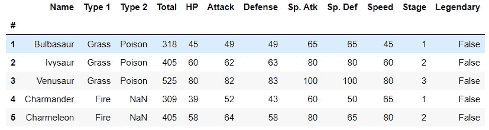

你应该可以看到最初的 151 只神奇宝贝的战斗统计数据。

# 使用 Seaborn 的线形图

在折线图中，测量点是有序的(通常按其 x 轴值)并用直线段连接。折线图通常被用来可视化一段时间内的数据趋势——一个**时间序列**——因此线通常是按时间顺序画的。在这些情况下，它们被称为**运行图**。

使用 Seaborn，在一行代码中，我们可以绘制一个线图。

*第一行* : `sns`是盟友一般用于`seaborn`。`sns.seaborn`告诉笔记本我们要创建一个折线图。使用 seaborn 库的每个命令都将以这个`sns`前缀开始。对于参数，`x`和`y`分别取要绘制在 x 轴和 y 轴上的列的名称。在`data`中，我们给出数据帧的名称，列名从该数据帧分配给`x`和`y`。通常每个`sns`图都遵循这种格式。第二

*第 2 行*:为了给这个情节起个标题，我们使用了`matplotlib.pyplot's`alliances`plt`和命令行`plt.title`作为参数。您应该会得到如下结果

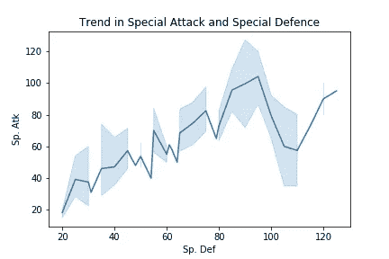

我们也可以在一个图形中绘制多条线图，只需要用类似的语法再添加一条线。

此外，您可以像上面一样通过添加参数`label`将标签添加到您的线图中。试试吧！

# 使用 Seaborn 的条形图

一个 **条形图**或**条形图**是一个用矩形条表示**分类数据**的图表，矩形条的**高度**或**长度**与它们所代表的值成比例。条形图**可垂直或水平绘制**。条形图显示离散类别之间的比较。

*第 2 行*:我们可以使用`sns.countplot`来绘制分类变量的总计数

*第 5 行*:使用`plt.xticks`我们用 *45⁰* 旋转个性化图形。您应该得到如下输出

当我们将类别作为列，将数值作为数据时，我们可以使用普通的`barplot`,如下所示

# 使用 Seaborn 的热图

H eatmaps 帮助你可视化**矩阵状**数据。每个单元格根据其对应的值进行**颜色编码**。我们将检查口袋妖怪数据集的不同列之间的相关性。

*第 1 行* : `df.corr()`给出除 NA 值和分类列之外的列的成对相关的矩阵输出，保存在变量`corr`中

*第 2 行*:我们使用这个`plt.figure(figsize=(x,y))`命令设置图形的大小

*第 3 行*:我们使用此`sns.heatplot`命令绘制热量图。设置`annot=True`给出相关的数值幅度以及颜色编码。

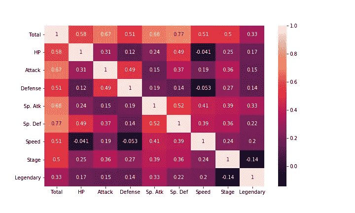

# 使用 Seaborn 的散点图

散点图是一种使用笛卡尔坐标来显示一组数据中两个典型变量的值的图或数学图表。如果这些点是彩色编码的，可以显示一个额外的变量。

*第 1 行* : `sns.scatterplot`告诉笔记本我们要绘制散点图。x 轴、y 轴和数据照常给出。`hue`根据提供的分类变量`Stage`对所有单个数据点进行颜色编码

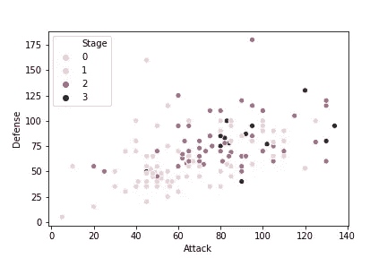

这个数据确实显示了一些线性回归，对吗？但是我们怎么能确定呢？除非有办法对数据进行线性回归拟合。我的朋友，你很幸运，Seaborn 只有一行代码！

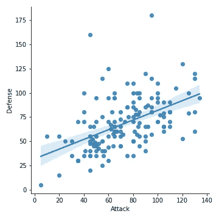

如果你想为`Stage`的每一个值建立单独的回归线，那么只要把`hue`加回来就可以了。

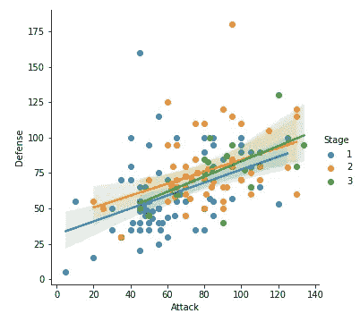

**正斜率**表示**正相关性**，这也可以通过热图来验证。

通常，我们使用散点图来突出两个连续变量之间的关系(如`"heights"`和`"weights"`)。但是，我们可以调整散点图的设计，在其中一个主轴上显示分类变量(如`"gender"`)。我们用`sns.swarmplot`命令构建它。

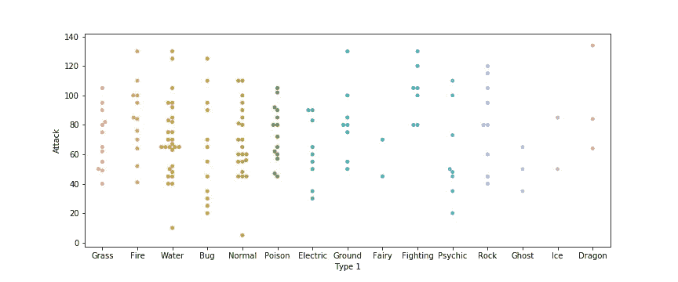

# 使用 Seaborn 的直方图

直方图是数值数据的**分布的近似表示。条形图的高度越高，该条形图覆盖的范围内的数据就越多。**

*第 1 行*:我们使用`sns.distplot`来绘制直方图。在直方图中，我们不需要提供`x`和`y`，因为`y`是默认频率，所以我们必须给出的唯一输入是`a`。注意，我们不需要在这个命令中提供参数`data`。`kde=False`移除直方图顶部的*内核密度估计*图。

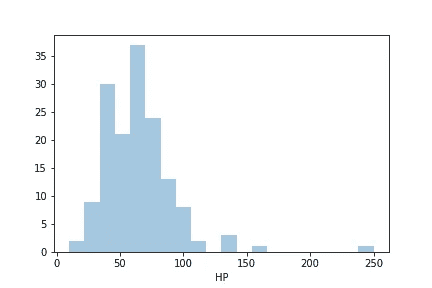

`kde = False`

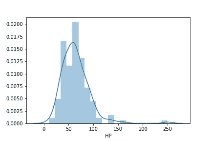

kde = True

我们还可以在同一个图中打印多个直方图，就像我们对线图所做的那样。对适当的输入列多次使用相同的命令。

*第 1 行*和*第 2 行*同上
第 23 行第 3 行:用`plt.legend()`方法强制图例出现在一个情节上

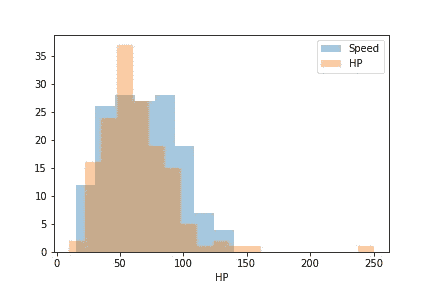

# 使用 Seaborn 的密度图

密度图显示两个变量之间的分布。人们可以把它们想象成平滑的直方图。它们对绘制随机变量的概率密度函数和概率质量函数很有用。

第 1 行:`sns.kdeplot`是用来绘制 KDE 图的命令。`data`被分配用于绘图的数据集，而`shade=True`用颜色填充曲线下的区域。

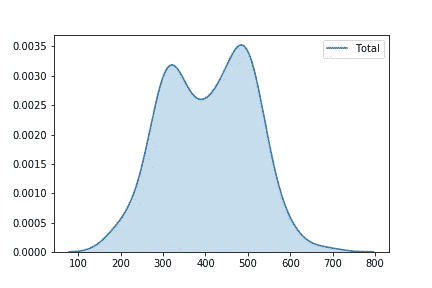

我们也可以在同一个图形中绘制多个 KDE 图，如下所示

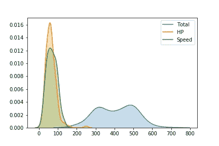

我们还可以使用`sns.jointplot`绘制第 2 列的 KDE 图

*第 1 行*:注意，现在我们再次回到 x、y 和数据参数。而`kind=”kde”`用于绘制 KDE 图，默认为`scatter`。

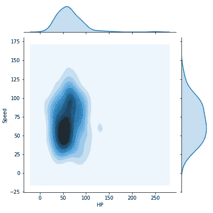

知道这一切对开始与 Seaborn 合作来说已经足够了。下图是我们所学内容的总结。

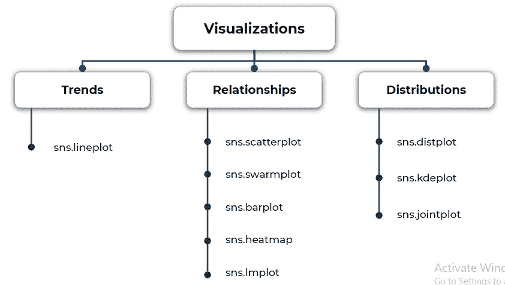

您可以点击查看用于本练习[的完整 jupyter 笔记本。](https://github.com/sanketkangle/Exploratory-Data-Analysis/blob/master/Seaborn_tutorial/Intro%20to%20Data%20Visualization%20using%20Seaborn%20and%20Matplotlib.ipynb)

感谢您阅读文章！想和我交流吗？这里是我的 Linkedin 个人资料的链接

 [## 桑基特·乐康—数据科学—学习&项目— | LinkedIn

### 在世界上最大的职业社区 LinkedIn 上查看桑凯特·乐康的个人资料。Sanket 有 8 个工作列在他们的…

www.linkedin.com](https://www.linkedin.com/in/sanket-kangle-460583a1/) 

所有的图片都是由作者创作的，除非注明出处