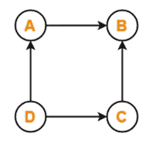
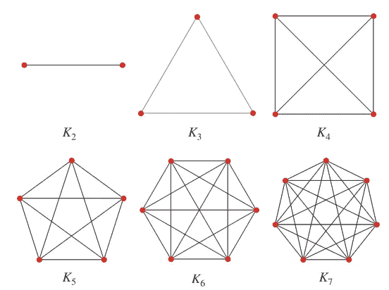
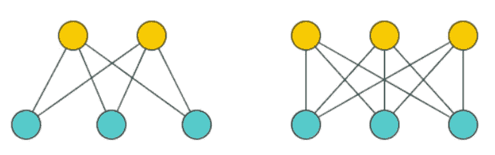
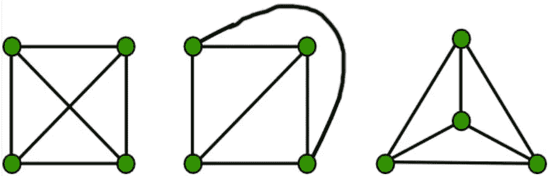
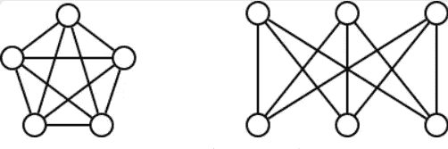

# 图论导论

> 原文：<https://medium.com/geekculture/intro-to-graph-theory-e20ec47546bf?source=collection_archive---------5----------------------->

图论是对具有成对关系的结构的研究。

Image by [Kevin Hartnett](https://www.quantamagazine.org/authors/kevin-hartnett/) on Quanta Magazine

图由顶点组成，有时称为节点或点，由边连接，有时称为线或链接。通常边最容易定义为它们连接的两个顶点的集合。

> **定义:**一个图 G=(V，E)是由成对的顶点组成的顶点 V 和边 E 的集合。

下图中，顶点为 *V={A，B，C，D}* ，边写成对 *E={(A，B)，(D，A)，(D，C)，(C，B)}。*

Graph by [Gate Vidyalay](https://www.gatevidyalay.com/graphs-types-of-graphs/)

需要注意的是，上面的图是一个**方向的**图。我们可以说它是一个有向图，因为边上有箭头，表示从箭头尾部的一个顶点到箭头头部的顶点的移动。这意味着被写成顶点对的边必须有特定的顺序。在上面的例子中，总是先写起始顶点，所以 *(D，A)* 是图中的一条边，而 *(A，D)* 不是。

当边只是没有箭头的线时，图是**无向图*，*** ，这意味着边可以以任何顺序书写。

# 图形的类型

上面关于图的定义以及有向图和无向图的概念足以开始学习图论，但是在这一节中，我将讨论一些特殊情况和类型的图。

## 完全图

完全图是这样的图，其中每个节点都与其他每个节点相连。在下图中，有 12 个节点，每个节点都有一条边将其连接到所有其他顶点。在一个有 n 个顶点的完全图中，它被标为 Kₙ，恰好有 n 条边。典型地，一个完整的图是无向的。

6 Complete Graphs Image by [Wolfram](https://mathworld.wolfram.com/CompleteGraph.html)

完全图出现在许多环境中，通常对理解图论中更复杂的问题很有用。理解在哪里可以找到一个完整的图，可以洞察一个图是如何连接的。

## 偶图

二部图有两组顶点。当 2 个集合的大小分别为 m 和 n 时，完整的二部图称为 kₙ,ₘ.

在下图中，这些集合显示为黄色和蓝色。如果同一个集合中没有两个顶点在一条边上相连，那么这个图就是二部图。如果一个集合中的每个顶点都通过一条边连接到另一个集合中的每个顶点，那么这个图就是完全二部图，如下图所示。

Bipartite Graph Image by [Book of Proofs](https://www.bookofproofs.org/branches/complete-bipartite-graph/)

二分图对于思考匹配问题很有用。您可以将这两个集合中的每一个视为一个组，与另一个组进行匹配。一个经典的例子是使用二分图来模拟谁对谁的约会感兴趣，其中人们只收集来自相反群体的其他人的数据。

## 平面图形

平面图是你可以在一张平面纸上画出的任何一个没有两条边交叉的图。虽然这看起来不是最复杂的问题，但是识别一个图形何时是平面的或者可以以平面形式绘制是一个有趣的问题。

An example of redrawing a graph to uncross edges. Image by [Geeks for Geeks](https://www.geeksforgeeks.org/mathematics-planar-graphs-graph-coloring/)

在左边，这个图看起来不是平面的，因为有两条边相交。在中间的图中，对角线边缘已经被移动到“围绕图”，这样没有两条边缘交叉，使其成为平面。最后，右边的图表移动了一些顶点，这样看起来更清晰一些。

左侧和右侧的图形是否具有相同的顶点和边结构并不明显，但遵循从左向右的转变会有所帮助。识别哪些图具有相似的结构，哪些图是同构的这个问题是图论中的一个基本问题，并且属于 NP 问题的计算类。

虽然识别哪些图是相似的并不总是容易的，但是根据下面的定理，识别哪些图是平面的是相当容易理解的。

> **瓦格纳定理:**一个图 g 是平面的当且仅当通过删除边或顶点或收缩边不能从 g 得到完全图 K₅或完全二部图 K₃,₃。

K₅ or K₃,₃ Graphs Image by [Rod Hilton](https://www.nomachetejuggling.com/2011/10/29/why-the-complete-bipartite-graph-k33-is-not-planar/)

收缩顶点是指删除一条边，然后连接该边末端的两个节点。我不会在这里给出瓦格纳定理的证明，但这是一个非常强大的想法，理解起来很重要。

这只是图论的冰山一角。有很多很棒的应用、想法和问题需要思考。图的着色、疾病在网络中的传播以及互联网都是基于图论背后的思想。

*如果你做到了这一步，按下鼓掌按钮。我刚接触媒体，正试图写出一些关于我如何看待数学、数据科学和计算机的内容。跟我来，如果你喜欢的话。*