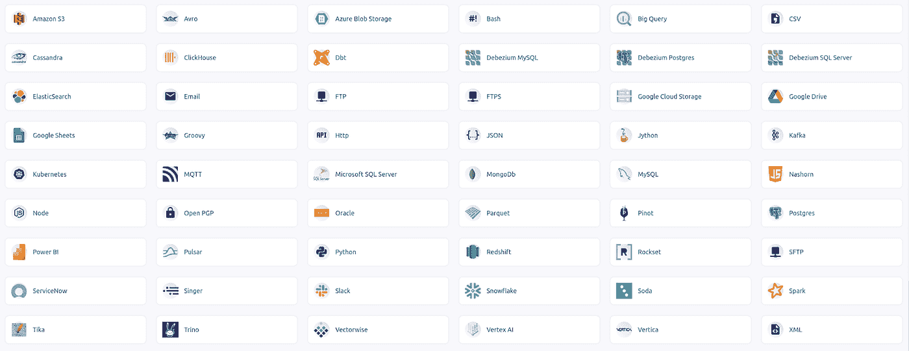
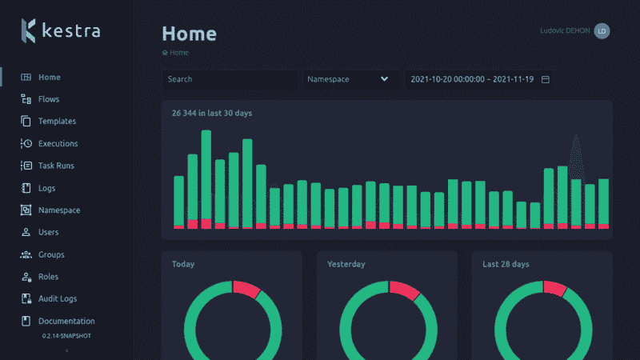

# Kestra 简介:开源编排和调度平台

> 原文：<https://medium.com/geekculture/intro-to-kestra-open-source-orchestration-and-scheduling-platform-a712f5238491?source=collection_archive---------1----------------------->

公司构建数据管道来准备数据成分、提取见解，并在内部和外部各方之间分发发现。处理各种海量数据的能力已经成为推动企业成功的关键因素。然而，构建和管理数据流并不简单。您必须考虑从不同来源提取数据的时间表和计划。当您最终将原始数据或转换后的数据持久化到数据仓库中时，您必须考虑转换、模型化和聚合。这很容易成为一项复杂的任务。

为了可靠地操作数据编排和调度，您应该非常清楚这样一个事实，即企业需要一个灵活且易于使用的平台。让我们尝试一下，并了解更多关于开源数据编制器 [Kestra](https://github.com/kestra-io/kestra) 的信息，以发现它如何以及是否能够简化数据流和开发过程。了解主要优势和特性！

# 凯斯特拉的两个主要概念

Photo by [Shubham Dhage](https://unsplash.com/@theshubhamdhage?utm_source=medium&utm_medium=referral) on [Unsplash](https://unsplash.com?utm_source=medium&utm_medium=referral)

Kestra 的构建模块是直接设计的，这有助于新用户快速掌握平台的基本概念和软件的工作方式。Kestra 有[两个大概念](https://kestra.io/docs/concepts/)，每个都由更小的组件组成。

## 流动

一个[流](https://kestra.io/docs/concepts/flows.html)是一个按照名称空间分组的简单任务列表。它存储当前流程中发生的所有操作。流程包含以下组件。

*   任务:任务是流程中的一个动作。任务可以接受输入、执行作业或生成输出。在 Kestra 有两种类型的任务。
*   **可流动任务:**可流动任务处理工作流状态并启动新任务。他们负责流的逻辑，这允许您构建复杂的工作流，例如分支和并行任务。
*   **可运行任务:**可运行任务是一个实际的计算任务。它可以是任何类型的作业，比如运行脚本、API 调用、文件系统操作、数据库查询等等。
*   **名称空间:**名称空间类似于文件系统的文件夹。它用于定义层次结构中的流。
*   **输入:**输入是发送给流程的参数。您可以传递字符串、整数、文件或更多形式的各种参数。
*   **版本:**修改时，会生成新的版本。它是一个增量数字，每次更改后都会更新。
*   **监听器:**监听器是一类任务，可以监听当前流，也可以执行当前流之外的任务。
*   **触发器:**触发器作为外部事件流的启动器。
*   **模板:**模板是可以在不同的流程中引用的任务列表。

## 执行

下面的高层概念是[执行](https://kestra.io/docs/concepts/executions.html)。执行是正在处理或已经完成的流程。

*   **任务运行:**它是一个正在运行或已经运行并与其状态相关联的任务(输出见下文)。
*   **尝试:**单个任务运行可以有一次或多次尝试。通常，任务运行将只有一次尝试。但是，当任务失败时，它可以增加重试次数。
*   **输出:**任务运行可以产生输出数据，这些数据可以传递给其他任务。
*   **指标:**任务可以创建指标数据，这些数据可用于跟踪任务状态。
*   **状态:**状态用于定义任务运行或执行的状态。

# 灵活的流程定义

在 Kestra 中，**一个** [**流**](https://kestra.io/docs/developer-guide/flow/#flow-sample) **可以在一个 YAML 文件**中定义，该文件可以用来在不同的环境中重现一个流。因为 YAML 是基础设施即代码服务的一种通用文件格式，而且使用起来很简单。这非常重要，因为您可以对流程中的所有变更进行源代码控制，并在构建流程时支持团队协作。在 YAML 使用 Kestra 的流定义，你可以控制它并应用不同的逻辑。

*   **顺序:**可以按顺序运行任务。
*   **并行:**可以同时执行任务。
*   **循环:**根据之前任务的输出，可以多次重复一个任务。
*   **切换:**可以根据当前状态分支出流程。
*   **暂停:**你可以在一个任务后暂停。
*   **触发:**您可以基于事件或他人的流程结束来启动流程。

# 丰富的 Kestra 插件

Kestra’s actual plugins

[**Kestra 插件**](https://kestra.io/plugins/) **使其高度通用，并允许您与不同的系统、数据库、服务和软件进行交互。**这是您评估作业编排工具时最重要的因素之一，因为编排软件本身并不是为执行繁重的数据处理或计算密集型作业而构建的。相反，它将这些工作分配给外部资源。

当您想要转换数据并将其保存到存储中时，您需要能够在关系数据库、NoSQL、数据仓库甚至云文件系统中连接和运行查询的插件。Kestra 在这个领域有广泛的覆盖，包括所有流行的关系和非关系数据库。此外，它可以与流行的数据仓库解决方案进行通信，如红移、雪花、大查询和云文件存储，如 AWS S3、GCP、Google Drive 等。

如果您想运行编排好的 DevOps 任务，您也可以这样做。您可以使用 Python、Bash 和 Node 中的定制代码启动 Docker 映像或控制 Kubernetes，以实现高级管道。您可以访问其他现代书库，如 dbt、Soda、Singer 和 Debezium。在他们所有支持的插件之上，**你可以构建你自己的插件**！

# 直观的用户界面

Kestra’s user interface

**Kestra 配备了一个直观且功能齐全的用户界面。**在基于网络的用户界面上，用户可以编辑配置、运行流程，并实时监控所有历史和当前执行情况。

# 轻松开发

**Kestra 支持**[**terra form**](https://kestra.io/docs/terraform/)**一体化。**使用它，您可以部署流程并在不同的环境中重现相同的流程，例如开发、UAT、阶段或生产。在 YAML 中定义流程、任务和流程逻辑的能力支持 CI/CD 部署成员之间可伸缩的团队合作。

# 结论

我们发现了 Kestra 的主要概念和特征。包括腾讯、宝马、华为、 [Leroy Merlin](/@kestra-io/how-leroy-merlin-managed-their-cloud-data-pipelines-with-kestra-9932ea66b517) 等大型企业都在使用该平台。Kestra 是开源软件，因此您可以[开始试用](https://kestra.io/docs/getting-started/)它，并研究检查编排工具是否适合您的用例，而不必担心试用期。使用开源工具的另一个优势是，它可以在任何云服务上实现，可以在本地实现，甚至可以在本地磁盘上测试。Kestra 有一个集装箱化的形象，便于开始。

如果您想尝试，请查看 Kestra Github 存储库:

 [## GitHub - kestra-io/kestra: Kestra 是一个无限可扩展的编排和调度平台…

### Kestra 是一个无限可扩展的编排和调度平台，创建、运行、调度和监控…

github.com](https://github.com/kestra-io/kestra)