# React-Redux 简介

> 原文：<https://medium.com/geekculture/intro-to-react-redux-f33d0edc8a29?source=collection_archive---------21----------------------->

## 使用 Redux 快速了解状态管理，包括演练

在使用了 React 一段时间后，可以说你已经不得不经常处理状态了。你也可能听说过 Redux，它可以帮助你更有效地管理你的状态。现在，我应该提到，完全有可能创建一个没有 Redux 实现的应用程序，这很好，我已经做到了。但是随着应用程序的增长和变得更大，在应用程序的各个组件层中管理状态变得更加困难。这就是 Redux 可以介入并帮助我们管理应用程序状态的地方。

让我们首先更深入地了解一下 Redux 是什么，以及它实际上为我们这些开发人员做了什么。之后，我们将使用 Redux 来管理示例 React 应用程序中的状态。

## redux 是什么？

嗯，根据定义，Redux 是几乎所有 JavaScript 应用程序的可预测状态容器，不管您喜欢 React、vanilla 还是 Vue。这里的关键是 Redux 是可预测的，因为它是可预测的，所以我们知道它的行为是一致的。

## 但是为什么要用 Redux 呢？

Redux 的卖点是它将维护应用程序的整体状态。但是 React 难道没有能力在整个应用程序中自己管理状态吗？是的，它确实是这样，但是我们声明 state 的地方意味着所有的反应。Redux 允许我们将状态全球化和集中化。这是因为我们的状态来自我们的“存储”，它是我们真理的唯一来源。看看下面的例子:

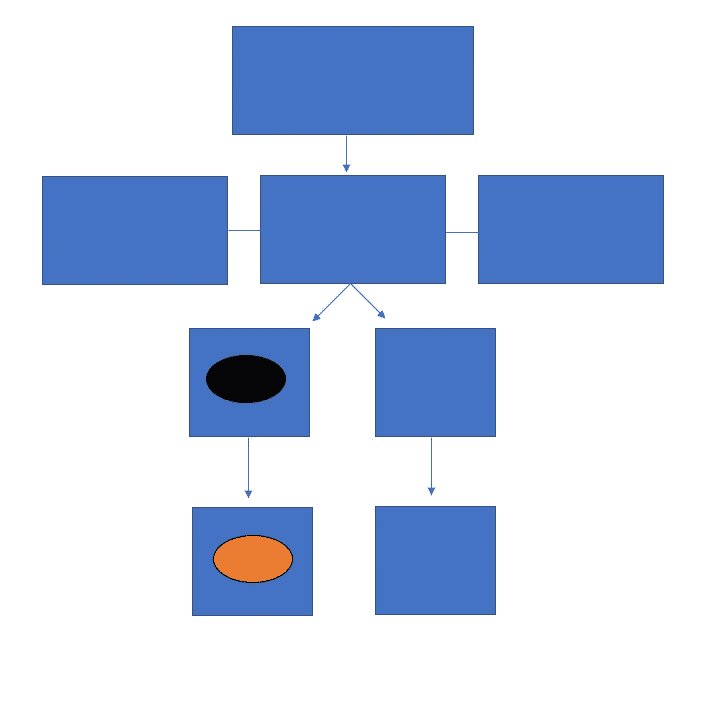

如果不使用 redux，当前状态中的状态只能被它自己和它的子组件访问。如果我们需要访问我们在父组件或单独组件中声明的状态，该怎么办？在这种情况下，我们需要将状态容器移动到最高的组件级别。

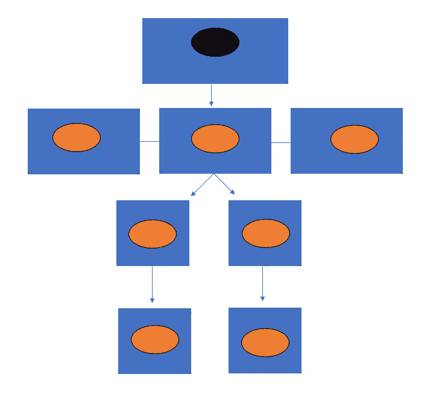

使用 Redux，我们能够在许多不同的组件层上创建状态，并在整个应用程序中访问状态。

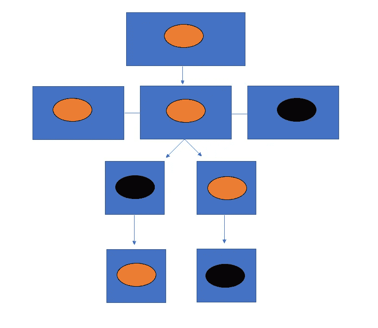

如果你想跟随我们使用 Redux 的演练，你可以在这里找到样板报告。

## 使用 Redux

现在我们对 redux 是什么以及它能为我们做什么有了一个基本的概念，让我们开始实际使用它并存储一些状态。我们首先需要为我们的 React 应用程序安装 Redux，但这并不像即插即用那么简单。要安装必要的 Redux 包，您可以通过运行以下命令来完成。

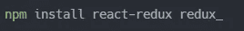

This will install redux and redux for react

完成后，我们可以前往 index.js，在那里我们将使用 Redux 的提供者包装我们的应用程序。这应该始终是您的第一步，因为这将有助于使 Redux 的存储在整个应用程序中全局化，因为它存在于最高层。我们必须确保首先从 react-redux 包中导入 Provider，然后可以像这样替换 react strict 模式，

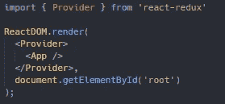

您可能还注意到，我已经向我们的提供商添加了一个商店道具，但目前是空的。这是因为我们需要先创建我们的商店，然后再把它交给我们的提供商。在我们创建我们的存储之前，让我们来谈谈 Redux 文件结构。尽管对于我们的应用程序级别来说，这似乎不是必需的，但是这是一个好的实践，因为状态只有变大的可能性。

为此，我们可以在 source (src)文件夹中创建一个名为 redux 的新文件夹。然后，我们将在 redux 命名的 store 中创建一个包含 index.js 的新文件夹。这个函数碰巧接受了另一个函数，我们的 reducer，我们很快就会创建它。现在，我们将通过我们的减速器的未来名称，主减速器。您的 redux/store/index.js 应该如下所示:

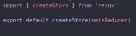

我们还可以将我们创建的商店传递给我们的提供商。我们只需要导入我们的存储文件夹，因为导入文件夹时，导入将查找 index.js。值得注意的是，给你的商店命名也是惯例。更新后的 src/index.js 应该如下所示:

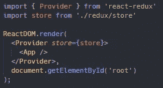

我们现在已经为我们的应用程序创建了全局存储，但是我们仍然有一个问题。我们不是刚刚在我们的商店中放置了一个尚不存在的 reducer 功能吗？是的，我们绝对做到了，但不要担心，现在会引导我们构建主减速器。为了保持我们的文件结构看起来不错，我们将在 redux 中创建新的文件夹名为 reducers，并创建一个名为 pokemon.js 的文件。这是我们将为最初的 151 个神奇宝贝创建 reducer 的地方。

我们的 reducer 是一个函数，它总是将状态和动作作为参数。最棒的是，我们可以直接声明我们的状态数据类型，在这种情况下是一个空数组，而不是不定义它。我们不需要定义我们的动作类型，因为稍后会通过我们的 dispatch 函数传入。我们需要告诉我们的 reducer，它的动作类型可以根据我们发送的命令而变化。之后，我们还需要向我们的 reducer 声明如何处理这些动作类型。默认情况下，我们希望它返回我们的状态，并且在这一点上，技术上有一个完整的减速器。

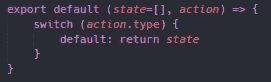

但是还没有完全完成。我们还需要在 reducers 文件夹中创建一个 index.js 和一个 user.js。我们将创建另一个 reducer 来保存我们的用户的状态，这是我们默认设置的，看起来几乎与我们的 pokemon.js 相同。我这样做的原因是因为你很少会只处理一个状态，要有多个状态，我们需要调用 redux 提供的 combine reducers 函数。

在我们的 redux/reducers/index.js 中，我们将导入联合减速器函数，以及我们的两个状态 Pokémon 和 user，然后在联合减速器函数中返回。现在我们已经完成了主减速器，我们需要确保将其导入到我们的商店中，以便正常工作。

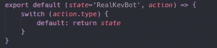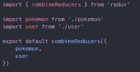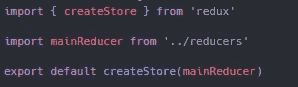

现在我们已经建立了我们的基础，让我们实际上设置我们的神奇宝贝的状态，从获取请求到唯一的 [pokiapi](https://pokeapi.co/) 。为了开始，我们将前往我们的 app.js，是的，我知道这是应用程序的顶层，为什么我们需要 Redux 无论如何，但我们现在保持事情简单。我们将使用 React 的钩子使用效果来模拟一个组件为获取神奇宝贝而挂载。一切看起来都非常相似，直到我们需要为神奇宝贝设置 Redux 商店的状态。

为此，我们需要将我们的操作分派到商店，使用 use dispatch 函数可以更容易地做到这一点，它将为我们提供对 dispatch 函数的访问。在将我们的 use dispatch 函数设置为 dispatch 的常量变量之后，为了便于使用，我们现在可以设置我们的状态。我们的调度将接受一个动作“type ”,正如我们在 reducer 中声明的那样，但是我们还没有类型。不要担心，我们将创建我们的类型的名称，现在称为 set Pokémon，以及设置我们的有效载荷。您当前的 app.js 应该是这样的，

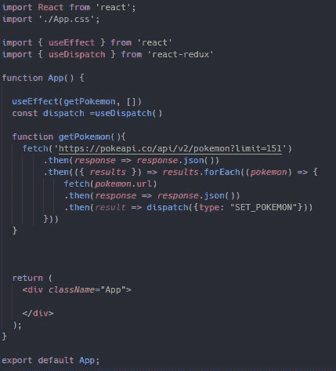

在我们进一步构建前端之前，我们需要让 Redux 了解我们的新动作类型，特别是我们的神奇宝贝缩减器。因为它现在知道要做的就是返回我们给它的初始状态。为了补救这种情况，我们只需要在我们的 reducer 中添加一个 case，让它知道我们将设置我们的神奇宝贝，并在我们的 set Pokémon 操作被调度后返回我们的 Pokémon 的“更新”状态。

此外，我们还想在 redux named types 内创建另一个新文件夹，带有一个 index.js。如果您现在还不明白，这是我们将存储和声明我们不同的操作案例类型的地方。同样，它现在可能会看到反直觉，因为我们目前只有一种类型，但应用程序只能变得更大，所以做好最坏的准备，并为更多的状态做好准备。确保将你设置的神奇宝贝类型导入到你的神奇宝贝还原器中，

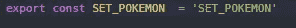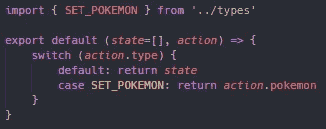

现在我们的 reducers 终于准备好了，我们可以回到我们的 app.js，在这里我们需要使用选择器进行最后的导入。这是 React Redux 包提供的另一个功能，它本质上允许我们从存储中选择状态。它将简单地接收状态，然后返回我们想要的东西，在本例中是我们的神奇宝贝。我们将把它设置为一个同名的常量变量，这样在试图向页面呈现某些内容时非常容易使用，

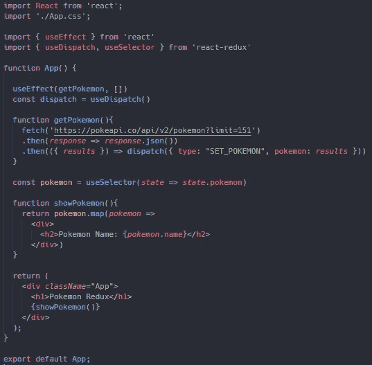

在上面的例子中，我们映射了 state 中的每个神奇宝贝，为每个神奇宝贝呈现了一个包含它们名字的 div。正如我之前所说的，我自己已经创建了许多不使用 Redux 的 React 应用程序，这并没有错。您的应用程序可能需要也可能不需要实现 Redux，但这是您需要自己做出的决定。

如果你想查看这段代码的副本，或者只是作为参考，你可以在这里找到 GitHub Repo [的链接。](https://github.com/TheRealKevBot/ReduxBlog)

我要感谢你的阅读，并希望你学到了新的东西！请关注未来更多文章！