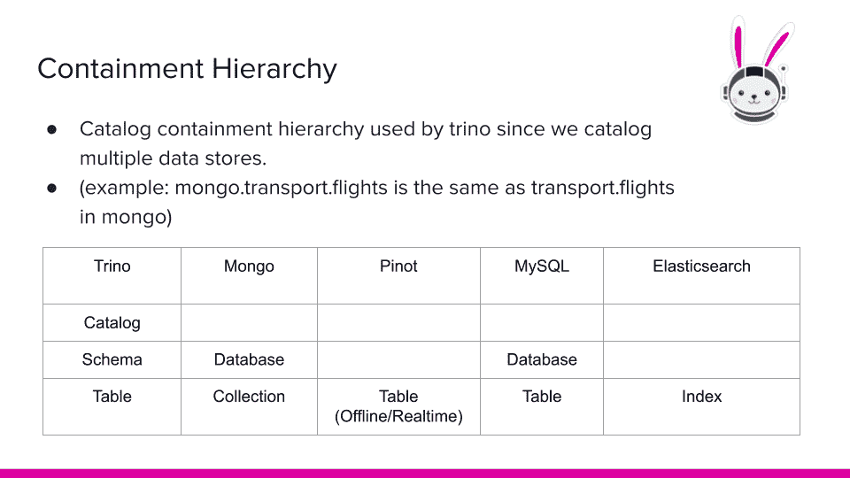

# Trino 介绍给 Trinewbie

> 原文：<https://medium.com/geekculture/intro-to-trino-for-the-trinewbie-a5a1088d3114?source=collection_archive---------0----------------------->

## 了解如何快速连接多个来源的数据

如果你以前没有听说过 Trino，它是一个查询引擎，可以说许多类型的数据库的语言。因此，Trino 通常用于提供跨异构数据源的快速特别查询。Trino 最初的用例是围绕替换 Hive 运行时引擎构建的，以允许更快地查询大数据仓库和数据湖。这可能是你第一次听说 [Trino](https://trino.io/) ，但是你可能听说过它的来源项目[【叉车】](https://venturebeat.com/2021/08/27/who-owns-open-source-projects-people-or-companies/)，很快。如果你想了解更多关于[为什么 Presto 的创造者现在在 Trino(以前的 PrestoSQL)](https://trino.io/blog/2020/12/27/announcing-trino.html) 上工作，你可以阅读他们今年早些时候制作的重命名博客。在你对这个博客投入太多之前，我想让你知道为什么你应该关心 Trino。


# 那么 Trino 到底是什么？

在讨论 Trino 时，我想确保人们知道的第一件事是，它是一个 SQL 查询引擎，但不是 SQL 数据库。那是什么意思？传统数据库通常由查询引擎和存储引擎组成。Trino 只是一个查询引擎，并不存储数据。相反，Trino 与各种数据库交互，这些数据库以自己的格式存储自己的数据。Trino 解析并分析您传入的 SQL 查询，创建并优化包含数据源的查询执行计划，然后调度能够智能查询它们所连接的底层数据库的工作节点。

我说聪明，特别是指下推查询。没错，Trino 要做的最明智的事情是避免为自己做更多的工作，并尝试将这些工作卸载到底层数据库。这是有意义的，因为底层数据库通常有特殊的索引和数据，它们以特定的格式存储，以优化读取时间。Trino 忽略所有优化的读取能力，对所有数据进行线性扫描来运行查询本身是愚蠢的。针对 Trino 的大多数优化的目标是将查询下推到数据库，并且只获取与另一个数据库中的另一个数据集连接所需的最少量的数据，做一些特定于 Trino 的进一步处理，或者只是作为查询的正确结果集返回。

## 询问所有的事情

所以我还没有真正回答你为什么要关心 Trino 的问题。简短的回答是，Trino 作为一个单一的访问点来查询所有的东西。没错。哦，它在各种数据源上的即席查询速度非常快，包括数据湖(如冰山/数据块)或数据仓库(如蜂巢/雪花)。它有一个[连接器架构](https://trino.io/docs/current/develop/connectors.html)，允许它使用[的语言和一大堆数据库](https://trino.io/docs/current/connector.html)。如果您有一个特殊的用例，您可以编写自己的连接器，将任何数据库或服务抽象成 Trino 领域中的另一个表。很酷吧？但是实际上很少需要这样做，因为最常见的数据库已经为它们编写了一个连接器。如果没有，[Trino 的开源社区每隔几个月就会添加更多的连接器](https://github.com/trinodb/trino/issues/4500)。

为了让运行联邦查询的好处更加明显，我将给出一个例子。Trino 为用户带来了映射[标准化 ANSI SQL](https://trino.io/docs/current/language.html) 查询的能力，以查询拥有[自定义查询 DSL 的数据库，如 Elasticsearch](https://www.elastic.co/guide/en/elasticsearch/reference/current/query-dsl.html) 。使用 Trino，建立一个 Elasticsearch 目录并开始在其上运行 SQL 查询非常简单。如果这没有让你大吃一惊，让我解释一下为什么它如此强大。

假设您有五个不同的数据存储，每个都有自己独立的查询语言。您的数据科学或分析团队只想访问这些数据存储。他们必须单独访问每个数据系统，查找不同的命令以从每个系统中提取数据，然后将数据转储到一个位置并进行清理，以便他们可以实际运行有意义的查询，这将花费大量的时间。有了 Trino，他们只需要使用 SQL 通过 Trino 访问它们。此外，它不仅仅停留在访问数据上，您的数据科学团队还能够跨不同数据库的表连接数据，例如像 Elasticsearch 这样的搜索引擎和 MySQL 这样的运营数据库。此外，使用 Trino 甚至可以在不支持连接的地方连接数据源，比如在 Elasticsearch 和 MongoDB 中。发生了吗？你疯了吗？

# Trino 入门

那么试驾 Trino 需要什么呢？相对于许多开源数据库项目，Trino 是安装更简单的项目之一，但这仍然不意味着它很容易。一个成功项目的一个重要元素是它如何适应新用户，并扩展增长和采用的能力。这确实强调了确保使用产品有多种途径的重要性，所有这些途径都有不同程度的难度、成本、可定制性、互操作性和可伸缩性。随着可定制性、互操作性和可伸缩性水平的提高，您通常会看到难度或成本的增加，反之亦然。幸运的是，当你开始的时候，你真的需要和崔诺一起玩。


Image added by Author

试用 Trino 的低成本低难度方式是使用 [Docker 容器](https://www.docker.com/)。这些容器的好处在于，你不需要真正了解 Trino 的安装过程就可以使用 Trino。虽然许多人喜欢浏览文档并与 Trino 一起工作来设置它，但它可能并不适合所有人。我当然有喜欢凉爽气候的日子，也有需要选择不去的日子。如果您想跳过简单的按钮来部署 Trino(提示，这是 SaaS 部署)，那么跳过接下来的几节。

## 使用 Trino 和 Docker

Trino 为[提供了一个 Docker 镜像](https://hub.docker.com/r/trinodb/trino)，它为 Trino 的运行做了很多必要的设置。除了简单地运行 docker 容器之外，设置时还需要做一些事情。首先，为了使用像 mysql 这样的数据库，我们实际上需要使用官方的 MySQL 映像运行一个 MySQL 容器。有一个[trino 入门库](https://github.com/bitsondatadev/trino-getting-started)，它包含了在你自己的电脑上使用 Trino 或者在测试服务器上设置 Trino 作为概念验证所需的大量设置。克隆这个库，如果 Docker 还没有安装，那么按照 README 中的说明安装它。

在了解这个合成文件如何工作的细节之前，您实际上可以运行一个查询。在运行查询之前，您需要运行 mysql 和 trino-coordinator 实例。为此，导航到包含 docker-compose.yml 的 mysql/trino-mysql/目录并运行:

```
docker-compose up -d
```

## 运行您的第一个查询！

现在您已经在 Docker 中运行了 Trino，您需要打开一个会话来访问它。最简单的方法是通过控制台。运行以下 Docker 命令连接到协调器上的终端:

```
docker container exec -it trino-mysql_trino-coordinator_1 trino
```

这会把你带到特里诺终点站。

```
trino>
```

您的第一个查询实际上是从 tpch 目录中生成数据，然后查询加载到 mysql 目录中的数据。在终端中，运行以下两个查询:

```
CREATE TABLE mysql.tiny.customer
AS SELECT * FROM tpch.tiny.customer;SELECT custkey, name, nationkey, phone 
FROM mysql.tiny.customer LIMIT 5;
```

输出应该是这样的。

```
|custkey|name              |nationkey|phone          |
|-------|------------------|---------|---------------|
|751    |Customer#000000751|0        |10-658-550-2257|
|752    |Customer#000000752|8        |18-924-993-6038|
|753    |Customer#000000753|17       |27-817-126-3646|
|754    |Customer#000000754|0        |10-646-595-5871|
|755    |Customer#000000755|16       |26-395-247-2207|
```

恭喜你。你刚刚在 Trino 上运行了你的第一个查询。你感觉到了吗？？好吧，从技术上讲，我们只是从数据生成连接器复制数据，并将其移动到 MySQL 数据库中，然后查询出来。如果这个简单的练习没有让你起鸡皮疙瘩，那很好，但希望你可以在连接到其他数据集时推断出可能性。

在进入 Trino 安装文档之前，最好先学习一下 compose 文件和目录。让我们通过分解刚才运行的 docker-compose 文件来看看这是如何实现的。

```
version: '3.7'
services:
  trino-coordinator:
    image: 'trinodb/trino:latest'
    hostname: trino-coordinator
    ports:
      - '8080:8080'
    volumes:
      - ./etc:/etc/trino
    networks:
      - trino-network

  mysql:
    image: mysql:latest
    hostname: mysql
    environment:
      MYSQL_ROOT_PASSWORD: admin
      MYSQL_USER: admin
      MYSQL_PASSWORD: admin
      MYSQL_DATABASE: tiny
    ports:
      - '3306:3306'
    networks:
      - trino-network
networks:
  trino-network:
    driver: bridge
```

请注意，mysql 的主机名与实例名相匹配，并且 mysql 实例位于 trino-coordinator 实例也将加入的 trino-network 上。还要注意，mysql 镜像暴露了网络上的端口 3306。

最后，我们将使用 trino-coordinator 实例的 trinodb/trino 映像，并使用 volumes 选项将 trino 的本地定制配置映射到/etc/trino 目录，我们将在下面的 *Trino 配置*部分中进一步讨论。trino 也应该添加到 trino-network 并公开端口 8080，这是外部客户端访问 Trino 的方式。下面是 docker-compose.yml 文件的一个例子。完整的配置可以在这个【Trino 库中找到。

这些说明是对[的基本概述，更完整的安装说明](https://trino.io/docs/current/installation/deployment.html)如果你真的要用的话！如果您对安装不感兴趣，可以直接跳到使用 Kubernetes 大规模部署 Trino 一节。如果你不想和 Kubernetes 打交道，我给你提供另一个进入本博客简单按钮部分的途径。

## Trino 要求

第一个要求是 Trino 必须在兼容 POSIX 的系统上运行，比如 Linux 或 Unix。社区中有些人已经让 Trino 在 Windows 上运行，并使用 cygwin 这样的运行时环境进行测试，但这并没有得到官方支持。然而，在我们的容器化世界中，这不是一个问题，不管你使用哪种操作系统，你至少可以在 [Docker](https://www.docker.com/) 上测试这个。

Trino 是用 Java 编写的，所以它需要 Java 运行时环境(JRE)。Trino 要求 64 位版本的 Java 11，最低要求版本为 11.0.7。建议使用更新的修补程序版本，如 11.0.8 或 11.0.9。Trino bin/launcher 的启动脚本也需要 python 版本 2.6.x、2.7.x 或 3.x。

## Trino 构型

要配置 Trino，首先需要知道 Trino 配置目录。如果您手动安装 Trino，默认情况下将位于相对于安装目录的 etc/目录中。对于我们的例子，我将使用默认的安装目录 [Trino Docker 镜像](https://hub.docker.com/r/trinodb/trino)，它是在 run-trino 脚本中设置为/etc/trino 的[。我们需要在这个基本目录下创建四个文件。我将描述这些文件做什么，你可以在我下面创建的 docker 图像中看到一个例子。](https://github.com/trinodb/trino/blob/356/core/docker/bin/run-trino#L15)

1.  config.properties —这是 trino 集群中每个节点的主要配置。这里有很多选项可以设置，但是在测试时，您通常会希望使用默认设置。所需的配置包括指示节点是否是协调器、设置 Trino 通信的 http 端口以及发现节点 url，以便 Trino 服务器可以找到彼此。
2.  JVM . config——该配置包含您将传递给运行 Trino 的 java 进程的命令行参数。
3.  log . properties——这个配置有助于指示 Trino 中各种 java 类的日志级别。它可以留空以对所有类使用默认日志级别。
4.  node.properties —此配置用于唯一标识群集中的节点，并指定节点中目录的位置。

您需要了解的下一个目录是目录/目录，位于根配置目录中。在 docker 容器中，它将位于/etc/trino/catalog 中。这个目录将包含 Trino 用来连接不同数据源的目录配置。对于我们的例子，我们将配置两个目录，mysql 目录和 tpch 目录。tpch 目录是一个简单的数据生成目录，只需要配置 conector.name 属性，它位于/etc/trino/catalog/tpch . properties 中。

tpch.properties

```
connector.name=tpch
```

mysql 目录只需要 connector.name 来指定要使用的连接器插件、指向 mysql 实例的 connection-url 属性以及 mysql 用户的 connection-user 和 connection-password 属性。

mysql .属性

```
connector.name=mysql
connection-url=jdbc:mysql://mysql:3306
connection-user=root
connection-password=admin
```

注意:配置文件的名称成为 Trino 中目录的名称。如果您熟悉 MySQL，您可能知道 MySQL 支持两层包容层次结构，尽管您可能从来不知道它的名称。这种包含层次结构指的是数据库和表。层次结构的第一层是*表*，而第二层由*数据库*组成。一个数据库包含多个表，因此如果两个表位于不同的数据库中，它们可以有相同的名称。



Image by Author

因为 Trino 必须连接到多个数据库，所以它支持三层的包容层次结构。Trino 没有将第二层称为数据库，而是将这一层称为*模式*。所以 MySQL 中的数据库相当于 Trino 中的模式。第三层允许 Trino 区分由*目录*组成的多个底层数据源。因为提供给 Trino 的文件名为 mysql.properties，所以它会自动将目录命名为 mysql，而不使用。属性文件类型。要查询 MySQL 中 tiny 下的 customer 表，需要指定以下表名 mysql.tiny.customer。

如果你已经到了这一步，那么恭喜你，你现在知道如何建立目录并通过 Trino 查询它们了！在这一点上的好处应该是显而易见的，这种方式很容易实现概念验证。是时候为您的团队和老板收集概念证明了！接下来呢？实际上，如何以可重复和可扩展的方式进行部署呢？下一节将简要介绍大规模部署 Trino 的快速方法。

# 使用 Kubernetes 大规模部署 Trino

到目前为止，这篇文章只描述了部署过程。在此之后，一旦您将 Trino 部署到生产环境中，并慢慢加入工程、BI/Analytics 和您的数据科学团队，情况会如何呢？正如许多 Trino 用户所经历的那样，随着 Trino 集群成为访问所有数据的单点，对它的需求会快速增长。这是这些小型概念验证规模的安装开始崩溃的地方，当您的系统开始承担更重的工作负载时，您将需要更灵活的东西来扩展。

您将需要监视您的集群，并且可能需要支持运行这些监视任务的其他服务。这也适用于运行其他安全和认证管理系统。当您考虑到所有这些系统都需要围绕不断增长的 Trino 集群进行扩展和适应时，这个复杂性列表还会增加。例如，您可以考虑部署[多个集群来处理不同的工作负载](https://shopify.engineering/faster-trino-query-execution-infrastructure)，或者可能运行数十或数百个 Trino 集群来提供一个自助服务平台，从而在您的平台中提供隔离租用。

通过使用像 Kubernetes 这样的编排平台及其包管理器项目 Helm，已经解决了将所有这些复杂场景表示为配置的解决方案。Kubernetes 提供了一种强大的方式来表达所有基于用例的复杂的适应性基础设施。

为了简洁起见，我将不包括如何运行 helm chart 的全套说明，也不涉及在 Kubernetes 上运行 Trino 的基础知识。相反，我会向你推荐一集 Trino 社区广播,其中讨论了 Kubernetes、社区掌舵图以及在 Kubernetes 上运行 Trino 的基础知识。为了透明起见，[官方的 Trino helm 图表](https://github.com/trinodb/charts)仍处于早期开发阶段。有一个非常受欢迎的[社区贡献的掌舵图](https://github.com/valeriano-manassero/helm-charts/tree/main/valeriano-manassero/trino)，它被许多用户修改以适应他们的需求，并且是目前 Trino 自我管理部署的最佳开源选项。如果你决定走这条路，小心前进，要知道有[发展来支持舵部署](https://github.com/trinodb/charts/pull/11)向前发展。

虽然这将提供所有的工具，使一个非常适合的工程部门能够运行和维护他们自己的 Trino 集群，但这回避了一个问题，即根据您的工程团队规模，您和您的公司是否应该投入昂贵的数据工程师时间来维护、扩展和黑客攻击，以保持完整规模的生产基础架构正常运行？

# 星爆银河:部署和维护 Trino 的简单方法


Image By: lostvegas, License: CC BY-NC-ND 2.0, Source: [https://www.flickr.com/photos/lostvegas/2214183472](https://www.flickr.com/photos/lostvegas/2214183472)

如前所述，Trino 有一个相对简单的部署设置，重点是相对。谈到管理和扩展 Trino 所涉及的复杂性，这篇博客实际上只是触及了冰山一角。虽然在 Kubernetes 中管理运行 Trino 是可能的，甚至可以使用头盔图表进行缩放，但对于 Trinewbies 来说，这仍然是一个困难的设置，对于那些已经有维护 Trino 经验的人来说，这也是一个困难的维护和缩放。当我几年前开始我的 Trino 之旅时，我亲身经历了许多这样的困难，并开始寻求帮助他人克服这些挑战。这让我与 SaaS·特里诺平台银河背后的公司 Starburst 不期而遇。

Galaxy 使 Trino 对那些难以根据自己的需求扩展和定制 Trino 的公司变得容易。除非你所在的公司拥有一个大规模的数据平台，并且你的平台上的每个系统都有专门的数据和开发工程师，否则从长远来看，这些选择对你来说是不可行的。

有一点需要明确的是，一个星系团实际上只是一个需要的 Trino 星系团。除了管理扩展策略之外，为了避免您的云账单出现任何意外，您真的不必考虑扩大或缩小 Trino，或者在不使用时暂停它。Trino 和 Galaxy 的美妙之处在于，它是一个短暂的计算引擎，就像 AWS Lambda 一样，可以快速加速或减速。您不仅能够在不同的数据源上运行特别的和联合的查询，而且现在您还可以按需运行这些查询的基础结构，几乎不需要花费您的工程团队的时间。

## 银河入门

这里有一个快速入门指南，反映了我们在上面的 Docker 例子中用 Trino 和 MySQL 实现的设置。

*   通过在 [Galaxy 信息页面](http://starburst.io/galaxy)的底部填写您的信息来设置 Galaxy 试用。
*   一旦你收到一个链接，你会看到这个注册屏幕。填写电子邮件地址，输入发送到电子邮件的 pin，并为您的集群选择域。
*   教程的其余部分在下面的视频中提供，它提供了一个基本的演示，告诉你需要做些什么来开始。

Video by Author

这种介绍可能让人感觉有点乏味，但可以推断出能够跨关系数据库运行联邦查询，如 MySQL，这是一个在 S3 存储数据的数据湖，或者很快会在许多 NoSQL 和实时数据存储中存储数据。《星爆银河》的真正力量在于，现在你的团队将不再需要奉献一大堆旨在扩大和缩小规模、监控和保护崔诺的门票。相反，您可以返回来关注业务问题和您领域中数据的最佳模型。

这真的为 Trino 社区打开了一个令人兴奋的未来。本着[最近发布的光年电影](https://www.youtube.com/watch?v=BwPL0Md_QFQ)的精神，“到无限，甚至更远！”