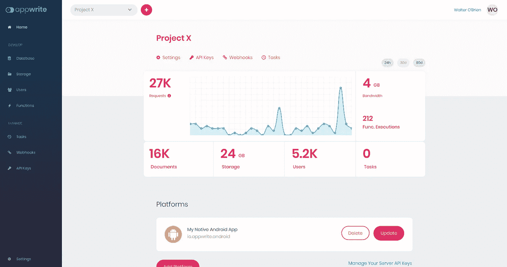
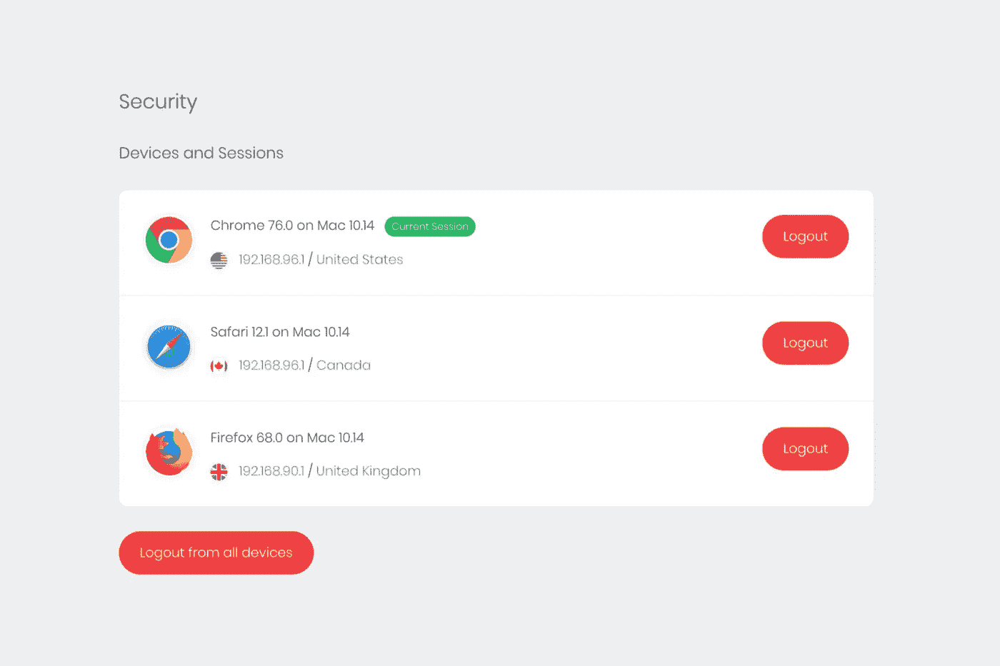
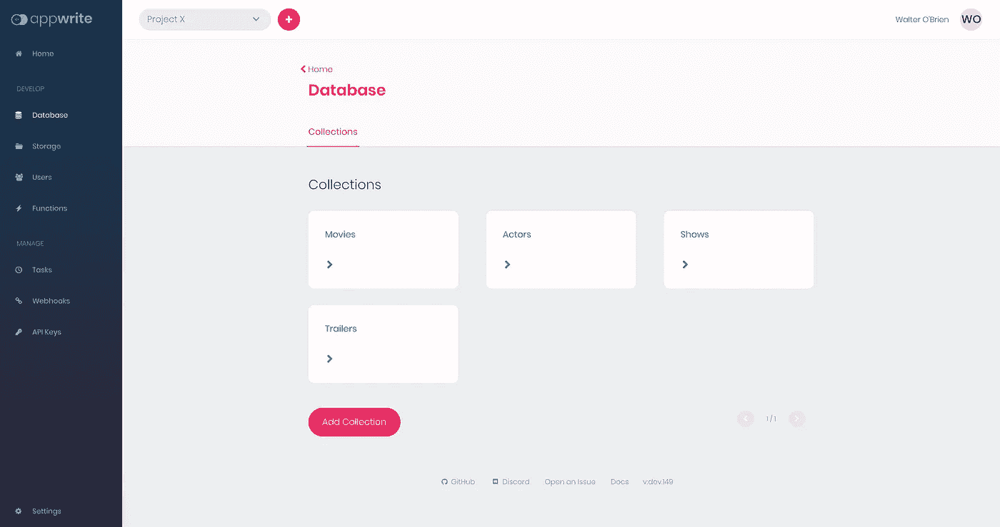
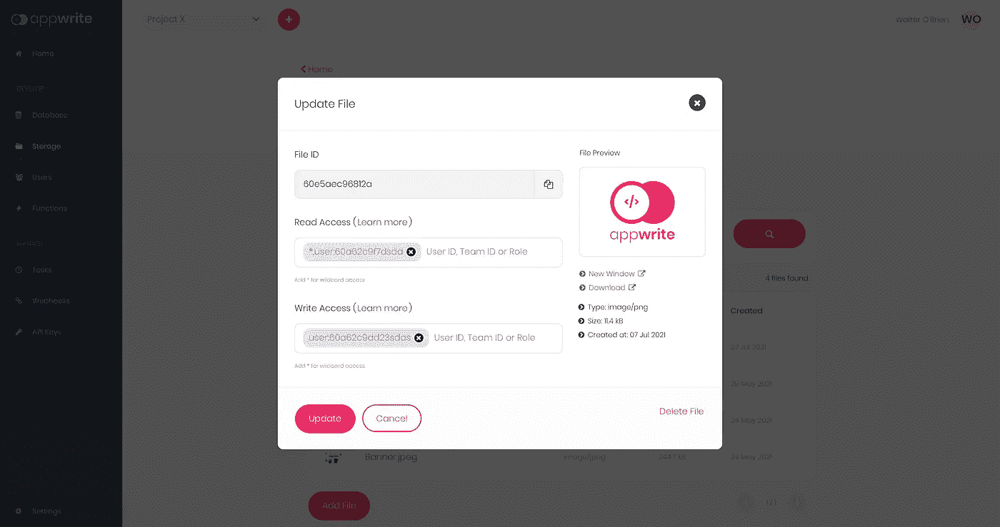
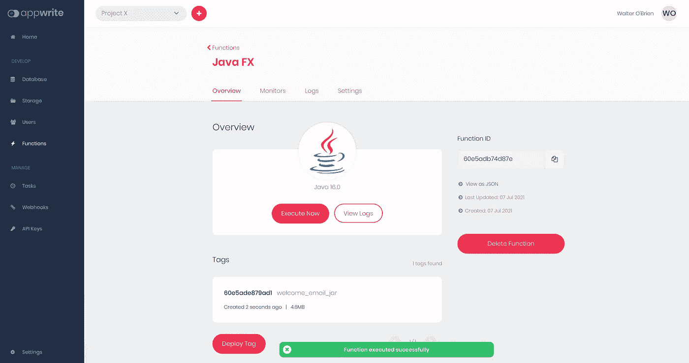

# Android 版 Appwrite 简介。易于自托管的开源 Firebase 替代方案🚀

> 原文：<https://medium.com/geekculture/introducing-appwrite-for-android-the-open-source-firebase-alternative-that-is-easy-to-self-host-507e2118e5b?source=collection_archive---------9----------------------->



今天，我很高兴向 Android 开发者社区介绍 Appwrite。Appwrite 是一个完全开源和自托管的 Firebase 替代方案，非常容易部署。我们已经在 Appwrite 上工作了很长时间，我们非常兴奋地宣布，随着 [Appwrite 0.9](https://dev.to/appwrite/announcing-appwrite-0-9-the-open-source-firebase-alternative-53ho) 和[官方 Android SDK](https://github.com/appwrite/sdk-for-android) 的发布，我们将支持原生 Android 开发。

# 什么是 Appwrite？

Appwrite 是一个自托管的后端即服务，它被打包为一组 Docker 微服务。Appwrite 为您提供了构建现代应用程序所需的所有核心 API，并抽象了所有 boiler plate 代码，使您能够专注于创建出色的创新解决方案。

您可以使用 Appwrite 构建应用程序，而无需编写任何后端代码！但这不是唯一的使用方法。Appwrite 并不是为了取代你的后端团队而设计的，而是为了给你的项目提供一个更好的起点和更好的开发者体验。

尽管 Appwrite 仍处于测试阶段(正在努力升级到 1.0 版本🤞)，我们已经获得了 BaaS 的大部分功能，而且它一直在变得越来越好，由成千上万名开发人员、250 多名贡献者以及最近的 10，000 多名 GitHub 明星(！).✨

## 身份验证和用户

Appwrite **账户**和**用户**服务将您的客户端暴露给一个 API，该 API 允许您与应用程序的登录账户进行交互，并从 **Appwrite Android SDK** 或 **Appwrite 控制台**轻松管理应用程序的用户。



Appwrite Account service lets you manage your user’s active sessions.

帐户服务允许您的用户更新他们的帐户相关信息，并保存他们的个人偏好，如用户界面语言、时区或喜爱的主题。此外，您可以允许您的用户安全地存储他们的所有偏好。

您还可以使用 API 获取所有活动用户会话的列表，包括关于会话位置、设备、操作系统和用户代理的信息。您甚至可以让您的用户查看他们最近的登录、密码恢复和其他安全敏感事件。

## 数据库ˌ资料库

Appwrite 数据库 API 是一个简单的 REST API，允许您向应用程序添加持久性。例如，您可以创建文档集合，并在集合和文档级别处理哪个用户具有读或写访问权限。



目前，Appwrite 使用 MariaDB 作为后台数据库。然而，在即将发布的版本中，我们增加了对 MongoDB 和其他数据库的支持，让您可以完全自由和灵活地使用您的团队最熟悉的技术。

## 储存；储备



Everything you need for managing your app and users’ files

Appwrite 存储服务是让您或您的应用程序用户安全上传和管理其文件的最简单方法。API 利用了数据库使用的相同的简单读写权限机制。这允许您轻松地向所有用户、特定用户甚至用户组授予读写访问权限。

Appwrite 还负责您的文件压缩、加密，甚至为您提供内置的反病毒扫描。安全和隐私是我们在 Appwrite 所做的一切的核心。

## 组

Appwrite Teams 服务允许您和您的用户创建团队并共享对不同 API 资源(如文件、函数或文档)的权限。这是为您的产品实现复杂的访问控制需求的一个伟大而简单的方法。

每个团队成员也可以被授予不同的角色，给你更大的灵活性。您还可以使用 Appwrite 控制台和后端 SDK 轻松管理您的团队。

## 功能



[Appwrite Functions API](https://appwrite.io/docs/functions) 允许你用你想用的任何编码语言轻松扩展你的 Appwrite API 行为和功能，包括 Java 和 Kotlin，作为我们对 Android 开发者新支持的一部分。

您可以使用 Appwrite API、控制台或使用 CRON 调度来触发您的自定义函数。您甚至可以在任何系统事件上触发您的函数，比如用户创建或上传新文件。

# **上手**

Appwrite 被打包成一组 Docker 微服务，可以在 Docker 可以运行的任何地方运行。这允许您使用单个 CLI 命令相当容易地部署 Appwrite。

**Unix**

```
docker run -it — rm \
 — volume /var/run/docker.sock:/var/run/docker.sock \
 — volume “$(pwd)”/appwrite:/usr/src/code/appwrite:rw \
 — entrypoint=”install” \
 appwrite/appwrite:0.9.0
```

**CMD**

```
docker run -it --rm ^
    --volume //var/run/docker.sock:/var/run/docker.sock ^
    --volume "%cd%"/appwrite:/usr/src/code/appwrite:rw ^
    --entrypoint="install" ^
    appwrite/appwrite:0.9.0
```

**PowerShell**

```
docker run -it --rm ,
    --volume /var/run/docker.sock:/var/run/docker.sock ,
    --volume ${pwd}/appwrite:/usr/src/code/appwrite:rw ,
    --entrypoint="install" ,
    appwrite/appwrite:0.9.0
```

一旦你的 Appwrite API 和控制台启动，开始使用新的 Android SDK 就相当容易了。您可以查看我们的 [Android 快速入门指南](https://appwrite.io/docs/getting-started-for-android)，从您的 Android 应用程序进行第一次 Appwrite API 调用。

# 下一步是什么？

如果你是 Appwrite 的新手，你应该加入我们的 [Discord 社区](https://appwrite.io/discord)，在那里我们不停地谈论 Appwrite。您还应该查看一下[Appwrite Awesome repository](https://github.com/appwrite/awesome-appwrite)，在那里您会找到许多关于 app write 的资源，包括文本和视频教程以及许多演示应用程序。

我们也很喜欢 Github 明星。所以，如果你喜欢我们做的事情，我们希望你能在我们的 [Github repo](https://github.com/appwrite/appwrite) 上放一个⭐️。