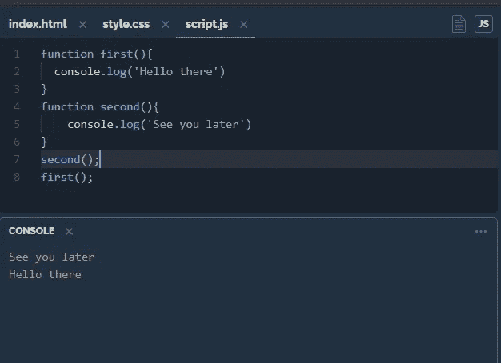
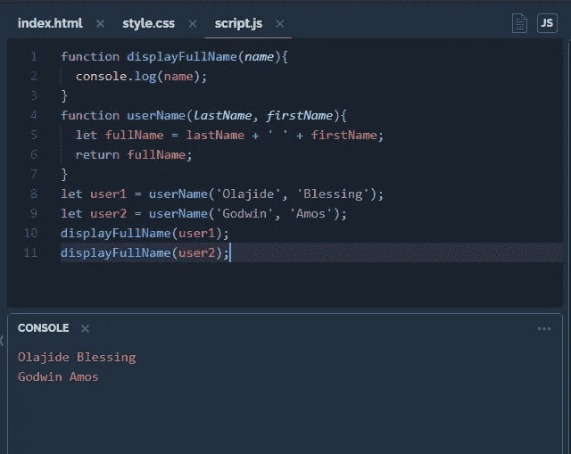
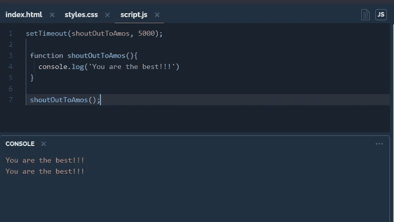
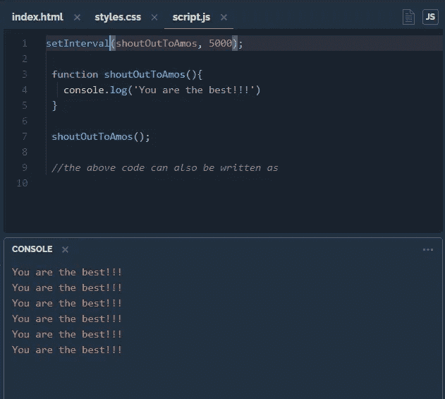
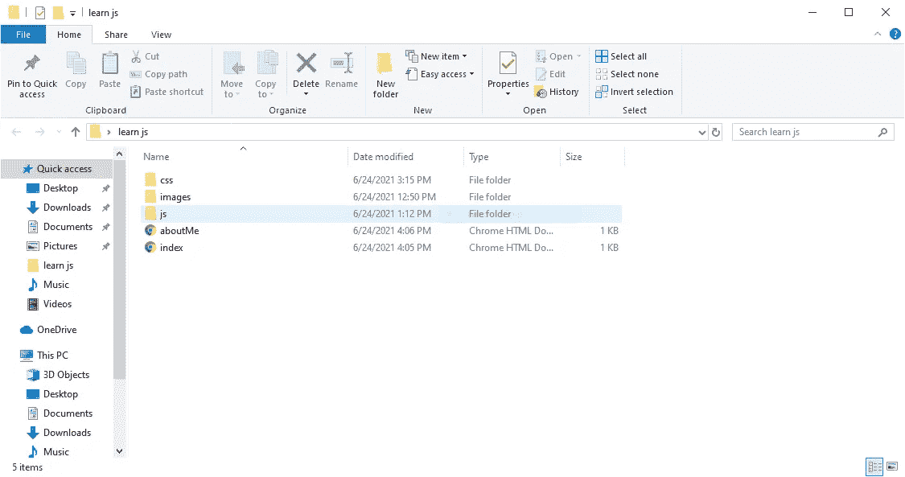
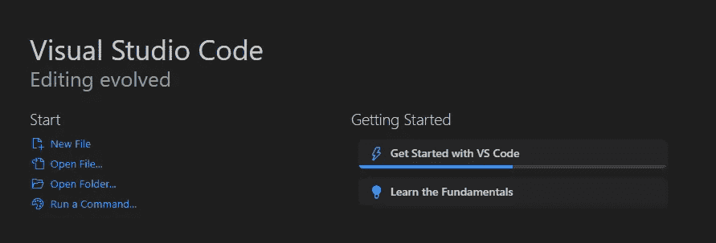

# 介绍 JavaScript 回调# 30 日 javascript == >第 15 天

> 原文：<https://medium.com/geekculture/introducing-javascript-callbacks-30daysofjavascript-day-15-c4866cfa0e08?source=collection_archive---------45----------------------->

当你告诉某人你过会儿会回电话时，那是什么意思？这意味着你正在采取的行动将要求你以后采取另一项行动。我希望这有意义，但让我这么说吧；当你在电话中告诉他们你稍后会再打来时，你已经在执行一个需要稍后再做的动作。当然，在下一次通话中，你会说一些不同的话，而不是“我过会儿再打来”。

call back

一个 javascript 回调是一个传递另一个在调用时执行的函数的函数(当它被调用时)。这种技术允许一个函数调用另一个函数。

# 功能序列

值得注意的是，JavaScript 函数是按照它们被 ***称为*** 的顺序执行的，而不是按照它们被*定义的顺序执行的。如果您有两个命名函数: **function1** 和 **function2** ，但是您决定在 function1 之前调用 **function2** ，即使 **function1** 实际上在 **function2 之前，JavaScript 也会按照您调用的顺序执行函数。**下面的例子应该会让你有更深的理解。*

**

*function sequence*

## *程序控制*

*顺序控制允许对何时显示每个功能进行更多的控制。例如，假设您处理用户数据，并希望显示他们的姓名。您可以调用一个名称函数(userName)，保存结果，然后调用另一个函数(displayName)来显示结果。*

**

*sequence control*

*如果你同意我的观点，也许试听并不令人兴奋，或者说例子并不令人兴奋。此外，我们什么时候可以使用回调？回调在**异步函数**(一个函数必须等待另一个函数才能被执行的情况)中大放异彩。*

## *异步 JavaScript*

*在实际应用中，回调用于异步函数。异步函数的一个很好的例子是 **setTimeout()** 。该函数允许在超时时执行另一个函数。下面给出了一个例子*

**

*set time out*

*另一个非常有趣的例子是 **setInterval()** 函数。该功能允许在设定的时间超时后执行特定的操作，这意味着该操作将在特定的时间间隔内继续运行。迷茫？坚持住，你可以用 **setInterval()** 函数选择每 5 秒显示一次文字“我爱 JavaScript”。只要用户在那个页面上，文本“我爱 JavaScript”将继续每 5 秒显示一次(不像 **setTimeOut()** 只在超时后显示一次)。请参见下面的示例:*

**

*另一个例子是等待文件，这是使用回调的最佳时机之一。在这里，一个函数用于在页面加载后显示一个外部文件，这意味着在加载完成之前不能显示或使用该文件。我将不得不在这里使用 DOM 来得到我们想要的结果，我也不得不在我的本地编辑器中这样做，这是因为我使用的在线编辑器不允许你创建多于一个 HTML 文件。*

*第一步是设置你的环境，对我来说，我在一个命名的文件夹中设置了一个 CSS，IMAGES 和 JS 文件夹(“learn js”)，HTML 文件在这些文件夹之外创建。*

**

*下一步是在我们的 IDE 中打开文件，在新窗口中单击 open folder 并打开您为此创建的文件夹。*

**

*Opening folder*

*你可以在这里 找到这个片段 [**的代码，在这里**](https://github.com/Pepzini/firstCallBack) 找到这个活页面[。如果您尝试在您的本地代码编辑器中运行这些代码，如果您没有设置本地服务器，如](https://pepzini.github.io/firstCallBack/) [**wamp**](https://www.wampserver.com/en/) 或 [**xamp**](https://www.apachefriends.org/index.html) ，它将不会运行，但是您可以使用以下步骤来代替:*

*   *运行 ***npm 在你的终端中安装 http-server-g****(确保你已经安装了 node.js)。这将在您的项目上直接安装一个本地服务器。**
*   **直接在你的工作文件夹上运行***http-server-p 8000***。**
*   **在您的浏览器中使用链接 [***提供服务 http://192 . 168 . 43 . 18:8000/***](http://192.168.43.18:8000/)***。*****

## **什么是新的？**

**您可能会注意到用于获取外部文件的 script.js 文件中有一点奇怪的代码。这就是所谓的 AJAX，AJAX 是异步 [JavaScript](https://en.wikipedia.org/wiki/JavaScript) 和 [XML](https://en.wikipedia.org/wiki/XML) 的缩写，用于从 web 服务器发送和接收数据，而不会干扰现有页面的功能。你会在 JavaScript 中使用很多 AJAX，所以我鼓励你(和我自己)在这里 学习它[。](https://www.w3schools.com/js/js_ajax_intro.asp)**

## **这是怎么回事？**

**30daysofjavascript 是一系列关于我如何学习用 javascript 编码的文章。这几集尽可能地简化，对于像我这样的初学者，我希望你在这一集里发现 JavaScript 不那么令人困惑。一如既往的感谢大家，下集再见。查看我写过的每一集 [**这里**](https://www.notion.so/30daysofjavascript-4f63bc748db84b71991a15b2df4b67d9) **。****