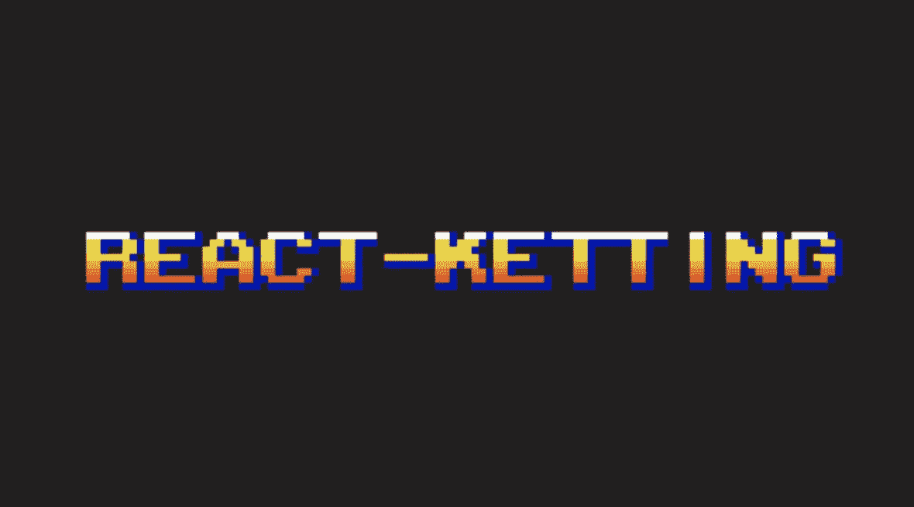
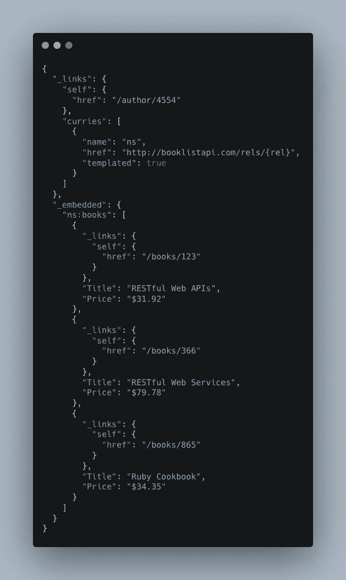
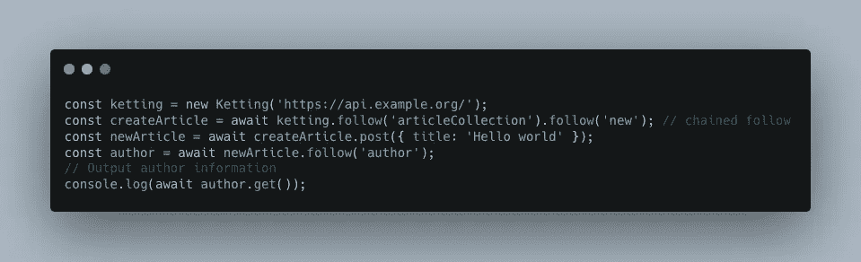
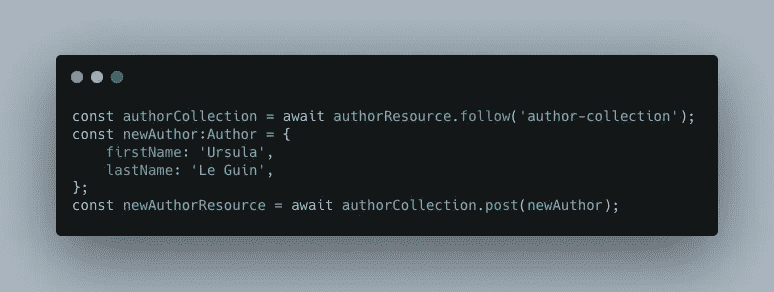
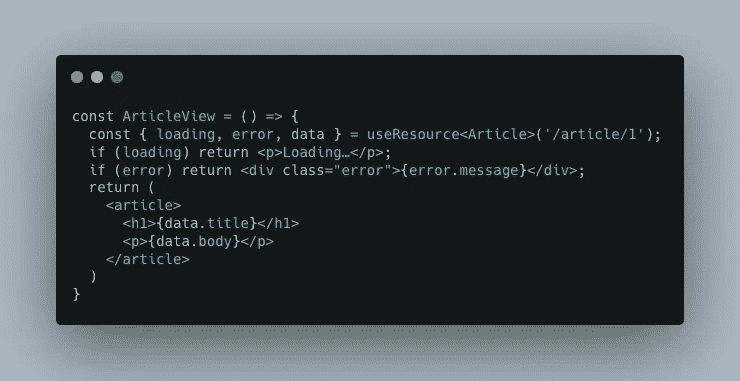

# 介绍 Ketting:超媒体驱动的 API

> 原文：<https://medium.com/geekculture/introducing-ketting-a-hypermedia-driven-api-2b25d9503e04?source=collection_archive---------1----------------------->

启用(超级)介质驱动器

最近，一位在 API 开发和 HTTP 协议方面有丰富经验的同事邀请我加入一个有趣的项目。该项目拥有 CRUD 应用程序的所有常见元素，除了 API 层将使用 [Ketting:一种新的面向超媒体的 API](https://github.com/badgateway/ketting) 。更特别的是，这个 API 层是由同一个同事 [Evert Pot](https://evertpot.com/) 创建的。下面是我对 Ketting 体验的一点总结，记录了我的印象，并将它们与我更熟悉的 API(特别是 REST 和 GraphQL)进行了比较。

# 从 Ketting 文档中:

> *Ketting 库是创建一个“通用”超媒体客户端的尝试，它支持一组自以为是的现代功能，REST 服务可能具有这些功能。*
> 
> *库支持 HAL、JSON:API、Siren、Collection+JSON、Web 链接(HTTP 链接头)和 HTML5 链接。它使用获取 API，可以在浏览器和 node.js 中工作*

什么是 [**超媒体 API**](https://github.com/badgateway/ketting/wiki/Hypermedia) **？**好问题。让我们稍微深入了解一下，以了解其中的不同部分。

**HAL** 代表超文本应用语言，是定义超媒体的语言规范，超媒体是指互联网上的链接、图形、视频等。通过使用 HAL 来驱动您的 API，一般的想法是，它使您的 API 可以自动发现，更倾向于通过跟踪关系进行自我文档化，并且更容易使用。

下面显示了一个示例。只要看看这个资源，你就可以推断出一大堆关于这个资源和它的关系！

在 Ketting 中，API 使用了*资源*的概念，该资源包含一个 URL 和一些针对该资源执行 CRUD 操作的功能。资源是您在 Ketting 中处理对象/关系的主要入口点。让我们看看下面的例子:

在这个例子中，我们将 API 基本 URL 传递给 Ketting 客户端。从那里，我们可以*跟随*不同的链接沿着不同的路径(甚至链接那些跟随的链接)。我们可以发布新资源，跟踪它们的链接(或者添加新链接)，我们可以从资源中获得 JSON 编码的输入结果。

跟随链接是 Ketting 的一个中心主题。链接是*可发现的*，因为一个资源可以有一个链接列表，并且这些链接中的每一个都将指向 API 的更多端点或特性。

# 好吧…但是它能得到邮件吗？

实话实说:我是一个简单的人，用简单的术语思考问题。对我来说 Ketting 最大的两个比较是 GraphQL 和 REST。感觉它既有两者的特点，又保持了简单的界面。只要有一个映射到某个对象或数据块的资源(例如，一个 Author、Article 或 ArticleCollection 资源)，就可以使用 Kettings API 对该资源执行常见的 PUT、POST、DELETE 和 GET 请求。使用这些非常简单，并且提供了比构建一个获取中间件或 GraphQL 附带的所有样板文件更干净的接口。Ketting 也是非常严格地使用 Typescript 进行类型化的，这使得在出现问题或者错误使用资源时很容易进行调试。下面是一个 Ketting 的 post 请求示例，它返回一个新的作者资源。

# 令人困惑的部分

当然，对于任何新的范例或新的技术，我仍然会遇到一些困难。写这篇文章的一部分是让我自己更清楚这些差距，看看我对 Ketting 的理解有多好。

我遇到的主要问题包括更好地理解资源的概念，以及知道我在什么时候拥有什么样的资源。我们的项目处理视频、视频列表和视频元数据，有时这三种不同的资源被不同地使用，但具有与它们的 API 相似的特性。公平地说，我对 Typescript 也相当陌生，当我陷入困境时，我本可以更深入地研究/理解类型。资源对象更类似于 HTTP 请求(这是由设计决定的),而不仅仅是表示它所表示的 JSON 数据，这让我有时困惑于如何在某个组件/功能的生命周期中最好地协调/耦合这两者。这两部分(资源和数据)如何结合在一起还不是很明显，尤其是随着复杂性的增加。经过一段时间的使用，我现在更好地理解了这一部分，尤其是 Ketting 在 React 中实现了[钩子，结果相当优雅。](https://github.com/badgateway/react-ketting)

理解关系和知道何时添加/使用链接是我遇到的另一个麻烦。虽然可以从前端任意添加到资源的链接，但这必须正确地完成，并与后端协作以确保资源/模型的完整性。最后，我很难考虑展示给我的用例之外的用例。当然，我不太熟悉 HAL、JSON:API、Siren、Collection+JSON、Web 链接以及 HTML5 链接中的差异等更深层次的概念，但是我认为了解 Ketting 闪耀的特定场景将对我充分利用它非常有帮助。

最后，缓存。我认为缓存通常是一个难题，有些情况下 Ketting 通过添加一个`preferTransclude()`和`.refresh()`方法很好地解决了这个问题。我认为在这种情况下，你几乎必须先看到错误(例如，不刷新列表)，然后才能返回到文档中寻找解决方案(包括`.refresh()`)。

# 超赞的酱

总的来说，我发现 Ketting 非常容易使用，而且比 GraphQL 或(axios，fetch middleware)的同类产品要简单得多。因为它也是我的同事积极开发的，看到它被构建和运行是非常酷的，随着我们开发我们的项目，经验教训和修复被推进。当我发现我需要它的一个特定特性来为我工作时，我甚至能够自己直接为它做贡献。测试一个新的 API 并不容易，但是可以说我们已经学到了很多关于 API 和需要解决的具体问题。

了解 Ketting 并使用它让我想到了 HTTP1 和 HTTP2，以及一种新的缓存方式。当设计新的应用程序时，充分理解正确使用的 HTTP2 协议(提示:缓存和优化)的含义是更重要的事情。使用 HAL media API 客户端也很棒，就像 GraphQL playground 一样，它让我对 API 模型有了直观的理解，并能很快回答问题，这非常有帮助。事实上，Ketting API 通过 HAL 生成自己的 GUI 的能力显示了它的强大和潜力。只要你有一个资源或者一个 URL，你就可以做很多强大的事情，并且编写更少的冗长代码来完成事情。

Ketting react 挂钩可能是我最喜欢的部分，它大大减少了我们的许多组件。它们的工作方式非常类似于它们的 GraphQL 或 useQuery 对应物，同时也返回一个资源对象，用于遍历链接和在资源上执行其他操作。

严格类型化的资源使我在出错或错误地使用资源时更容易理解/调试，总的来说，引导我在未来的工作中使用更多的类型脚本。在我对我的资源的预期中没有出现意外，当需要重构项目并迁移到 Ketting 的新版本时，由于严格的类型，这个过程变得简单多了。

实现 Oauth2 可能是迄今为止我所拥有的最简单的实现之一，看到这一部分的运行非常棒，因为这是开发人员在新项目中经常遇到的问题。

重复我关于 GET/POST 请求冗长性的第一点，对 Ketting 资源执行 GET、PUT 或 POST 请求，而不需要所有 graphQL 样板文件，或者管理 Axios 之类的 REST 中间件层或某种定制的 fetch，这确实是一种更好的体验，通常最终会被构建。它“正常工作”，并在不工作时提供有用的错误消息。

# 我的简短结论

使用 Ketting。它将挑战您对 REST、HTTP、GraphQL 以及数据如何在客户机和服务器之间移动的先入之见。如果你有兴趣贡献，有足够多的工作可以贡献。最后，因为钩子刚刚被添加到 Ketting 中，所以现在是一个很好的机会来尝试一下，看看它们是如何工作的。