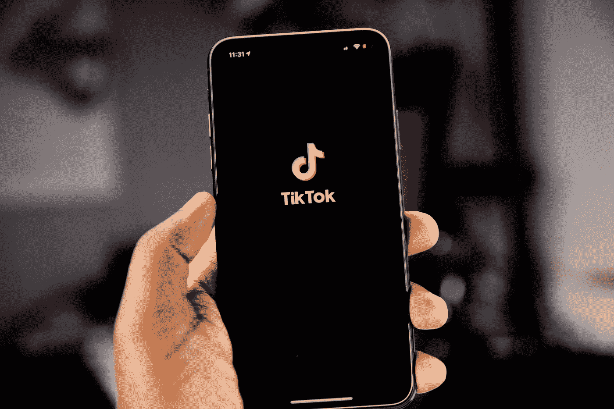

# 抖音现场购物介绍

> 原文：<https://medium.com/geekculture/introducing-live-shopping-with-tiktok-64ded013ace5?source=collection_archive---------13----------------------->

抖音转向电子商务会带来繁荣吗？

Photo by [Solen Feyissa](https://unsplash.com/@solenfeyissa?utm_source=unsplash&utm_medium=referral&utm_content=creditCopyText) on [Unsplash](https://unsplash.com/s/photos/tiktok?utm_source=unsplash&utm_medium=referral&utm_content=creditCopyText)

**什么是现场购物？**

2021 年底，抖音发起了一系列活动，将该公司定位为电子商务领域的竞争对手。这些由抖音主办的活动属于一种被称为“现场”或“社交”购物活动的蓬勃发展的数字体验。这些现场购物活动在精神上是商业化的。