# 引入新的集成体验

> 原文：<https://medium.com/geekculture/introducing-new-integration-experience-db451b1aff33?source=collection_archive---------68----------------------->

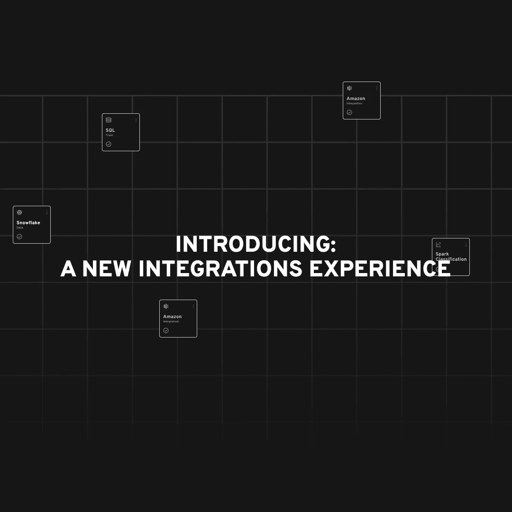

构建一个满足用户期望的产品是很难的，但是在 Datagran，我们总是倾听并努力实现这些期望。今天，我们很自豪地推出全新的集成控制面板。这将为公司提供他们需要的数据治理，让他们对我们的技术充满信心。我们希望您能像我们喜欢建造它一样喜欢它。

# 集成概述

如今，团队使用 Datagran 最流行的方式之一是将多个数据源集成到我们的工具中。这个过程是通过 ELT 完成的，它是一个直接的信息输入过程，无需从多个来源(如仓库、服务器、CMS 等)提取数据，并将其存储在不同的工具中进行处理、分析和建模。Datagran 的集成流程允许团队将他们的数据集中在一个地方，了解哪些来源可以用于分析、机器学习模型构建和可视化，并在工作区内的多个项目中重用它们。

今天，随着集成升级的发布，我们又向前迈进了一步。顾名思义，新设计的升级提供了对所有数据源的深入研究，并增加了提取和设置等功能。

概览面板中引入的第一个重大变化是提取组件。

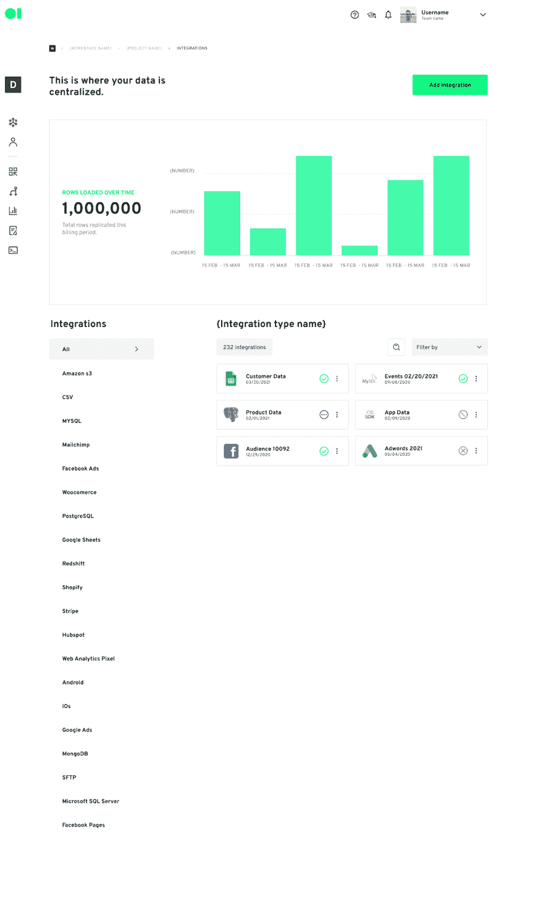

# 跟踪数据源和数据行概述

目前，当用户在 Datagran 中集成数据源时，不清楚复制了多少信息。用户不知道他们是提取了一半数据还是全部数据。此外，他们没有为项目提取的数据行的可视化表示。

借助新的数据行图表，团队将能够轻松查看在他们的计费周期内从其源复制了多少数据行。它是如何工作的？我们构建了这个工具来清晰地显示从位于其工作区内的所述数据源中提取的数据总数，团队将有一个显示复制的行的清晰数字，以及一个条形图，这将帮助他们跟踪在计费期间使用的行的负载。

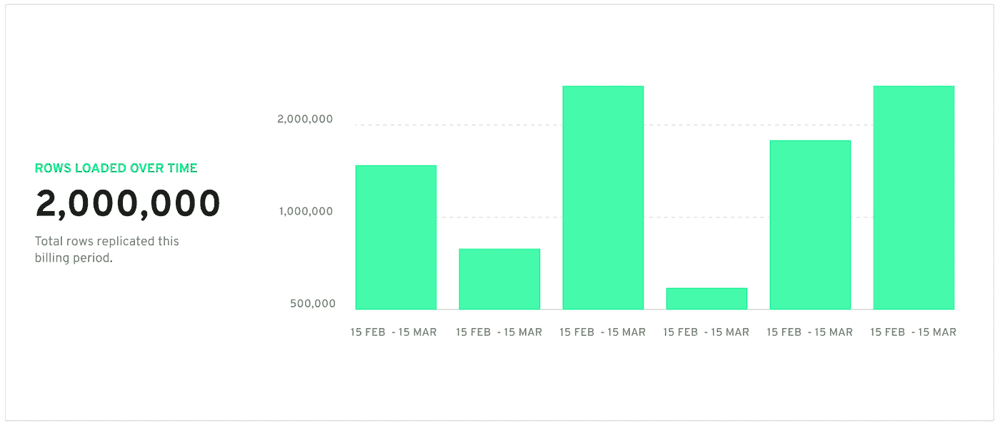

此外，他们仍然能够在左侧菜单上看到 Datagran 中可用的所有数据源。在仪表板的右侧，他们将能够看到数据源主动集成到他们的工作区中。

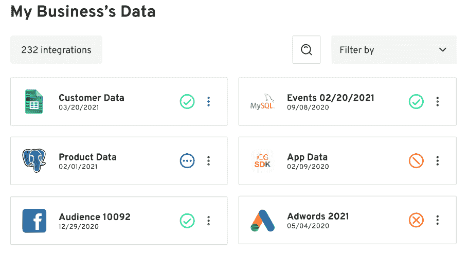

现在，每个数据源将显示一个指示其状态的图标，这将让用户知道所述集成是成功集成、正在集成还是在集成时出错。

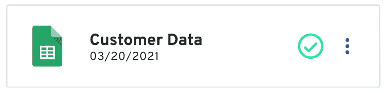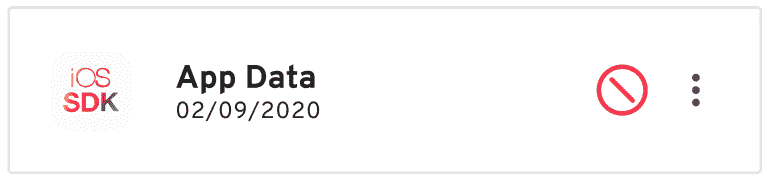

# 近距离观察集成

此外，每个集成都有自己的概述，用户可以在其中更深入地了解其内容。

通过单击集成状态旁边的三个点，用户可以删除集成或转到概述。概述将提供集成、其提取、复制过程中的流和设置的摘要。

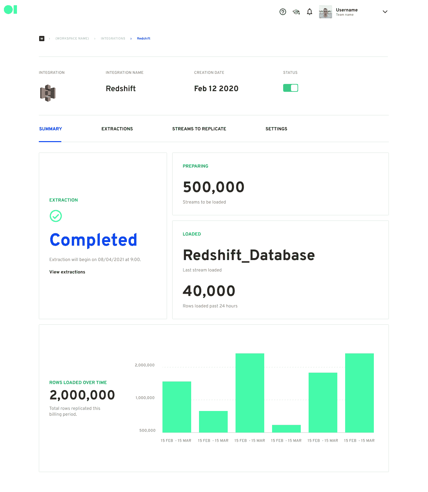

集成的摘要细分了提取状态、准备加载的流、过去 24 小时内加载的行，以及计费期间加载的总行数。

[流是在集成流程](https://blog.datagran.io/posts/all-you-need-to-know-about-data-integration-for-business)的初始步骤中建立的，它们是从数据源中提取的数据流，现在它们将有自己的选项卡，以帮助团队准确地查看提取了哪些流、每个流中的行以及提取日期。

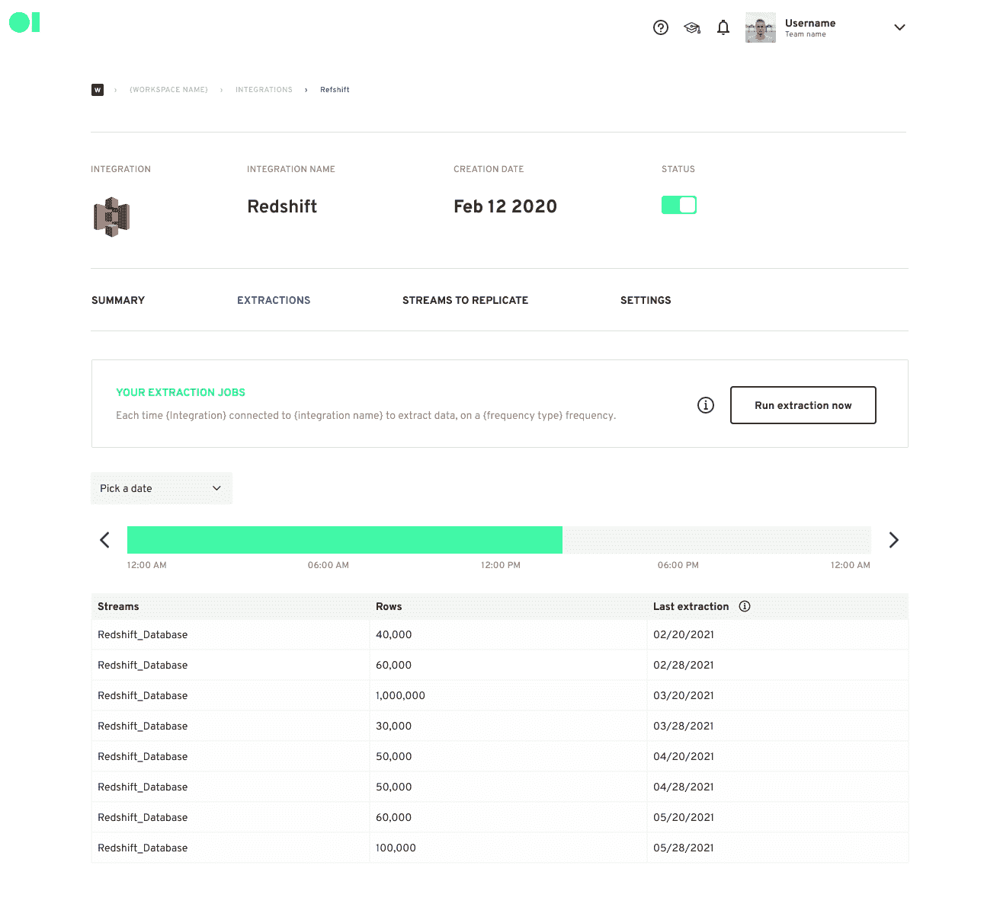

目前，用户可以选择他们想要从集成中复制哪些流，但是有时，他们可能想要停止某个流。使用流复制，团队将完全控制复制的流、它们的状态，以及为特定集成执行的最后提取的时间表。一个开关会给他们打开和关闭的能力，这样他们就可以决定将哪些频道导入他们的项目。

例如，如果一个团队想要运行具有两个集成(如 Redshift 和 Hubspot)的回归分析模型，但他们只需要来自每个集成的五个流，他们可以简单地关闭所有剩余的流，除了他们打算在模型中使用的那些流。

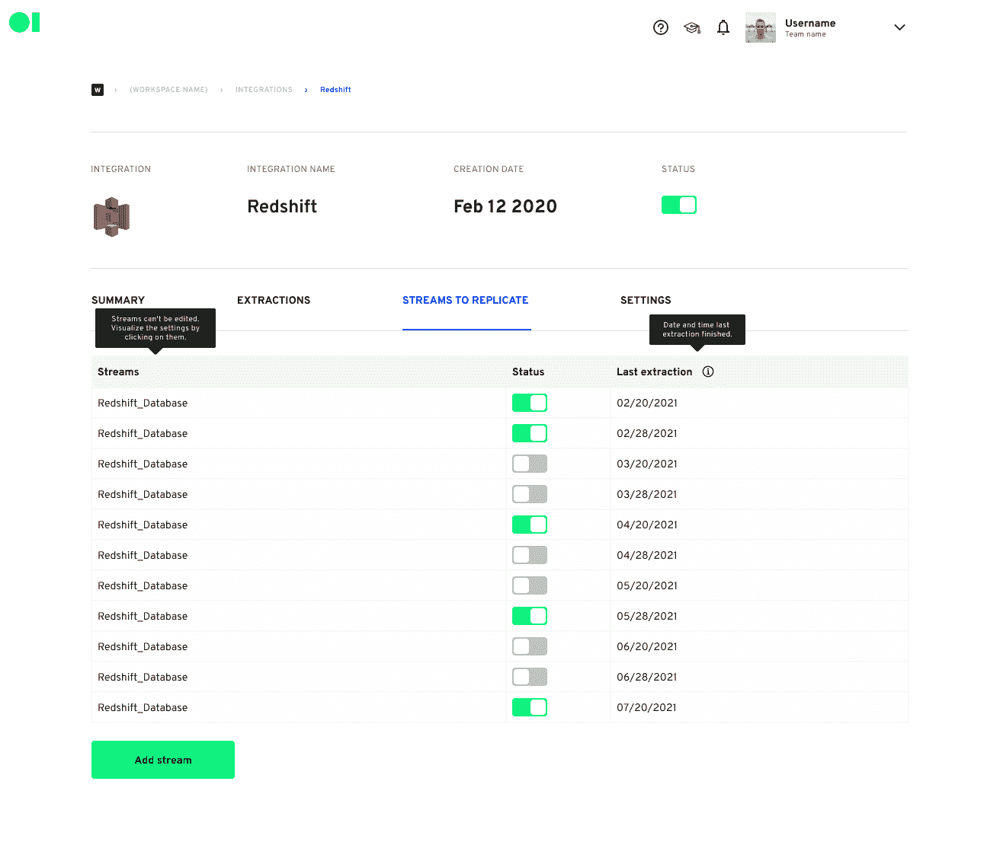

除了流复制之外，用户只需点击 Add Stream 按钮，就可以立即添加一个全新的流。这将允许他们选择想要复制的流，选择提取的类型，甚至创建一个定制的模式。

我们的目标是为团队提供处理数据的自由和便利，而不需要定制代码。

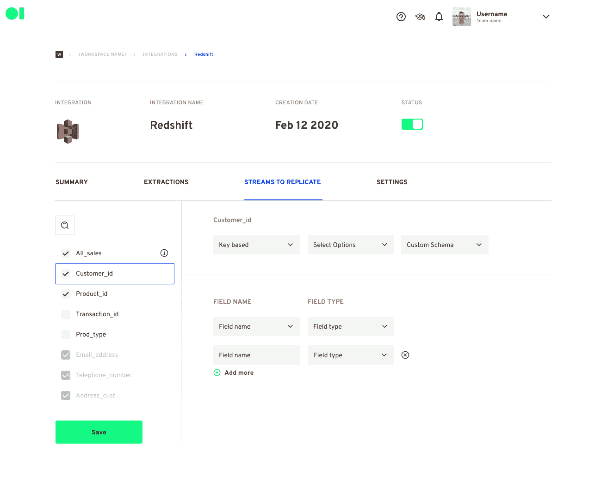

总而言之，集成的配置面板将允许用户查看和编辑他们的集成的设置信息、复制频率，以及最终删除集成的能力。

当用户集成数据源时，Datagran 每天都会复制数据。现在，我们将为用户提供选择每个集成的复制频率的选项，因此团队可以每天、每周或每月复制他们的数据。例如，考虑到客户向企业注入信息的速度，这是一个强大的功能。通过尽可能快地复制信息，公司可以几乎实时地与他们的客户进行交互，增加了在客户旅程中获得新机会的机会。

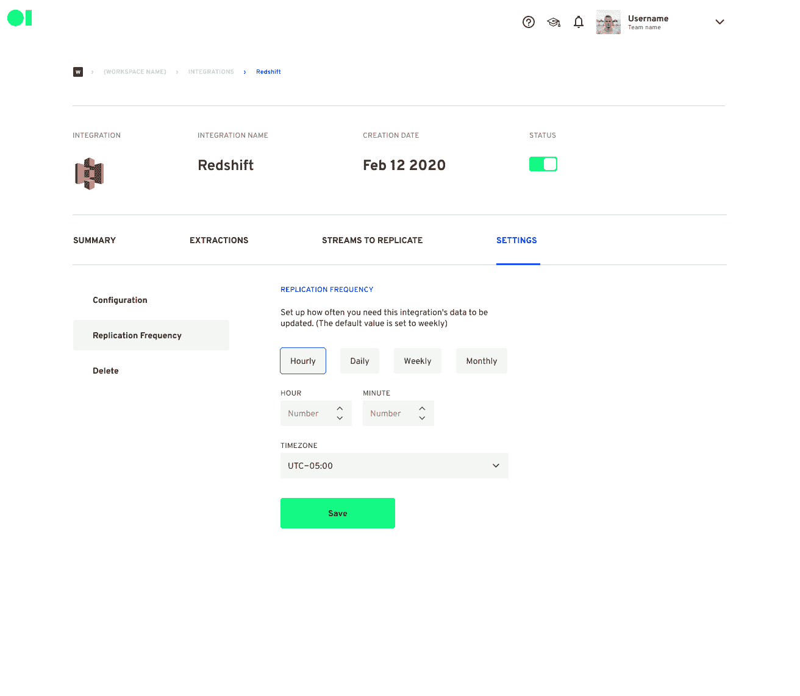

现在，整个团队都可以清楚地看到他们可用的数据源、项目中当前使用的数据源、复制的数据行数以及在一个计费周期内使用情况的细分。

我们非常乐意为您带来这些新功能，并且迫不及待地想了解您将使用它们构建的令人惊叹的东西。我们的用户继续以创造性和令人兴奋的方式使用 Datagran，我们希望今年能从您那里学到更多。请求访问我们的平台以及我们今年将继续推出的所有新功能。

如果您想分享您的反馈，您可以随时发送电子邮件至 [support@datagran.io](mailto:support@datagran.io) 。