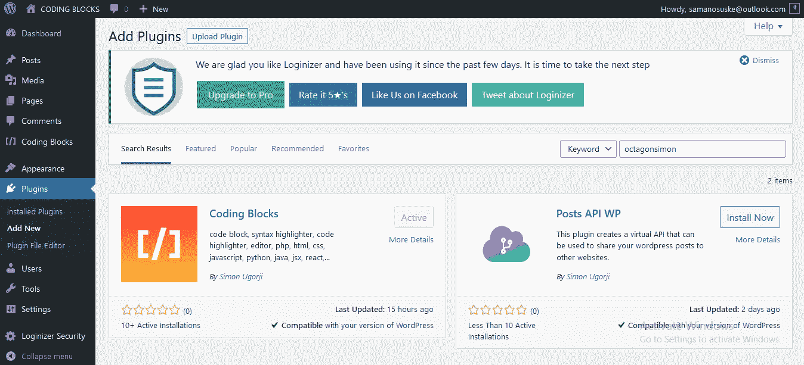
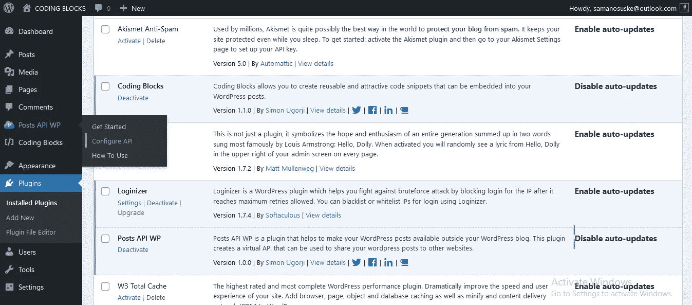
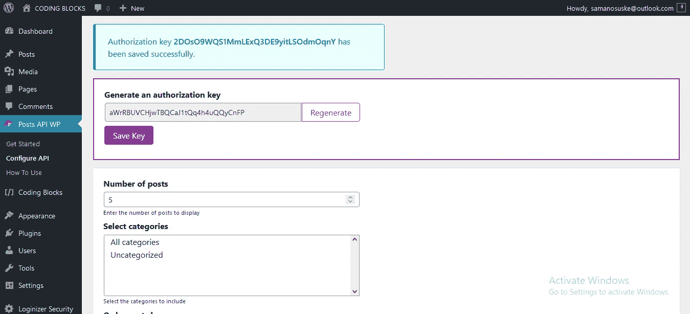
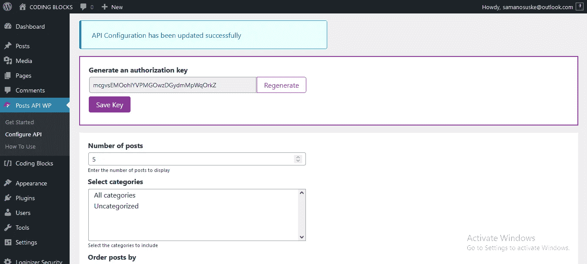
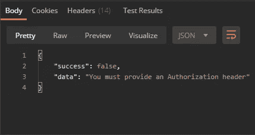
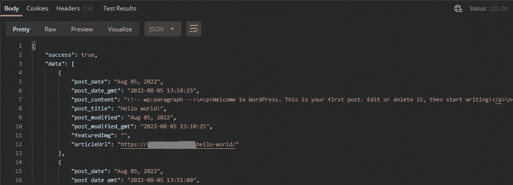

# 介绍文章 API WordPress 插件

> 原文：<https://medium.com/geekculture/introducing-posts-api-wordpress-plugin-7024d628adf5?source=collection_archive---------13----------------------->

Posts API WordPress Plugin Cover Image

**Posts API WP** 是一个 WordPress 插件，它通过一个虚拟 API 帮助你与另一个网站分享你的 WordPress 文章。

是的，你没看错！

假设我在`wordpress-blog.com`上有一个 WordPress 博客，在`static-site.com`上有一个静态网站，我需要在静态网站上整合我的一些 WordPress 帖子，我将在`wordpress-blog.com`上安装这个插件，并从`static-site.com`访问 API 端点，这样我就可以完全访问`wordpress-blog.com`上的帖子。

有趣的..对吗？让我们来深潜一下！

# 安装并激活插件

就像其他插件一样，你需要[下载，安装&在你的 WordPress 仪表盘上激活这个插件](https://wordpress.org/plugins/posts-api-wp)。

 [## 发布 API WP

### Posts API WP 是一个插件，可以帮助你在 WordPress 站点之外发布文章。这个插件…

wordpress.org](https://wordpress.org/plugins/posts-api-wp) 

如果上面的链接不起作用，在你的 WordPress 仪表盘的插件页面上搜索插件或我的用户名`octagonsimon`，然后安装&激活插件。

一旦插件被激活，你应该会在你的工具条上看到插件的图标。

点击配置 API

# 如何使用

现在，我们需要设置 API 参数，并在配置页面上生成一个授权密钥。

所以你看，即使是虚拟 API 也需要一个授权密钥来处理请求和提供数据。

在您必须生成授权密钥之后，配置 API 参数，例如；

*   要显示的文章数量
*   要从中检索文章的类别
*   是否包含每个帖子的特色图片链接
*   是否包含每个帖子的 URL 等

然后保存配置

现在我们准备测试我们的端点。

# 向我们的端点发出 GET 请求

从版本 **1.x.x** 开始，您的虚拟 API 的端点采用以下格式

`[https://YOUR_WORDPRESS_DOMAIN/posts-api-wp/](https://YOUR_WORDPRESS_DOMAIN/posts-api-wp/)`

只需将`YOUR_WORDPRESS_DOMAIN`替换为你的 WordPress 站点的实际链接，然后使用 API 客户端向端点 URL 发送一个`GET`请求。

我将使用 Postman 作为我的 API 客户机来测试这个端点。

从上图可以看出，在向端点发出`GET`请求之前，我们需要提供一个授权头。

# 附加授权头

在您的 API 客户机中，附加请求头`X-API-Key`，并将其值设置为您已经生成的授权密钥。如果您没有保存之前生成的授权密钥，只需生成一个新的并使用它。

因此，当我将我的授权密钥附加到请求头并重新发送`GET`请求时，这就是响应

通过 API 响应，您可以遍历数据并访问每篇文章的内容。

现在，如果您在`X-API-Key`头中提供了一个无效的授权密钥会怎么样呢？

您可以看到，只有当提供了有效的授权密钥时，才允许 API 提供数据。

这就是使用**帖子 API WordPress 插件**与其他网站分享你的 WordPress 帖子的简单之处。

# 观看视频

这里有一个 YouTube 视频演示了如何使用这个插件来检索 WordPress 域的文章。

> *注意，虚拟 API 只有在 WordPress 域上安装了&激活的插件时才起作用。*

# 它的发布日🎉🎉🎉

如果您能抽出一些时间在产品搜索上查看这个插件，我将不胜感激。

如果你有任何问题、贡献或建议，请在下面留下评论，我会处理的。

感谢您的阅读。