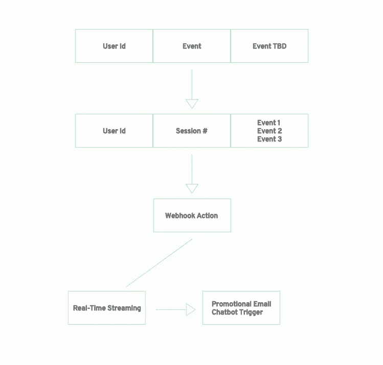
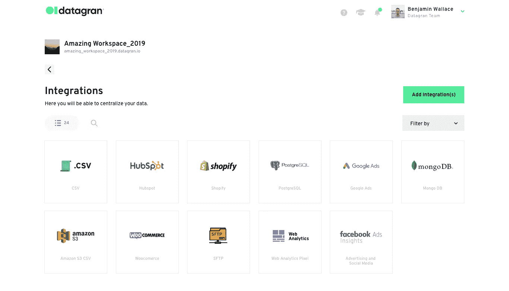
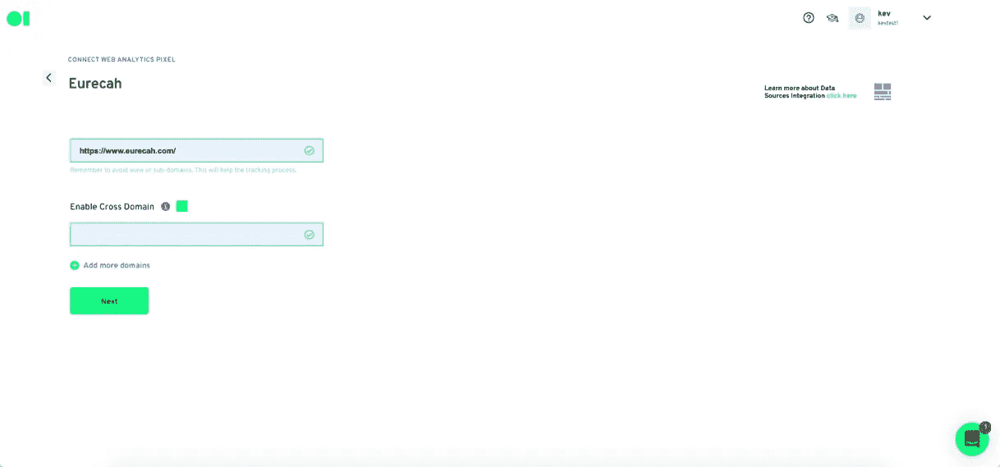
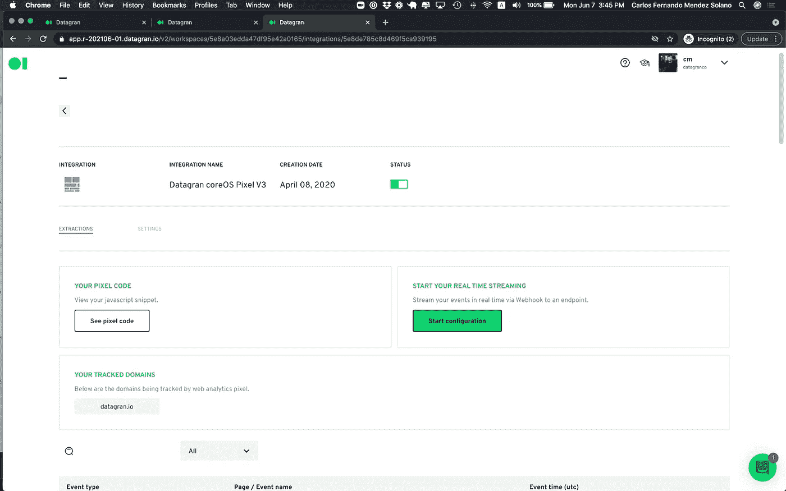
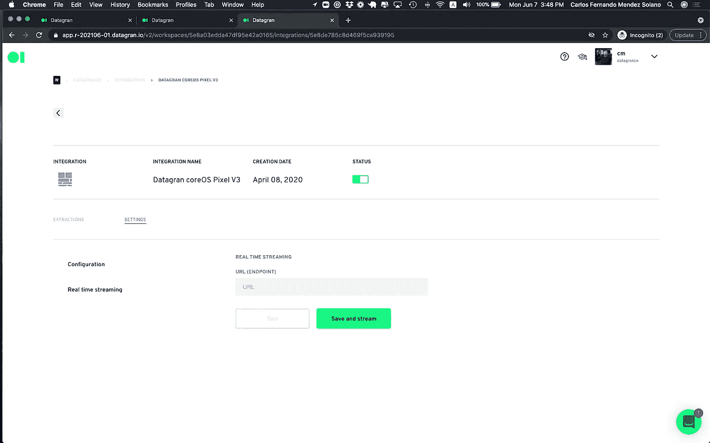
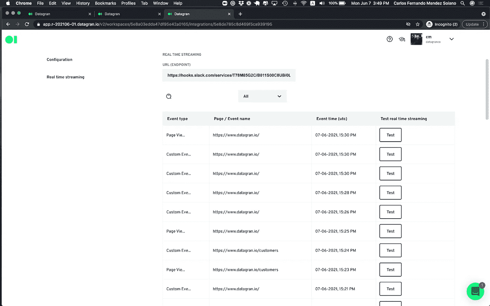

# 🛰通过 Datagran 的 AnalyticsJs 引入实时流。

> 原文：<https://medium.com/geekculture/introducing-real-time-streaming-with-datagrans-analyticsjs-ac342625c841?source=collection_archive---------45----------------------->

Datagran 的 web pixel 提供了一个 JavaScript 跟踪器，安装在您的网站上，并开始收集有关您的用户与您的网站的交互的粒度数据。在今天之前，这些活动通常是成批进行的，但是今天，我们很高兴地宣布一个全新的功能调用

虽然您仍然能够批量收集数据(批量发送数据)，本质上是运行机器学习模型，但通过实时流，您将能够通过 Webhook 实时发送事件(您需要提供一个端点)。

# 它是如何工作的？

在下图中，您可以看到如何使用 Webhook 提取、处理和部署您的数据，以便根据需要付诸行动，例如，为您的客户、聊天机器人等进行宣传。

要整合 web pixel，您必须能够访问您网站的代码，因为您需要在网站的 head 部分插入一段代码。如果您使用的是来自 [Google Tag Manager](https://www.notion.so/Install-Datagran-Pixel-using-Google-Tag-Manager-Step-by-step-guide-350b4f53443047a89c49204d8e0487ef) 的片段，只需添加包含我们的 JavaScript 代码的默认标签，并设置过滤器，以防您希望该标签仅在特定页面上触发。

默认情况下，我们会捕获以下事件:

**页面浏览量:**为每次页面加载触发。

**表单提交:**我们捕获表单元素提交时触发的默认事件。收集除密码以外的所有数据。

**链接点击:**这包括将用户带到网站其他部分的超链接，以及常规的出站链接(导致网站退出)。

**其他 HTML 元素点击:**除了捕捉超链接点击，我们还捕捉按钮、选择、输入和文本区域元素的点击。

对于包括自定义事件和 identify()的高级实现，请单击此处的。

# 整合网络像素

前往您的 Datagran 帐户的集成部分。寻找网络像素集成，并点击它来设置它。

命名您的网络像素集成，并启用跨域。请确保此处指定的域名与代码段所在的域相匹配。单击下一步。

复制代码片段并粘贴到您的网站的头部。集成完成后，您可以单击它来查看其状态。

一旦 web pixel 安装到您的网站上，并且您在“提取”选项卡上验证了 pixel 正在提取数据，您现在可以单击“开始配置”您的实时流。

实时流媒体是一个很好的工具，可以让你的团队与你的客户在你的网站上做的事情保持一致，以避免错过宝贵的机会。