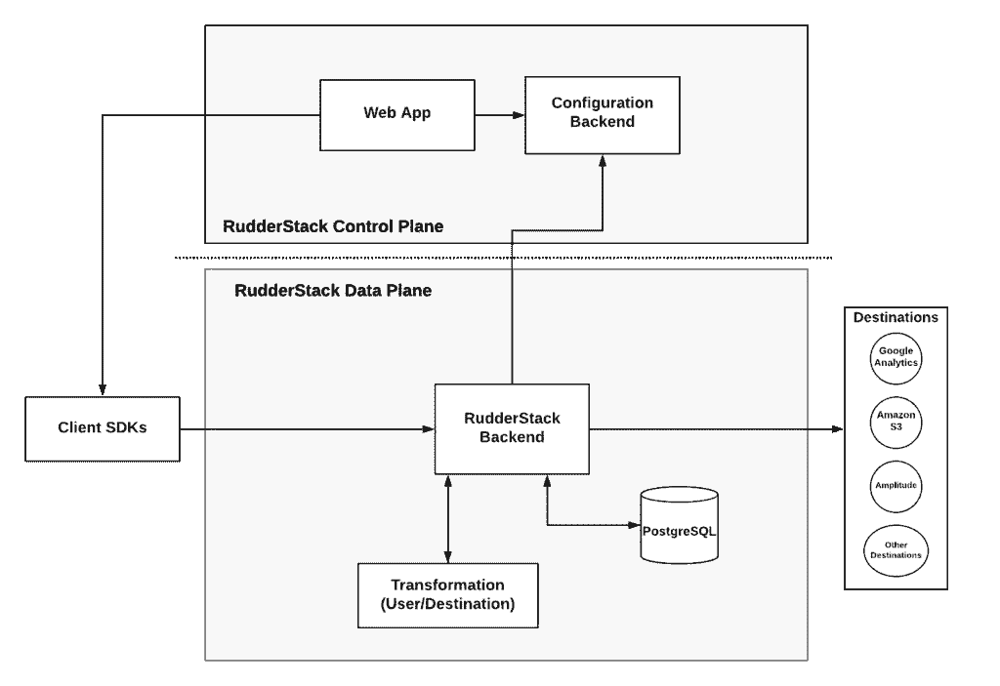
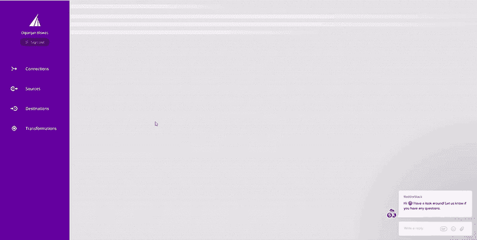

# 引入方向舵堆栈转换

> 原文：<https://medium.com/geekculture/introducing-rudderstack-transformations-f1dbe654b623?source=collection_archive---------1----------------------->

[RudderStack](http://rudderstack.com) 是一个开源平台，用于收集和路由您的客户事件数据(通常称为客户数据基础设施或 CDI 平台)。RudderStack 是企业级的，特别关注数据隐私和安全性。这篇博客更多地讨论了 RudderStack 和 RudderStack 转换，它们允许您定制您的客户数据平台。

我们开始构建 RudderStack 是因为，作为数据工程师，我们发现现有的 CDI 解决方案缺乏当今数据驱动型企业所需的关键属性。大多数解决方案都在灵活性和复杂性之间进行权衡。另一方面，云 SaaS 产品的可用性牺牲了可扩展性和功能性。

在 RudderStack，我们正在构建一个数据平台，可以提供数据工程师所需的环境。我们的目标是提供一个平台，解决日常业务中的独特挑战，同时让运营者高枕无忧。我们希望方向舵堆栈:

*   **可扩展**和**可定制**。数据工程师应该能够处理各种问题和需求
*   易于**部署**、**管理**、**监控**

为了实现上述目标，我们已经实施并交付了作为核心平台一部分的*方向舵堆栈转换*。它是一种机制，数据工程师可以在其中定义和部署定制逻辑，这些逻辑在 RudderStack 内部流动的事件流上执行。

# 建筑

在 RudderStack，我们相信能够操作事件数据是任何数据平台不可或缺的一部分，我们希望将这一功能视为我们产品的一等公民。我们构建了这个平台来反映这一信念。

上图展示了 RudderStack 的一个高层架构。后端或数据平面上的底层机制负责实现与目的地的集成。同样，这个机制也负责用户转换。

通过实现负责执行用户转换和与目的地集成的单一机制，我们可以:

*   简化架构
*   简化自定义逻辑的实现和调试
*   使围绕性能的推理变得更容易，因为没有太多会增加开销的活动部件

如果您希望了解更多关于实现细节的信息，请访问我们的 [Github 资源库](https://github.com/rudderlabs/rudder-server)或加入我们的 [Discord channel](https://discordapp.com/invite/xNEdEGw) ，在那里我们的工程团队是可用的。

# 部署方向舵堆栈转换

部署*方向舵堆栈转换*是一个简单的过程，它发生在方向舵堆栈控制平面或 UI 内。您可以用 JavaScript 编写转换。该环境允许您通过对样本事件执行转换来测试和调试这些转换。您可以在下面的可视化示例中看到整个过程。

# 你能用方向舵堆栈转换做什么

*方向舵堆栈转换*是向您的客户数据平台添加定制逻辑的方法。为此，我们增加了对 Javascript 等丰富语言的支持。这意味着您可以实现应用于单个事件或批处理的复杂脚本。以下部分讨论了 RudderStack 用户到目前为止已经实现的一些用例。

# 使用 PII 数据

开发人员通常会无意中(例如，开发人员错误)或有意地在事件中嵌入 PII 数据。但是，通常有充分的理由避免将 PII 发送到下游云或本地目的地。即使对于像数据仓库这样的内部目的地，存储 PII 也会带来安全挑战。同时，在数据如何出现和如何存储方面，能够解决任何可能的边缘情况是至关重要的。有了*舵栈变换，*就有可能实现复杂的 PII 扫描仪和遮罩。您还可以创建一个通知系统，它可以在事件级别上操作，并在检测到某个事件时通知您。

# 事件采样和聚合

访问所有事件是有用的，但并不是所有应用程序都需要访问这种级别的数据粒度。但是，您可以在将数据交付给某些应用程序(如分析工具)时对其进行采样。当这些数据接收服务根据容量向您收费时，此功能甚至更加有用。同样，您可能更喜欢在将数据交付到可视化工具之前对其进行预聚合，并简化它们与数据的交互。

# 搜寻空壳

数据中的错误是不可避免的——事件模式可能会改变，开发人员会引入错误，或者有时字段需要退役。能够从后端检测数据异常并对其做出反应，可以节省试图调试损坏的数据管道的数据工程师的大量时间。使用 *RudderStack 转换，您可以检测常见的*错误，例如 *null* 值，并在数据管道的早期进行纠正。

# 模式转换

很多时候，您希望将数据转换成不同的表示形式。在一个系统中，您可能只有一个姓名字段。在另一种情况下，您希望有两个独立的字段。您可能还想从 URL 中提取并分解 UTM 参数。能够转换事件的模式对于维护任何公司的现实数据基础设施都是非常重要的，而*rudder stack Transformations*提供了实现这一点所需的所有功能。

以上只是我们到目前为止遇到的一些日常用例，它们展示了*舵栈转换*的多功能性。你可以在我们的 [Github 仓库中找到这些案例的模板，用于*方向舵堆栈转换*](https://github.com/rudderlabs/sample-user-transformers) 。

# 我们希望你有所贡献

正如我们在本文开头所说，我们在 RudderStack 的目标是构建下一代数据平台，解决数据工程师今天面临的所有挑战。我们的核心假设是，在这样一个复杂和开放的问题中，只有拥有一个拥有相同问题和愿景的强大社区，才能提供一个强大的解决方案。

因此，我们不是将每一个可能的功能都作为一个新特性来提供，而是提供一个基础设施，您可以部署和运行功能来转换您的数据。

在这个用于*方向舵堆栈*转换的 [Github 存储库中，您可以找到各种模板。这些是社区为常见用例提供的模板，就像我们在本文前面提到的那些。我们鼓励您参与进来，提出问题，提出拉动式请求，并分享知识。](https://github.com/rudderlabs/sample-user-transformers)