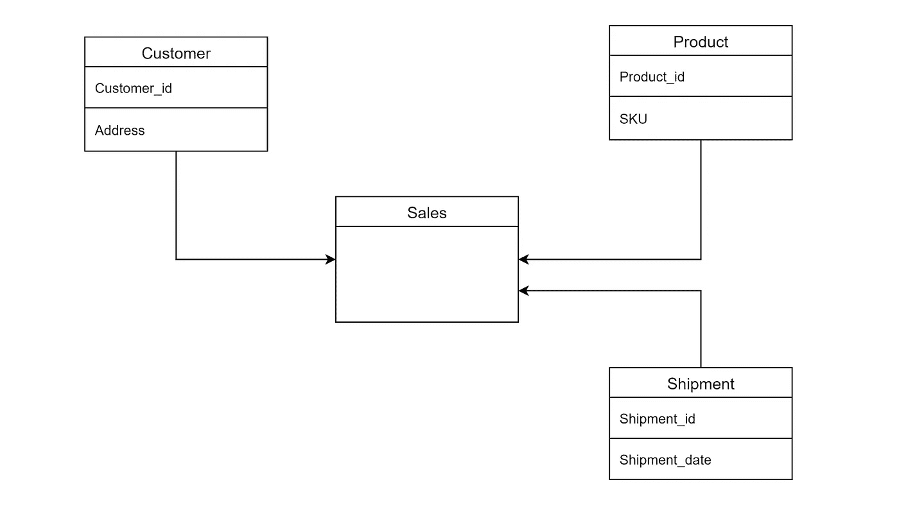
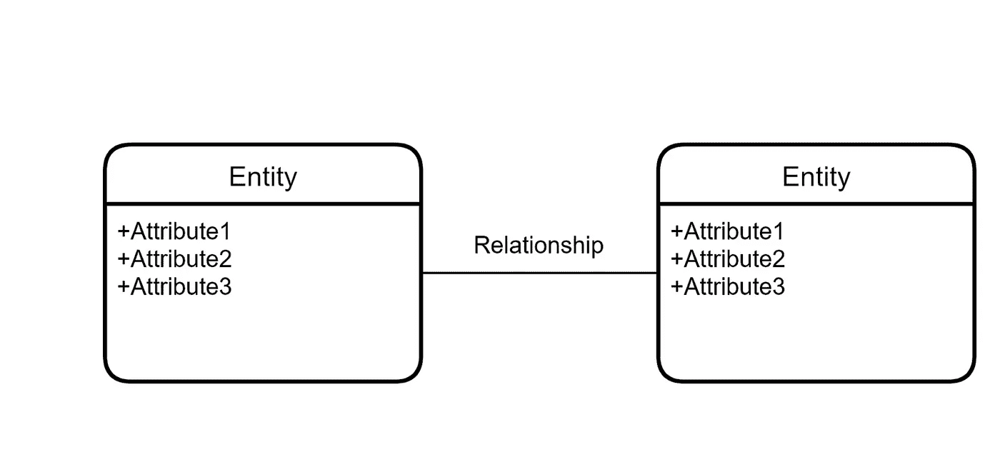
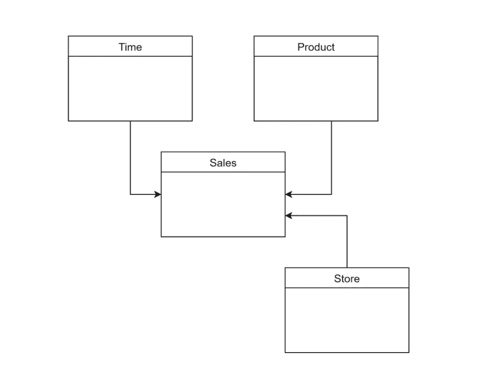
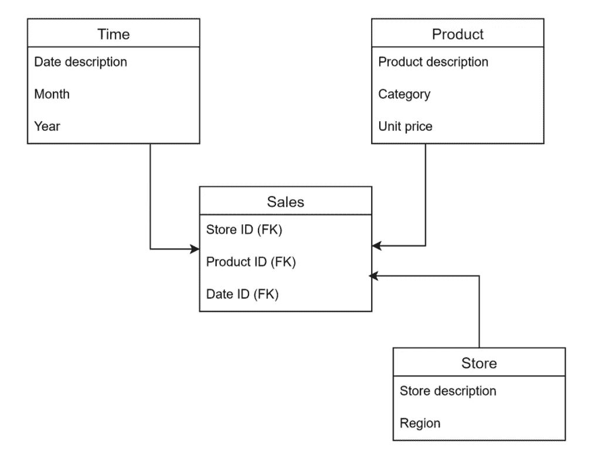
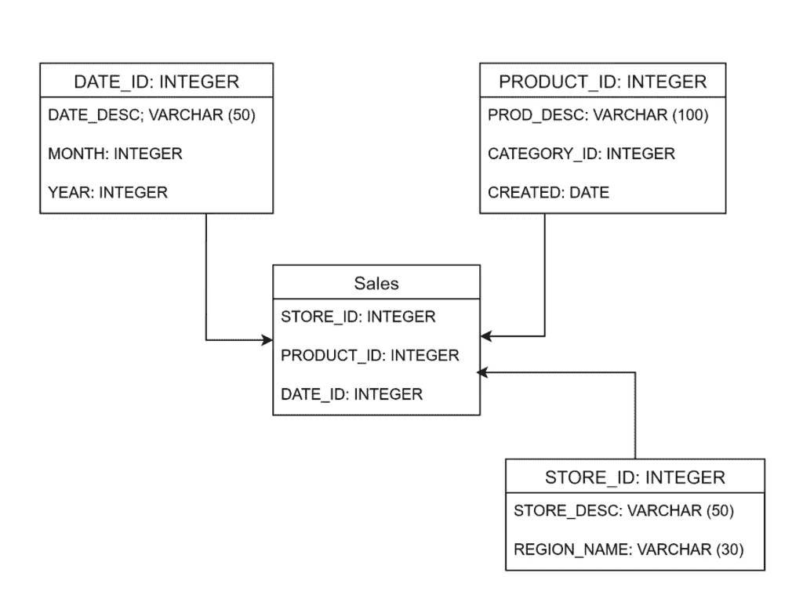
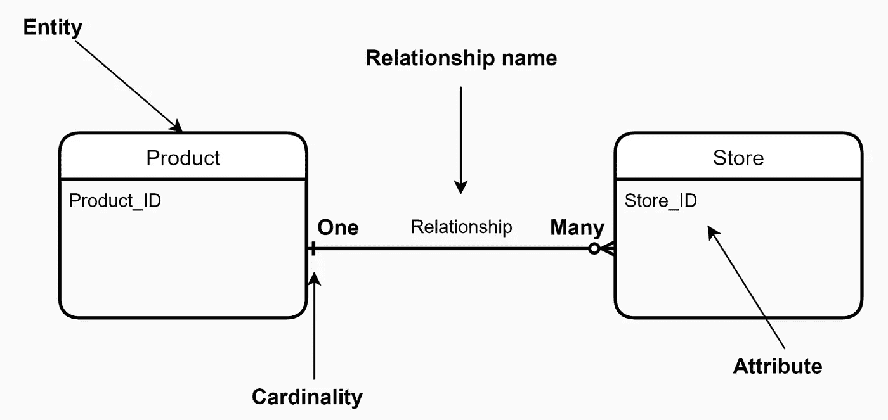
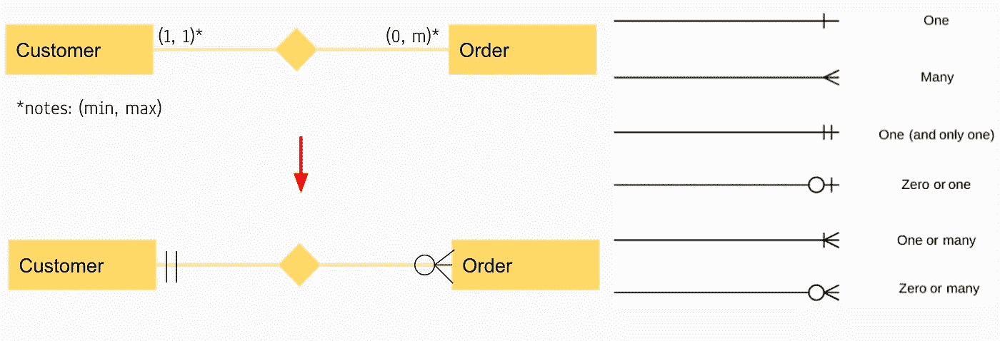
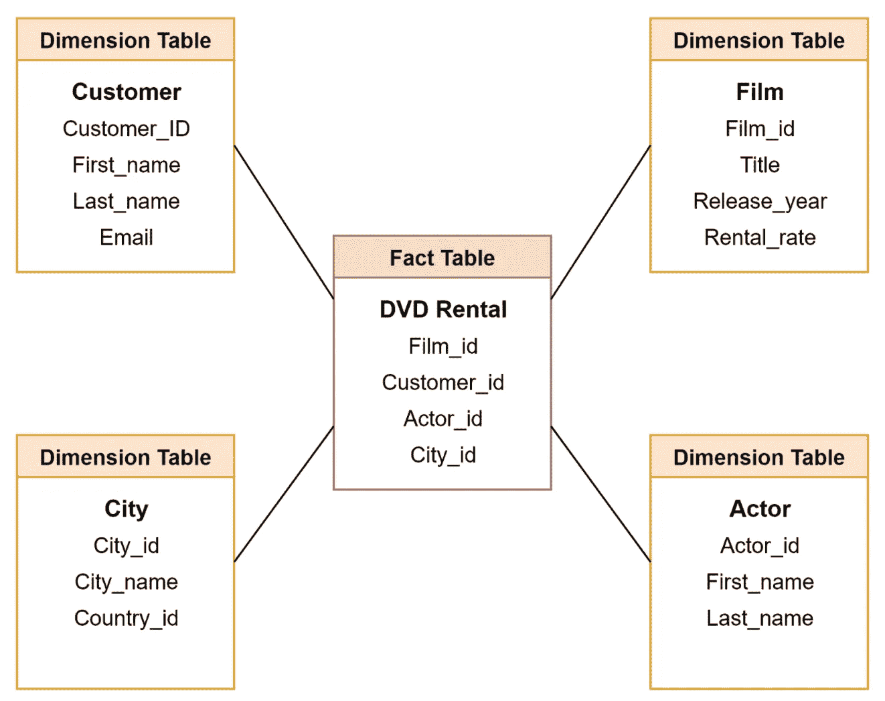
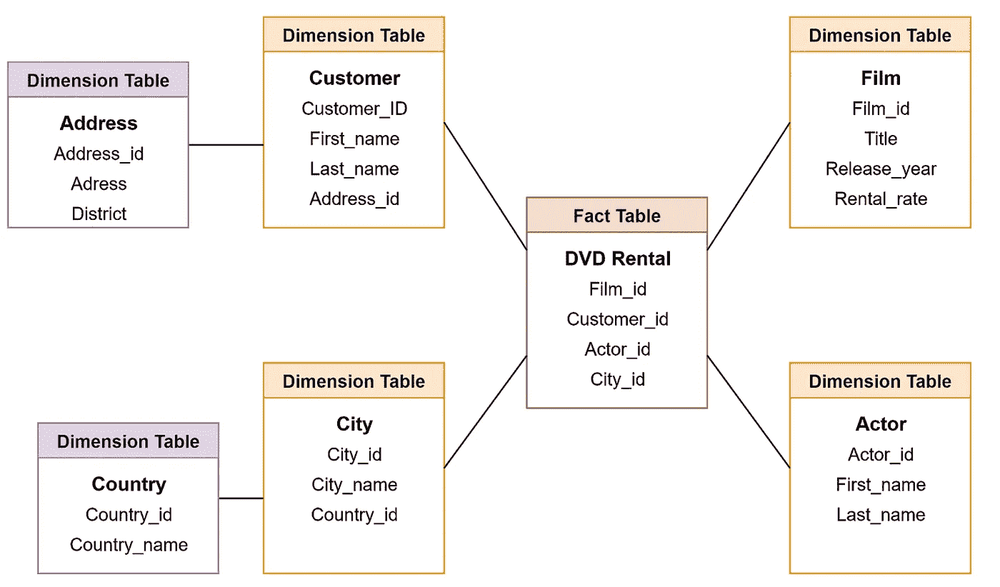

# 在您的数据职业生涯中引入数据建模

> 原文：<https://medium.com/geekculture/introduction-of-data-modeling-in-your-data-career-3cdd65e36437?source=collection_archive---------20----------------------->

## 数据建模让每一个利益相关者理解数据如何与其他数据相关，或者我们称之为**数据理解**

Photo by [Fabio](https://unsplash.com/@fabioha) on [Unsplash](https://unsplash.com/photos/oyXis2kALVg)

一年多来，大多数人都在学习数据，无论他们是选择学习数据科学、数据分析师还是机器学习，主要是为了读取 CSV 文件和创建预测模型。

> 然而，真正的工作并不总是谈论预测模型。但是，你对数据了解得越多，你就能做得越多，越能改善你的公司。

在这篇文章中，我想分享我对**数据建模**的新认识。希望，在你的第一份真正的工作中，你会用理解数据打下第一个立足点。本文的目标如下:

1.  数据建模及其目的
2.  数据建模阶段(概念、逻辑和物理数据)
3.  实体关系图(ERD)
4.  模式的类型(星型模式和雪花型模式)

# 1.数据建模及其目的

数据建模是数据库设计过程中的第一步 T4。有时，数据建模是创建数据库的一种蓝图或模式。例如，如果您想要创建批发数据，您将需要产品数据、装运数据和客户数据。这是一个简单的数据建模图。

Image created by Author

数据本身需要在每个表中分开，最后，我们将它们合并，供涉众使用。数据建模的**目的是:**

1.  将数据包含到数据库中
2.  理解数据项之间的关系(学生由一堂课指导)
3.  数据的约束(学号有 8 个数字，科目有 4 个学分)

在数据建模中，您还必须了解数据建模的**基本结构**，例如:

*   实体:要收集其信息的主要数据对象。它类似于数据库中的**表**。
*   属性:与它们相关联的实体。它类似于数据库中的**列**
*   关系:表示**两个或多个实体**之间的关联。

Image created by Author

# 2.数据建模阶段

数据建模有三个阶段，如概念数据建模、逻辑数据建模和物理数据建模。在每个阶段，它表示数据及其存储方式，并设置数据之间的关系。

## **概念数据建模**

It 由**业务干系人**使用。目的是组织、界定和定义业务概念。概念数据有以下特征:

*   提供灵活的数据结构
*   易于理解和增强
*   只有实体可见
*   抽象关系
*   主要数据对象的识别基础和高级描述；他们回避细节

Image created by Author

## **逻辑数据建模**

它由**数据架构师**和**业务分析师**使用。目的是开发一个规则和数据结构的技术图。逻辑数据建模有一些特征:

1.  每个实体的属性的存在
2.  主键和外键关系
3.  用户友好的属性名称
4.  比概念模型更详细
5.  数据库不可知
6.  需要更多的努力和提高

Image created by Author

## 物理数据建模

是**开发者**用的。目的是数据库的实际实现。物理数据建模有一些特征:

1.  称为表的实体
2.  称为列的属性
3.  数据库兼容表名
4.  数据库兼容的列名
5.  数据库特定的数据类型
6.  用户难以理解
7.  明显比逻辑模型更费力

Image created by Author

# 3.实体关系图

现在，您了解了数据建模的阶段。在本节中，您将看到一个实体如何与另一个具有基数的实体相关联。**基数**表示连接器末端的一个鱼尾纹，表示一个实体中有多少实例与一个实体中的一个实例相关。

Image created by Author

基数有两个值，如最大值和最小值。最大基数意味着关系双方(1 或多)的实例的最大值。另一方面，最小基数意味着关系双方的实例的最小值(0 或 1)。

Image created by Author

# 4.数据建模中的模式类型

创建 ERD 后，您希望将数据存储在数据仓库中。有几种存储数据的模式，如星型模式和雪花型模式。

## **星形模式**

数据仓库中的星形模式，其中星形的中心可以有一个事实表和几个关联的维度表。在星型模式中，事实表位于中心，包含每个维度表中的键[1]。星型模式有一些特征:

1.  星型模式中的每个维度都只用一个一维表来表示。
2.  维度表应该包含属性集。
3.  维度表使用外键连接到事实表
4.  维度表没有相互连接
5.  该模式受到 BI 工具的广泛支持

Image created by Author

## 雪花模式

雪花模式是星型模式的扩展，其中维度表中有一个额外的维度表。附加维度表是规范化表的形式[1]。雪花模式有一些特征:

1.  雪花模式的主要好处是它使用更小的磁盘空间。
2.  向模式中添加了一个更易于实现的维度
3.  您在使用雪花模式时将面临的主要挑战是，由于更多的查找表，您需要执行更多的维护工作

Image created by Author

# 结论

在我作为数据科学家的工作中，我意识到数据建模是理解公司现有数据的第一个立足点。如果您是数据分析师/数据科学家的新手，您必须要求数据工程师团队为您提供模式。因此，一旦你被要求创建一个仪表板或分析数据，你直接阅读文件，没有任何盲目开始。希望它能帮助你更多地了解数据职业生涯中的学习历程。

# 参考资料:

[1] Guru99，数据仓库中的星型和雪花型模式与实例(2021)，[https://www.guru99.com/star-snowflake-data-warehousing.html](https://www.guru99.com/star-snowflake-data-warehousing.html)